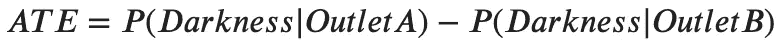
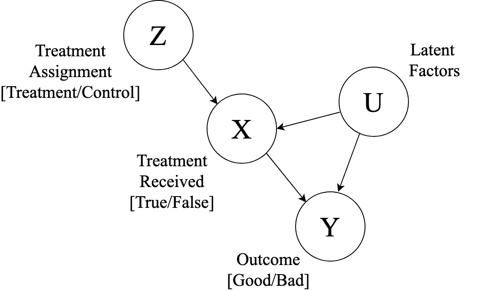
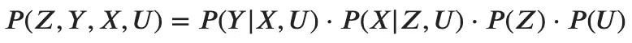
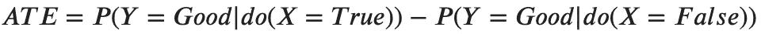
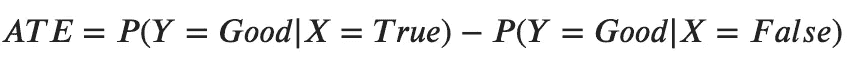
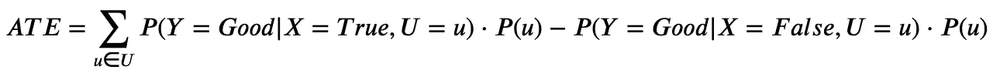
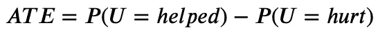
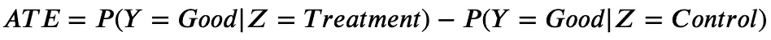
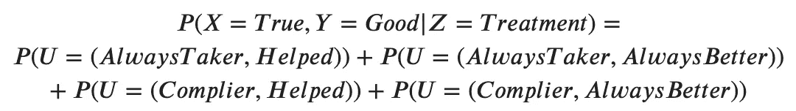

# 你的产品有用吗？

> 原文：<https://towardsdatascience.com/does-your-product-actually-work-5fe8134c5144?source=collection_archive---------25----------------------->

## 随机对照试验、不完全依从性和反事实时间机器

我们开发软件来解决人类的问题。但是人类的问题可能是混乱的，有时并不十分清楚我们是否真的解决了它们。

Snapchat 可能会说，如果他们看到 50%的普通用户检查他们的新狗过滤器，他们就成功了，脸书可以说，他们已经打破了他们的增长里程碑，显示他们已经实现了超过 23 亿的月活跃用户。

但是，当你的应用程序被设计成帮助会员应对焦虑时，你的接受标准是什么？当你的软件被构建来培养[正念](https://www.headspace.com/headspace-meditation-app)时，你能监控什么标准？

或者，以我的公司为例——[甚至](https://even.com/)——我们如何判断我们是否对会员的财务健康产生了影响？

我们与我们的移动应用高度互动，我们已经向我们的会员发送了价值超过 10 亿美元的工资，我们还自动为他们在雨天账户中节省了数百万美元。这些都是值得庆祝的事情。

但这还不够。

我们更直接关心的是，我们的产品是否能在物质上改善我们会员的生活。作为一名致力于了解我们功效的数据科学家，这基本上是我所关心的全部。

这是从度量优化到更像科学实验的地方。我需要了解的是我们的[平均治疗效果](https://en.wikipedia.org/wiki/Average_treatment_effect)——也就是我们*在用户生活中造成*影响的预期值。

为了解释我如何做到这一点，我将深入一种因果分析，这种分析被朱迪亚·珀尔在他的[奇幻书](https://www.amazon.com/Causality-Reasoning-Inference-Judea-Pearl/dp/052189560X/ref=sr_1_1?keywords=causality&qid=1571645404&sr=8-1)和[本文](https://arxiv.org/pdf/1302.6784.pdf)(与亚历山大·巴尔克合著)中分解。

如果你是数据驱动型组织的一员，在这个组织中跟踪应用程序的使用模式相对容易，那么这种分析*与执行涉及产品对用户影响的实验*高度相关。即便如此，我还没有看到[甚至是最学术性的科技研究](https://link.springer.com/article/10.1007/s12671-018-0905-4)使用我将要深入探讨的那种思维。

快速警告:深度潜水将涉及一点科学方法、许多概率论、一点 Python 和一点线性编程。你不需要成为任何一个主题的专家来理解我将要讨论的内容，但是这几乎肯定需要一些时间，努力，也许还需要一些背景阅读。

不过，我向你保证，这很酷，值得一试。

让我们从科学复习开始:随机对照试验。

# 随机对照试验

相关性不是因果关系——我们感兴趣的是因果关系。我们希望*让*成员的生活得到改善。不过，在我开始宣扬“因果关系”之前，先定义一下它是有用的。[的反事实定义](https://en.wikipedia.org/wiki/Counterfactual_conditional#cite_note-14)是我个人认为最清楚的一个:

**事件 A“引发”了事件 B，当且仅当，我们把事件 A 从历史中删除，事件 B 就不会发生。**

成为一个原因就是成为引发连锁反应的多米诺骨牌，成为引爆炸药的导火索。如果你消除了这个原因，无论发生什么都不再发生了。

为了研究因果关系，我们可以*去除*我们认为是因果关系的东西，看看它的影响是否仍然存在，其他一切都是一样的。这就是“受控试验”试图做的事情。

我们自然一直在做对照试验。想想你上一次尝试安装一盏新灯，却发现它不起作用。你是如何着手解决这个问题的？

你可能对哪里出了问题有一些想法。灯泡可能已经烧坏了。或者你插的插座是个哑弹。

让我们取其中的一个想法，正式称之为我们的假设。

**假设:**插座不起作用，这意味着没有电力可以到达灯泡，它不能点亮。

我们如何检验这个假设？嗯，我们有一个试验，我们尝试了当前的插座，插座 a。这是我们的治疗试验——我们用我们认为导致我们最终黑暗和沉闷状态的输入来治疗我们的系统。

现在我们需要一个[控制](https://en.wikipedia.org/wiki/Scientific_control)试验——我们把插座 A 换成一个我们知道有效的插座:插座 B，它已经忠实地为我们的手机充电几个月了。系统中的一切都保持不变，除了插座。

在我们进行这个试验之前，让我们尽可能正式地设计这个实验。我们寻找的是插座 A 对房间照明的平均处理效果(ATE)。

Treatment Effect = The probability of a non-functional lamp given that we use Outlet A, minus the probability of a non-functional lamp given that we use Outlet B.

我们已经知道 **P(黑暗|出口 A) = 1** 。如果当我们将插座 A 与插座 B 交换时，房间仍然是黑暗的，那么 **P(黑暗|插座 B) = 1** 也是如此，因此 **ATE = 0** 。这意味着插座是我们问题的 0%原因。

但是，如果我们把灯插到插座 B 上，灯瞬间就亮了，那么 **P(暗度|插座 B) = 0** ，我们的 **ATE = 1。或者换句话说，插座 A 100%是我们问题的原因！**

所以，让我们把灯插到插座 b 上。砰:

…Surprise! We were talking about a lava lamp this whole time. Now the living room of your imagination is just a tiny bit more whimsical. Source: [Warisan Lighting](http://warisanlighting.com/lava-lamp-red.html)

灯亮了；出口 A 是黑暗的原因。

问题解决了。

就像我说的，我们一直在做这种事情。对使用我们软件的人进行对照试验的复杂之处在于，其中涉及到一个特别棘手的变量:人。

虽然家用电器(通常)是完全确定的，但人却不是。没有一个人是相同的，他们使用你的产品的方式和对它的反应经常会让你吃惊。他们中的一些人会下载它并忘记它，一些人会每天登录。你的一些成员可能会从这个产品中得到帮助，但是——这是一个可怕但必要的想法——他们中的许多人可能会受到伤害。

当你的实验的一个输入变量如此多变时，你如何对你的产品进行受控试验？

这就是统计学介入的地方。我们不能再像在确定性系统中那样做单一的对照试验和单一的治疗试验。我们需要做数百次试验。成千上万。

每次试验将针对不同的人。重要的是，将一个人分配到控制或治疗条件的标准是完全随机的。这确保了在每种情况下的实验参与者的样本在总体上或多或少是相同的:他们将有来自每种性别、身高、收入水平、性格等的相同比例的人。不在审查范围内的因素的影响应该会互相抵消。

到目前为止，我们已经把相当多的片段放在一起:我们控制着一个单一的解释变量，并且随机化以减轻我们没有研究的一堆外生变量的影响。我们现在有了一个随机对照试验(T12)和一个研究什么导致什么的黄金标准(T13)。

但是故事还没有结束。我们可以将人分配到治疗状态(被分配使用你的产品的人)和控制状态(不使用你的产品的人)，但是谁敢说你的参与者真的会遵守你的分配呢？

谁能说你的治疗组的参与者真的会下载并使用你的软件，或者你的对照组的人不会在应用商店找到它并试用它？

当你不知道参与者是否真的接受了你的治疗时，你不能进行因果归因。所以。我们如何做到这一点？

# 处理不完全合规

让我们回顾一下我们在 RCT 的设置。

1.  我们将参与者随机分配到治疗组或对照组。
2.  他们可能决定服从他们的任务，这取决于一些不可观察的因素。
3.  他们会以某种方式对你的产品作出反应(或缺乏产品)，这取决于他们是否接受了治疗，以及一些不可观察的因素。

我们可以描述这些事件如何与贝叶斯网络相互作用，如下所述。

**Bayesian Network description of an RCT:** This diagram describes conditional dependences of the events we’d expect to see. **Z** is completely independent of anything else, since it’s done via random coin-flip. **U** is a catch-all variable for the whole universe of unknowns that affect **X** and **Y,** and is also conditionally independent from other variables. **X** would be conditionally dependent on **Z** and **U.** **Y** would be conditionally dependent on **X** and **U.**

我们将使用 **Z** 、 **X** 、 **Y** 和 **U** 符号来简写它们在该图中代表的随机变量。例如，当我们提到 **Y** 时，我们谈论的是参与者可能意识到的结果变量(或者是*好的*结果，或者是*坏的*结果)。使用小写字母， **y** ，表示随机变量的实际实现(例如 *Good* )。

这种图表只是一种方便的方式来描述我们可能如何计算一些联合的概率 **Z** 、 **X** 、 **Y** 、 **U** 配置(例如，“ **Z** = *治疗*、 **X** = *真*、 **Y** = *好*、**用象征性的术语来说，这个图表是在说:**

根据图表/表达式，你或许可以说出一些直观的东西:

1.  知道 **X** = **x** 改变了 **Y** 等于特定 **y** 的概率。
2.  知道 **Z** = **z** 和/或 **U** = **u** 改变 **X** 为特定 **x** 的概率。
3.  知道 **Z** = **z** 不会给我任何关于 **u** 值 **U** 可能是什么的额外信息。

我们所做的就是在这里捕获条件依赖。

然而，我们的最终目标是能够计算出平均治疗效果，即:

i.e: The probability of having a good outcome given that we force a participant to take the treatment, vs. the probability of a good outcome given that we force them **not** to take the treatment. This difference is the ‘goodness’ directly attributable to our intervention

注意那个 **do()** 操作符，那里。也就是说，我们想知道当我们*迫使* **X** 进入特定状态时，好结果的概率是多少——而不仅仅是被动地观察它。

问题是，在 RCT，我们从来没有强迫任何人做任何事情。我们让参与者接触到产品，然后他们想做什么就做什么。我们*能*做的就是被动观察！

有鉴于此，一个幼稚的方法可能是宣布:

但这是一个致命的错误。

我们必须记住，不同的潜在因素*、*由 **U、**表示，驱动着参与者接受治疗和不接受治疗的案例。同样的情况很可能会影响他们获得良好结果的可能性，这将会混淆我们对治疗效果的描述。

例如，在 Even 的案例中，选择定期使用该应用程序的成员可能天生就比那些不经常使用的成员更富裕(反之亦然)。在这种情况下，我们会看到一个高比率，但这并不能说明它对人的影响——它只是选择偏差的虚假结果！

我们想要的是能够比较给予治疗的良好结果的机会与不治疗的良好结果的机会，其中所有其他因素都是固定的*。*看起来更像这样:

Here we’re making sure that we’re only capturing the difference in P(**Y** = Good) between the treated (**X** = True) and untreated (**X** = False) groups given the same unobserved condition (the same **u**), for all possible unobserved conditions (all **u** ∈ **U**)

好吧，我们有点进展了。我们有一个如何将实验观察转化为 ATE 的表达式…但是这个表达式是没有用的，除非我们找到某种方法来理解什么样的 **u** 态是 **U** 的元素，这样我们就可以正确地控制这些态。

但是 **U** 是这个不可思议的随机变量，它应该捕捉影响人们为什么决定尝试一种产品以及他们可能如何反应的整个未观察到的因素。

你怎么能开始分解它呢？

让我们把问题尽可能简化。我们不需要模拟人们的神经生理学，或者天气，或者股票市场，或者任何能够影响日常决策的无限因素。

让我们考虑一下哪些事情会影响我们的实验结果。我们知道 **U** 影响 **X** 和 **Y** —即 **U** 包含了人们的遵从行为(他们是否使用了该产品)以及他们的反应行为(他们是否变得更好了)。

我们可以把未被观察到的宇宙中的无数因素归纳成几大类，然后:决定参与者顺从和反应行为的原型。

我列举了一个这样的方案如下:

**合规行为类型**

1.  *总是接受者*——无论我们如何分配，他们都能获得产品。
2.  *服从者—* 他们服从小组分配。接受治疗的人下载并使用产品，而对照组的人则没有。
3.  *否认者—* 他们做了与他们被指派做的相反的事情。对照组的人找到了使用该产品的方法，而治疗组的人从未使用过。
4.  *从不接受者—* 他们从不接触产品，不管任务是什么。

**反应行为类型**

1.  *总是更好—* 无论是否使用该产品，他们都会有好的结果。
2.  *帮助—* 如果他们使用该产品，将会有良好的结果。
3.  *伤害—* 如果他们使用该产品，结果会很糟糕，但如果不使用，结果也会很好。
4.  *再好不过了* —无论他们使用我们的产品，都不会有好结果。

实验中的所有参与者必须恰好有一种遵从行为类型和一种响应行为类型，因为它们被定义为互斥的。所以你可以把每一个人都描述成属于一个(顺从，回应)行为对，给我们一个人可能的 16 个原型。

我想这有点像 Myers-Briggs——除了这个框架实际上对科学研究有用(T21)。

It’s like a horoscope! Except it sorts people into groups that aren’t hot garbage

太好了，现在我们知道了 **U** 可以像*(总是接受者，被帮助)*或*(从不接受者，永远不会更好)*一样接受 **u** 值。参与者可能属于特定的 **u** 的原因对于我们的分析并不重要——我们只需要知道**u**u*是什么*。如果我们知道 **U** 的分布，我们实际上可以为 ate 制定一个简单得多的表达式:

We’re marginalizing the compliance behaviors in this expression — **P(U=helped)** is actually a union of all **P(U=u)** where **u** has a ‘helped’ response type, for example.

但是怎么才能知道 **U** 的分布呢？

…好吧，事情是这样的:我们永远不会知道这种分布是什么。那是不可能的。在某些实验场景中，你怎么知道一个人是否会“好得不能再好”呢？这根本说不通。

在这一点上，你可能会通过你的电脑对我大喊大叫，说我浪费了你的时间。为什么我们刚刚经历了所有这些麻烦审议，结果却被卡住了？许多研究走捷径，根本不涉及 **U** 或 **X** 或任何像我们设置的图表那样复杂的东西！

例如，医学研究中一个非常标准的做法是将 ate 表述为如下形式:

这被称为[意向性治疗](https://www.ncbi.nlm.nih.gov/pmc/articles/PMC3159210/)分析，它认识到了自己名字中的缺陷:它测量的是*意向*给某人治疗(治疗或控制的任务)的效果，而不是他们是否真的接受了治疗。

你可能已经知道为什么我不是意向治疗的支持者，但是为了让我的不快真正发自内心，我将为你模拟一个实验。在本笔记本中跟随:

这是我们刚刚模拟的大量工作——我们招募了一些参与者，获得知情同意，跟踪他们一段时间，测量结果，查询我们的生产数据库以获得合规数据，进行一些汇总等。等等。最后我们得到了那 8 个美丽的值: **Z** 中每个 **z** 的 **P(X，Y|Z=z)** (这里是治疗和控制)。

你知道在关于蜘蛛丝及其神奇特性的纪录片中，叙述者会不断提到他们如何辛辛苦苦地为 14000 只义愤填膺的蜘蛛挤奶三个月，只为了得到一盎司的蛛丝？

The true cost of scientific progress. Base image source: [Pexels.com](https://www.pexels.com).

我们的 **P(X，Y|Z)** 值是那盎司丝。它们很珍贵。

意向性治疗立即将它们抹去，并将其卷成两个粗略的数字:**P(Y =好| Z =治疗)**和**P(Y =好| Z =对照)**。

多么浪费有用的信息啊！这就像点燃我们一盎司的蜘蛛丝，然后系统地扇我们 14000 只已经痛苦不堪的蜘蛛的耳光。

How could you do this

这就是信息湮灭的悲剧:

必须有一些*用于丰富 **P(X，Y|Z)** 信息。对吗？*

# 反事实的时间机器

虽然我们永远无法知道 **U** 在我们的参与者群体中的分布情况，但我们知道 **P(X，Y|Z)** 的变化取决于 **U** 。或者换句话说，存在某个函数 **U → P(X，Y|Z)** 。

该函数可能是一对一或多对一的——但无论哪种情况，知道什么是 **P(X，Y | Z)***应该能够揭示 **U** *可能是什么。**

*除非它是一个[活板门功能](http://mathworld.wolfram.com/TrapdoorOne-WayFunction.html)，在这种情况下，我们就完了。*

*不是虽然！实际上， **U → P(X，Y|Z)** 就是一个简单的线性函数，你很快就能直观地感受到。让我们仔细想想:*

*取量 **P(X= *真*，Y= *好* | Z= *处理* )** 。这个概率给了我们在治疗条件下接受治疗并有良好结果的人的比例。*

*但是我们可以得到这个值的另一种方法是，假设我们知道在 **U** 上的分布，将我们知道的总是接受治疗并好转的人的比例相加，以及服从治疗分配并好转的人的比例相加。*

*这让我们断言以下线性关系:*

**

*事实证明，我们拥有的每一个单独的 **P(X，Y|Z)** 值都是一组 **P(U=u)** 值的并集，就像上面的例子一样，这意味着 **U** 受到我们容易观察到的数据的约束！*

*这些并不是唯一的限制。我们还有概率规则在起作用:每个 **P(U=u)** 必须位于**【0，1】**区间内，所有 **P(U=u)** 的总和也必须等于 1。*

*除了这些限制，我们还想学习一个涉及到 **U** 的表达式:ATE，我们的圣杯。又来了:*

**

*Again, we’re marginalizing over the compliance behaviors in this expression — **P(U=hurt)** is actually a union of all **P(U=u)** where **u** has a ‘hurt’ response type*

*虽然我们没有工具来精确地解决 **U** 的分布——我们*所做的*都是线性优化问题的正确成分。*

*我们可以在可能的约束空间范围内，找出绝对最好和最坏的情况。这给了我们实际 ATE 值的硬边界。*

*我设置了这些约束，并使用 [PuLP](https://pythonhosted.org/PuLP/) 进行了优化，这是一个 Python 库，它允许您用超级可读的符号表达式来构建这类线性编程问题:*

*请密切注意我们刚刚做的事情。使用一些假设和我们图表的结构，我们能够回到过去，看看如果我们生活在我们能想象的最幸福的时间线，有最高的可能 ATE，会发生什么。*

*使用同样的推理，我们也可以回到过去探索最黑暗的时间线(如果我们最小化而不是最大化)。*

**

*The **darkest** timeline. Source: [Community](https://www.imdb.com/title/tt1439629/).*

*如果你密切关注，你可能也会注意到一些相当惊人的事情。*

*意向性治疗分析——记住，这是分析人类参与者大多数实验结果的标准做法——宣布我们的治疗有 45%的 ATE，对参与者的结果有适度的积极影响。*

*但是当我们考虑治疗变量 X 时，我们看到最高可能的 ATE 是-15%。*

*治疗*伤害*人。*

# *模型驱动与数据驱动的思维*

*从因果模型的角度思考，而不是把数据本身当成福音，是解开这种推理的关键。*

*我们没有被 RCT 提出的 8 种可能性困住，而是能够推断出某些东西对我们的实验参与者如何接受我们的治疗并对其做出反应负有责任。考虑到这一点，我们可以算出在不同的情况下会有什么样的结果。*

*我需要在这里对你说实话:在大多数情况下，这种分析会得到与意向治疗研究相同的方向性结果。我故意用了一个人为的例子，其中他们的结果是不同的。但重要的是要认识到，这种分歧一开始就可能发生，而且可能如此剧烈。*

*我认为许多从事应用统计学工作的人习惯于把我们看到的数据扔进我们众多古老而成熟的机器中。或者至少，我知道。这是个坏习惯。*

*权变表？进行卡方检验，然后转动曲柄。一张 2x2 的桌子和超低的样本量？把它扔进费希尔精确测试中，转动曲柄。映射到连续标签上的特征矩阵？把它放入线性回归中*

*转身。*

*那个。*

*曲柄。*

*很容易忘记数据的减少并不是分析的最终目的。理解并制作一个关于*创造*过程的心智模型，这些数据释放出一系列全新的力量。你可能从未意识到自己拥有的力量。*

*其中一些能力让你根本不需要进行实验就能进行因果推断*。**

*但那是以后的事了。*

*现在，我希望我已经给你的工具箱增加了一个可爱的新工具——更好的是，一个思考你的问题的新方法。*