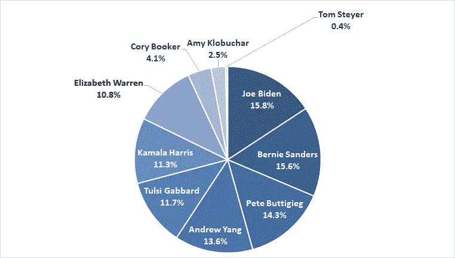
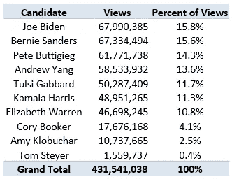
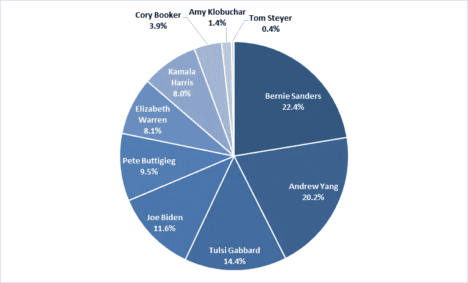
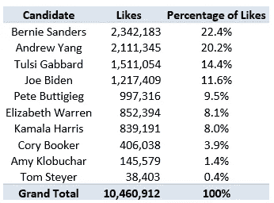
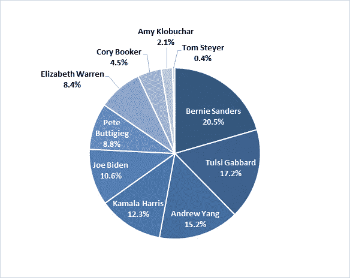

# YouTube 的数据是否告诉了我们一个关于 2020 年民主党候选人的故事？

> 原文：<https://towardsdatascience.com/does-youtubes-data-tell-us-a-story-about-the-2020-democratic-candidates-69568d2b0ce5?source=collection_archive---------24----------------------->

Photo by [Philipp Lublasser](https://unsplash.com/@philu?utm_source=medium&utm_medium=referral) on [Unsplash](https://unsplash.com?utm_source=medium&utm_medium=referral)

随着 2020 年总统大选在一年内举行，所有与弹劾无关的新闻都在谈论谁将成为面对特朗普总统的民主党候选人。

现有的信息来源包括新闻渠道和民意调查，但对我个人来说，我想看看我是否可以探索其他类型的公开可用数据。

作为一个每天在 YouTube 上花费大量时间的人，我决定从 YouTube 的数据 API 中获取数据，并设计自己的快速实验，看看这些数据是否会为民主党候选人竞选增添色彩，而传统渠道和民意调查无法提供这些色彩。YouTube 是一个非常棒的平台，因为创作者经常上传针对个人候选人的内容，内容表现可供每个人查看和使用。

## 提取数据的方法

每个快速数据实验都是围绕一些快速假设和规则设计的。以下是我使用的方法:

*   [YouTube 数据 API](https://developers.google.com/youtube/v3) 获取数据。许多数据方法是围绕 YouTube 有配额限制这一事实设计的。
*   我调出了 2019 年 12 月 4 日的视频列表和 2019 年 12 月 6 日的统计数据
*   收集了 2019 年 11 月 20 日[辩论](https://ballotpedia.org/Democratic_presidential_primary_debate_(November_20,_2019))的候选人名单。在写这篇文章的时候，我意识到卡玛拉·哈里斯已经退出，迈克尔彭博正在竞选。我很可能会在未来写一部续集。
*   在 2019 年 1 月 1 日之后上传的前 250 个视频**中，他们的名字出现在搜索词中。**
*   消除了跨越多个候选人的重复视频，如“DNC 市政厅— SNL”。因此，该分析不包含涵盖多个或所有候选人的视频。
*   查看、喜欢、不喜欢和评论的统计数据
*   将名单缩小到每个候选人观看次数最多的前 150 个视频。
*   已禁用喜欢和评论的视频被限定为该视频的 0 个喜欢、不喜欢和评论。
*   在 Excel 中快速处理数学和图表。还将附上表格。

# 数据告诉我们的是

虽然我们有很多方法可以深入数据，并做进一步的分析和细分，但我认为快速简单地浏览一下基本统计数据*确实讲述了一个很好的故事，我们可以从中学到很多东西。*

## 视图

浏览量相当于每个候选人有多少人观看了独特的视频。这总计约为 4.3 亿英镑。候选人之间的意见分歧是这样的:

**Chart Representing Candidates’ Share of Unique YouTube Views**

**Table Representing Candidates’ Share of Unique YouTube Views**

正如你在这里看到的，6800 万的浏览量属于乔·拜登，占了 15.8%的份额。他领先，紧随其后的是伯尼·桑德斯 15.6%，皮特·布蒂吉格 14.3%，杨安泽 13.6%，塔尔西·加巴德 11.7%，卡玛拉·哈里斯 11.3%，伊丽莎白·沃伦 10.8%，然后是科里·布克，艾米·克洛布查尔和汤姆·斯特耶加起来约 7%的显著下降。

## 喜欢

视图对于理解链接被打开和可能被观看的频率是至关重要的，但是视频赞告诉我们一些视图不能告诉我们的事情。喜欢更符合观众参与度。就向其他观众推荐什么而言，赞是 YouTube 算法的关键组成部分之一。

**Chart Representing Candidates’ Share of Unique YouTube Likes**

**Table Representing Candidates’ Share of Unique YouTube Likes**

## 厌恶

就成为观众反馈的良好标记而言，类似于“喜欢”,但以负面方式表达。

**Chart Representing Candidates’ Share of Unique YouTube Dislikes**

**Table Representing Candidates’ Share of Unique YouTube Dislikes**

## 评论

评论是敬业度的另一个重要部分。它们不一定一眼就能反映出积极或消极的参与度，但它们确实代表了哪些候选人被认为更具“争议性”

**Chart Representing Candidates’ Share of Unique YouTube Comments**

**Table Representing Candidates’ Share of Unique YouTube Comments**

## 比率

当谈到观察数据时，从基本数据中创造比率可以为我们的理解增加很多价值。然而，简单的统计数据并不总能说明全部情况，因此比率的存在有助于我们将事情放入背景中。这方面的一个例子是当我们从视频中查看“喜欢”时。一个有数百万次观看的视频会比一个有数千次观看的视频获得更多的喜欢，但这并不能真正告诉你它与观众的互动有多好。它也可以有数以百万计的厌恶。考虑到这一点，我决定看看下面的比率，它给出了一个关于“可爱度”的概念

*   **点赞浏览量(百分比):** 这简单地告诉我们候选人的视频每被观看 100 次就有多少人点赞。单独拥有这个比例并不意味着什么，但当与其他人进行比较时，它可以成为谁被认为更“可爱”的有用基准。

**Likes to Views Ratio. Average is 2.3%**

*   **喜欢与不喜欢的比率:** 这告诉我们一个候选人得到多少喜欢与不喜欢。与不喜欢相比，喜欢和不喜欢的比例很高的候选人可以被认为是非常可爱的。

**Likes to Dislikes Ratio. Average is 10.3**

从上面的分析中，我们可以看到，YouTube 告诉了我们一些如果我们只依靠新闻和民意调查获得数据时不一定会知道的事情。乔·拜登获得了观点，目前他在民调中领先，但当涉及到参与度和可爱程度时，YouTube 的观众似乎倾向于伯尼·桑德斯和杨安泽。

由于技术，我们与信息和媒体互动的方式自上次民主党人取代共和党人入主白宫以来发生了巨大变化。正因为如此，我认为我们还应该探索额外的方法来衡量和基准测试候选人，特别是在 YouTube 这样每天都在变大的平台上。

[以下是我如何获得数据的，以防你想亲自试验一下](https://gist.github.com/bryfeng/79c391fd6cede4fe0ea0bcc7675b85f9)