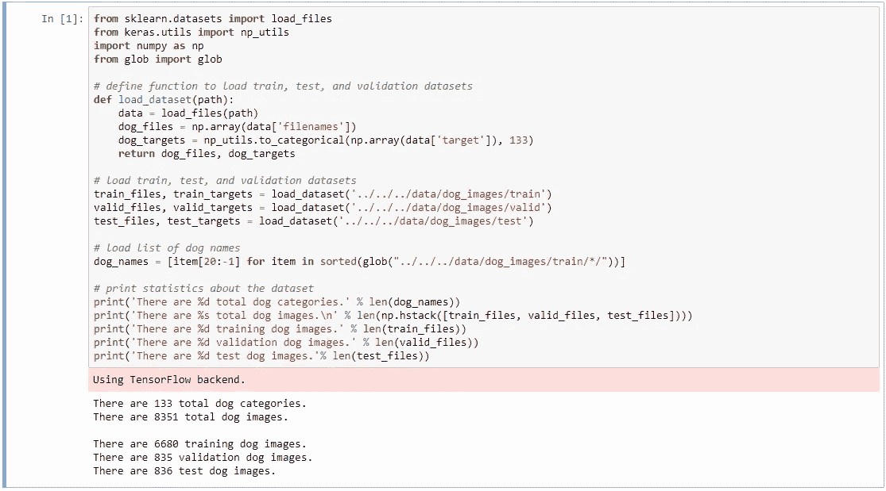
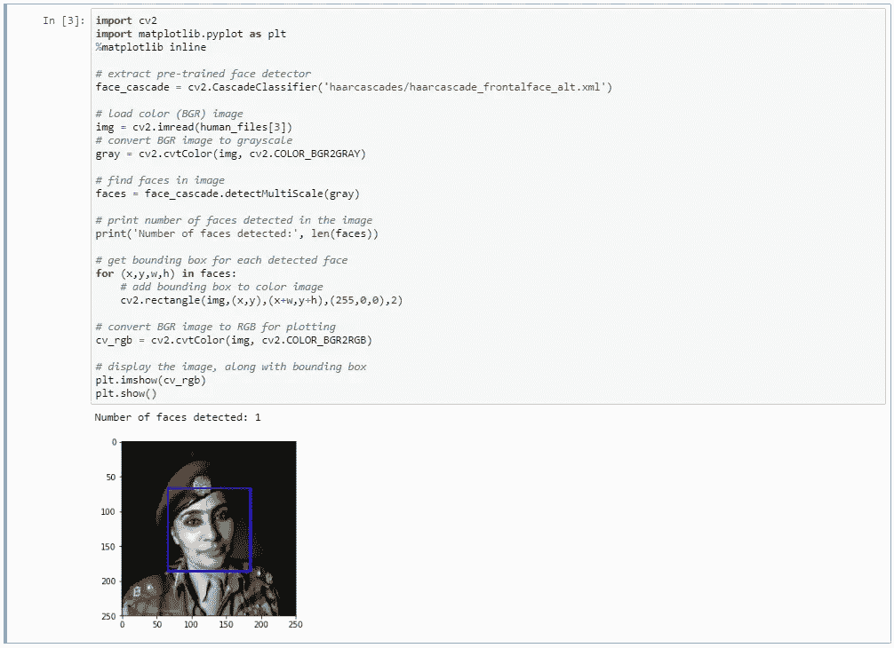
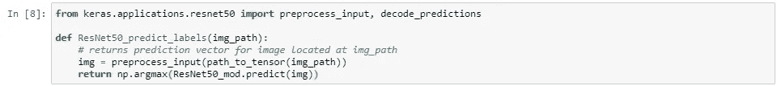
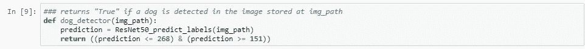
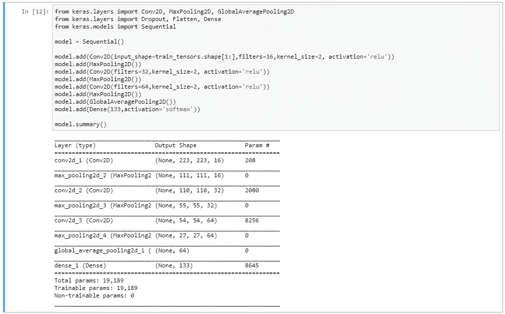
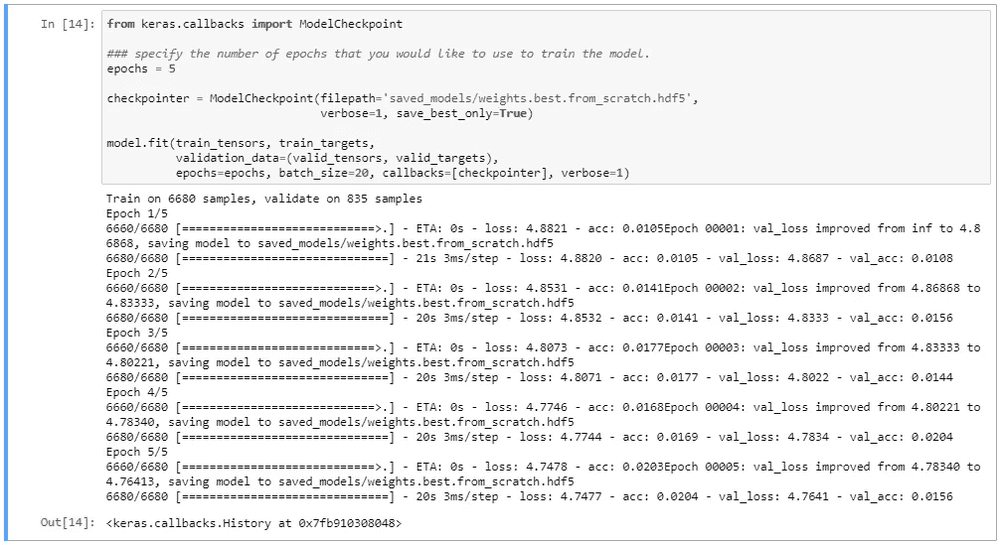
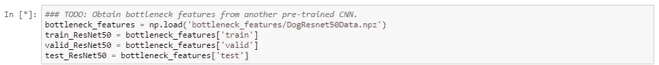
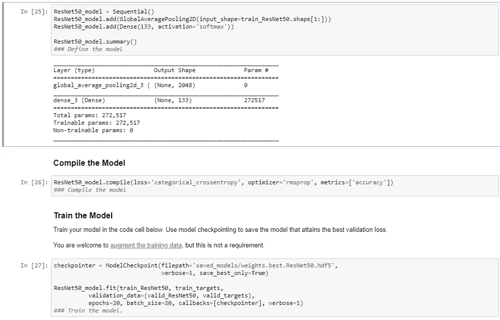
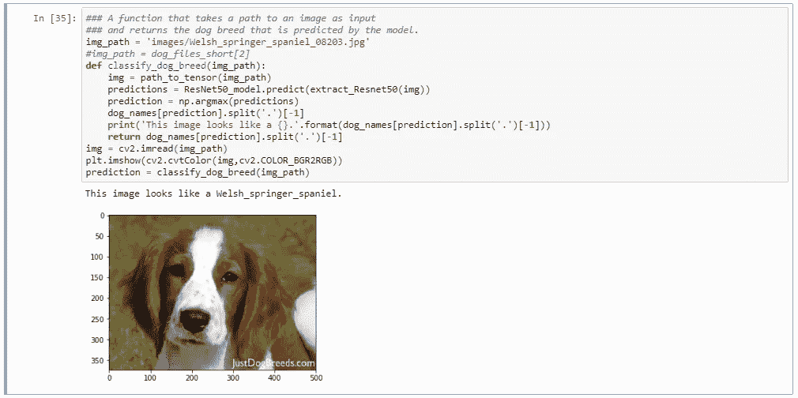

# 基于 CNN 的犬种分类

> 原文：<https://towardsdatascience.com/dog-breed-classification-using-cnns-f042fbe0f333?source=collection_archive---------13----------------------->

在今天的帖子中，我将向你展示如何制作一个非常有趣的应用程序，来检测一张照片中是人还是狗。此外，在图像中检测到狗的情况下，它会以很高的准确度告诉我们狗的品种。

可以通过这个 github [链接](https://github.com/denizn/Dog-Breed-Classifier)访问相关的存储库，在那里可以找到关于下载数据集和先决条件的说明。

在构建我们的分类器时，我们将遵循以下步骤:

*   步骤 0:导入数据集
*   第一步:探测人类
*   第二步:探测狗
*   第三步:创建一个 CNN 来分类狗的品种
*   第四步:训练 CNN 对狗的品种进行分类(从头开始)
*   第五步:训练 CNN 对狗的品种进行分类(通过迁移学习)

**第 0 步:导入数据集**

我们的第一步将是加载分为训练、验证和测试文件夹的数据集。

我们想把我们训练数据集中的狗分成 133 个不同的品种。

正如我们在下面的代码片段中看到的，我们将使用 6680 张狗的图片来训练我们将要使用的模型。我们将使用 835 验证图像来微调我们的参数，并在 836 测试图像上测试最终模型的准确性。当然，测试数据集将是模型以前没有见过的图像。

Snippet 1 : Loading the Dataset

**第一步:探测人类**

为了检测人，我们首先将三通道 RGB 图像(红绿蓝)转换成灰度。一个名为“ [detectMultiScale](https://www.programcreek.com/python/example/79435/cv2.CascadeClassifier) ”的 [OpenCV](https://opencv.org/) 函数对灰度图像起作用，并给我们一个检测人脸的“盒子”的坐标。稍后，我们可以使用它在我们正在绘制的图像上绘制一个蓝色的矩形，如下所示。

Snippet 2 : Detecting humans

**第二步:检测狗** 我们将使用 Keras 中的 resnet50 预训练模型来检测图像中的狗。这里的第一步是转换的 RGB 编码。jpg 图像到 BGR，然后根据从庞大的 Imagenet 数据库中获得的平均值和标准偏差对三个通道进行归一化。幸运的是，这是由 Keras 中 applications.resnet50 模块中的 preprocess_input 完成的。

Snippet 3: Resnet50

使用我们从 keras.applications 库导入的 ResNet50 模型，我们可以将图像分类到标签中。在 resnet 库中，任何编码为 151 到 268 的标签实际上都是“狗”。如果是这种情况，下面的函数将给出一个真布尔值，否则为假。

Snippet 4: Dog Detector

**第三步:创建 CNN 对狗的品种进行分类**

我们将使用下面的基本序列模型，并设计我们的 CNN 网络。

我使用了三个卷积层，每个卷积层后面都有一个 MaxPooling2D，以降低堆叠模型的复杂性。

最后，我们将使用 global_average_pooling 将 Max Pooling 图层中的每个要素地图转换为标量。

Snippet 5: Building the CNN Model

**第四步:训练 CNN 对狗的品种进行分类(从头开始)**

我们开始训练我们创建的模型，我们看到我们的验证损失不断降低，我们的准确性降低了 5 个时期，表明我们的模型正在学习。

Snippet 6: Training the Model with 5 Epochs

在 20 个历元时，有可能达到大约 4.5%的精度吗？当我们在这个数据集上运行 250 个历元时，我们能够达到%40+的准确度，即使有强大的 GPU 支持，这也需要相当长的时间，这就是为什么我们将使用迁移学习作为下一步。

**第五步:训练 CNN 对狗的品种进行分类(通过迁移学习)**

接下来，我们将使用预提取的“瓶颈特征”，这些特征是应用于我们的训练、测试和验证数据集的预训练库的输出。

我们将使用 Resnet50 库输出作为我们模型的输入，并使用这些瓶颈特性训练我们的模型。

Snippet 7: Loading bottleneck features

我们通过添加一个全局平均池层来创建一个简单的模型，该层将之前的每个特征映射总结为一个标量。密集层创建 133 个不同的输出，每个输出对应一个所需的标签。然后，softmax 激活将这些转换成概率。

Snippet 8: Define, compile and train the model

然后，我们现场测试我们的算法，看看它是否能正确预测加载图像路径中的狗的品种。我们将一张威尔士施普林格犬的图片加载到模型中，正如你在下面看到的，神经网络正确地对我们使用的样本狗图片进行了分类。

Snippet 9: Predict using the model

最后一部分连接了我们之前构建的所有函数，将有助于确定所提供的图像是人还是狗，或者两者都不是。

Snippet 10: Final algorithm