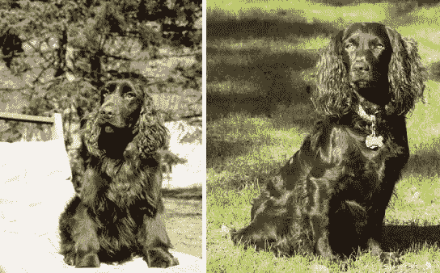
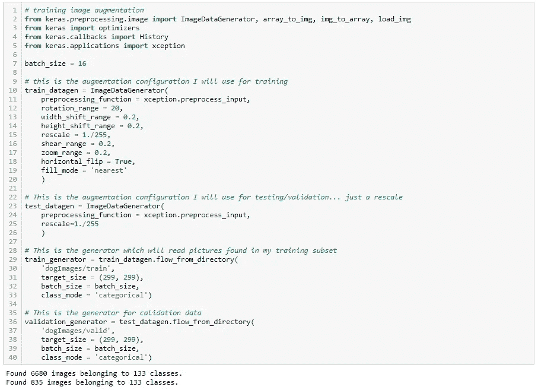

# 基于细胞神经网络和迁移学习的犬种预测

> 原文：<https://towardsdatascience.com/dog-breed-prediction-using-cnns-and-transfer-learning-22d8ed0b16c5?source=collection_archive---------7----------------------->


在本文中，我将演示如何使用 keras 和 tensorflow 来构建、训练和测试一个卷积神经网络，该网络能够在提供的图像中识别狗的品种。成功将由高验证和测试准确性来定义，准确性和召回分数在具有相似准确性的模型之间有所不同。

这是一个监督学习问题，特别是一个多类分类问题，因此可以通过以下步骤来解决:

1.  积累标签数据。在这种情况下，这意味着用已知品种的狗编辑一个图像库。
2.  构建一个能够从训练图像中提取数据的模型，该模型输出可以被解释以辨别狗的品种的数据。
3.  根据训练数据训练模型，在训练期间使用验证数据验证性能
4.  评估绩效指标，可能返回到第 2 步进行编辑以提高绩效
5.  根据测试数据测试模型

当然，每一步都有许多子步骤，我将在后面详述。

# 序幕

训练一个神经网络的行为，即使是一个相对简单的网络，在计算上也是极其昂贵的。许多公司使用专用于此类任务的 GPU 服务器机架；我将在配有 GTX 1070 图形卡的本地电脑上工作，我将为这次练习招募该电脑。为了在您的本地计算机上执行这个任务，您必须采取一些步骤来定义一个合适的编程环境，我将在这里详细介绍它们。如果您对后端设置不感兴趣，请跳到下一节。

首先，我在 Anaconda 中创建了一个新环境，并安装了以下包:

*   张量流-gpu
*   朱皮特
*   glob2
*   sci kit-学习
*   克拉斯
*   matplotlib
*   opencv(用于识别图像管道中的人脸——不是必要的功能，但在某些应用中很有用)
*   tqdm
*   枕头
*   海生的

接下来，我更新了我的显卡驱动。这一点很重要，因为驱动程序更新会定期推出，即使是像我这样使用了 3 年的卡，如果您使用的是 tensorflow 的现代版本，是否有必要使用最新的驱动程序来实现兼容性。在我的案例中，只有 5 个月大的驱动程序与最新版本的 tensorflow 不兼容。

最后，在新环境的 anaconda 提示符下打开 jupyter 笔记本，以便执行您的工作，并确保 jupyter 使用了正确的内核环境。如果不这样做，Tensorflow 可能会遇到问题。

作为健全性检查，在模块导入后，我可以调用以下代码来显示可用的 CPU 和 GPU。

```
from tensorflow.python.client import device_lib
print(device_lib.list_local_devices())
```


成功！这是我的 GTX 1070。

最后，我执行下面的代码块，它编辑 tensorflow 后端的一些配置参数，并防止将来出现一些运行时错误。

```
# tensorflow local GPU configuration
gpu_options = tf.GPUOptions(per_process_gpu_memory_fraction=0.8)
config = tf.ConfigProto()
config.gpu_options.allow_growth = True
session = tf.Session(config=config)
```

# 步骤 1:编译数据


在我的情况下，这是微不足道的，因为 Udacity 向我提供了 1.08Gb 的跨越 133 个品种的狗图像，已经在一个适当的文件结构中。适当的文件结构，在 CNN 用 keras 建立分类的情况下，意味着文件通过训练、验证和测试被隔离，并且在这些文件夹中通过狗的品种被进一步隔离。每个文件夹的名称应该是您计划识别的类的名称。

显然，世界上有超过 133 个狗品种——美国权威机构 [AKC](https://www.akc.org/) 列出了 190 个品种，而世界权威机构 [FCI](http://www.fci.be/en/) 列出了 360 个品种。如果我想增加我的训练数据集的大小，以包括更多的品种或每个品种的更多图像，我可以采用的一种方法是安装 python Flickr API，并在其中查询标记有我想要的任何品种名称的图像。然而，为了这个项目的目的，我继续使用这个基本数据集。

作为第一步，我将把所有文件名加载到内存中，以便以后更容易处理。

```
*# define function to load train, test, and validation datasets*
def **load_dataset**(path):
    data = load_files(path)
    dog_files = np.array(data['filenames'])
    dog_targets = np_utils.to_categorical(np.array(data['target']))#, 133)
    return dog_files, dog_targets# load train, test, and validation datasets
train_files, train_targets = load_dataset('dogImages/train')
valid_files, valid_targets = load_dataset('dogImages/valid')
test_files, test_targets = load_dataset('dogImages/test')*# load list of dog names
# the [20:-1] portion simply removes the filepath and folder number*
dog_names = [item[20:-1] for item in sorted(glob("dogImages/train/*/"))]*# print statistics about the dataset*
print('There are %d total dog categories.' % len(dog_names))
print('There are %s total dog images.\n' % len(np.hstack([train_files, valid_files, test_files])))
print('There are %d training dog images.' % len(train_files))
print('There are %d validation dog images.' % len(valid_files))
print('There are %d test dog images.'% len(test_files))
```

它输出以下统计信息:

```
There are 133 total dog categories.
There are 8351 total dog images.

There are 6680 training dog images.
There are 835 validation dog images.
There are 836 test dog images.
```

接下来，我通过将图像中的每个像素除以 255 来标准化数据，并将输出格式化为张量 keras 可以使用的向量。注意:下面的代码将数千个文件作为张量加载到内存中。尽管对于相对较小的数据集来说这是可能的，但最好使用批量加载系统，一次只加载少量的张量。我在后面的步骤中为我设计的最后一个模型这样做。

```
*# define functions for reading in image files as tensors*
def **path_to_tensor**(img_path, target_size=(224, 224)):
 *# loads RGB image as PIL.Image.Image type
    # 299 is for xception, 224 for the other models*
    img = image.load_img(img_path, target_size=target_size)
    # convert PIL.Image.Image type to 3D tensor with shape (224, 224, 3)
    x = image.img_to_array(img)
 *# convert 3D tensor to 4D tensor with shape (1, (target_size,) 3) and return 4D tensor*
    return np.expand_dims(x, axis=0)def **paths_to_tensor**(img_paths, target_size = (224, 224)):
    list_of_tensors = [path_to_tensor(img_path, target_size) for img_path in tqdm(img_paths)]
    return np.vstack(list_of_tensors)*# run above functions*
from PIL import ImageFile                            
ImageFile.LOAD_TRUNCATED_IMAGES = True*# pre-process the data for Keras*
train_tensors = paths_to_tensor(train_files).astype('float32')/255
valid_tensors = paths_to_tensor(valid_files).astype('float32')/255
test_tensors = paths_to_tensor(test_files).astype('float32')/255
```

# 构建、培训、测试、评估

有无数种方法可以做到这一点，其中一些会比另一些更好。我将探索 3 种独特的方法，并遵循它们从构建到测试和评估。我采用的方法如下:

1.  **琐碎的解决办法。**我将在数据集上构建并训练一个非常简单的 CNN，并评估其性能。
2.  **具有瓶颈特征的迁移学习。**我将利用一个已在大规模图像库上训练过的现有 CNN，并通过使用它将我的输入图像转换为“瓶颈特征”:图像的抽象特征表示，使其适应我的应用程序。
3.  **图像增强的迁移学习。**类似于瓶颈特征方法，但我将尝试通过创建一个模型来获得更好的模型泛化，该模型是一个预训练的瓶颈特征 CNN 的堆栈，带有一个用于我的应用程序的自定义输出层，我将向它提供通过象形变换随机增强的输入图像。

首先，我将演示创建一个基本 CNN 并在数据集上训练它的简单方法。

## 步骤 2a:构建简单模型

我用下面的代码创建了一个简单的 CNN，使用 keras 和 tensorflow 后端。

```
from keras.layers import Conv2D, MaxPooling2D, GlobalAveragePooling2D
from keras.layers import Dropout, Flatten, Dense
from keras.models import Sequentialmodel = Sequential()*# Define model architecture.*
model.add(Conv2D(16, kernel_size=2, activation='relu', input_shape=(224,224,3))) # activation nonlinearity typically performed before pooling
model.add(MaxPooling2D()) # defaults to pool_size = (2,2), stride = None = pool_size
model.add(Conv2D(32, kernel_size=2, activation='relu'))
model.add(MaxPooling2D())
model.add(Conv2D(64, kernel_size=2, activation='relu'))
model.add(MaxPooling2D())
model.add(GlobalAveragePooling2D())
model.add(Dense(133, activation='softmax'))model.summary()
```

model.summary()方法打印出以下模型结构:


在这里，我创建了一个 8 层顺序神经网络，利用与最大池层配对的 3 个卷积层，并终止于具有 133 个节点的全连接层——我试图预测的每个类一个节点。注意在密集层我使用了一个 softmax 激活函数；原因是它的范围是从 0 到 1，并且它强制输出层中所有节点的总和为 1。这允许我们将单个节点的输出解释为模型的预测概率，即输入是对应于该节点的类。换句话说，如果层中的第二个节点对于特定图像的激活值为 0.8，我们可以说模型已经预测到输入有 80%的机会来自第二类。请注意 19，000 个模型参数——这些是我的网络将尝试优化的权重、偏差和核(卷积滤波器)。现在应该很清楚为什么这个过程需要大量的计算。

最后，我编译这个模型，以便它可以被训练。注意，这里我可以使用许多损失函数和优化器，但是当前多类图像标签预测的通用约定使用 Adam 作为优化器，使用分类交叉熵作为损失函数。我用 SGD 和 RMSProp 测试了 Adam，发现 Adam 的训练速度要快得多。

```
model.compile(optimizer=’adam’, loss=’categorical_crossentropy’, metrics=[‘accuracy’])
```

## 步骤 3a:训练平凡模型

现在我有了一个用来训练、验证和测试模型的张量列表，还有一个完整编译的 CNN。在我开始训练之前，我定义了一个 ModelCheckpoint 对象，它将作为一个钩子，我可以使用它来保存我的模型权重，以便将来轻松加载，而无需重新训练。为了训练模型，我调用。用我的关键字参数拟合模型的()方法。

```
checkpointer = ModelCheckpoint(filepath='saved_models/weights.best.from_scratch.hdf5', verbose=1, save_best_only=True)model.fit(train_tensors, train_targets, 
          validation_data=(valid_tensors, valid_targets),
          epochs=3, batch_size=20, callbacks=[checkpointer], verbose=2)
```

正如您所看到的，我只运行了 3 个时期的模型，因为我知道由于它的简单性，它不会是一个高性能的模型，这个模型纯粹是为了演示的目的。模型训练给出以下输出:


模型完成训练，训练准确率为 1.77%，验证准确率为 1.68%。虽然这比随机猜测要好，但也没什么值得大书特书的。


*顺便提一下，在训练这个模型时，我们可以看到我的 GPU 使用率立即跃升！这太好了——这意味着 tensorflow 后端确实在使用我的显卡。*

## 步骤 4a:评估普通模型

该模型在训练或验证数据上没有达到合理的精确度，这表明它大大地低估了数据。这里我展示了一个模型预测的混淆矩阵，以及一个分类报告。


该模型预测了几乎所有输入图像的两类中的一类。似乎偏爱巴吉度猎犬和边境牧羊犬。不幸的是，我没有创造出有一只喜欢的狗的有知觉的 AI；在巴吉度猎犬和边境牧羊犬的训练集中，图片比大多数其他种类的图片要多一些，这是模型学来的。由于模型的严重欠拟合，不值得探究精度或回忆它在此时达到的效果。

## 步骤 5a:测试普通模型

最后，我在测试数据集上测试模型。

```
# get index of predicted dog breed for each image in test set
dog_breed_predictions = [np.argmax(model.predict(np.expand_dims(tensor, axis=0))) for tensor in test_tensors]# report test accuracy
test_accuracy = 100*np.sum(np.array(dog_breed_predictions)==np.argmax(test_targets, axis=1))/len(dog_breed_predictions)
print('Test accuracy: %.4f%%' % test_accuracy)
```

这产生了 1.6746%的测试精度——符合我的预期。如果我在更多的时期训练模型，我可能会达到更高的精度，但这个模型是高度简化的，修改我的架构将是一个更好的主意。很快，我将展示使用迁移学习建立模型的更好方法，这可以实现更高的准确性。

## 步骤 2b:构建瓶颈特征模型

我可以显著提高性能的一种方法是利用迁移学习，也就是说，我可以利用现有的 CNN，它已经过预训练，可以识别一般图像数据的特征，并根据自己的目的进行调整。Keras 有许多这样的预训练模型可供下载和使用。每一个都是在一个名为 [imagenet](http://www.image-net.org/) 的图像库中训练过的模型，该图像库包含分布在 1000 个类别中的数百万张图像。在 imagenet 上训练的模型通常是具有许多完全连接的输出层的深度 CNN，这些输出层已经被训练为将卷积层暴露的隐藏特征分类为 1000 个类别中的一个。我可以采用这些预训练模型中的一个，简单地用我自己的完全连接层替换输出层，然后我可以训练这些层，将每个输入图像分类为我的 133 个狗品种中的一个。这里需要注意的是，我不再训练 CNN，我将冻结卷积层的权重和内核，卷积层已经被训练来识别图像的抽象特征，并且只训练我自己的自定义输出网络。这节省了大量的时间。

至少有两种方法可以解决这个问题。一种方法是将预训练网络和我的定制网络连接在一起，如上所述。另一种更简单的方法是，通过预训练的网络输入我的数据集中的每幅图像，并将输出保存为数组，以便稍后通过我的网络输入。后一种方法的好处是它节省了计算时间，因为每个训练时期我只通过我自己的模型进行前向传递和后向投影，而不是 imagenet 模型和我的模型一起进行。方便的是，Udacity 已经通过一些内置的 CNN 提供了他们提供的所有训练图像，并提供了原始输出或瓶颈功能，供我简单地阅读。

在这里，我定义了自己的全连接网络，以接受瓶颈特性并输出 133 个节点，每个品种一个。这是 VGG16 网络的一个例子。我在实际训练中使用不同的网络，这将在下一节中看到。

```
VGG16_model = Sequential()
VGG16_model.add(GlobalAveragePooling2D(input_shape=train_VGG16.shape[1:]))
VGG16_model.add(Dense(133, activation='softmax'))
```

这里需要注意一些事情:

*   我从 GlobalAveragePooling 层开始——这是因为 VGG16 的最后一层，事实上我测试的所有 imagenet 模型都是卷积/池序列。全局池层减少了该输出的维数，并且在输入到密集层时极大地减少了训练时间。
*   我的网络中第一层的输入形状必须适合它所设计的模型。我可以通过简单地获得瓶颈数据的形状来做到这一点。瓶颈特征形状的第一个尺寸被切除，以允许 keras 添加一个尺寸进行批处理。
*   我再次使用一个 softmax 激活函数，原因与简单模型相同。

## 步骤 3b:列车瓶颈特征模型

Udacity 为 4 个网络提供了瓶颈功能:VGG19、ResNet50、InceptionV3 和 Xception。下面的代码块读入每个模型的瓶颈特性，创建一个完全连接的输出网络，并在 20 个时期内训练该网络。最后输出每个模型的精度。


从最后一行可以明显看出，所有 4 个模型的表现*都比我自己微不足道的 CNN 好得多*，其中 Xception 模型达到了 85%的验证准确率！

## 步骤 4b:评估瓶颈特征模型

表现最好的——Xception 和 resnet 50——都取得了显著的验证准确性，但是通过挖掘日志，我们可以看到它们对训练数据的准确性接近 100%。这是过度拟合的标志。这并不令人惊讶，Xception 有 2200 万个参数，ResNet50 有 2300 万个参数，这意味着这两个模型都有巨大的熵容量，能够只记住训练数据图像。为了解决这个问题，我将对我的全连接模型进行一些更改并重新培训。


我已经添加了第二个密集层，希望模型能够对预训练参数依赖少一点，我还用 L2 正则化和丢弃增强了完全密集层。L2 正则化因高个体参数权重而惩罚网络，而丢弃在训练期间随机丢弃网络节点。两者都通过要求网络在训练过程中进行更多的归纳来对抗过度拟合。还要注意我已经改变了优化策略；在真实的研究环境中，这将通过 GridSearch 来完成，grid search 接受超参数列表(比如具有超参数范围的优化器)，但是为了节省时间，我自己试验了几个。请注意，我已经切换回使用 SGD——通过实验，我发现尽管 Adam 训练速度极快，但如果给定足够的训练次数，SGD 始终会超过 Adam(这一发现在本文中有所暗示)。

训练 100 个周期(5 分钟)后:


该模型取得了与以前相当的验证精度，但训练精度要低得多。训练精度低是由于辍学，因为它从来没有使用完整的模型来评估训练输入。我很满意这个模型不再像以前一样过度合身。看起来验证准确性和损失都大致持平——可能再过 100 个纪元，我还能挤出 1 %- 2%的准确性，但我可以先采用更多的训练技术。

## 步骤 5b:测试瓶颈特征模型


在测试数据集上有将近 83%的准确率。与预期的验证集非常相似。看着混乱矩阵:


比上一部好多了。我们可以在这里看到，有几个品种的狗，模型表现相当好，有几个地方，它真的很难。看看这个例子，原因就很清楚了。

让我们放大 y 轴中间和 x 轴大约 1/4 处的异常值。


模型一致认为 66 级其实是 35 级。也就是说，它认为一只田野猎犬实际上是一只博伊金猎犬。这是并排的两个品种。



Field Spaniel (left), Boykin Spaniel (right)

注意到相似之处了吗？显然，区分这两个品种是一项极其困难的任务。我怀疑，在这种情况下，调整我的模型参数不会导致分类的有意义的改进，在真实的场景中，我会训练一个二元分类器来区分这些品种，如果主要模型预测了任一类别，则在分类预测管道中使用它。但是现在，我感兴趣的是通过增加我的训练数据来获得更好的表现。

## 步骤 2c:编译扩充输入模型

在根据图像数据训练的模型中，有一种引导训练数据的形式，称为图像增强，在训练期间，我可以对训练图像应用随机旋转、缩放和平移。这具有通过改变训练图像的像素同时保持内容的完整性来人为增加训练数据的大小的效果；例如，如果我将一只柯基犬的图像旋转 15 度并水平翻转，该图像仍然可以被识别为一只柯基犬，但是模型在训练期间将不会看到该图像。希望这项技术既能提高大量时期的模型精度，又能防止过度拟合。为了做到这一点，我不能再使用我以前使用的瓶颈特性，我必须一起编译整个模型，以便向前和向后传播。另请注意，由于我仍然不想编辑 imagenet 预训练模型的参数，我将在训练前冻结这些层。

首先，我定义了我的数据加载管道:



接下来，我加载 imagenet 模型，定义一个定制的完全连接的输出模型，并将它们组合成一个顺序模型。由于训练时间的原因，我在这里重新使用了 Adam。如果我有更多的计算资源，可能值得像以前一样使用 SGD。


## 步骤 3c:训练增强输入模型

这个模型的训练时间比我以前的任何模型都要长，因为每次向前传递都必须遍历 imagenet 模型的所有节点。在我的 GPU 上，每个 epoch 需要大约 3.5 分钟来训练，而瓶颈功能模型只需要几秒钟。这暴露了我们以前从使用瓶颈特性中获得的计算增益。


该模型在训练和验证数据集上非常快地实现了相对较高的准确性——这要归功于我切换到 Adam 优化器。请注意，训练精度仍然低于验证精度，这是因为我仍然在使用 dropout。另一件要注意的事情是验证准确性的高度变化。这可能是高学习率(看着你，亚当)或高熵容量(参数太多)的症状。随着时间的推移，它似乎变得平稳了，所以我并不担心。

## 步骤 4c:评估扩充输入模型

查看这个模型和以前的模型的分类报告，在验证过程中，两个模型的精确度和召回率都得了 0.80 分。两者都以大约 1 的验证损失结束，进一步表明没有改善。我希望看到由于训练数据的增加而导致的准确性的提高，但是我认为在这种提高变得明显之前，只需要更多数量级的训练周期。我怀疑改用 SGD 分类器并运行更多的纪元会有所帮助。

## 步骤 5c:测试增强的输入模型

使用 keras ImageDataGenerator，我可以像输入培训和验证数据一样输入增强模型测试数据:


测试精度与瓶颈特性模型大致相同，只是低了几个百分点。

为了深入研究精确度和回忆，我使用混淆矩阵执行了与之前相同的分析:


这里真正有趣的是，我们看到了和以前一样的异常值，尽管它更模糊，表明这个模型在区分西班牙猎犬方面做得稍好。然而，现在在矩阵的中心附近有另一个明亮的异常值——放大显示，这个模型无法区分杜宾犬和德国犬。


Doberman (left) and German (right) Pinschers

去想想。

# 最后结果

对我来说，最后一步是编写一个函数，从零开始加载给定的模型，接受图像数据作为输入，并输出品种预测。我将继续我的增强图像模型，因为我相信在未来我可以通过更多的训练来改进它。

在我在这里测试的每个模型的训练期间，我将参数保存到. hdf5 文件中。因此，一旦训练完成，假设我知道如何编译我感兴趣使用的模型，我可以根据命令加载我上次训练运行的最佳权重。然后在我的预测函数中，我只需要重新创建我在训练期间执行的图像处理步骤。


因为我已经将模型权重存储在一个外部文件中，并且我知道如何重新创建模型架构，所以我可以将所述模型打包，以便在任何地方使用，包括在 web 或移动应用程序中。事实上，在我写这篇文章的时候，我在 Play Store 上看到有一个狗品种识别应用程序，我怀疑它使用了与我在这里结束的那个类似的模型。

*github 回购:*[*https://github.com/jfreds91/DSND_t2_capstone*](https://github.com/jfreds91/DSND_t2_capstone)