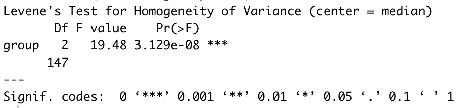
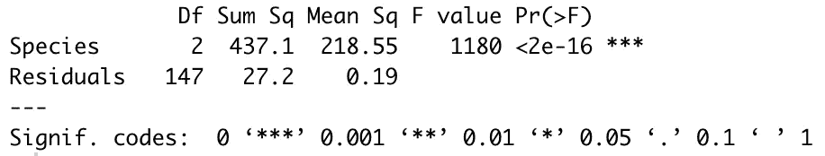
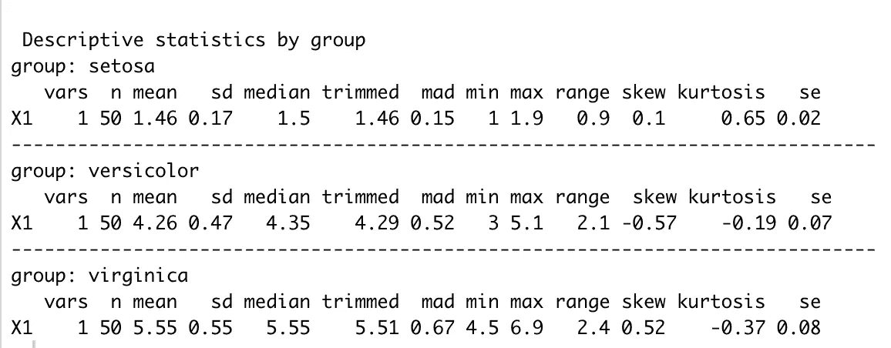
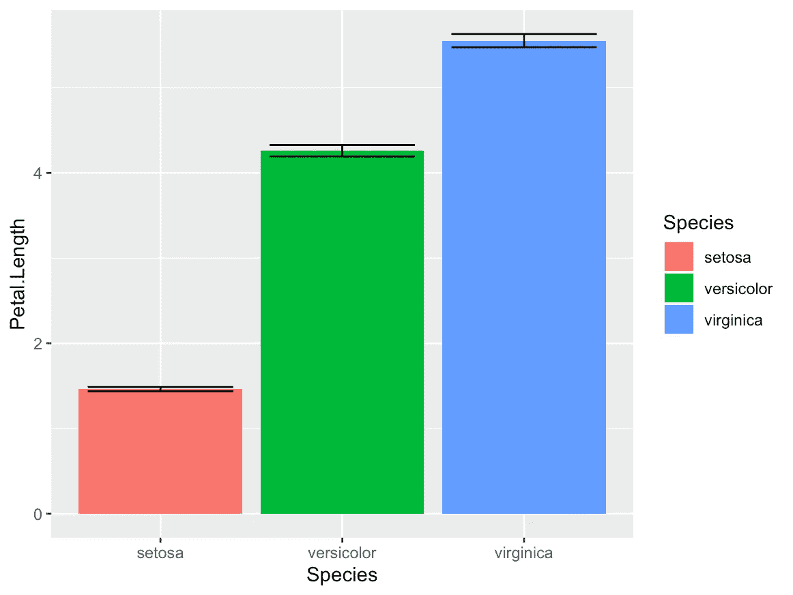
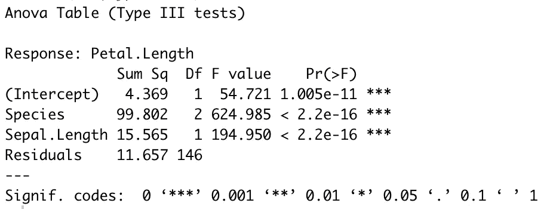

# 在 R 中进行并报告您的第一个方差分析和安协方差分析

> 原文：<https://towardsdatascience.com/doing-and-reporting-your-first-anova-and-ancova-in-r-1d820940f2ef?source=collection_archive---------2----------------------->

## 如何测试和报告分类自变量对区间因变量的影响？

*方差分析*或 ANOVA，是许多科学领域中经常使用的基本统计测试。最常见的形式是，它分析模型中因变量的方差有多少可归因于自变量。它最常用于分析分类自变量的影响(例如，实验条件、狗的品种、花的种类等)。)上的区间因变量。方差分析的核心是提供与简单线性回归(即 OLS)相同的信息。然而，ANOVA 可以被视为一种替代的*界面*，通过它可以访问这些信息。不同的科学领域可能有不同的偏好，这通常意味着你应该使用哪种测试。

协方差的*分析*，或 ANCOVA，表示有一个以上自变量的 ANOVA。假设你想分析狗的品种对狗的体重的影响，控制狗的年龄。如果不控制狗的年龄，你可能永远无法确定狗的品种对其体重的真正影响。因此，你需要运行 ANCOVA 来“过滤”狗的年龄的影响，看看狗的品种是否仍然影响体重。控制另一个协变量可能会加强或削弱你感兴趣的自变量的影响。


Photo by [Akshay Nanavati](https://unsplash.com/@anphotos?utm_source=unsplash&utm_medium=referral&utm_content=creditCopyText) on [Unsplash](https://unsplash.com/s/photos/iris?utm_source=unsplash&utm_medium=referral&utm_content=creditCopyText)

# 方差分析

## 数据集

在这个练习中，我将使用 *iris* 数据集，它在 core R 中可用，我们将使用下面的命令以 *df* 的名称将其加载到工作环境中:

```
df = iris
```

*鸢尾*数据集包含描述不同种类鸢尾花的形状和大小的变量。

一个可以用方差分析来检验的典型假设是鸢尾的种类(独立分类变量)是否对花的其他特征有任何影响。在我们的例子中，**我们将测试鸢尾的种类是否对花瓣长度**(因变量区间)有任何影响。

## 确保你不违反关键假设

在运行方差分析之前，必须首先确认数据集中满足方差分析的关键假设。关键假设是在您的计算机如何计算方差分析结果时假设的方面，如果违反了这些方面，您的分析可能会产生虚假的结果。

对于 ANOVA，假设是方差的**同质性。这听起来很复杂，但它基本上检查了由分类自变量创建的不同组中的方差是否相等(即，方差之间的差为零)。我们可以通过运行 Levene 的测试来检验方差的**同质性。** Levene 的测试在 R 基地不可用，所以我们将使用*车*包进行测试。**

安装软件包。

```
install.packages("car")
```

然后加载包。

```
library(car)
```

然后进行 Levene 的测试。

```
leveneTest(Petal.Length~Species,df)
```

这会产生以下输出:



如您所见，测试返回了一个重要的结果。在这里，了解检验中的假设是很重要的:如果检验结果不显著，我们可以接受 Levene 检验的零假设，这意味着方差是同质的，我们可以继续进行方差分析。然而，测试结果非常显著，这意味着花瓣之间的差异。不同物种的长度有显著差异。

*现在怎么办？*

嗯……在这一点上，和你的合著者、同事或主管谈谈。从技术上讲，你必须进行稳健的方差分析，即使面对非齐次方差，它也能提供可靠的结果。然而，并不是所有的学科都遵循这个技术指南…所以要和你领域里更资深的同事交流。

无论如何，我们将继续本教程，就好像 Levene 的测试结果无关紧要一样。

## 运行实际的方差分析

我们通过使用公式符号、数据集名称和 Anova 命令指定该模型来实现这一点:

```
fit = aov(Petal.Length ~ Species, df)
```

在上面的命令中，你可以看到我们告诉 R 我们想知道*物种*是否影响*花瓣。数据集 *df* 中的长度*使用 *aov* 命令(这是 R 中的 ANOVA 命令)并将结果保存到对象 *fit* 中。**上述命令的两个基本要素是语法(即结构、符号、括号等)。)和 *aov* 命令。**其他一切都可以修改，以适应您的数据:*花瓣。长度*和*物种*是由*虹膜*数据集指定的名称，而 *df* 和 *fit* 只是我随意选择的名称——它们可能是你想要分析的任何东西。

您可能已经注意到，R 还没有报告任何结果。我们需要使用以下命令告诉 R 我们想要访问保存在名为 *fit* 的对象中的信息:

```
summary(fit)
```

该命令产生以下输出:



这张表给了你很多信息。尽管如此，我们感兴趣的关键部分是行*物种*，因为它包含我们指定的自变量的信息，以及列 *F 值*和 *Pr( > F)* 。如果我们的目标是拒绝零假设(在这种情况下，零假设是鸢尾的物种对花瓣长度没有任何影响)并接受我们的实际假设(物种对花瓣长度有影响)，**我们要寻找高 *F 值*和低 *p 值*** *。*在我们的例子中，F 值是 1180(非常高)，p 值小于 0.000000000000002(写出来的 2e-16，你可能已经猜到了，非常低)。这一发现支持了我们的假设，即鸢尾的种类对花瓣长度有影响。

## 报告方差分析的结果

如果我们想报告这一发现，最好报告数据中个体组的平均值(在我们的例子中是物种)。我们使用 *psych* 包中的 *describeBy* 命令来完成这项工作。如果您还没有安装 *psych* 包并且想第一次使用它，请使用以下命令:

```
install.packages("psych")
```

否则，或者在安装了 *psych* 包之后，运行以下命令。

```
library(psych)
describeBy(df$Petal.Length, df$Species)
```

对于 *describeBy* 函数，您传递您希望看到描述的变量(*花瓣。长度*)和分组变量(*物种*)。我们需要在变量名前指定 *df* ，这与上面使用的 *aov* 命令使用的公式符号不同，因为 *describeBy* 命令不允许我们单独指定数据集。运行此命令会产生以下输出:



在此输出中，我们可以看到三个物种 Setosa、Versicolor 和 Virginica，在第三列中，我们看到了*花瓣值的平均值。三组的长度*。

这一发现可以用以下方式报告:

> 我们观察了三种鸢尾(M=1.46)、杂色鸢尾(M=4.26)和海滨鸢尾(M=5.55)的花瓣长度差异。方差分析表明物种之间的这些差异是显著的，即物种对花的花瓣长度有显著影响，F(2，147)=1180，p <.001./>

One could also add a graph illustrating the differences using the package *ggplot2。*运行以下命令安装 *ggplot2* 包，如果你还没有安装的话。

```
install.packages("ggplot2")
```

然后加载包。

```
library(ggplot2)
```

然后运行图形命令。

```
ggplot(df,aes(y=Petal.Length, x=Species, fill=Species))+
  stat_summary(fun.y="mean", geom="bar",position="dodge")+
  stat_summary(fun.data = mean_se, geom = "errorbar", position="dodge",width=.8)
```

这产生了下图。代码相当复杂，解释 *ggplot2* 的语法超出了本文的范围，但是请尝试对其进行修改并将其用于您的目的。



# 安科瓦

现在想象你想要做上面的分析，但是同时控制花的大小的其他特征。毕竟，物种可能不会具体影响*花瓣长度*，但更普遍的是，物种会影响植物的整体大小。所以问题是:**在控制了其他植物尺寸的情况下，物种是否仍然会影响花瓣的长度？**在我们的分析中，代表植物大小的另一个指标是变量 *Sepal。长度*，在*虹膜*数据集中也有。因此，我们通过添加这个新的协变量来指定我们的扩展模型。这就是 an cova——我们在控制一个或多个协变量的同时，分析分类自变量对区间因变量的影响。

```
fit2=aov(Petal.Length~Species+Sepal.Length,df)
```

然而与之前不同的是，我们现在不能简单地在 *fit2* 对象上运行 *summary* 命令。因为在默认情况下，非常奇怪的是，base R 使用类型 I 错误作为默认。在进行简单的方差分析时，I 型误差不是问题。但是，如果我们试图运行 ANCOVA，I 类错误将导致错误的结果，我们需要使用 III 类错误。如果你对什么是 I 型和 III 型错误感兴趣，我可以推荐安迪·菲尔德的书《使用 R 发现统计数据》第 457 页底部的简·超级大脑部分

因此，我们需要使用不同包中的另一个函数来指定我们希望使用的错误的确切类型。我们将使用*赛车*套件。运行下面的命令来安装*汽车*包，如果你还没有安装的话。它和上面 Levene 的测试是同一个包，所以如果你从一开始就遵循教程，你可能不需要安装和加载这个包。如果您不确定，为了安全起见，只需运行这些命令。

```
install.packages("car")
```

然后加载包。

```
library(car)
```

然后，在我们的 *fit2* 对象上运行 *car Anova* 命令，指定我们希望使用类型 III 错误。

```
Anova(fit2, type="III")
```

这会产生以下输出:



正如您在我们的行*物种、*列 *Pr( > F)、*即 p 值中所看到的，物种仍然对花瓣的长度有显著影响，即使在控制萼片的长度时也是如此。这可能意味着花朵确实有不同的比例，并不是因为物种的不同而简单地变大或变小。

尝试在 *fit2* 对象上运行 *summary* 命令，查看 *summary* 命令产生的结果是否不正确；然而，如果您要通过 *summary.lm* 命令查看 *fit2* 对象，该命令以线性模型(即 OLS)的样式生成输出，并且还使用 III 类错误，您将在输出中获得与通过 *Anova* 命令从 *car* 包获得的相同的正确信息。

我们可以如下所示报告这一发现。

> 协变量，萼片长度，与花的花瓣长度显著相关，F(1，146)=194.95，p <.001\. there="" was="" also="" a="" significant="" effect="" of="" the="" species="" plant="" on="" petal="" length="" after="" controlling="" for="" sepal="" f="" p=""/>

After completing either the ANOVA or ANCOVA, you should normally be running the appropriate post hoc tests to reveal more about the effects. After all, an ANOVA is merely an inferential test, i.e., it tests whether the data is distributed in a way that we would expect if the distribution were random. So far, we only know that there is a relationship between species and sepal length —we know that sepal length is non-randomly distributed when grouped by species. However, how exactly does species influence sepal length? One way of achieving this is by breaking down the variance explained by the independent variable of interest into its components . You[可以在我关于**计划对比**的文章中了解更多信息。](/doing-and-reporting-your-first-planned-contrasts-in-r-ee77ff277088)