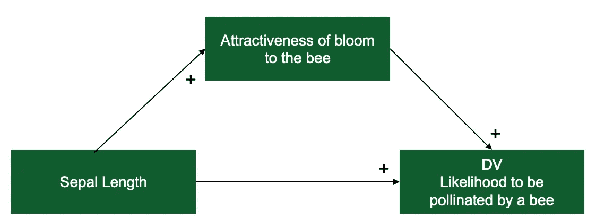
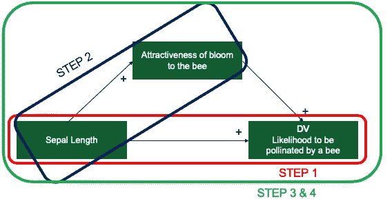
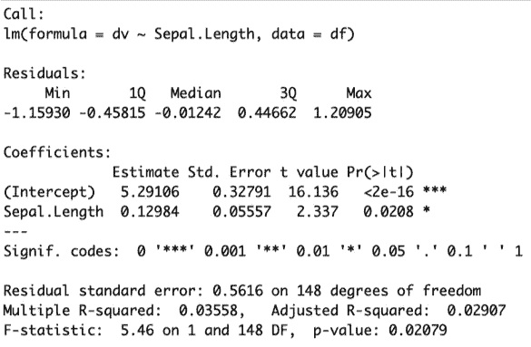
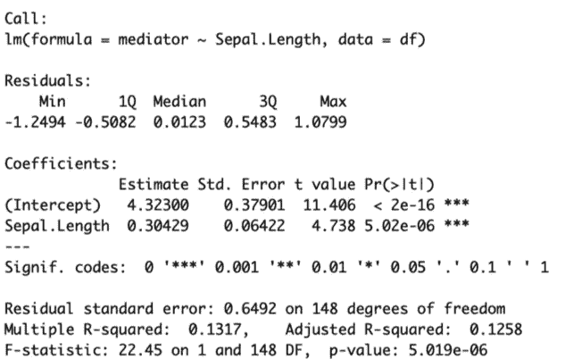
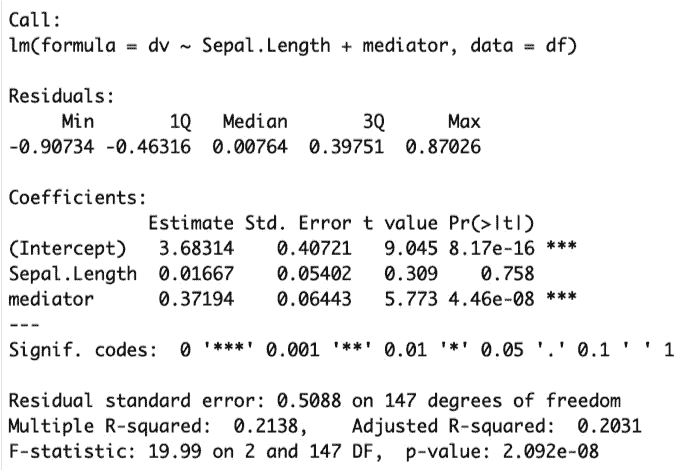
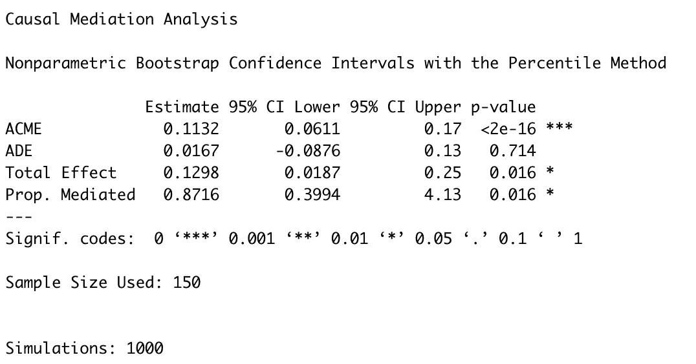
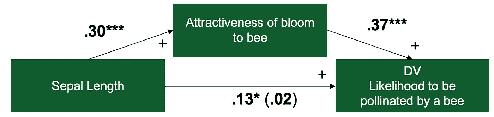

# 在 R 中做并报告您的第一个中介分析

> 原文：<https://towardsdatascience.com/doing-and-reporting-your-first-mediation-analysis-in-r-2fe423b92171?source=collection_archive---------0----------------------->

## 如何测试和报告介导效应

本教程将解释什么是调解分析，展示如何为调解分析模拟数据，运行必要的统计程序，并撰写报告以供发表。
简介将关注于建立冥想到底是什么。如果你知道什么是中介，只是想知道如何在 R 中实现它，那么跳到“第一步:总体效果”这一章。

中介听起来可能很有挑战性，但实际上很简单。中介效应也称为间接效应。当自变量对因变量的影响——顾名思义——被另一个变量(中介变量)调节时，就会发生这种情况。

考虑调解时，一些重要的注意事项是:

*   **介体必须是内源性的:**这意味着介体不能是治疗或研究条件。介体本身必须依赖于外生变量，这些变量通常是实验研究中的治疗或研究条件。
*   **调解人必须揭示更多关于自变量如何影响因变量的见解:**调解人揭示关于过程的一些情况。

因此，中介帮助我们找出*自变量如何影响因变量。通过运行中介分析，我们正在测试关于自变量如何影响因变量的过程的假设。*

## 得出一个中介效应

对于本文，我们将模拟数据。我相信模拟数据确实有助于弄清楚我们正在分析的数据中发生了什么。数据将基于经典的“iris”数据集，该数据集包含在 base R 中。另外，同时设置样本种子，这样你的随机数生成器的结果就会和这里的一样。

```
df=iris
set.seed(12334)
```

iris 数据集包含 5 个变量和 150 个观察值。这 5 个变量是萼片的长度和宽度，花瓣的长度和宽度，以及鸢尾花的种类。


Photo by [Lukas Blazek](https://unsplash.com/@goumbik?utm_source=unsplash&utm_medium=referral&utm_content=creditCopyText) on [Unsplash](https://unsplash.com/s/photos/bee-flower?utm_source=unsplash&utm_medium=referral&utm_content=creditCopyText)

在这篇文章中，我们将假设花瓣的长度影响花朵被蜜蜂授粉的可能性。然而，这种影响不会是直接的，而是通过开花对蜜蜂的吸引力来调节的。因此，我们的假设是萼片长度对蜜蜂通过花朵的吸引力授粉的可能性有间接影响。



只有**萼片长度**是包含在**虹膜**数据集中的变量。剩余的两个变量将被模拟。所以下一步，让我们模拟数据。

## 模拟中介的数据

模拟有一个很好的副作用，你可以直接看到数据中发生了什么。这可以提高你对统计结果的直观理解。

首先，让我们模拟一下中介，“对蜜蜂的吸引力。”这个变量将被命名为 **mediator** ，在我们的例子中，它将由两部分组成。其价值的 35%是萼片。长度+其值的 65%是随机噪声。想象一下，变量“对蜜蜂的吸引力”中的随机噪声可能是其他特定于花朵的属性，如颜色、形状、气味等。

```
df$random1=runif(nrow(df),min=min(df$Sepal.Length),max=max(df$Sepal.Length))df$mediator=df$Sepal.Length*0.35+df$random1*0.65
```

其次，让我们模拟因变量，“被蜜蜂授粉的可能性。”这个变量将被命名为 **dv** 并再次由两部分组成。其值的 35%是介体，+ 65%是随机噪声。在我们的例子中，随机噪声可以是非植物特有的属性，如花的位置、天气条件、土壤等。

```
df$random2=runif(nrow(df),min=min(df$mediator),max=max(df$mediator))df$dv=df$mediator*0.35+df$random2*0.65
```

现在，“萼片长度”中包含的大约 12%(准确地说是 12.25%)的信息应该包含在**因变量**“被蜜蜂授粉的可能性”(as 35% × 35% = 12.25%)中。这是我们预期的总效果。由于**因变量**包含了**中介**“开花对蜜蜂的吸引力”中 35%的信息，因此通过中介的间接效应将“强于”直接效应这正是**中介分析**所显示的。

## 如何用统计程序为调解提供支持

我们将在中介分析的帮助下，通过四个简单的步骤为中介提供统计支持。

*   首先，我们将测试总体效果。这里我们正在观察萼片长度的任何变化是否会影响 DV。稍后将详细介绍。
*   其次，我们将测试自变量对中介的影响。萼片长度对调解的显著影响是调解成为可能的绝对先决条件。
*   第三，我们将同时检验中介变量和自变量对因变量的影响。这是当橡胶碰到路面时，所有的东西都聚集在一起。
*   第四，也是最后一点，我们将为因果中介分析估计各种数量，这意味着我们将比较直接和间接影响，让我们对数据中发生的事情有更多的了解。



The four steps of mediation analysis.

## 第一步:整体效果

总效应描述自变量(iv) **萼片长度**对因变量(dv) **被蜜蜂授粉的可能性**的总效应。基本上，我们想了解这两个变量之间是否有关系。对于这种关系是否需要对调解产生重要影响，有两种观点:

*   第一种观点认为两者之间必然存在着重要的关系。否则，即使有显著的间接影响，我们也不能肯定地说改变 iv(在我们的例子中是萼片长度)对 dv(被蜜蜂授粉的可能性)有任何影响。然而，这个学派正在慢慢地让位于第二个学派。
*   第二种观点认为静脉注射和家庭暴力之间不一定有显著的关系。正如相关性不能证明因果关系一样，没有相关性也不能否定因果关系。[海斯 2018，第 80 页](https://amzn.to/2t93RDw)。一个同样有道理的论点。

总之，你不需要有显著的总体效果，但是有一个绝对没有坏处。如果有疑问，和你的合著者谈谈，因为我的经验是这是一个高度个人化的决定。并希望你的最终审稿人同意你和你的合著者的观点。

幸运的是，在我们的例子中，当我们模拟数据时，我们将有一个显著的总效应。因此，我们开始运行一个简单的线性回归到 dv 加上任何协变量(在我们的例子中没有)。

```
fit.totaleffect=lm(dv~Sepal.Length,df)
summary(fit.totaleffect)
```

这将产生以下结果。正如你所看到的，萼片长度对我们的 dv 的总影响是显著的(p <.05 and="" the="" coefficient="" is="" very="" close="" to="" expected="" from="" above=""/>



*If the output you receive differs from the one below (e.g., the coefficients differ), you might have set a different random seed (see above) or have set no random seed at all. This seed introduces some predictability to the randomness. You can remedy this by setting the random seed above and re-simulating the data.*

So now we have a significant total effect. Let’s proceed to step 2.

## Step #2: The effect of the IV onto the mediator

To establish any mediation, the independent variable (iv, “sepal length” in our case) must significantly affect the mediator. This makes sense, as, for a mediation to take place, the iv must significantly impact the mediator.

So we do another simple linear regression of the iv onto the mediator plus any covariates you might have this time (none in our case).

```
fit.mediator=lm(mediator~Sepal.Length,df)
summary(fit.mediator)
```

This will yield the following results below. As you can see, the total effect of sepal length on our dv is significant (p<.05 and="" the="" coefficient="" is="" close="" to="" expected="" from="" above.=""/>



Now we have a significant effect of the independent variable “sepal length” onto the mediator “attractiveness of the bloom to the bee.”

# Step #3: The effect of the mediator on the dependent variable

The third step confirms that the mediator affects the dependent variable*，同时控制自变量*。这意味着，为了进行调解，调解人必须解释因变量中比自变量更多或其他部分的方差。

因此，我们做一个简单的线性回归，将自变量和中介变量回归到因变量，再加上这次可能有的任何协变量(在我们的例子中没有)。

```
fit.dv=lm(dv~Sepal.Length+mediator,df)
summary(fit.dv)
```

这会产生以下输出:



请注意该输出的几个方面:

*   中介物有显著的影响(p <.05 on="" the="" dv.="" with="" result="" from="" step="" we="" can="" now="" already="" say="" that="" there="" is="" a="" mediation.="" again="" coefficient="" very="" close="" to="" expected=""/>
*   Whereas sepal length was a significant predictor of the dv “likelihood of pollination” before, it is no longer. In our data simulation, we included all the information of the IV that was contained in the DV also in the mediator, so this is not unexpected. In such cases, we speak of a “complete mediation.” This means that the total effect of the IV on the DV is explained by the mediator. In our case, it means that the total effect of “sepal length” onto “likelihood to be pollinated by a bee”)通过“花朵对蜜蜂的吸引力”中介分析有助于我们更好地理解 iv 对 dv 的作用过程。
    如果 IV 仍然是重要的，我们会说“不完全调解”，这也是完全可以的。不完全的调解意味着静脉注射对静脉注射的另一种影响，这种影响不通过调解人。

从统计学上来说，我们有所有的支持来假设数据中的中介。但是，在一个模型中计算整个模型是一种很好的做法。中介是一个迷你结构方程模型(SEM ),所以如果我们愿意，我们可以使用 SEM-packages for R，比如“lavaan ”,来估计整个中介。然而，这将是相当复杂的。谢天谢地，有更简单的方法来完成这项工作。这就是第四步的内容。

## 步骤 4:因果中介分析

让我们加载必要的 R 包。

```
#install.packages("mediation") #uncomment this command in case you haven't installed the mediation package yet.
library(mediation)
```

这将加载(并安装)中介包，它采用我们刚刚估计的回归模型，组合它们并估计整个中介。因此，让我们运行命令。

```
results = mediate(fit.mediator, fit.dv, treat='Sepal.Length', mediator='mediator', boot=T)
```

来自*中介*包的*中介*函数请求我们刚刚估计的模型，然后要求我们指定作为*处理的变量、*即我们的自变量*、*和作为中介的变量。此外，我们需要指定 *boot=T* ，因为默认情况下， *mediate* 将对置信区间使用准贝叶斯近似。然而，我们想要报告百分位数的置信区间，所以我们将其设置为 *T* 为真。这个命令需要一些时间来运行，但不会产生任何输出。要获得输出，我们需要运行下面的命令。

```
summary(results)
```

这会产生以下输出:



这些缩写可能有些吓人，但它们的意思是:

*   **ACME** 代表*平均因果中介效应。*这是 IV(萼片长度)通过媒介(对蜜蜂的吸引力)对 DV(授粉可能性)的间接影响。请注意，它估计这种影响为 0.11——这正好是 0.30(步骤#2 中 IV 对介质的影响)乘以 0.37(步骤#3 中介质对 DV 的影响)——因此不一定是新信息。然而，新的是，我们现在有了整个间接效应的置信区间和显著性水平，而不仅仅是它的两个单独部分。这是我们报告中介所需要的。
*   **ADE** 代表*平均直接效果。*它描述了静脉注射对静脉注射的直接影响。再说一遍，这不是新信息。我们已经在步骤 3 中计算了这种影响:当控制介体时，静脉对静脉的直接影响。
*   **总效应**代表 IV 对 DV 的总效应(直接+间接)。这也不是新信息。我们在第一步中计算了这一点。我们也可以通过简单地将 ACME (.1132)和 ADE (.0167)相加得到. 1298 的总效果。我们也已经知道，从第一步开始，总的效果是显著的。
*   **道具。中介**描述了静脉注射对通过中介的静脉注射的影响比例。计算方法是将顶点(. 113)除以总效果(. 13)得到 0.87。这条信息是一个很好的花絮，但不一定是我们感兴趣的焦点。

你看，我们在这最后一步没有学到很多新东西。然而，我们现在已经获得了报告中介所需的所有信息。

# 报告调解

我们计算的中介可以按以下方式报告:



Figure 1

> 萼片长度对授粉可能性的影响完全是通过花的吸引力来调节的。如图 1 所示，萼片长度和授粉可能性之间的回归系数以及吸引力和授粉可能性之间的回归系数是显著的。间接效应为(. 30)*(.37) = .11。我们使用自举程序测试了这种间接影响的显著性。对 1000 个自举样本中的每一个样本计算非标准化的间接效应，并通过确定第 2.5 和 97.5 百分位的间接效应来计算 95%的置信区间。自举非标准化间接效应为. 11，95%置信区间为. 06 到. 17。因此，间接效应具有统计学意义(p<.001/>

该图的系数取自步骤#1 到#3 中的不同模型。大部分文本信息来自中介函数的结果(第 4 步)。我们之前忽略了它，但中介函数确实执行引导，即，它使用从数据中随机抽取的子样本重新计算模型 1000 次。这样做是为了对我们的结果更有信心。