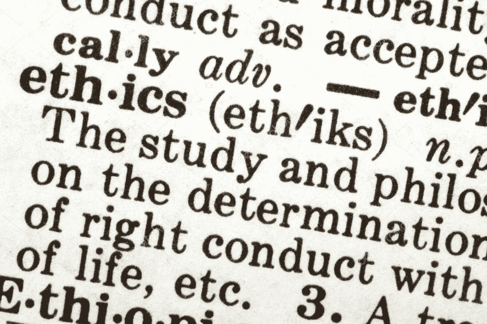
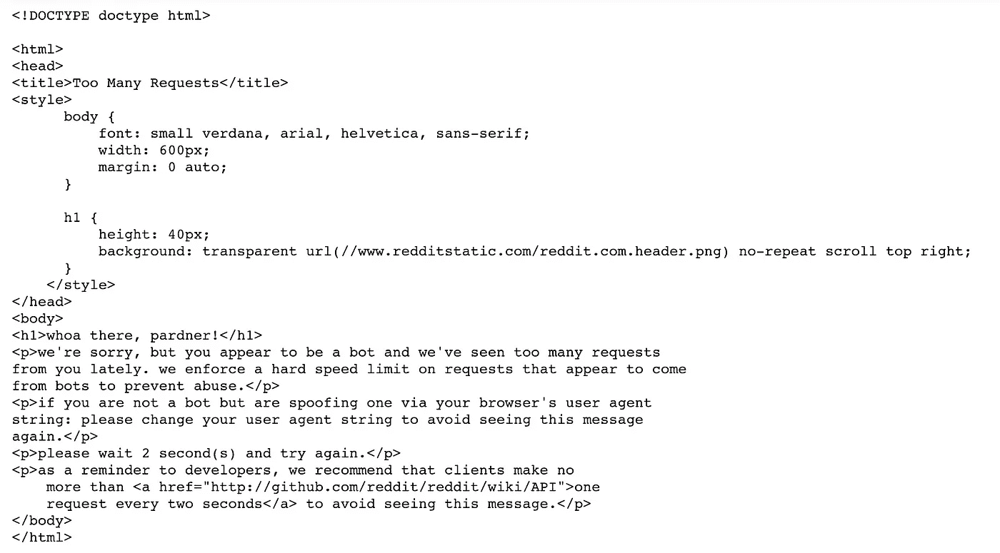

# 以正确的方式处理数据

> 原文：<https://towardsdatascience.com/doing-data-the-right-way-dbf5ba658177?source=collection_archive---------17----------------------->

## 数据科学的伦理

(from: robynmac on D*epositphotos)*

当我学习如何从网上搜集数据时，我第一次想到了数据科学中的伦理概念。刚刚配备了能够轻松捕获和存储任何仅仅是在线打印的信息的能力，我正享受着仅仅为了它而抓取不同网站的乐趣。然后，在尝试搜索 Reddit 时，我收到了这条消息:

whoa there, pardner!

网页抓取*虽然繁琐*却是一个强大的工具。像 Reddit 这样更大的网站有类似上面的措施来阻止我们一次获得太多的信息。看着上面的信息，我们仍然可以获得这些信息，只是不是一下子。网络抓取是我们作为数据科学家最先学会的事情之一，在我涉足数据科学领域的一个月内，我就有能力在线存储写在任何网页上的几乎任何信息。权力越大，责任越大。*肯定有一些人会滥用他们的网络抓取能力来作恶。*

我们生活在一个信息时代，这里存在着大量的数据，并且这些数据还在不断产生。信息现在是生活和社会不可或缺的一部分，随之而来的是需要知道如何管理它。电气和电子工程师协会(IEEE)实际上在 1999 年发布了[软件工程道德规范](https://www.computer.org/web/education/code-of-ethics)，概述了软件工程师应该遵守的 8 项原则“符合他们对公众健康、安全和福利的承诺。”道德规范为软件工程师的行为和决策提供了指南，并且(简单地说)非常实用。例如，第一条原则规定“软件工程师的行为应该与公众利益一致。”下面的原则也符合做好事和最大化软件产出的好处的路线。

数据科学是一个比软件工程还要新的领域。2018 年，我们看到了剑桥分析/脸书崩溃和欧盟实施**通用数据保护法规** ( **GDPR** )等事件，这两者都与大数据以及如何处理我们在线信息有关。大数据不可避免地会对世界和我们的社会产生巨大影响，因此我们(作为数据科学家)必须对我们正在做的任何事情的道德影响有所认识。

# 所以…什么是对的？怎么了？

[silicon Republic](https://www.siliconrepublic.com/careers/data-scientists-ethics)上发表的一篇文章质疑为什么数据科学家没有接受道德培训。文章一开始就提出了一系列与道德相关的问题，比如:*我们能卖什么？我们可以得到这些信息吗？*“问 20 个数据科学家这些问题，你会得到 20 个不同的答案。”

由于该行业还处于起步阶段，对于什么是正确的还没有达成社会共识。此外，在数据科学过程中，有许多阶段会涉及不同的伦理问题。我在两个广泛的领域探索数据科学的伦理:**数据收集**和**有效性**。这不是在任何情况下做什么的答案，而是探索如何将伦理应用于数据科学，以及我们如何以正确的方式实践数据科学。

在开始之前，我想声明这篇文章中的很多内容都是基于网上研究的。我的一个主要资源是密歇根大学 Jagadish 教授在 Coursera *上的* [*数据科学伦理课程。*](https://www.coursera.org/learn/data-science-ethics/home/welcome)

## 数据收集

对于一项数据科学任务，流程的第一个一般阶段是收集和清理数据。出现了许多伦理争议，比如我遇到的网络抓取。这里有一个关于数据收集道德的问题:**如果我给你拍了一张照片，这张照片是不是因为我拍的而属于我？或者既然照片的主体是你，那这张照片是属于你的吗？**

这个基本的例子已经引出了两个在数据科学伦理领域越来越受关注的主要概念:**知情同意**和**数据所有权**。

知情同意的概念来自医学研究领域，在这一领域，患者必须在接受治疗前了解治疗的全部风险。更相关的是，知情同意发生在研究对象必须知道他们正在被研究的时候。这似乎是显而易见的，不是吗？如果你正在参加某个临床试验，你会知道你是这个试验的一部分，对于研究人员来说，随机给人用药来测试某种治疗的有效性是完全不道德的。现在将这个概念应用于数据科学。许多企业基于 A/B 测试做出决策。A/B 测试对受试者的影响可能不如测试抗癌药物，但它也是一种实验。

这里有几个现实生活中的例子可以考虑。2014 年，在一项与康乃尔大学和加州大学旧金山分校联合进行的关于情绪传染的研究中，脸书被揭露操纵用户的新闻推送。他们想知道在他们的订阅源上看到更多正面帖子的用户是否会发布更多正面帖子，以及看到更多负面帖子的用户是否会发布更多负面帖子。他们得出结论，情绪传染是显而易见的，但当公众发现脸书不仅操纵他们看到的内容，而且还使用他们的新闻订阅和帖子上的信息进行研究时，大多数人都感到愤怒。快速的谷歌搜索发现了许多抨击脸书滥用用户数据的文章，特别是因为这个实验操纵了用户的情绪。然而，脸书声称，在他们的实验中使用数据符合他们的数据使用政策，用户在创建他们的脸书账户之前已经同意并接受了该政策。

同年， [OkCupid 出来说，他们在一项实验中也操纵了呈现给用户的信息，以观察被告知他们是兼容的是否会影响真正的兼容性](https://www.forbes.com/sites/kashmirhill/2014/07/28/okcupid-experiment-compatibility-deception/#616a0b6477b1)。OkCupid 基本上告诉不相容的夫妇他们是相容的，反之亦然，以观察报告的相容性分数是否重要。我引用莫莉·伍德在《纽约时报》上发表的一篇关于这个实验的文章:

> OKCupid 的用户协议说，当一个人注册该网站时，个人数据可能会用于研究和分析。
> 
> “我们告诉用户一些不真实的东西。我绝对没有隐瞒这个事实，”OKCupid 的总裁鲁德尔先生说。但他说，测试是为了确定人们如何从网站上获得最大收益。“人们来找我们，是因为他们希望网站能够运行，而我们也希望网站能够运行。”

与脸书的失败类似，他们声称知情同意是因为用户在注册服务时达成的协议。在不同的网站注册时，我们盲目同意了多少这样的协议？这算不算知情同意？

数据所有权有些相关。在数据科学中，数据属于记录它的人。因此，在照片示例中，约定将规定照片属于我。作为数据科学家，我们通常获取和处理现有数据——我们不是进行调查和发布表格的人。数据的所有权现在变得更加复杂了。在知识产权方面，我们正在处理记录数据的衍生产品，因为我们从一个地方获得数据，对其进行管理和收集，然后为我们的研究进行清理和验证。因为在整个清理过程中投入了如此多的精力，而且从技术上来说，因为我们是这些新数据的记录者，所以这些清理过的数据集属于我们吗？

普遍的共识是，在我们使用这些数据之前，我们必须得到发布这些数据的人的许可。但是如果我们从产品评论上获取信息呢？我们必须得到每个留下评论的人的许可。这就是为什么像亚马逊或易贝这样的在线网站在他们的用户协议中有某种条款，规定无论用户在他们的网站上发布什么，公司都可以使用。因此，如果我们是亚马逊的数据科学家，我们可以在伦理上使用他们的产品评论数据。这是与 GDPR 相关的数据科学道德领域——一种保护互联网用户数据不被公司处理的措施。对许多公司来说，数据是一种资产。尤其是在技术领域，数据推动他们做出决策，一般来说，数据越多越好。

GDPR 是政府监管用户数据所有权和使用的首批重大举措之一，它以某种方式影响了每一家有网络业务的公司。这也暴露了数据所有权这一复杂领域中的许多灰色地带。

## 有效性:在数据、处理和模型中

有效性可以在数据科学过程的不同点进行评估。我粗略地简化了过程，并解决了三个主要的争论点:数据的有效性、处理的有效性和模型的有效性。从伦理上评估数据科学过程的有效性是主观的。谁来说什么是对的，什么是错的？当然有比其他方法更好的方法，但是关于处理数据的正确方法还没有一个行业标准。没有关于如何确保收集的数据符合某种标准的指南。

首先，在我看来，作为数据科学家，我们有责任尽最大能力验证我们正在处理的数据是有效的；或者至少，我们应该将数据放在上下文中，并向决策者概述其局限性。决策者应该在最大程度上了解从数据和我们创建的模型中得出的结论所处的环境。在评估数据的有效性时，我会考虑以下几个问题*(绝对不是详尽的列表)*:

*   **数据是否代表了您想要捕捉的内容？**会不会是来自将要得出结论的人群中的某个特定子集？我认为 Jagadish 课程中的一个例子很好地描述了这一点:使用来自 Twitter feeds 的数据来代表公众意见。Twitter 用户普遍倾向于更年轻、更富有。
*   **数据有多永恒？**随着时间的推移，你用于预测/模型的数据会有相关性吗？如果没有，是否有措施防止模型过时**或**是否有一个已知的模型使用截止点？例如，SAT 的得分是 2400 分，直到 2016 年，随着阅读和写作部分的合并，它变成了 1600 分。我们应该知道大学用来评估整体分数的标准分数转换，或者如果我们评估阅读/写作能力，考虑各部分的合并。

我们有很多方法可以处理数据。当我们处理表格和数据帧中的`NaN`值时，我们可以采取许多不同的方法，从而产生不同的结果。无论是删除行、用平均值或中值替换空值还是从相邻数据点进行插值，都有一般的最佳实践，但没有硬性的标准规则。什么是最好的方法也取决于学习的背景。由于这是如此主观，需要如此多的背景，我在这里能做的最好的就是推荐功利主义的方法——选择任何你认为最有意义的方法；你认为最大化效用的任何方法。

**模型有效性**与我们讨论的非常相似。我们只是想确保无论在什么情况下，我们都在尽最大努力产生最好的结果。在技术层面上，我们希望验证我们的模型，以便它最适合我们拥有的任何场景。这就是为什么我们有不同的评估系统和测试分数——来看看我们的模型表现如何。提出一个不准确的模型来做预测或决策是非常不道德的，尤其是如果它可以改进的话。我认为，作为一名数据科学家，负责任的做法是不断测试你的模型。是过拟合还是欠拟合数据？设计的功能有意义吗？模型容易改变吗？

我发现[软件工程道德准则](https://www.computer.org/web/education/code-of-ethics)中有三个条款与数据科学的这个方面相关:

> 软件工程师应确保他们的产品和相关的修改符合最高的专业标准。
> 
> 软件工程师应保持其专业判断的完整性和独立性。
> 
> 软件工程经理和领导者应认同并促进软件开发和维护管理的道德方法。
> 
> (摘自 IEEE 的软件工程道德准则)

到结束掉，我们来深入一下。想象一下，我们正试图训练一个人工智能像人类一样行动。在监督学习算法中，目标是优化一些*目标函数*。现在我们如何定义人类的目标函数？这个人工智能会有什么样的道德？不管是谁负责定义这个目标函数，他基本上都有权力定义，至少对这个人工智能来说，定义“理想人类”。

[电车难题](https://en.wikipedia.org/wiki/Trolley_problem)及其变种，是经典的伦理思想实验之一。随着自动驾驶汽车的出现，这种思想实验现在变成了现实。如果一辆自动驾驶汽车将要撞上一些行人，汽车是否应该突然转向，从而有可能杀死司机？还是汽车应该饶了司机，害死行人？

NPR 的 Laurel Wamsley 写道 [*自动驾驶汽车应该有伦理吗？*](https://www.npr.org/2018/10/26/660775910/should-self-driving-cars-have-ethics)2018 年 10 月。这篇文章着眼于在线向人们提出的 Trolly 问题变体的结果。 [*(可以看到这里提出的问题！—在“判断”标签下)*](http://moralmachine.mit.edu/) 研究发现，人们的答案会因他们来自哪里而有所不同。因此，对于在每种情况下什么是正确的，还没有达成共识。这项电车问题研究的作者写道:

> “在我们允许我们的汽车做出道德决定之前，我们需要进行一次全球对话，向设计道德算法的公司和监管它们的决策者表达我们的偏好。”

随着人工智能成为社会越来越重要的一部分，规则将开始形成。我们非常幸运能够见证该行业的发展，并有可能作为数据科学家为其做出贡献。我希望，作为数据科学家，我们要确保把我们的力量用在好的方面。

TL；博士:尽你所能做正确的事情。

*想法？给我留个评论@*[*Yish Lim*](https://medium.com/u/6ac286c49dad?source=post_page-----dbf5ba658177--------------------------------)*和大家说说吧。*