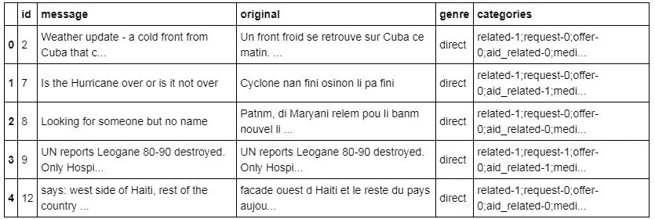
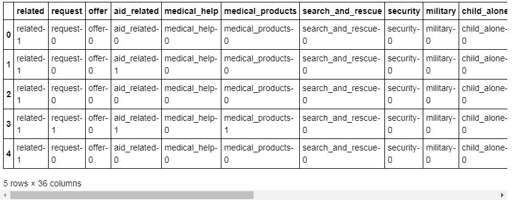
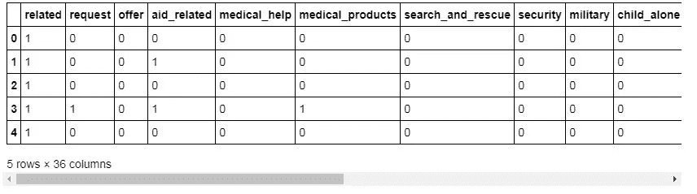
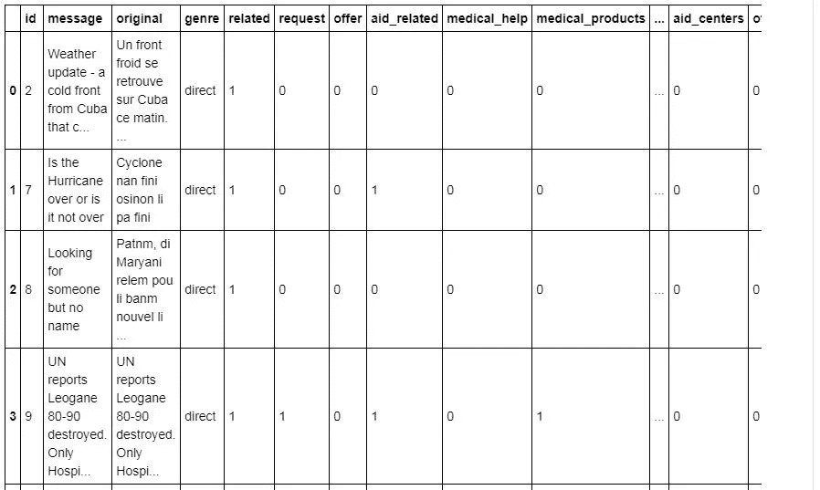
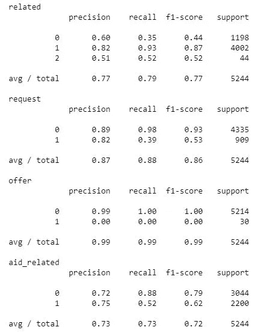
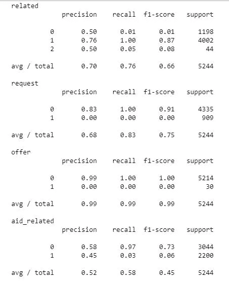
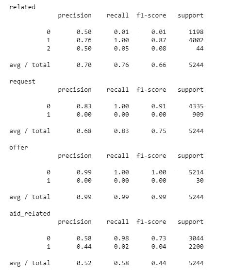

# 用机器学习做有意义的工作——对灾难信息进行分类

> 原文：<https://towardsdatascience.com/doing-meaningful-work-with-machine-learning-classify-disaster-messages-436bfe9ec42?source=collection_archive---------23----------------------->

## 建立模型，帮助救灾组织拯救人们的生命。


I’m writing this post at 1am in Bucharest, Romania.

又见面了。欢迎来到我的第四篇关于机器学习的内容。我最近做了一个我认为对社会有意义的项目。我将简要概述这是怎么回事，然后马上深入代码:)

> 在这个项目中，我应用数据工程技术创建了一个 API(应用程序编程接口),将来自各种来源(Twitter，文本消息)的灾难消息分为 36 类。这种分类问题是一种受监督的机器学习，因为模型根据对提供给它的数据的学习来学习对结果进行分类。即信息与什么相关:水、食物、住所、金钱等。？原因是当灾难发生时，有数百万条消息被发送和推文告知。然而，灾难由不同的组织负责。食物供应可能由某个组织提供，而灭火则由另一个组织负责。因此，该应用程序的用途是将这些消息分类成各种类型，以便可以理解对于特定的灾难需要哪种类型的援助。

## 项目结构

该项目有三个部分:

1.  **ETL 管道**
    *提取、转换、加载*数据。这与处理数据有关。也就是说，我加载、合并和清理了消息和类别数据集。我存储到 SQLite 数据库中，以便模型可以在下一步中使用它进行训练。
2.  **ML 流水线**
    *机器学习*流水线与训练模型和测试模型有关。管道包括一个文本处理部分，因为它处理开头提到的文本源。我还使用 GridSearchCV 进一步调优模型，并将其保存为 pickle 文件。
3.  **Flask Web App**
    `run.py``process_data``train_classifier`基本就是终端工作空间包含的 ETL 管道和 ML 管道，让 App 工作。

## ETL 管道

在项目的第一部分，我的目的是提取我需要的数据，进行必要的转换，以便我可以在以后的算法构建中使用它。一旦我看到了我需要的两个数据集:T3 和 T4，我就使用公共 id 合并这两个数据集。

```
*# merge data sets* 
df = messages.merge(categories, on = [‘id’]) 
df.head()
```



然后，我将类别分成单独的类别列，并为每一列指定了单独的类别名称。

```
*# create a dataframe of the 36 individual category columns*
categories = df['categories'].str.split(';', expand = **True**)row = categories.head(1)category_colnames = row.applymap(**lambda** x: x[:-2]).iloc[0, :].tolist()*# rename the columns of `categories`*
categories.columns = category_colnames
categories.head()
```



因为模型使用数字作为输入，所以我将类别值转换为数字 0 或 1。

```
**for** column **in** categories:
    *# set each value to be the last character of the string*
    categories[column] = categories[column].astype(str).str[-1]

    *# convert column from string to numeric*
    categories[column] = categories[column].astype(int)
categories.head()
```



转换类别列后，我对数据框进行了更改。我用新的类别列替换了原来的类别列。

```
*# drop the original categories column from `df`*
df.drop('categories', axis = 1, inplace = **True**)*# concatenate the original dataframe with the new `categories` dataframe* df = pd.concat([df, categories], axis = 1) df.head()
```



在检查了数据中的重复项后，我删除了它们。

```
*# check number of duplicates*
df[df.duplicated].shape(170, 40)*# drop duplicates* 
df.drop_duplicates(inplace = **True**)*# check number of duplicates* 
df[df.duplicated].count()
```

我最终将干净的数据集保存到 SQLite 数据库中。

```
*# Save the clean dataset into a sqlite database.*
engine = create_engine('sqlite:///disaster.db')
df.to_sql('messages_disaster', engine, index=**False**)
```

## ML 管道

在项目的第二部分，我创建了机器学习管道，用于将灾难信息分类成不同的类别。被称为“管道”的原因是因为这个建模工具由几个步骤组成，这些步骤处理输入以生成输出。在这种情况下，我使用*标记化*来处理文本数据。

```
*# load data from database*
engine = create_engine('sqlite:///disaster.db')
df = pd.read_sql_table('messages_disaster', con = engine)X = df['message']  
Y = df.drop(['message', 'genre', 'id', 'original'], axis = 1)*# Tokenization function to process text data.*
**def** tokenize(text):
    tokens = word_tokenize(text)
    lemmatizer = WordNetLemmatizer()
    clean_tokens = []
    **for** tok **in** clean_tokens:
        clean_tok = lemmatizer.lemmatize(tok).lower().strip()
        clean_tokens.append(clean_tok)
    **return** clean_tokens
```

机器学习管道将在数据集中的 36 个类别上以`message`列作为输入和输出分类。这是一个*自然语言处理的问题；*即对文本进行处理，从信息中提取含义。是不是很神奇？

```
pipeline = Pipeline([
    ('vect', CountVectorizer()),
    ('tfidf', TfidfTransformer()),
    ('clf', MultiOutputClassifier(RandomForestClassifier()))
])
```

就像所有其他 ML 模型一样，我们必须有训练和测试集。原因是我们不希望我们的模型在训练集上表现得非常好，同时在看到新数据时不能正确地对我们的类别进行分类。因此，我们必须只使用数据的子集来训练它，并观察它在测试集上的表现。

```
*# Split data into train and test tests.*
X_train, X_test, y_train, y_test = train_test_split(X,Y, test_size = 0.2, random_state = 45)*# Train the model.*
pipeline.fit(X_train, y_train)
```

在测试我的模型时，我希望有一些客观的性能指标。即我会看 *f1 分数*，*精度和召回。*

```
*# Test the model and print the classification report for each of the 36 categories.*
**def** performance(model, X_test, y_test):
    y_pred = model.predict(X_test)
    **for** i, col **in** enumerate(y_test):
        print(col)
        print(classification_report(y_test[col], y_pred[:, i]))performance(pipeline, X_test, y_test)
```



just a snapshot

在建立模型时，寻求改进总是一个好主意。尝试调整模型的参数以获得更好的结果。这就是我在这里尝试的。这是相同的过程，但有不同的管道。

```
*# Improve the pipeline.*
pipeline2 = Pipeline([
    ('vect', CountVectorizer()),
    ('best', TruncatedSVD()),
    ('tfidf', TfidfTransformer()),
    ('clf', MultiOutputClassifier(AdaBoostClassifier()))
])*# Train the adjusted pipeline.* 
pipeline2.fit(X_train, y_train)# Check the performance of the adjusted model.
performance(pipeline2, X_test, y_test)
```



我更进一步，使用了一组不同的参数和一定范围的值。在 *GridSearchCV* 的帮助下，模型选择最佳参数。

```
parameters2 = { 
              'tfidf__use_idf': (**True**, **False**), 
              'clf__estimator__n_estimators': [50, 100],
              'clf__estimator__learning_rate': [1,2] }cv2 = GridSearchCV(pipeline2, param_grid=parameters2)cv2.fit(X_train, y_train)performance(cv2, X_test, y_test)
```



## **构建 API**

最后，我以制作一个 API 来结束这个项目，这个 API 接收一条灾难消息，并将其分类为最可能的灾难类别。这样，我们可以帮助救灾组织更好地了解发生了什么类型的灾难，以及需要哪种援助。

## **结束语**

如果你做到了这一步，非常感谢你的阅读！希望这能让你了解机器学习有多有用。以及它的应用范围有多广。通过了解如何处理文本数据和实现模型，我们可以真正挽救人们的生命。说到模型，这是我的 [**github**](https://github.com/andreigalanciuc/RECOMMENDATION-SYSTEM-WITH-IBM) 上的完整项目。

祝你一切顺利，永远幸福:)

**附:我们来连线一下** [**Linkedin**](https://www.linkedin.com/in/andreigalanchuk/) **！**