# 做得更好

> 原文：<https://towardsdatascience.com/doing-yelp-better-fdc11c20362a?source=collection_archive---------18----------------------->

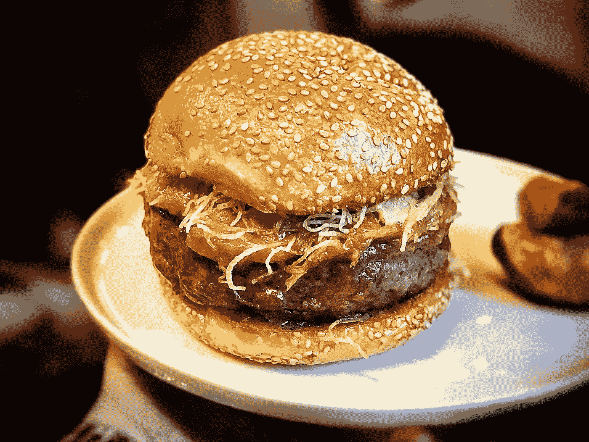

Mu Ramen’s Harlan Burger

## 使用 Vader 和 LDA 为餐厅提供量化指标。

编辑:更新应用程序，包括好的和坏的评论快照。

欢迎来到我称之为 Yelp 成绩单的项目。在这个项目中，我的目标是为 Yelp 目前的企业所有者服务提供商业增值。使用 NLTK 的 Vader 情绪分析并结合 Genism 的 LDA 库，我为餐馆创建了一个量化的报告卡，以确定他们做得好的地方，以及他们可以改进的地方。

要直接跳到应用程序，[点击此处](https://desolate-ocean-14363.herokuapp.com/)。

# 商业案例

Yelp 很可能是世界上最大的本地商业评论网站，涵盖了从医生办公室到清洁服务的各种业务。然而，Yelp 的核心是一个众包评论网站，通过在其数据库中征集用户生成的餐厅内容，使餐厅评论过程民主化，并为世界各地的餐厅带来更多曝光率。

随着时间的推移，Yelp 作为一种餐厅信息资源的流行导致了数百万点数据的产生。这在一定程度上稀释了 Yelp 对一家餐馆的评论的影响，并导致餐馆老板的一些不满。以下是导致企业主对 Yelp 不满的诸多因素中的 3 个。

1.大数定律

由于评论的绝对数量，每一个进入餐厅的评论最终都会稳定他们的评级。它永远停留在那里，通常是 4。在这一点上，大多数餐厅争取 4 分，只有像 Le Bernadin(米其林三星)这样真正最好的餐厅才能得到 4.5 分。获得 5 星评价的餐厅通常是较新的餐厅，评价不到 30 个，许多厨师认为这些评价大多来自餐厅的朋友。你可以在下图中看到评论的分布。假设 1 星和 2 星餐馆通常会关门，但我可以向你保证，我在当地的中国外卖店一如既往地开放和繁忙。这也可能是因为 Yelp 的 API 给我的餐馆提供了更高的评论数。

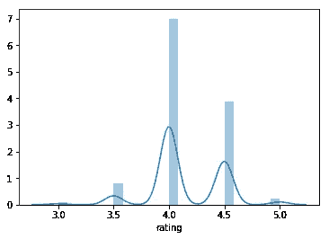

2.极度波动

Yelp 是人们以某种方式回应的指定场所，这导致了大量的赞美，或愤怒的被动攻击内容。第一次或第一千次使用 Yelp 的人通常会受到极端体验的激励，无论是积极的还是消极的，因此他们的评论往往会反映这些体验，而不会考虑用餐体验的其余部分。

3.代表性差

如上所述，由于对单一问题的关注，我们看到了大量正面和负面的评论，这些评论不能正确反映整个用餐体验。这些不是我们通常期待的评论，指出了积极和不足之处。因此，许多餐厅看到很多 5 星或 1 星的评论，他们觉得这是不平衡的，影响了他们的总分。

# 这个问题

鉴于我们已经确定了许多餐厅在处理在线评论时面临的一些问题，Yelp 是否有办法为这些餐厅增加价值并提供可行的反馈？

Yelp 拥有数百万条用户评论，使用 NLP，我们可以获得这些数据，并为一家餐厅提供全面的量化指标，而不必花费数小时手工整理评论。使用这一指标，餐馆可以发现问题并努力改善他们的业务。

# 该过程

创建这些指标的过程非常简单，如下图所示:

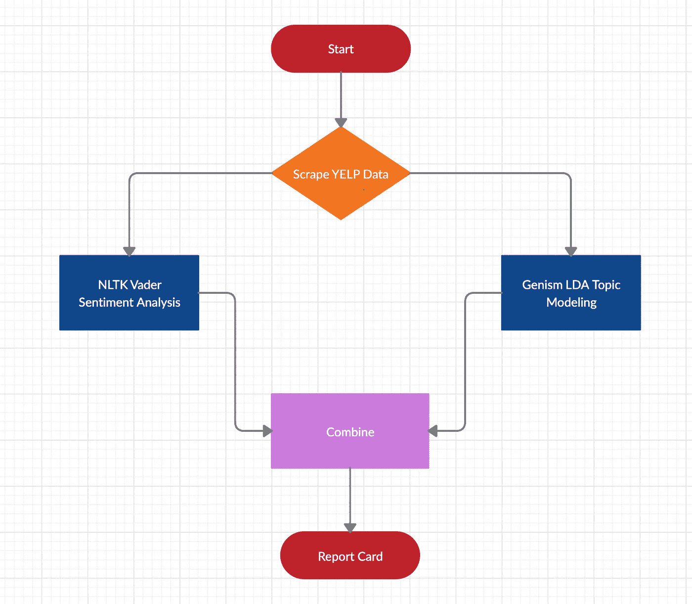

# 步骤 1:收集数据

使用 Yelp 的 API，我获得了信息，更重要的是，获得了给定行政区中每个餐馆的餐馆 id。这为我提供了一个包含 1000 个餐馆 id 的列表，然后我可以用它来抓取 5 页或者至少 100 个有这么多评论的餐馆的评论。有的餐厅 scraped 没有 100 条评论，有的餐厅由于用户更新评论，评论超过了 100 条。这些更新的评论有些是正面的，有些是负面的。

最终统计如下:

曼哈顿:115，588 条评论

皇后区:94301 条评论

布鲁克林:100，166 条评论

斯塔滕岛:51，490 条评论

布朗克斯:59150 条评论

斯塔滕岛和布朗克斯区是 Yelp 上回应最少的。我相信这与我的信念有关(在此讨论),大多数人倾向于不离开 Yelp 评论，除非他们有一次重要的用餐经历。这些餐馆位于本土，为居民提供日常膳食，因此在 Yelp 上很大程度上被当地人忽略了。在曼哈顿用餐被广泛认为是一种体验，或者特殊场合，因此更有可能在 Yelp 上获得回应。此外，我咨询了当地的斯塔滕岛专家，得知可能由于斯塔滕岛主要是住宅区，大多数居民要么开车过桥去布鲁克林享受独特的餐饮体验，要么呆在家里吃饭。这可能是斯塔滕岛回复率低的原因之一。

# 第二步:维德

收集数据后，我采取的第一步是通过 NLTK 的维德情绪分析运行数据。Vader 是一个使用起来极其简单的库，是在 Twitter 数据上训练出来的。因此，它不需要太多的数据准备，因为像标点符号，大写字母和随机停用词这样的东西可以帮助它确定情感得分。

我没有关注评论中给出的星级数，因为我觉得星级评定是任意的，而且没有指导原则。它仅仅代表了评论者有多疯狂或快乐，却没有为我们提供一个可衡量的标准来识别具体的问题。例如，三星级是模糊的，一个人可以称赞食物，但同时提到 2-3 件他们不满意的事情。

Vader 是使用一个简单的 lambda 函数完成的，该函数为每个评论返回一组 4 个分数，一个正面、中性、负面和复合分数。复合得分是我们所关注的，其范围从-1 到 1，反映了从负到正的情况。由于人们通常在 Yelp 上看到的回复的性质，分布有点不平衡。下图是平均复合情感得分频率的样本。

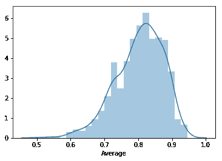

正如我们所见，积极情绪的评论比消极情绪的多。没关系。只要我们在这个公认的框架内工作，我们就能理解最终的分数。

对于那些不熟悉维德的人来说，下面是我们一些被“维德化”的餐厅评论的快照:

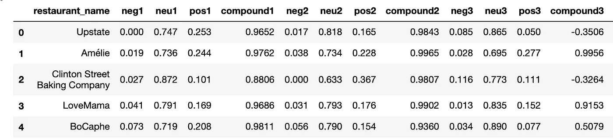

为了说明 Vader 情绪分析是如何工作的，下面是平均复合得分最高的餐厅 Fish checks(. 945)和最低的餐厅 Di Fara Pizza (.511)的样本评论。

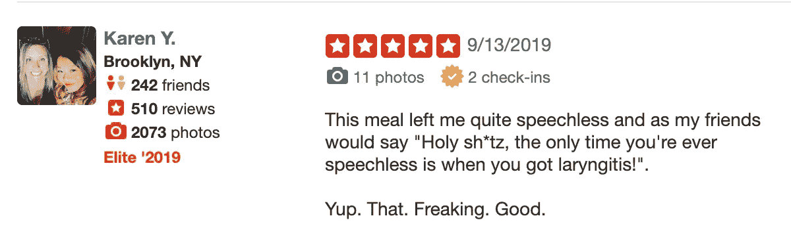

Fish Cheeks

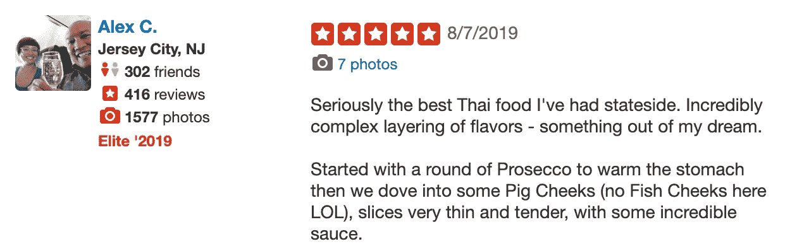

Fish Cheeks

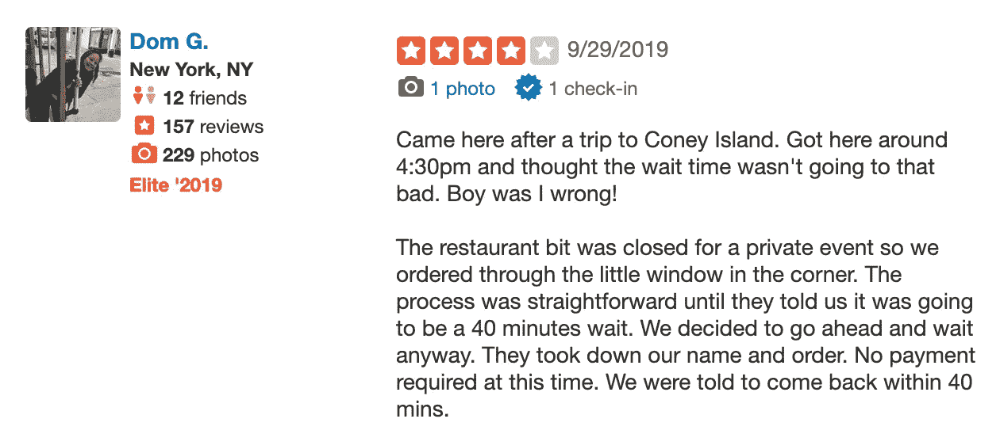

Di Fara Pizza

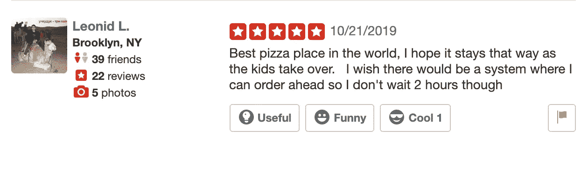

Di Fara PIzza

正如你所看到的，鱼颊餐厅的食物有很多最高级的词语，人们对它们赞不绝口。另一方面，对于纽约市最著名的比萨餐厅之一的迪法拉比萨，许多人对食物赞不绝口，但也对排队感到不满，因为等待一片比萨通常需要 45 分钟至 1.5 小时。这也增加了我关于星星太模糊的断言的分量。DiFara 的服务显然存在问题，但许多评论都是 5 星，事实上该餐厅的总体评分是 4 星。因此，在个人评论中使用星级系统会导致我们在识别服务问题以确定情绪时出现误报。

# 第三步:LDA

我们过程的下一步是使用潜在的狄利克雷分配。这是一个无监督的机器学习工具，它对我们的数据语料库(所有文本)进行采样，并试图导出共同的话题。我在提到服务的餐馆上训练这个模型，因为服务相关的评论只占我总数据的 30%。我指示 LDA 找出 15 个主题，因为服务在我的数据中没有得到充分体现，所以我至少要找出 2 个代表服务的主题，其余的我需要确保纽约市提供的各种美食得到充分体现。如果我的模型遇到一篇提到食物的评论，却没有发现它，那将是一个巨大的失败。

LDA 是一个详尽的过程，需要不断地调整和重新运行，以确保模型得到充分的训练。除了清理、词汇化和标记化之外，我还需要删除标准停用词库之外的大量停用词。最后，为了确保我的模型准备充分，我需要在每个区添加超过 1000 个额外的停用词。我添加到禁止列表中的单词包括所有与这个过程无关的词类，比如“兄弟”、“姐妹”、“史蒂夫”、“美味”、“也许”、“炸弹”和“美味”。我想确保包含以食物和服务为导向的词，但为了扩大服务的范围，一定要去掉与禁止列表服务相关的形容词。我最后的主题列表如下:

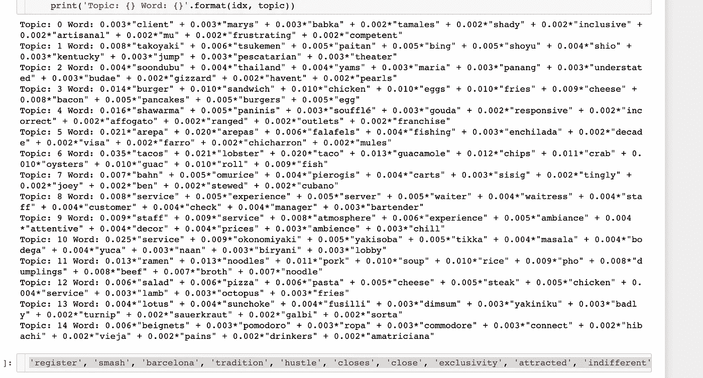

一旦主题列表最终确定，我就可以将该模型应用到我的所有评论中，并为每个评论的最高得分主题分配一个主题编号，如下所示:

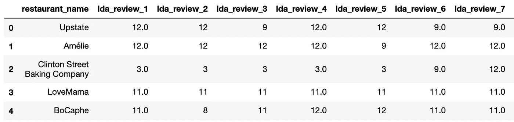

# 第四步:组装

项目的最后一部分包括加载 Vader 和 LDA 数据帧，并编写一个函数来记录每个数据帧并创建一个分数。代码如下:

```
#df is topic modeled restaurant reviews dataframe
#vd is vaderized restaurant reviews dataframe
#maintaining index integrity is important for this function#establishing food vs service topics
food = [1, 2, 3, 4, 5, 6, 7, 10, 11, 12, 13, 14]
service = [0, 8, 9]
#iterable
nums = [str(s+1) for s in range(139)] reportcard = []
for row in df[['restaurant_name']].itertuples():
    #these are inside to reset after each restaurant
    numreviews = 0
    badfood = 0
    goodfood = 0
    badservice = 0
    goodservice = 0
    for j in nums:
       #check for Nans
        if not np.isnan(df.iloc[row[0]]['lda_review_'+j]):
            #if integer version of topic number in this cell[0] is #in service
            if int(df.iloc[row[0]]['lda_review_'+j]) in service:
                #and if compound score is less than .5, add a point #to bad service
                if vd.iloc[row[0]]['compound'+j]<.5:
                    badservice +=1
                else:
                    #otherwise add a point to good service
                    goodservice +=1
            #if integer version of topic number in this cell[0] is #in food
            elif int(df.iloc[row[0]]['lda_review_'+j]) in food:
                #and if compound score is less than .5, add a point #to bad food
                if vd.iloc[row[0]]['compound'+j]<0.5:
                    badfood +=1
                #otherwise add a point to good food.
                else:
                    goodfood +=1
            else:
                #if all that fails, let me know what failed
                print(int(df.iloc[row[0]]['lda_review_'+j]))
            #track for number of reviews in each row for averaging #purposes
            numreviews += 1

    #append all this to a dictionary in the following fashion
    reportcard.append({'restaurant': row[1], 
                        'posfood_score': goodfood/numreviews, 
                        'negfood_score': badfood/numreviews,
                        'posservice_score': goodservice/numreviews, 
                        'negservice_score': badservice/numreviews})
```

最终结果存储在一个字典中，然后我们可以将其转换为 json 文件，并导出到其他应用程序中使用。我将评分汇总为总评论的百分比，这样我们就可以告诉餐馆:

“在留下评论的人中，60%的人说他们喜欢你的食物，但 30%的人说他们讨厌它。”

可以做进一步的提炼来简化分数，但我觉得这为餐馆老板提供了足够的快照来辨别随着时间的推移他们相对于基线的位置。

所有这些数据都放在一个 streamlit 前端包装器中，允许用户从下拉菜单中选择一家餐厅，并查看下面每家餐厅的得分:

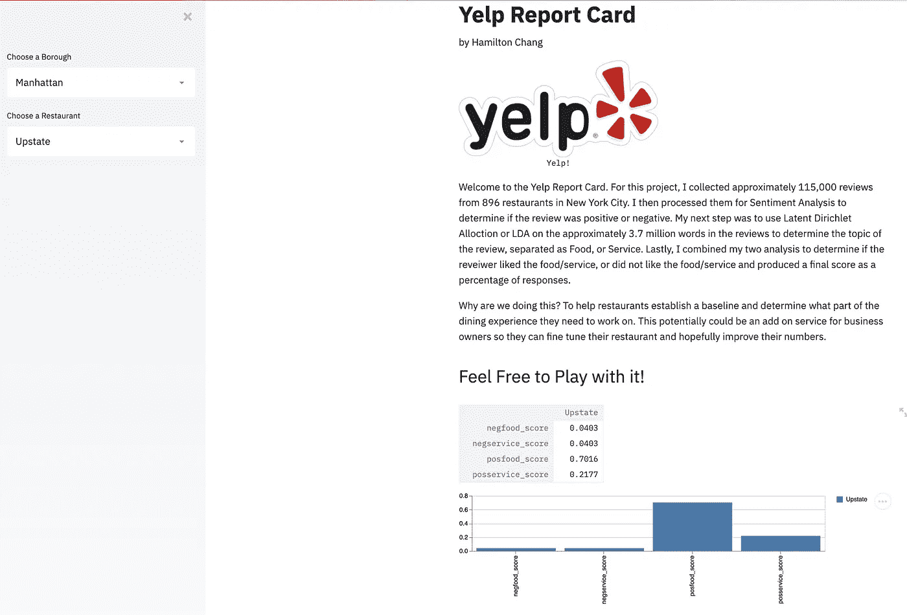

此应用程序已通过以下链接成功上传到 Heroku。

[https://desolate-ocean-14363.herokuapp.com/](https://desolate-ocean-14363.herokuapp.com/)

# 结论

这个项目是一个有趣的练习，它将我对食物和餐馆的热情与我初露头角的数据科学技能结合了起来。也有一些宝贵的经验教训。我现在知道，LDA 不是我想在有限的时间框架内使用的模型，使用 TF-IDF 和使用机器学习分类器可能会更好地加快速度。在这种情况下，我使用 LDA，因为我想扩展我的能力，并冒险进入无监督学习。我也很喜欢 LDA 的易解释性，它给了我更大的控制微调模型的能力。最后，为了更好地将服务作为我的主题，我最终将 TF-IDF 与 LDA 结合使用。

这个项目的进一步扩展将包括回顾快照，以便餐厅老板可以获得他们可能想要解决的特定事件的样本，此外，它可能有助于他们更好地理解数据。此外，我想按区编制一份总体报告卡，以确定每个区是否有具体的不足之处。最后，我想进一步完善我的数据，并探究总体评分是否会受到这些主题的影响。

所有代码都在我的 Github 中。

在 Linkedin 上与我联系！

www.linkedin.com/in/hamilton-chang