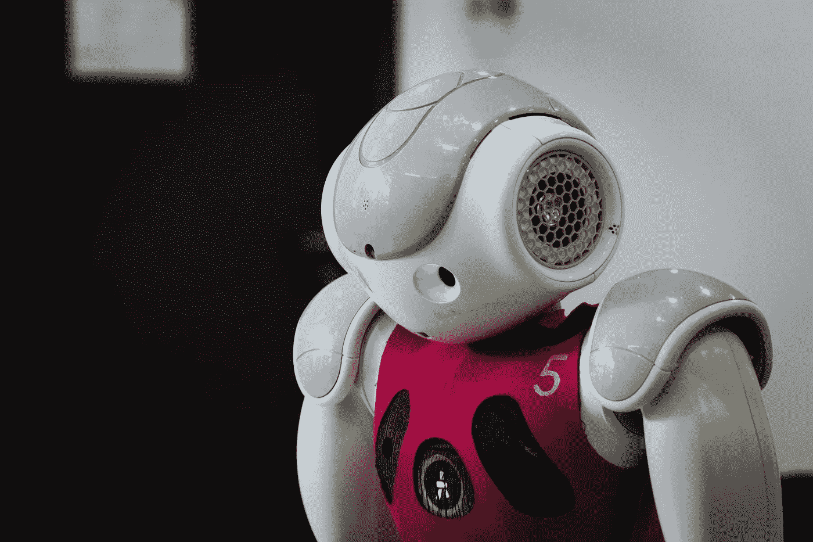
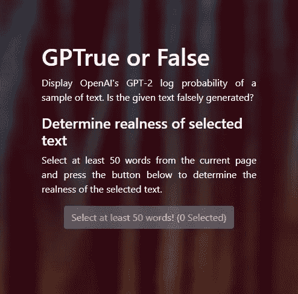
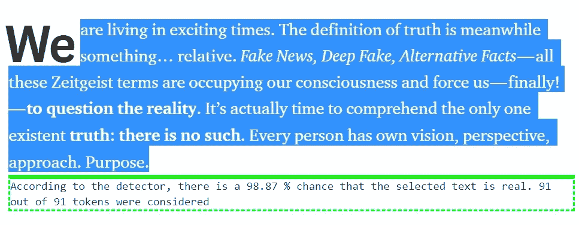
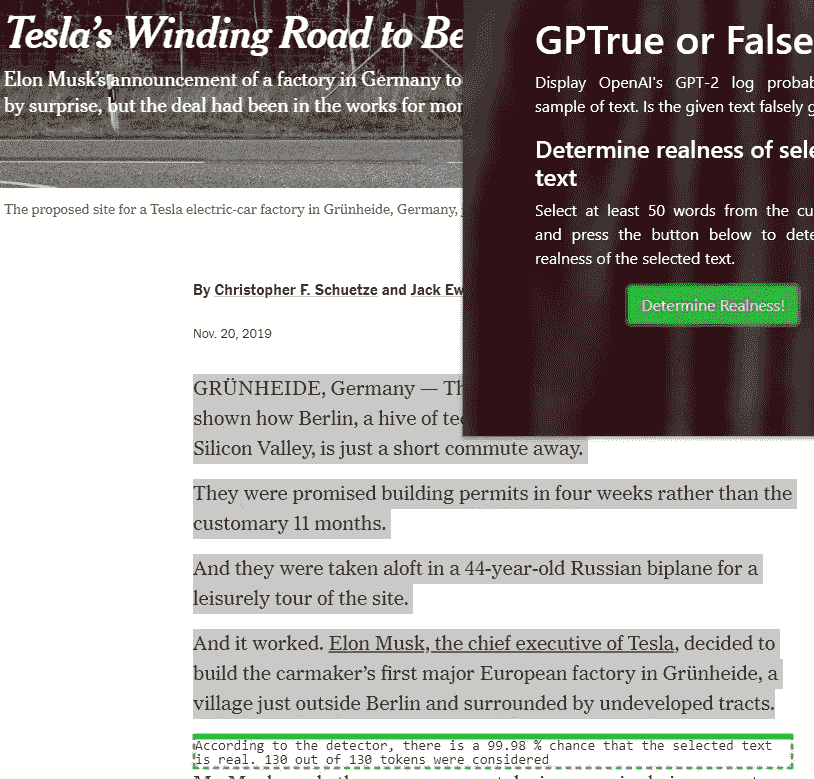
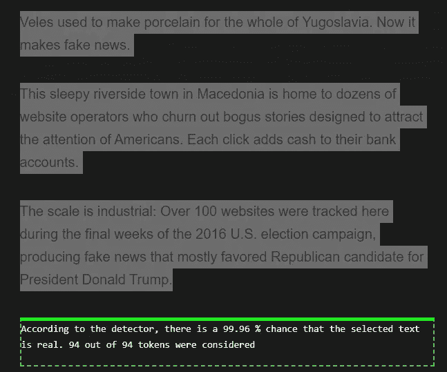
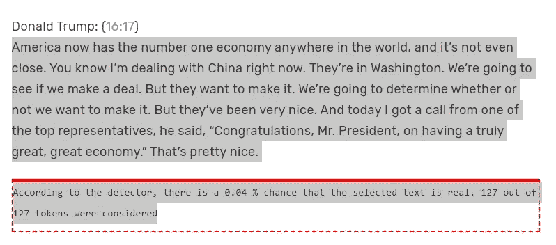
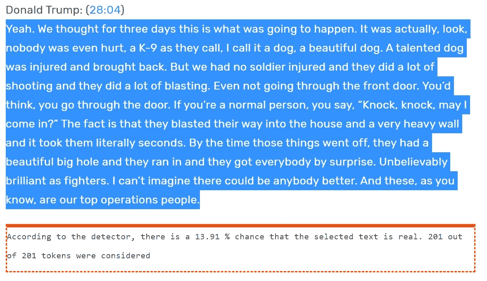
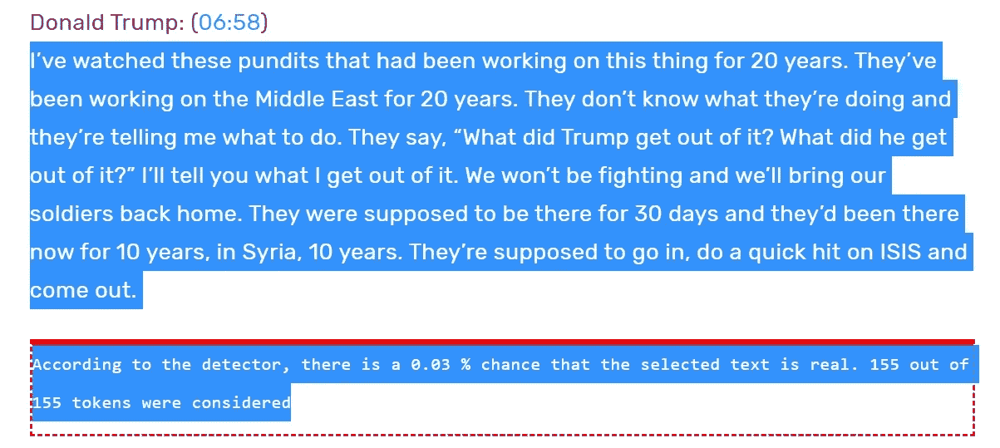

# 唐纳德·特朗普是个机器人。或者不真实。根据这个人工智能探测器。

> 原文：<https://towardsdatascience.com/donald-trump-is-an-android-3bf1173f3e88?source=collection_archive---------28----------------------->

我们生活在激动人心的时代。与此同时，真理的定义是与**相对的**。*假新闻、深度造假、另类事实*——所有这些时代精神术语最终占据了我们的意识并迫使我们！—进入**质疑现实**。是时候领悟唯一存在的**真相** : **没有这样的**。每个人都有自己的视野、观点和方法。一个目的。

有了人工智能——至少有了 GPT-2 模型([，它能够生成语义连贯的文本](https://medium.com/merzazine/lakrobuchi-part-1-gpt-2-artificial-intelligence-literature-fake-news-and-the-rest-77997f52c8c3))——我们有了欺骗和被欺骗的新可能性。这就是 OpenAI 没有发布完整的 GPT-2 模型的真正原因。现在，差不多一年后，他们得出了以下结论:

> **4。到目前为止，我们还没有看到滥用的有力证据。**虽然我们已经看到了一些关于新 GPT 协议增加垃圾邮件和网络钓鱼等高容量/低收益操作的潜力的讨论，但我们还没有看到编写代码、文档或误用实例的证据。

这也是他们发布全[15 亿参数模型](https://openai.com/blog/gpt-2-1-5b-release/)的原因。为了所有人。去试一试。([我写了一下](https://medium.com/merzazine/merzwoch-openai-meaning-of-life-revisited-and-the-rest-b906e8624c46?source=friends_link&sk=412cfa7ea9c80fcff5c36aae898666d6))

当然，第一个关注和考虑很快就提出来了——例如，特斯拉的人工智能总监[安德烈·卡帕西](https://medium.com/u/ac9d9a35533e?source=post_page-----3bf1173f3e88--------------------------------)([https://cs.stanford.edu/~karpathy/](https://cs.stanford.edu/~karpathy/))和人工智能领域的杰出人物**:**

事实上，检测人工智能生成的文本的工具——这是当今的一个重要话题。因此，一位研究人员朱利奥·斯塔瑞斯做了这件事:

# GPTrue 或 False

一个方便的 Chrome 插件，可以让你检查文本是人工智能编写的几率有多大。[免费下载](https://chrome.google.com/webstore/search/Gptrue%20or%20false)。只需安装—选择 50 个单词的文本—并感到惊讶(或不惊讶)。

该工具检查 GPT-2 对数概率( [GitHub](https://github.com/thesofakillers/GPTrue-or-False) 作为参考)，并利用现有解决方案[“open ai 检测器”](https://huggingface.co/openai-detector/)。

于是*现实检验*来了。我是真实的吗？我们来分析一下*我自己的文字*(本文开头):

> *唷！幸运的是。我能适应人类语言到目前为止，所以它没有认出*我真实的自己*(通过图灵测试后感觉像那天一样开心！).*

好吧，那么**埃隆·马斯克**和他的**德国**之路呢？《纽约时报》的一篇文章？(马斯克是 btw。也是 OpenAI 的主要投资者):

好吧，是定性记者写的(是纽约时报，还有问题？).

> 但是等等——说到假新闻，CNN 呢？主要的假新闻制造者(根据特朗普先生的说法)。

好了，我们来分析一下《[马其顿机](https://money.cnn.com/interactive/media/the-macedonia-story/)》(《假新闻机》)一期特刊《假新闻 CNN》根据:

> 在 2016 年美国大选的最后几周，超过 100 个网站在这里被跟踪，产生了大多数有利于共和党总统候选人唐纳德·特朗普的假新闻。

所以，至少不是 AI 写的。是真的。

> 但是等等——说到特朗普，为什么不分析一下他的演讲呢？

以下是他在明尼阿波利斯的演讲，这是唐纳德·特朗普弹劾调查开始以来的首次竞选集会:

…there is a 0.04% chance that the selected text is real…

等等……嗯，可能是系统故障。让我们看看他关于杀死 ISIS 头目阿布·巴克尔·巴格达迪的声明:

Chances are better, but still with 86.09% for **not real**.

嗯……好吧，那他著名的内阁会议呢，[他称宪法中的薪酬条款是“虚假的”](https://www.rev.com/blog/donald-trump-cabinet-meeting-transcript-trump-calls-emoluments-clause-of-the-constitution-phony)(提醒一下:薪酬条款”*声明总统个人不能从当总统中获得经济利益*)。

不会吧！

**女士们先生们，这是美利坚合众国总统唐纳德·川普先生事实上是一个机器人的证据。或者不真实。**

…或者，这只是我们**真理认知**的另一个方面。我们在寻找真相，是的。但是我们发现的是一个由暗示和线索驱动的我们期望的构造，它符合我们想要的真理的概念。如果有什么不合适，我们就跳过它。

在数字时代，我们终于有能力去理解这个简单的想法，这个我们几个世纪以来一直在与之抗争的想法:

> 真理是我们对世界的感知。人活在这个世界上，有那么多道理。没有什么像绝对真理一样——如果有，那就是这个世界上所有真理的总和。

当然，这是事实。但事实如此之多，以至于我们的意识在白噪音中看到了类似谷歌深梦的模式。[幻想症](https://www.bbc.com/news/magazine-22686500)。

> 我们需要更多的自我反省。我们需要了解我们的世界有多复杂。**在量子计算机时代，**我们必须**反思**我们的黑白世界认知。在我们周围的世界中有**个叠加的**和**个量子位状态**。

亲爱的朋友，你在想什么？我们准备好面对这个事实了吗？

还是一切都只是假的？