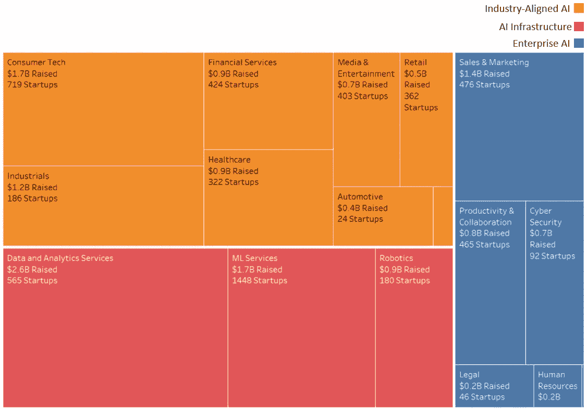
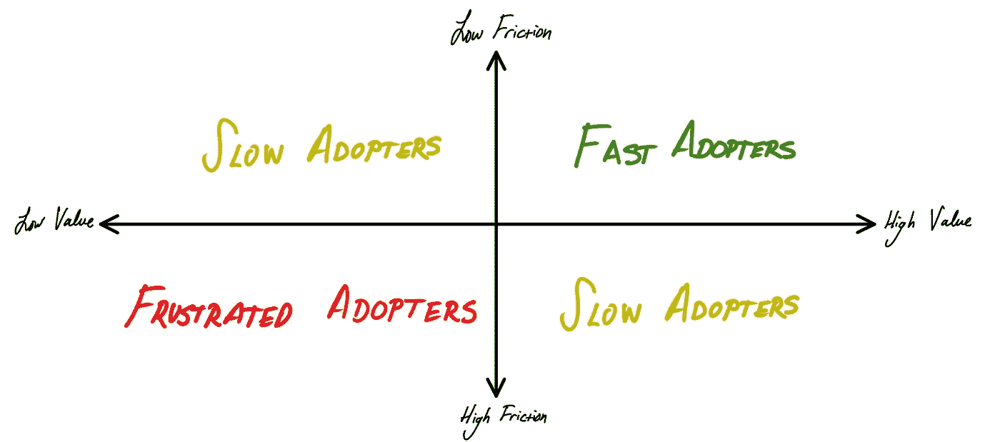
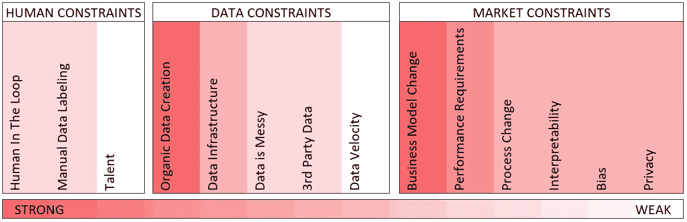
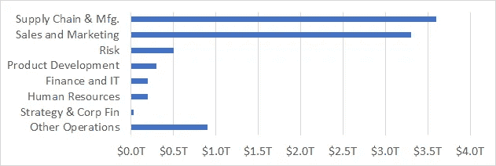
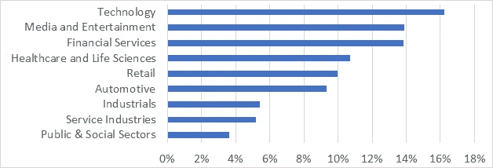
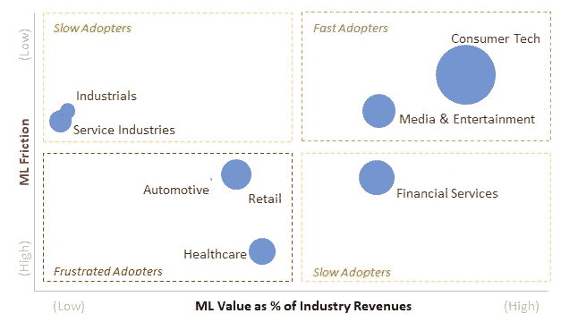

# (还)不要赌 AI

> 原文：<https://towardsdatascience.com/dont-bet-on-ai-yet-c3c37bbcc0b6?source=collection_archive---------7----------------------->

Photo by [Federica Giusti](https://unsplash.com/@federicagiusti?utm_source=medium&utm_medium=referral) on [Unsplash](https://unsplash.com?utm_source=medium&utm_medium=referral)

## 我分析过 7000 个“AI 创业公司”。大多数人低估了困扰人工智能的挑战。你的呢？

你可能听过这句话的变体，来自[吴恩达](https://medium.com/u/592ce2a67248?source=post_page-----c3c37bbcc0b6--------------------------------) : *“人工智能是新的电力！电力改变了无数的行业；AI 现在也会这么做。”*

我基本上同意这种观点。问题是，这种说法忽略了阻止人工智能快速采用的巨大障碍。人工智能不会是一夜之间的现象。电成为无处不在的技术用了 40 多年！到 1882 年，世界已经发现了现代电力的关键要素。然而，许多挑战阻止了即时的大规模采用:昂贵的基础设施、缺乏人才、不透明的法规等等。综上所述，这些障碍使得电力在 1925 年之前无法进入普通美国家庭。

> 人工智能是新的电力。它将改变工业。但是像电一样，需要几十年。今天是人工智能世界的 1882 年，而不是 1925 年。

哪些摩擦阻碍了人工智能的采用？AI 会先在哪里成功？会滞后在哪里？**除非我们开展这种对话，否则许多技术上可行、理由充分的人工智能项目将会失败。**

这很重要，因为这个世界，也许是不明智的，现在在人工智能上下了很大的赌注。我浏览了一下网页，发现了[7192 家“人工智能初创公司”](https://1drv.ms/x/s!Al21AI3tCHl9gs0MYyahjjrWCUo61A?e=cga9H3)——声称自己是人工智能公司或声称正在使用机器学习的风险投资公司。这些初创公司已经筹集了超过 190 亿美元，雇佣了超过 15 万名员工。

AI Venture Activity by Market | Source: Analysis of 7,192 “AI Startups” from Angel List

# 你的 AI 创业何时能成功？—一个框架

幸运的是，你可以预测你的人工智能项目在近期、中期还是长期更有可能成功。人工智能的能力和挑战是很好理解的——你所要做的就是整体地回顾它们，然后批判性地思考你的人工智能用例。

要做到这一点，考虑使用一个简单的框架:**你的人工智能解决方案被采用的速度是潜在价值和独特摩擦的函数**。有许多摩擦减缓了人工智能的采用。但是这些摩擦对一些企业的影响比其他企业更大。为什么？因为有些 AI 解决方案比其他方案创造更多的价值。当人工智能解决方案具有巨大的价值潜力时，公司、投资者、监管者和消费者更容易联合起来克服摩擦。价值和摩擦之间的简单关系产生了一个有用的框架:

Rate of AI Adoption = *f*(AI friction, AI value)

那么，对于你的人工智能赌注来说，大规模采用的道路是什么样的？对于任何问题、风险或行业，这个框架都可以直接操作。这里有一个更详细的分类。

# 阻碍人工智能快速采用的主要摩擦

第一步是对人工智能的摩擦进行深思熟虑的分析，这些摩擦可能会减缓你的人工智能项目的采用。人力、数据和市场摩擦都减缓了成熟的人工智能解决方案的采用。它们使开发变得复杂，限制了可伸缩性，并引入了用例扼杀风险。并不是所有的摩擦都是一样的。有些比其他的危险得多:

Estimated Magnitude of AI Frictions | Source: Interviews with AI Experts

## 人工智能的人为限制

*   **人在回路需求:** 很多算法需要人的监督。例如，脸书雇用了 15，000 多名员工来协助他们的内容审核算法。
*   **手动数据标注需求:** AI 的许多用例需要人类教会算法预测什么(或者用技术术语来说，“标注”数据)。例如，百度不得不雇用数千名翻译来训练其中文翻译算法。
*   **缺乏获得人才的途径:** 全球都缺乏数据科学家、机器学习工程师和其他人工智能人才。这使得公司很难组建有能力的人工智能团队。2018 年，Indeed.com 的发布量是人工智能相关工作搜索量的 3 倍。

## 人工智能的数据约束

*   **有机数据创建:** 有些商业模型并不能自然生成 AI 需要的数据。例如，传统的零售企业不会获取客户购物模式的丰富数据。为了融入人工智能，零售商需要采用新的商业模式，如在线和“直接面向消费者”。
*   **缺乏** **数据基础设施:** AI 在技术栈的每一层都需要大量投资。内部硬件和传统软件解决方案是人工智能的噩梦。为了实现人工智能，企业必须投资于云、数据集中化、数据安全和人工智能开发工具。
*   **现有数据杂乱无章:** 数据很少被组织在干净、集中的行列表中。相反，大多数数据存在于杂乱的文档或遗留的软件系统中。公司倾向于跨团队和组织存储数据。他们通常无法维护不同数据所在位置的文档。他们也没有强制执行如何捕获和存储数据的标准。
*   **对第三方数据的依赖:
    AI 对数据如饥似渴。当你的公司没有足够的专有数据时，它必须购买这些数据。许可和维护 API 以访问第三方数据成本高昂。**
*   **数据速度低:** 大部分 AI 需要成千上万个完整反馈循环的例子来学习。在反馈循环缓慢的领域，这是一个挑战。例如，获取慢性病长期医疗保健结果的数据是一个成本高昂的过程。

## 人工智能的市场约束

*   **捕捉人工智能价值所需的商业模式变革:** 为了捕捉人工智能价值，许多行业将不得不改变其交付产品和服务的方式。例如，自动驾驶汽车将迫使汽车制造商接受交通即服务战略。
*   **近乎完美的算法性能要求:** 有些 AI 用例的失败成本很高。以医疗保健或无人驾驶汽车的诊断决策为例。在这些背景下，人工智能解决方案会带来重大风险。
*   **人工智能需要流程变革:** 支持人工智能的产品通常会引入截然不同的工作流程。例如，人工智能招聘解决方案通常更喜欢非传统的面试和工作申请。这让更多传统的 HR 团队感到害怕。
*   **无法解释的算法:** 在很多情况下，消费者(甚至监管者)都需要能够自我解释的人工智能工具。不幸的是，很难解释有多少人工智能算法做出决策。例如，如果一家银行拒绝客户的信贷，他们必须解释原因。这让 AI in 借贷变得困难。
*   **有偏差的算法:** AI 算法经常会做出有偏差的决策。这在许多领域(如执法、人力资源和教育)都是非法且令人反感的。
*   **繁琐的隐私标准:** AI 是对隐私的威胁。人工智能为公司收集大量私人信息提供了激励。此外，人工智能能够从无害的数据(如打字模式)中推断个人信息(如个人的情绪状态)。威胁隐私的人工智能解决方案很可能面临监管和消费者的抵制。

# 评估人工智能的价值

一旦你了解你的企业面临的人工智能摩擦，进行价值分析。你的 AI 解决方案降低成本了吗？节省时间？降低风险？创造新的消费者价值？如果有，多少？在这方面，没有一种通用的方法。

一旦你评估了你的人工智能解决方案，批判性地思考这个价值将如何激励利益相关者推动过去的摩擦。在这样做的时候，你应该考虑宏观层面的趋势。更普遍地说，处于人工智能没有创造重大价值的类别是危险的。如果是这样的话，你将是一个孤独的人工智能倡导者。麦肯锡全球研究所(MGI) [最近对人工智能和分析的潜力估值超过 9T](https://www.mckinsey.com/featured-insights/artificial-intelligence/notes-from-the-ai-frontier-applications-and-value-of-deep-learning) 。重要的是，这个价值并没有按比例分布在不同的用例与行业中。

## 人工智能的用例

在评估了 400 多个已知人工智能用例后，MGI 发现普通的商业问题——供应链、销售和营销——是人工智能最有价值的用例。

Value of AI by Use Case | Source: McKinsey Global Institute

## 人工智能在各行各业的价值

通过将用例映射到各个行业，MGI 评估了人工智能对各个行业的重要性。他们发现，在顶级功能(如销售)中存在复杂问题的行业将从人工智能中获益最多。

Value of AI as % of Industry Revenues | Source: McKinsey Global Institute

# 人工智能的未来——应用框架

那么，哪些行业最容易受到人工智能采用速度低于预期的影响？谁最有可能占据时机不当的人工智能赌注的墓地？这个框架可以在宏观层面上应用来找出答案。我采访了几位人工智能专家，以估计每个行业的人工智能摩擦有多严重，然后将这些信息汇总，并根据 MGI 的人工智能价值估计值绘制图表:

根据我的分析，人工智能将在三个浪潮中跨行业推出:

*   **第一波人工智能——快速采用者:**这一波融合消费技术和媒体的浪潮已经展开。谷歌、脸书和网飞等公司的进步引领了这一潮流。
*   **第二波人工智能——缓慢采用者:**这一波也已经开始，但可能会推出得更慢。一些采用者(如制造商和供应链运营商)采用 AI 的积极性较低。其他人(如银行)如果成功，会看到巨大的回报，但在采用人工智能方面面临重大挑战。
*   **第三波人工智能——受挫的采用者:**医疗保健、汽车和(可能)零售面临人工智能采用速度慢于预期的风险。所有人都面临着采用人工智能的巨大障碍。从一美元换一美元的角度来看，所有人都不太有动力采用人工智能。然而，请注意，零售在这里有点不适应:传统零售商在一些领域(销售和营销)面临重大摩擦，但在其他领域(供应链运营)却是人工智能的快速采纳者。

那么你的人工智能项目什么时候会成功呢？分析你面临的 AI 摩擦。确定你想要创造的价值。然后看看你的冒险相对于已知的人工智能成功的位置。摩擦越多价值越小？现在可能还不是打赌的时候。但是，如果你有一个高价值，低摩擦的人工智能解决方案，那么停止阅读这篇文章。全速前进！

感谢[文斯·劳](https://medium.com/u/65b4c1c5563e?source=post_page-----c3c37bbcc0b6--------------------------------)、[布莱恩·波利多里](https://medium.com/u/96d1f0839234?source=post_page-----c3c37bbcc0b6--------------------------------)、[金奎大·卡克贝克](https://www.linkedin.com/in/daankakebeeke)、[马修·斯特普卡](https://medium.com/u/a181e5ec3d62?source=post_page-----c3c37bbcc0b6--------------------------------)、[瑞安·丁勒](https://medium.com/u/b63782fcb114?source=post_page-----c3c37bbcc0b6--------------------------------)、[高瑟·瓦瑟尔](https://www.linkedin.com/in/gauthiervasseur/)、[格雷戈里·拉布兰克](https://medium.com/u/bdba4e249272?source=post_page-----c3c37bbcc0b6--------------------------------)和[哈里·戈德堡](https://medium.com/u/a7e66bd4f234?source=post_page-----c3c37bbcc0b6--------------------------------)对本文的宝贵反馈和支持。如果没有他们的观点和洞察力，我不可能发展出这些想法。

如果你觉得这些想法有价值，我很乐意听听。如果你对如何改进这篇文章有任何建议，请留下评论。最后，如果我能为你的人工智能努力提供任何帮助，请随时在 LinkedIn 上与我联系。