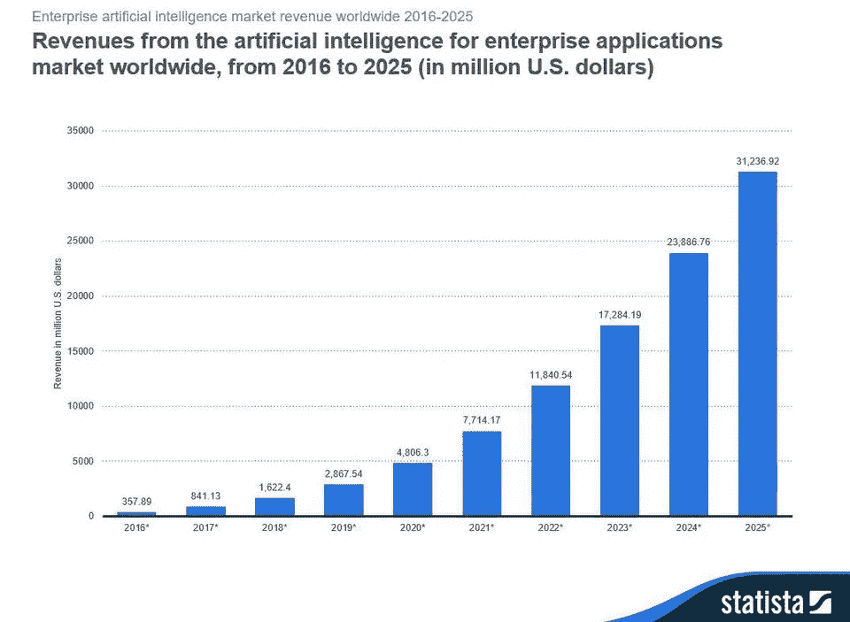

# 在你做到这一点之前，不要说服你的老板使用机器学习…

> 原文：<https://towardsdatascience.com/dont-convince-your-boss-to-use-machine-learning-until-you-have-done-this-e4fc62628312?source=collection_archive---------8----------------------->

“我们必须做人工智能的东西！”

**“我们公司如何实施 AI，才能带来更多利润？”**

**“我们可以用什么机器学习模型来解决这个问题？”**

好吧…

也许你已经从你的上级管理层(也就是你的老板)那里听说过这些陈述或问题。

也许你每天都会面临这些问题，你的老板会问你——作为一名数据科学家——如何使用机器学习模型，或者如何利用人工智能的力量为公司带来价值(或为公司赚更多的钱)。

也许你以前没有从你的老板那里听说过这一点，因为公司仍然没有看到人工智能的需求。

或者你可能想说服你的老板使用机器学习来增加业务的价值。

不管是什么情况……人工智能成为大多数公司的目标是有原因的。有一件事是肯定的。

[**人工智能(AI)正在兴起。**](https://www.weforum.org/agenda/2017/12/charts-artificial-intelligence-ai-index/)

[Source](https://www.forbes.com/sites/louiscolumbus/2018/01/12/10-charts-that-will-change-your-perspective-on-artificial-intelligences-growth/#3f00c4904758)

由 [Statista](https://www.statista.com/statistics/607612/worldwide-artificial-intelligence-for-enterprise-applications/) 完成的一项研究显示，用于企业应用的人工智能的全球收入预计将从 2018 年的 16.2 亿美元增长到 2025 年的 312 亿美元，在预测期内实现 52.59%的 CAGR。

随着人工智能的流行，对人工智能的关注可能有点过头了，因为我相信数据科学中有很多唾手可得的果实供企业采摘和品尝。

> “当其他地方还有这么多唾手可得的果实时，每个人都在争先恐后地加倍押注人工智能。”
> 
> **—** [**井架哈里斯**](https://medium.com/u/7824679e7160?source=post_page-----e4fc62628312--------------------------------)

许多公司怀着兴奋和高度的期望开始了他们的人工智能项目，但由于缺乏数据集，数据管道中断等原因，结果是另一个失败的人工智能项目。

而这些公司最终可能会认为 AI 是一种炒作，数据科学只不过是公司在虚荣中的一个花哨部门。

在这个数据是新金矿的时代，所有这些都是阻止公司成功实现数字化转型的一些主要因素。

所以……在你兴奋得无法说服你的老板下次使用机器学习之前，确保你已经完成了一些项目，通过首先解决低挂的水果，实现了切实的商业价值。

在接下来的章节中，我将在着手任何机器学习(或人工智能)计划之前，简要谈谈**低挂果实意味着什么**以及**为什么在商业数据科学中处理低挂果实很重要**。

我们开始吧！

# 什么是低挂水果？

[(Source)](https://pixabay.com/images/id-1873078/)

“低挂果实”的原意是指在树枝下端的甜美、容易够到的果实。

果园工人和屋主欣赏这种水果容易采摘，相比之下，需要努力达到在树上更高的水果。

**在商业的语境中，指在特定情况下容易完成的任务或容易解决的问题。**

**换句话说，唾手可得的成果就是自动化日常工作，提高员工的工作效率。**

**或者可以利用公司网站上的现有数据来获得任何有意义的、可操作的见解，否则这些见解会被隐藏起来。**

****事实是**大多数公司都有很多这些唾手可得的成果(改善数据清理和数据管道，从现有数据中提取见解等。)不需要复杂的 ML 模型来求解。**

****坏消息**大多数数据科学家希望使用复杂的 ML 模型来解决简单的问题，这些问题可以通过简单的统计建模、分析或可视化来解决。**

> **简单可能比复杂更难:你必须努力让你的思维变得清晰，让它变得简单。但最终还是值得的，因为一旦你到了那里，你就可以移山。”**
> 
> **— **史蒂夫·乔布斯****

# **为什么要在任何 ML/AI 项目之前先解决商业数据科学中容易实现的成果？**

**这并不是鼓励你总是设定较低的目标，只是因为它们容易实现。**

**在任何 ML/AI 项目之前，首先解决商业数据科学中容易实现的结果的全部要点是这样的— **动力和信心。****

****气势。**通过在处理易得的业务成果方面取得重大胜利(前提是这些重大胜利能帮助公司获得直接利益)，你的团队将获得动力来解决未来更困难的问题。**

**最重要的是，你的老板将能够看到从数据中获得的切实结果和可行的见解，只需进行简单的分析，而无需太多复杂的 ML 模型。**

**因此，你的团队说服你的老板在未来使用 ML 的努力将变得更加容易，因为你的老板(或公司)已经看到了数据交付有形商业价值的重要性。**

**先在小问题上取得大胜利，然后在大问题上取得大胜利就不会太遥远了。**

****自信。**归根结底，从金钱的角度来说，商业就是要获取利润。如果你的项目能给公司带来利润，我相信你的老板很难否认这些项目的重要性。**

**起初，你的老板可能会怀疑数据科学能给企业带来什么价值。这是完全可以理解的。**

**为了证明您的数据科学项目能够交付真正的商业价值，您必须增强他们利用数据力量的信心。这就是在做任何可能需要更多时间和资源来向公司证明其价值的 ML 项目之前，处理容易实现的成果的地方。**

**一旦建立了信心，一旦建立了信任，他们在追求数字化转型的过程中转向其他 ML/AI 项目就会容易得多。**

# **最后的想法**

****

**[(Source)](https://www.videoblocks.com/video/night-view-of-the-illuminated-helix-bridge-and-marina-bay-sands-singapore-marina-bay-singapore-asia-time-lapse-uqbmf-a)**

**感谢您的阅读。**

**我希望到现在为止，你已经理解了**低挂果实的意思**和**为什么在着手任何机器学习(或人工智能)计划之前，处理商业数据科学中的低挂果实是重要的****

**最终，实现唾手可得的成果只不过是解决其他更复杂问题(ML/AI)的垫脚石，最终将使公司的数字化转型取得成功。**

**一如既往，如果您有任何问题或意见，请随时在下面留下您的反馈，或者您可以随时通过 [LinkedIn](https://www.linkedin.com/in/admond1994/) 联系我。在那之前，下一篇文章再见！😄**

## **关于作者**

**[**Admond Lee**](https://www.linkedin.com/in/admond1994/) 目前是东南亚排名第一的商业银行 API 平台[**Staq**](https://www.trystaq.com)**—**的联合创始人/首席技术官。**

**想要获得免费的每周数据科学和创业见解吗？**

**你可以在 [LinkedIn](https://www.linkedin.com/in/admond1994/) 、 [Medium](https://medium.com/@admond1994) 、 [Twitter](https://twitter.com/admond1994) 、[脸书](https://www.facebook.com/admond1994)上和他联系。**

** [## 阿德蒙德·李

### 让每个人都能接触到数据科学。Admond 正在通过先进的社交分析和机器学习，利用可操作的见解帮助公司和数字营销机构实现营销投资回报。

www.admondlee.com](https://www.admondlee.com/)**