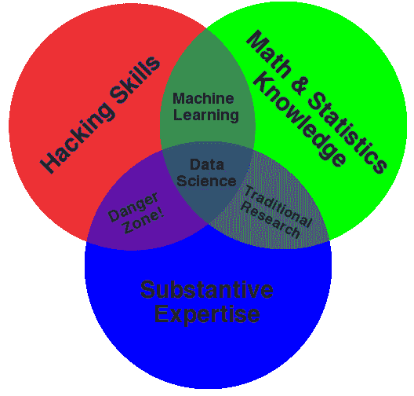

# 不做数据科学，解决业务问题

> 原文：<https://towardsdatascience.com/dont-do-data-science-solve-business-problems-6b70c4ee0083?source=collection_archive---------10----------------------->

“数据科学家”这一术语在现代商业用语中已经变得通俗易懂，表示拥有几乎所有以数据为中心的技能的个人。想要雇用数据科学家的组织会寻找“独角兽”——拥有如此广泛和深入技能的数据科学家专业人员，他们实际上并不存在。数据科学维恩图**(由数据科学家[德鲁·康威](http://drewconway.com/zia/2013/3/26/the-data-science-venn-diagram)推广)有助于形象化这一系列广泛的技能。**

****

**当大多数人看到这个图表时，他们会立即想到它定义了一个数据科学家。因为任何自称为数据科学家的人都应该是黑客、数学和统计方面的专家，并且在他们工作的领域拥有丰富的专业知识。实际上，真正成为这三个领域专家的人少之又少(如果你是这三个领域的真正专家，你可能在谷歌、微软或脸书工作)。**

**该图从未打算定义数据科学家(人)，而是定义数据科学(领域)。作为一名数据科学家，他必须在至少一个或两个类别中出类拔萃，并在其他方面拥有足够的知识，以完成任何给定的目标。**

**一些公司越来越擅长将数据科学家划分到更合适的工作篮子中。Airbnb 雇佣了世界上最成熟的数据科学团队之一，[最近将他们的数据科学团队分成三个部分](https://www.linkedin.com/pulse/one-data-science-job-doesnt-fit-all-elena-grewal/)(分析、算法和推理)，以便更有效地沟通和构建价值。许多公司现在列出了“机器学习工程师”或“研究科学家”的职位名称，以强调数据科学连续体中角色的差异。**

**但是，尽管我们越来越擅长定义数据科学，并将它的许多子领域划分为适当的职称、职能和任务，但我们仍然没有抓住要点。数据科学不是关于算法、高级技术技能或专业学位，而是关于解决问题。**

## **烤面包和造烤箱**

**组织更关心其数据科学团队的学术和技术复杂性，而不是他们给企业带来的价值。事实上，我敢打赌，阅读这篇博文的人中，有三分之二的人能够想到他们公司的一个数据科学项目，该项目有重大投资，但尚未显示出商业价值。这是为什么呢？**

**企业想要新鲜的烤面包，但却在雇佣电气工程师而不是面包师。**

**谷歌首席决策智能工程师凯西·科济尔科夫解释了这个类比:**

> **想象一下，雇一个厨师为你造一个烤箱，或者雇一个电气工程师为你烤面包。当谈到机器学习时，这是我看到企业一次又一次犯的错误。**
> 
> **如果你要开一家面包店，雇佣一名经验丰富的面包师是个好主意，他精通制作美味面包和糕点的细微差别。你也会想要一个烤箱。虽然它是一个重要的工具，但我敢打赌，你不会让你的顶级糕点师承担知道如何制作烤箱的任务；那么，为什么你的公司专注于机器学习的等价物呢？**
> 
> **你是做面包的吗？还是做烤箱？**

**Kozerkov 女士继续解释说，企业在机器学习方面经常失败的原因是由于对研究和应用的理解不足，例如，建造烤箱和烤面包。**

**拥有高度专业化学位的研究专家在适当的情况下非常有价值(例如，如果你的企业或产品*是*算法】)然而，大多数企业并不需要。他们需要的是一个“面包师”——能够“烤面包”、出售面包、并利用其他地方已经建成的厨房有效分配面包的人。如果你管理一个团队，并且想雇佣*研究*专家，那就去做吧，但是要确保你让她/他和真正能解决你问题的人配对。否则，当你没有得到你认为应该得到的价值时，不要抱怨。如果你对自己说“我需要一个伟大的面包师和工程师”，祝你好运。虽然这些人确实存在，但他们可能比你在谷歌或脸书工作挣得更多。不要去寻找“独角兽”,而是建立一个专门为你的业务问题而设计的团队。**

**如果您目前从事数据科学工作，那么您当前的公司面临哪些挑战？你非常了解这些挑战吗？你能清楚地衡量你正在做的项目的商业价值吗？**

**对于有抱负的数据科学家，您对什么类型的问题感兴趣？医疗保健？生意？自动驾驶汽车？在你深入钻研技术课程或攻读博士学位之前，你是否了解你想要解决的问题？**

**你想造烤箱还是烤面包？**

## **你不需要 AI**

**与普遍的看法相反， **AI** **并不是一颗神奇的子弹**。在《哈佛商业评论》2017 年 7 月的封面故事中，*人工智能的商业*脸书的人工智能老板华金·坎德拉(谈到独角兽)在这一点上发泄了他的沮丧:**

> **“让我沮丧的是，”他说，“每个人都知道统计学家是什么，数据分析师能做什么。如果我想知道‘嘿，哪个年龄段的人有什么行为方式？’我去找数据分析师。**
> 
> **“因此，当人们跳过这一步，来到我们面前，对我们说，‘嘿，给我一个能做我们所做的事情的机器学习算法’，我就想，‘我看起来像什么？你想解决什么问题？你的目标是什么？“权衡是什么，”“有时他们会惊讶于其中的取舍。“如果那个人没有这些问题的答案，我就在想，‘你到底在想 AI 是什么？"**
> 
> **他们认为这是魔法。**
> 
> **“但事实并非如此。这是我告诉人们‘你不需要机器学习’的部分。**你需要建立一个数据科学团队，帮助你思考一个问题并应用人类试金石。**和他们坐在一起。看看你的数据。“如果你不知道发生了什么，如果你没有任何直觉，如果你不能建立一个非常简单的、基于规则的系统——比如，*嘿，如果一个人不到 20 岁，并且生活在这个地理位置上，那么就做这件事*——如果你做不到这一点，那么我非常紧张，甚至谈论用人工智能来解决你的问题。”**

**坎德拉先生的见解在我们当前对人工智能和人工智能的痴迷中令人难以置信地深刻。严酷的事实是:你可能不需要人工智能——至少现在还不需要。在你开始真正的对你的业务产生影响的机器学习之前，你需要有一个非常具体的、定义良好的业务问题。**

**以我个人的经验来看，大多数企业都没有很好地定义这个问题，甚至没有对它应用一套简单的规则。正如坎德拉先生强调的那样——如果你还没有走到那一步，我们怎么能开始讨论应用人工智能呢？底线是，我们不能。**

## **不做数据科学，解决业务问题**

**暂时忘掉数据科学，齐心协力解决问题，并制定解决问题的计划。如果你这样做，有趣的事情将会发生——你需要应用的技术/算法/或技巧将会变得显而易见。你会变得很好，甚至成为这方面的专家，因为你将不仅仅是黑客或计算，你将解决一个真正的，实际的问题。**

**以下是对数据科学家或分析团队成员的一些建议，让他们更充分地应用这一理念:**

1.  **成为商业领域的科学家。少花点时间学习新算法和 Python 包，多花点时间学习让你的特定业务上升或下降的杠杆以及影响这些杠杆的变量。确定对这些变量有贡献的数据源——通常在交叉点您会发现高价值的机会。**
2.  ****在优先考虑和接受项目时要毫不留情。**在推进 DS 项目之前，评估 1)将对结果采取的行动，以及 2)基于该行动将创造的商业价值。如果两者的作用都不明确，价值也不高，就不要浪费时间了。*补充说明:*数据科学不是商业智能，BI 是一项重要的 IT 职能，它维护数据源和仪表盘的完整性——作为数据科学家，您的工作是解决业务中的问题。**
3.  **不要期望利益相关者总是(或永远)能够定义问题。在我看来，这是数据科学家最重要的技能，高于任何技术专业知识——清楚地评估和定义问题的能力。大多数商业利益相关者都有问题，但是没有足够长的时间去思考它们，以至于不能定义它们背后的过程。这是你将让机器学习和人工智能为你的组织工作的地方——通过将业务需求解密为数据科学可以有效应用的流程。**
4.  **让自己成为业务的一部分。在任何情况下都不要变得孤立。作为合作伙伴主动参与业务部门，而不是支持职能部门。**

**祝你解决问题好运。**