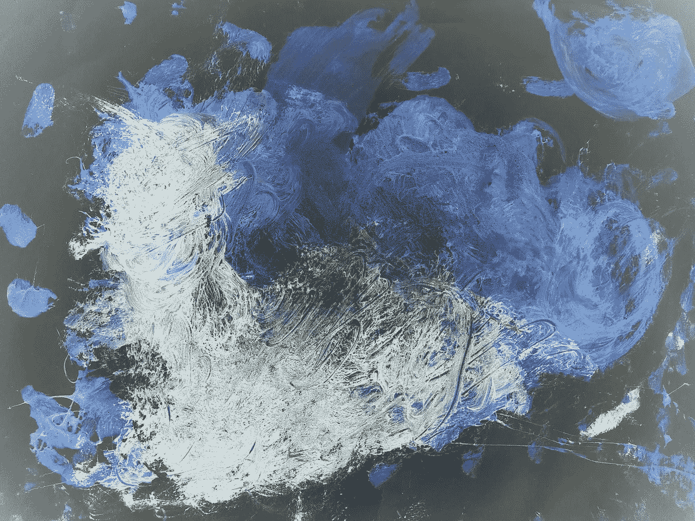
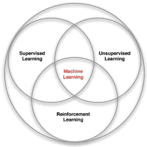
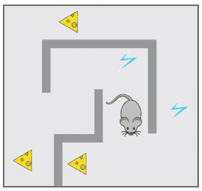
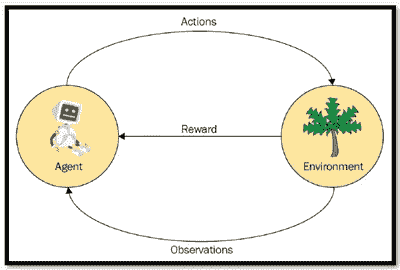
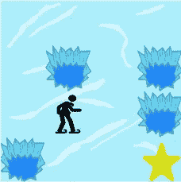
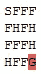
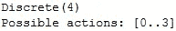
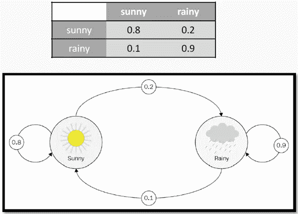
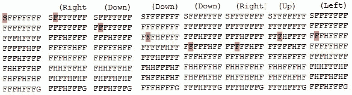

# 不要再忽视强化学习了

> 原文：<https://towardsdatascience.com/dont-ever-ignore-reinforcement-learning-again-4d026ee81371?source=collection_archive---------15----------------------->

## 监督或无监督学习并不代表一切。每个人都知道。开始使用 OpenAI 健身房。

Credits: Sophie Madeleine

你想在直升机上创造自动飞行特技动作吗？还是你在管理一个投资组合？

你想接管一个发电站吗？或者你的目标是控制人形机器人运动的动力？

> 你想打败一个国际象棋、双陆棋或围棋的世界冠军吗？

有一个地方你会解决这样的问题:强化学习。

# 什么是强化学习？

强化学习是关于学习在一个环境中做出连续的决策，同时最大化在这个过程中获得的整体回报。

没有监管，只是环境的一个奖励信号。时间问题和行动会影响后续数据。这使得有监督和无监督的机器学习变得困难。

在下面的例子中，老鼠试图找到尽可能多的食物，同时尽可能避免电击。

P. Protopapas, Harvard IACS

这只老鼠可能很勇敢，为了到达有大量奶酪的地方而遭到电击。这将是一个比停滞不前、一无所获更好的结果。

老鼠不想在每一个特定的情况下都采取最佳行动。这样会想太多，不灵活。

强化学习提供了一些神奇的方法，让我们的老鼠能够自己学习如何避免电和收集尽可能多的食物。

鼠标是**代理**。有墙、奶酪和电的迷宫就是**环境**。鼠标可以左右上下移动；这些是**动作**。

老鼠想要食物而不是电击；这些是**奖励**。老鼠可以观察环境；这些是**观察结果**。

# 冰上强化学习

让我们把老鼠留在迷宫里，到冰上去。“冬天来了。当你和你的朋友在公园里扔飞盘时，你把飞盘扔到了湖中央。水大部分都结冰了，但有几个洞的冰已经融化了。”([来源](https://gym.openai.com/envs/FrozenLake-v0/))

“如果你踏入其中一个洞，你会掉进冰冷的水里。在这个时候，有一个国际飞盘短缺，所以它是绝对必要的，你航行穿过湖和检索光盘。”([来源](https://gym.openai.com/envs/FrozenLake-v0/))

## 你如何处理这种情况？

这是一个强化学习的问题。代理控制网格世界中角色的移动。网格的一些瓦片是可行走的，其他的导致代理人掉进水里。代理人因找到一条通往目标方块的可行走路径而获得奖励。

我们可以使用 [OpenAI Gym](https://github.com/openai/gym) 对这个环境进行建模，这是一个开发和比较强化学习算法的工具包。它提供了对一组标准化环境的访问，比如我们例子中的那个，叫做[冰湖](https://gym.openai.com/envs/FrozenLake-v0/)。它是一个基于文本的玩具环境，只需要几行代码就可以加载。

现在，我们需要一个框架，允许我们系统地处理强化学习问题。

# 马尔可夫决策过程

在我们的例子中，因为*代理*控制由格子中的瓷砖组成的格子世界中的角色的移动，这被称为*完全可观察环境。*

由于给定当前瓦片，未来瓦片独立于过去瓦片(即，遵循**马尔可夫特性**的随机状态序列)，因此我们正在处理所谓的 [**马尔可夫过程**](https://en.wikipedia.org/wiki/Markov_chain) 。

当前状态包含了决定未来行动所需的一切，不需要记忆。

每个时间步长，代理都处于一个状态，它选择一个动作(以一定的概率导致下一个状态)，环境返回一个观察和一个奖励。

在马尔可夫过程中加入报酬函数和折扣因子，我们得到了所谓的*马尔可夫报酬过程*。通过包含这组动作，我们获得一个***【MDP】***马尔可夫决策过程。下面更详细地定义了 MDP 的组件。

## *状态*

状态是环境的一部分，是代理在特定时刻在环境中观察到的事物的数字表示，即湖的棋盘状态。这里，S 是起点，G 是目标，F 是代理人可以站立的固体冰，H 是如果代理人去，它会掉下来的洞。我们在 4x4 网格环境中有 16 个状态，或者在 8x8 环境中有 64 个状态。下面我们用 OpenAI Gym 渲染一个 4x4 网格环境的例子。

## *动作*

代理有 4 种可能的移动，在环境中分别表示为 0、1、2、3，分别表示向左、向右、向下、向上。

## *状态转换模型*

状态转换模型描述了当代理根据当前状态执行动作时，环境状态如何变化。

它通常由转移概率来描述，转移概率表示为 N×N 大小的正方形转移矩阵，其中 N 是我们模型中的状态数。下面举例说明天气环境。

P. Protopapas, Harvard IACS

在冰湖环境的情况下，我们假设湖是不滑的。如果我们向右走，我们只向右走。因此所有的概率都是相等的。

“左”将代理 1 平铺向左移动，或者如果代理在左边界，则保持在当前位置。

如果代理在右边界，向右移动 1 格或保持在当前位置。

如果代理位于上边框，则向上移动 1 格或保持在当前位置。

“向下”将它向下移动 1 格，或者如果代理在下边框，则保持在当前位置。

## *奖励*

对于每个状态 F，代理人获得 0 奖励，对于状态 H，它获得-1 奖励，因为在状态 H 中，代理人将死亡，并且在达到目标时，代理人获得+1 奖励。

因为状态转移模型和报酬模型都是确定性函数，这使得环境*确定性*。

## *折扣*

折扣是控制未来奖励重要性的可选因素。它的值介于 0 和 1 之间。其目的是防止总报酬趋于无穷大。

折扣也模拟了代理人的行为，当代理人更喜欢即时的回报，而不是可能在遥远的未来收到的回报。

## *值*

一个州的价值是该州的预期长期回报加上折扣。

## *政策(π)*

代理用来决定下一个动作的策略称为策略。在采取的所有政策中，最优政策是最大化一生中获得或预期获得的回报金额的政策。

## *第一集*

当代理人在起始牌上时，一集开始，当代理人落入洞中或到达目标牌时结束。

# 让我们想象一下这一切

在回顾了马尔可夫决策过程中涉及的所有概念之后，我们现在可以使用 OpenAI Gym 在 16x16 的环境中模拟一些随机行为。每次，代理都会选择一个随机操作并执行它。系统计算奖励，并显示环境的新状态。

# 结论

在本文中，我们简要介绍了强化学习中的关键概念。一个玩具示例提供了对 OpenAI Gym toolkit 的深入了解，这使得用预构建的环境进行实验变得很容易。

在我们的下一篇文章[中，我们将说明如何设计和实现策略，这些策略将允许代理做出一系列必要的行动来达到目标并获得奖励，例如击败世界冠军。](/this-is-how-reinforcement-learning-works-5080b3a335d6)

 [## 这就是强化学习的工作原理

### (什么会让你建立你的第一个人工智能)

towardsdatascience.com](/this-is-how-reinforcement-learning-works-5080b3a335d6) 

感谢阅读。