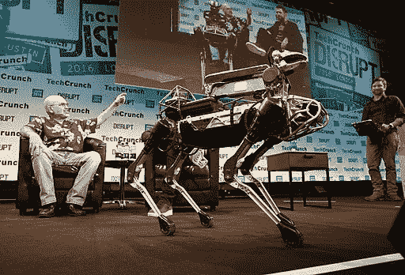

# 不要害怕机器人

> 原文：<https://towardsdatascience.com/dont-fear-the-robots-2f0d62992890?source=collection_archive---------20----------------------->

## 虽然这里的技术令人印象深刻，但重要的是要记住波士顿动力公司的视频是一部尚未制作的电影的预告片。

Photo by TechCrunch [ ([https://creativecommons.org/licenses/by/2.0](https://creativecommons.org/licenses/by/2.0))]

每当这些波士顿动力公司的视频出现时，他们都会遇到惊讶和对我们的新机器人统治者的厄运预测的混合。

令人印象深刻。

它也是精心设计和上演的。

虽然这里的技术令人印象深刻，但重要的是要记住波士顿动力公司的视频是一部尚未制作的电影的预告片。仔细看，你会发现机器人令人印象深刻的奔跑、跳跃和做其他事情的糟糕表现，因为它们解决了问题。

因为视频不仅仅是视频，它们还是广告。[用于资助和投资。](https://www.crunchbase.com/organization/boston-dynamics)实际的仓库环境与此处展示的演示大不相同。总有一天，人工智能会实现这一点，但它的好坏取决于它的编程，任何在物流和运输行业呆过的人都会告诉你，只要一个误读的 SKU 代码，或者一个放错的物品，或者一个错误的标签，就会造成一大堆混乱。提高物流效率的问题不仅仅是流程的简化，而是在动态环境中快速解决和适应问题的能力。在大多数情况下，这种决策能力是成败的关键，因为环境是长时间令人麻木的重复行动，不时会出现对过程进行激烈和绝望的修改。自动化首先是美妙的，但后者是一个巨大的挑战，也是成败的关键。寻求完全取代人类的机器人必须做到这一点，不仅仅是体力劳动方面，最先进的机器人仍然只能编程。到目前为止，他们做的任何“思考”仍然必须被编程，像物流这样的行业即使在最好的日子里也是有组织的混乱，有比预先计划更多的变量。

虽然机器人完全取代人类拳击运动员的那一天可能会到来，但现在更现实的——更不用说有利可图的——自动化的使用不是完全取代人类，而是增强和改善他们在机器人协助下可以做的事情。精益概念的变体已经从制造业转移到从 T2 运输到 T4 医疗的各个领域，并在物流领域占据了一席之地。更聪明、更好、更高效是改进的时髦词。这种理念自然适合于引入自动化来提高流程效率。将波士顿动力公司的视频与亚马逊机器人公司的视频进行比较，亚马逊机器人公司与手柄机器人严格控制的演示不同，目前已在全球范围内部署并运行。

比对天网即将崛起的夸张更相关的问题是，破坏性的人工智能技术将对就业市场造成多大的破坏。各种各样的观点认为，从轻微的破坏性到担心整个行业将没有人。事实是，技术总是打断工作，工作也在不断变化。冰箱扼杀了送冰块的生意，汽车也没有给汽车带来任何好处，你上一次买壁挂式电话是什么时候？

整个行业可能会突然发生变化，这也是事实。随着技术和自动化的发展，制造业和采矿业所需的人力急剧下降。但是在不断发展的科技和经济的两边都有很多例子。对于每一个被这些变化摧毁的扬斯敦或锈带地区，都有匹兹堡和阳光地带的大片地区因新的增长而欣欣向荣。在他们学会自己做之前，机器人仍然必须由人类设计、制造、编程和维护，这创造了它自己的新的破坏性行业。

AI 会颠覆，机器人会改变就业市场。但是他们也必须在商业上可行。最能提高和促进人类生产力增长的机器人将会占据主导地位并改变世界，就像亚马逊机器人公司目前默默无闻的那样。当波士顿动力公司的机器像亚马逊一样让许多消费者的生活变得更好时，它们将是真正的革命性产品，而不仅仅是潜在的。

但在那之前，视频真的很酷，是我们真的想看的电影的预告片。如果他们有时间把这部电影拍得和挑逗暗示的一样好的话。

*原载于 2019 年 4 月 1 日*[*【ordinary-times.com】*](https://ordinary-times.com/2019/04/01/dont-fear-the-robots/)*。*