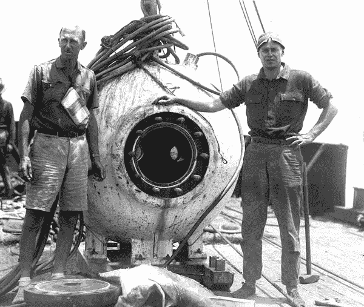

# 不要学深度学习

> 原文：<https://towardsdatascience.com/dont-learn-deep-learning-d23485e4c1c4?source=collection_archive---------13----------------------->

A Bathysphere may be useful for literal Deep Learning. (Ralph White/ Corbis)

深度学习是上一代机器学习中最大的突破之一——但这是否意味着一个通才数据科学家应该努力掌握它？

深度学习无疑是神经网络的一次飞跃。以前一直是绊脚石的计算机视觉问题突然变得容易处理，一个新的前景打开了，使整个人工智能领域复苏。

事实上，它的重要性最近得到了认可，因为对深度学习最重要的三位人物——yo shua Ben gio、Geoffrey Hinto 和 Yann LeCunn 因其对深度学习发展的贡献而获得了 ACM 的图灵奖。

随着深度学习被视为机器学习进步的未来，人们经常建议初出茅庐的数据科学家需要了解深度学习如何工作，这是建立深度学习职业生涯的重要一步。

有两种方式可以将深度学习正确地视为数据科学整体框架内的利基技能集。

深度学习的用例与数据科学的主流用例有些不同。数据科学家经常试图在商业环境中建立具有广泛应用的模型，例如预测营销变动、保险事件或类似事件，深度学习特别相关的用例往往围绕计算机视觉和其他传统人工智能应用。

这些不同的知识领域本身需要不同的思维方式和不同的背景知识。事实上，尽管数据科学和人工智能被一些人视为同一事物的两种形式，或者是一个领域是另一个领域的子集，但更多的情况是，它们是完全不同的领域，有一小部分重叠，就像医学和制药或法律和会计一样。

因此，在深度学习的用例由人工智能应用主导的情况下，这些应用与数据科学应用的主流非常不同。深度学习被证明是最有效的应用(至少目前如此)——图像识别和语音识别——对大多数数据科学家来说都是一条很长的路要走，而且有自己的习惯和行话，必须学会才能做任何事情，而不是在浅水区玩。

就需要特定神经网络架构的专业知识而言，深度学习也特别麻烦。此外，与适用于随机森林、C&RT 甚至梯度增强机器等更常见的数据挖掘算法的许多术语相比，深度学习的术语泛化能力很差。

第三个问题是，深度学习是一种真正的大数据技术，往往依赖于数百万个例子才能得出结论。加里·马库斯(Gary Marcus)在他的《深度学习的批判》(Critique of Deep Learning)中表示，“在数据有限的问题中，深度学习往往不是理想的解决方案。”可悲的事实是，对于大多数数据科学家来说，大多数时候，数据*是*有限的。这是深度学习通常不适合大多数数据科学家最常使用的应用程序的第二个原因。

这三个元素相当于深度学习，与统计学相比，甚至与至少一些其他机器学习方法相比，需要不同的思维模式。这种思维定势不仅需要从业者学会才能有效，当从业者回到另一个领域时，还需要部分地学会。在这种情况下，深度学习和统计类似于显微外科医生对整形外科医生——与处理最大的骨头相比，处理身体中非常小的结构。

这并不是说发展深度学习技能不能成为你帽子上的另一根羽毛，或者你工具箱中的另一件工具。然而，需要意识到的是，对大多数人来说，深度学习对投入学习的时间回报很低，尤其是在职业生涯的早期。作为应用领域最有限的最难学习的工具集之一，其他工具提供了更好的时间投资回报。

需要研究不太可能被使用的额外材料的负担已经使试图学习成为数据科学家的人偏离了他们的目标。这可能会导致许多数据科学家报告的倦怠。将要求的学习限制在一个更小的更重要的主题列表中，这样就可以说，“我已经掌握了需要掌握的东西，至少现在是这样。”

在这种背景下，深度学习带来的专业和不可转移技能集的额外负担对许多人来说是一座通往远方的桥梁。一方面，深度学习算法自动创建自己的特征的想法意味着从业者远离他们试图建模的数据。我们欠下一个数据科学家来确保他们只研究开始他们的职业生涯真正必要的东西。

*罗伯特·德格拉夫的书* [*管理你的数据科学项目*](https://www.amazon.com.au/Managing-Your-Data-Science-Projects-ebook/dp/B07SWV54LR/ref=sr_1_1?crid=1IJIWKNHFBHOY&keywords=robert+de+graaf&qid=1561334793&s=gateway&sprefix=robert+de%2Caps%2C332&sr=8-1) *，已经通过出版社出版。*

在推特上关注罗伯特。