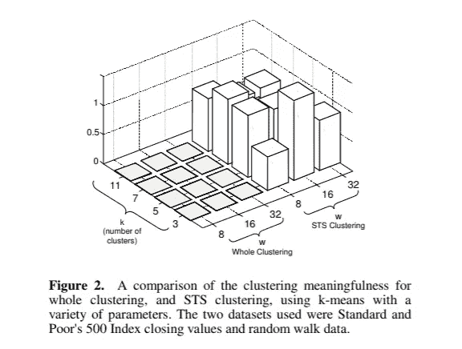
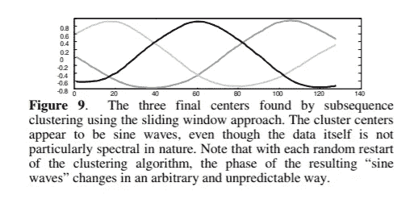

# 时间序列数据聚类时不要犯这种错误！

> 原文：<https://towardsdatascience.com/dont-make-this-mistake-when-clustering-time-series-data-d9403f39bbb2?source=collection_archive---------3----------------------->

> **免责声明:**这不是原创工作，这篇文章的目的是传播和使更多的内容可访问“[时间序列子序列的聚类是无意义的:对以前和未来研究的意义](http://www.cs.ucr.edu/~eamonn/meaningless.pdf)”埃蒙·基奥&杰西卡·林。

最近，我开始研究如何将聚类技术应用于时间序列，我惊讶地发现关于这个主题的帖子非常少(特别是与我想了解 LSTMs 时找到的帖子数量相比)。幸运的是，我发现了埃蒙·基奥和杰西卡·林的这篇论文，它真的很有趣(我鼓励你们去读一读)，但是对于那些没有时间(或者不想读)的人，我决定在一篇文章中总结一下。

在处理时间序列数据时，有两种类型的聚类:

*   整体聚类:当您有几个来自不同机器的时间序列，并且想要比较它们时。
*   子序列聚类:当原始数据是一个很长的时间序列，需要分成几个部分来对这些部分进行聚类。

本文主要研究第二种类型的时间序列聚类，并提出了破坏性的主张，即时间序列子序列的聚类是没有意义的！

具体来说，他们讨论了通过滑动窗口获得的子序列，他们注意到获得该子序列的其他方法可以产生成功的结果，甚至提出了一种新的方法(我不会在这里深入讨论)。

# 他们的证据是什么？

为了证明这一说法，他们使用不同的聚类算法和不同的数据集进行了一系列实验，以确保差异仅由后续算法造成。

他们正在做的是从给定数据集的子序列中生成 *k* 个聚类，从随机数据集的子序列中生成 *k* 个聚类。一旦这样做了，他们就比较在两种情况下获得的聚类，并观察到这些聚类是相似的，即使数据并不相似。使用整体聚类方法不会出现这种情况，从论文中的这张图可以看出:

Image obtained from the original paper

测量“**聚类意义**”(z 轴)的方法是获得聚类的稳定性值(具有不同初始质心的不同运行的相似聚类)并除以不同数据集(其中一个是随机的)获得的聚类的差异。

如果该值接近于零，则意味着聚类是稳定的，并且远离为随机数据集生成的聚类。这个集群可以说是有意义的。然而，如果这接近于 1，这意味着相同数据的不同运行之间的差异类似于来自随机数据集的聚类的差异，这没有意义，因为从不同数据集生成的聚类不应该是相似的；值为 1 意味着分类毫无意义。

正如我们在图中看到的，这正是进行子序列聚类时发生的情况，获得的聚类没有意义。由于许多不同的算法和数据集都会发生这种情况，他们得出结论，这是子序列提取方式的结果。

# 但是为什么呢？

当研究在该聚类中获得的结果时，他们发现当子序列的长度远小于原始长度时，发现所有聚类中心具有正弦形状。聚类中心是该聚类中所有子序列的平均值，但是无论这些子序列的形状如何，结果都是完美的正弦波。

在论文中，他们用一个例子展示了这一点，我不会在这里深入解释，但即使子序列的形状看起来一点也不像正弦波，聚类后的结果如下:

Image obtain from the original paper

# 结论

在对时间序列数据的子序列进行聚类时，我们需要小心。这证明了用于获得子序列的滑动窗口技术产生了无意义的聚类，即使该技术被认为是有用的并且是众所周知的(它已经在许多发表的论文中被使用)。有其他方法可以获得这些子序列，其中一些可以给出最佳结果，但是，我们必须始终关注生成的聚类，以确保中心对我们的数据有意义，并且它们代表了数据集上真正存在的行为。

如果你想更详细地了解这一点，我建议你阅读原始文件，都非常清楚，解释得很好，这篇文章的目的是总结它，所以我不想进入太多的细节。当然，如果你有任何疑问，请随时问我，但请记住，我并没有完成原著，只是读了一下，并尽我所能做了些什么。

如果你想聊更多，请随时通过 LinkedIn 联系我！