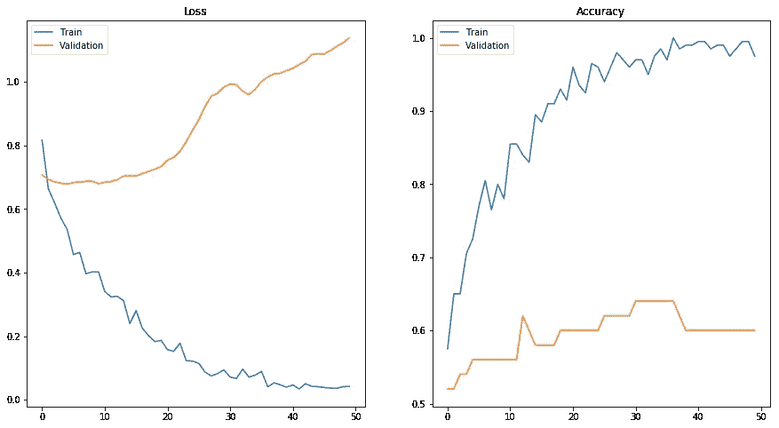
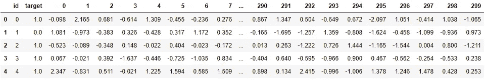
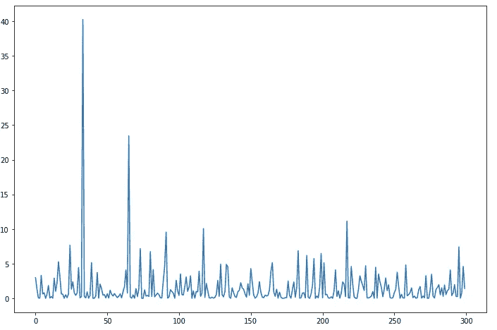
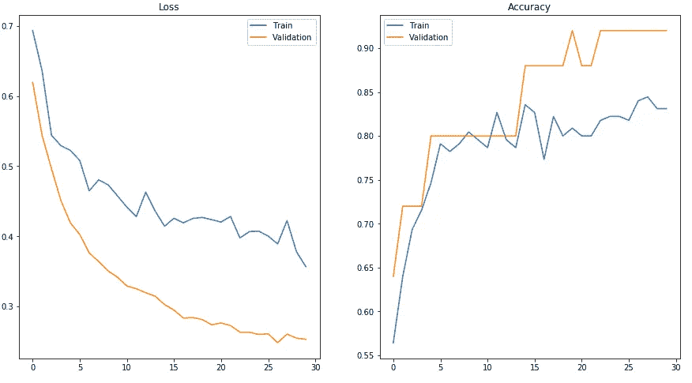

# 不要过度配合！—如何防止深度学习模型过度拟合

> 原文：<https://towardsdatascience.com/dont-overfit-how-to-prevent-overfitting-in-your-deep-learning-models-63274e552323?source=collection_archive---------1----------------------->


Feature Learning can help you prevent overfitting

## 了解有关无监督特征学习等常见策略的更多信息，这些策略可以帮助您防止过度拟合

在这篇文章中，我将谈论如何在深度学习模型中防止过度拟合。为了有一个参考数据集，我使用了[不要过度拟合！II](https://www.kaggle.com/c/dont-overfit-ii) 来自 Kaggle 的挑战。

> 如果你真的想赢得这样的挑战，**不要使用神经网络**，因为它们很容易过度拟合。但是，我们不是来赢得 Kaggle 挑战的，而是来学习如何防止深度学习模型中的过度拟合。

所以让我们开始吧！

# 基础模型

为了了解如何防止过度拟合，我们首先需要创建一个基础模型来与改进的模型进行比较。基本模型是一个简单的 keras 模型，有两个隐藏层，分别有 128 和 64 个神经元。你可以在这里查看:

使用该模型，我们可以实现超过 97%的训练准确率，但是验证准确率只有大约 60%。在下图中，我们可以看到明显的过度拟合迹象:列车损耗**减少**，但是验证损耗**增加**。



This is a sign of overfitting: Train loss is going down, but validation loss is rising

如果您看到类似这样的情况，这是您的模型过度拟合的明显迹象:它很好地学习了训练数据，但未能将知识推广到测试数据。有了这个模型，我们在 Kaggle 挑战赛中得到了大约 **59%** 的分数——不是很好。

那么，让我们看看如何改进这个模型

# 提高分数

为了提高分数，我们基本上可以做两件事

*   改进我们的模型
*   改善我们的数据

我将首先向您展示如何更改基本模型。然后，我将进入**功能选择**，它允许您更改数据

# 改进我们的模型

为了防止过度拟合，我将谈论三种调整你的模型的常用方法。

## 1:简化模型

处理过度拟合的第一步是降低模型的复杂性。在给定的基础模型中，有 2 个隐藏层，一个具有 128 个神经元，一个具有 64 个神经元。此外，输入层有 300 个神经元。这是大量的神经元。为了降低复杂性，我们可以简单地删除层或减少神经元的数量，以使我们的网络更小。没有一个通用的规则来规定要移除多少或者你的网络应该有多大。但是，如果你的网络超负荷，试着把它变小。

## 2:添加漏失层

脱落层是防止模型过度拟合的简单有效的方法。丢弃层随机丢弃层之间的一些连接。这有助于防止过度拟合，因为如果一个连接断开，网络被迫幸运的是，使用 keras 很容易添加一个断开层。

带有脱落层的新的简化模型可能如下所示:

可以看到，新模型只有一个隐藏层，神经元更少。此外，我还在层间添加了漏失层，漏失率为 0.4。

## 3:提前停止

防止过度拟合的另一种方法是尽早停止训练过程:不是训练固定数量的时期，而是在验证损失增加时立即停止，因为在此之后，随着更多的训练，你的模型通常只会变得更差。您可以通过 keras 中的回调轻松实现提前停止:

为此，您需要将`validation_split`参数添加到您的`fit`函数中。否则，`val_loss`不是用 keras 来衡量的。

# 特征选择

如果你看一下原始数据，你会看到有 **300 列**，只有 **250 行。**



Overview over the datset

这对于很少的训练样本来说是很多的特征。所以，与其使用所有的特性，不如只使用最重要的特性。一方面，这将使训练过程明显更快，另一方面，它可以帮助防止过度拟合，因为模型不需要学习很多特征。

幸运的是，scikit-learn 提供了强大的[特性选择](https://scikit-learn.org/stable/modules/feature_selection.html)模块，可以帮助您识别数据集的最相关特性。所以，让我们来探索其中的一些方法吧！

# f 分数选择

选择相关特征的最简单方法之一是计算每个特征的 F 值。F 值是使用要素之间的方差和每个要素内的方差计算的。高 F 值通常意味着该功能比低 F 值的功能更重要。您可以像这样计算要素的 F 值:

如果你绘制数据，你会看到这样的东西:



F-Score of each of the 300 features of the dataset

如你所见，特征之间的 F 值变化很大。您可以使用`selector.scores_`获得每一列的分数，或者您可以获得前 10 个特性的索引，如下所示:

```
f_score_indexes = (-selector.scores_).argsort()[:10]
```

# 递归特征消除

另一种方法是递归特征选择。与其他方法不同，使用 RFE，您不需要为每个特征计算分数，而是在越来越小的特征集上多次训练分类器。在每次训练之后，计算特征的重要性，并且从特征集中消除最不重要的特征。

您可以像这样获得这些特征的索引:

```
rfe_indexes = np.where(rfe_values)[0]
```

# 结果

在本文的开始，我们从一个过度拟合的模型开始，这个模型几乎不能达到 50%以上的精度。下面，您可以看到新模型的结果，在选择功能后根据数据进行训练:



Results of the improved model

它仍然不是完美的，但正如你所看到的，模型过度拟合的方式更少。在 Kaggle 挑战赛中，新模型的得分约为**80%**——比基本模型高出 20%。