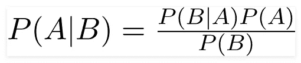
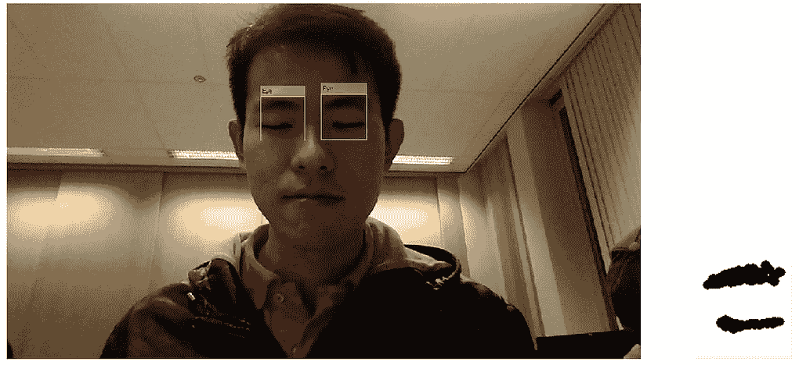

# 不要睡觉:建立你的第一个睡意检测系统

> 原文：<https://towardsdatascience.com/dont-sleep-building-your-first-drowsiness-detection-system-28a9903015f3?source=collection_archive---------5----------------------->

## 权威的建造指南

## 我如何用计算机视觉、人脸识别和 Matlab 建立睡意检测系统


A sleeping student in front of laptop — Extracted from Medical News Today

# 介绍

这是非常重要的一天，测试和项目的截止日期是下周，但你没有准备太多，因为新的光环发布。出于焦虑，你冲到图书馆，打开你的笔记本电脑。然而，当你在提升你的角色时失眠了，你的意识很快把你带到了梦境。咖啡没有用，因为你在笔记本电脑前睡得很香。时间不多了，你拼命保持清醒。

> 如果我告诉你…你的笔记本电脑可以帮助你保持清醒。

# 解决方案:睡意检测系统(DDS)

## 还有一个警报…

想象你是那个可怜的家伙，你可以激活安装在你的笔记本电脑上的 DDS 应用程序。这将触发你的笔记本电脑摄像头。每当你昏昏欲睡时，你的笔记本电脑就会注意到并给你的耳机发出警报。当你醒来后，你的笔记本电脑会注意到并关闭闹铃。然后你可以继续你的工作。

酷用例..？

现在，让我们来看看如何开发 DDS 模型。希望你准备好了，☺


Drowsiness Detection System Coded in Matlab

# 我们怎么知道你困了？

## **对嗜睡的天真分析**

想象一下你的朋友或爱人困倦的脸，你怎么知道他们困了？嗯，最明显的迹象是:

1.  眼睛:眼睛睁开(清醒)，眼睛闭上(困倦)
2.  嘴巴:嘴巴紧闭(清醒)，嘴巴张开/下垂(困倦)
3.  头部位置:头部在同一位置(清醒)，头部上下摆动(困倦)

我们如何教我们的电脑注意到这些迹象？

## 计算机视觉分析

## 眼睛

**黑色像素与白色像素的比率(BW):** 检测你的眼睛是睁开还是闭上。因为你的瞳孔是黑色的，你的眼睛睁得越大，就会出现越多的黑色像素。

然而，问题是，可能有其他混淆变量会中断 BW 比率:

1.  **摄像机到用户的距离**:用户可能会远离摄像机，这取决于他们的最佳检查位置。显然，它们离得越远，BW 比就越小，反之亦然。
2.  **眼睛和瞳孔大小**:不同种族的眼睛大小可能不同。白种人和拉丁美洲人的眼睛大小不同。更不要说像我这样体重比特别小的中国人了。干杯。

为了解决这些混杂变量，我们需要在激活时校准 BW 比率。这是我们确定用户是睁开还是闭上眼睛的基线。

## 口

**物体检测和贴标**:检测开口是否裂开。如果嘴是闭着的，那么就会有一个相连的嘴唇。但是，如果嘴是分开的，那么你的嘴唇是不相连的，将返回多个检测到的对象/嘴唇。

## 头部位置

**使用加速度计的面部检测**:绘制面部的运动。你的面部垂直运动越多，你就越有可能犯困。

## 我们的范围

在这份出版物中，我们将关注眼睛和嘴巴作为我们对睡意进行分类的标识符。现在，让我们开始吧:)。

# 我们应用程序的技术架构

## **模块描述:**

1.  *DrowsinessDetection.m* :捕捉现场摄像机跟踪，并对拍摄的每个*视频帧*运行分类器方法
2.  *EyeDetection.m* :捕捉并裁剪每个*视频帧*的眼睛，并运行分类变量(比率)
3.  *嘴部检测. m* :捕捉并裁剪每个*视频帧*的嘴部，并运行分类变量(检测到嘴唇)
4.  *Scoring.m* :根据 *EyeDetection.m* 和 *MouthDetection.m* 返回的测量值对睡意进行分类
5.  *MeasureTracking.m* :循环显示采集到的不同图片，打印出 *EyeDetection.m* 和 *MeasureDetection.m* 的不同测量值进行分析。

请看看下面的图表，以便更好地理解。


DDS Architecture

# DDS 编码

## 创建 DDS 控制器(DrowsinessDetection.m)

DDS 控制器的工作是激活您笔记本电脑的网络摄像头，并使用分类器来评估您的功能。

首先，让我们用点跟踪器创建一个人脸检测器对象来跟踪人脸检测器对象

```
**faceDetector = vision.CascadeObjectDetector();
pointTracker = vision.PointTracker(‘MaxBidirectionalError’, 2);**
```

一旦我们完成，你可以启动摄像头，然后添加循环，以确保它捕捉帧。系统会一直拍照，直到检测到一个人。

一旦检测到人脸，我们将校准特征。这将产生以下初始比率计算。


First Calibration upon initiation of the system

然后我们会激活 *EyeDetection.m* 来检测图像里面的眼睛。成功检测的第一幅图像将用于启动后续分类的阈值比率。

```
**cam = webcam();
while true
disp(‘Open your eyes wide before picture is taken’)
pause(3)
videoFrame = snapshot(cam);
frameSize = size(videoFrame);
try
   EyeDetection
   initialratio=ratio;
   thresholdratio = initialratio*0.95;
   break**
```

一旦我们检测到这个人的脸和眼睛，我们将继续准备拉响 tiktok 警报。只有当 *Scoring.m* 返回‘sleep’作为结论时，我们才会运行这个声音。

如果没有检测到人脸，应用程序将继续拍摄快照并播放蜂鸣器，直到检测到人脸或用户强制停止它。

*眼睛检测*和*嘴巴检测*的输出将被传入*计分模块*进行计分并得出结论。

```
**EyeDetection
disp([‘ratio is ‘,num2str(ratio,3),’ threshold is ‘,num2str(thresholdratio,3)]) ;****MouthDetection
disp(‘Lips detected: ‘+lipsdetected);**
```

一旦你停止应用程序，网络摄像头和视频对象将被释放。

```
**clear cam;
release(videoPlayer);
release(pointTracker);
release(faceDetector);**
```

# 捕捉眼睛睡意(EyeDetection.m)

## 捕捉眼睛边界框对象

给定摄像机拍摄的图像，我们将使用 *CascadeObjectDetector* 启动*眼睛检测器*对象。

> **级联物体检测器**使用维奥拉-琼斯算法**检测**人的脸、鼻子、眼睛、嘴或上身。你也可以使用图像标签来训练一个自定义分类器来使用这个系统**对象**。— Mathworks

请参考这个惊人的出版物，了解关于 Viola-Jones 算法用于检测人脸。

 [## 使用 Viola Jones 算法的面部部分检测- IEEE 会议出版物

### 本文提出检测图像中的人脸并定位图像中的人脸特征。对…的检测

ieeexplore.ieee.org](https://ieeexplore.ieee.org/abstract/document/8014636) 

我们将使用 *CascadeObjectDetector* 来获取你的脸部的边界框并隔离你的眼睛。

```
**im1=videoFrame;****% Get EyeDetector Object
EyeDetector = vision.CascadeObjectDetector(‘LeftEyeCART’);****% only one eyes are used
% Use EyeDetector on A and get the faces
EyeBBOX =step(EyeDetector,im1);****% Annotate these eyes on the top of the image
imannotateeye = insertObjectAnnotation(im1,’rectangle’,EyeBBOX,’Eye’);****% Getting the last box and crop
EyeBBOX=EyeBBOX(1,:);
imeye3 = imcrop(im1,EyeBBOX);**
```


Getting the eye part from my own face

## 睡眼的目标检测

然后，我们将图像处理成黑色和白色，然后创建一个 strel(形态元素/形状)。

> 一个 **strel** 对象代表一个平面形态结构元素，它是形态膨胀和腐蚀操作的重要组成部分。我们使用 **strel** 函数(如下所述)来创建一个平面结构元素。— Mathworks

[](https://www.mathworks.com/help/images/ref/strel.html) [## 形态结构元素- MATLAB

### 一个 strel 对象代表一个扁平的形态结构元素，它是形态结构的重要组成部分。

www.mathworks.com](https://www.mathworks.com/help/images/ref/strel.html) 

```
**% Process the image to bw, complement and strel
imeye4=im2bw(imeye3,0.1);
imeye5=imclose(imeye4, strel(‘sphere’,4));**
```

然后，我们将通过对所有图像像素求和得到白色像素的数量，每个值为 1 以表示白色像素。这将允许我们找到 BW 比率。

```
**numberOfWhitePixels = sum(imeye5);
numberOfBlackPixels = numel(imeye5) — numberOfWhitePixels ;
% Now calculate the ratio.
ratio = numberOfBlackPixels / numberOfWhitePixels;**
```


My own Open and Closed Eyes bw ratios

# 捕捉口腔睡意(**口腔检测. m)**

## 捕捉嘴部边界框对象

当你的嘴唇半张(分开)时，我们将描述困倦的嘴。通过读取来自摄像机的图像，我们将使用 *CascadeObjectDetector* 提取嘴部对象。

```
**mouthDetector = vision.CascadeObjectDetector(‘Mouth’,’MergeThreshold’,90);
 % Use Mouth Detector on A and get the faces
 MouthBBOX =step(mouthDetector,im1);
 % Annotate these mouth on the top of the image
 imannotatemouth = insertObjectAnnotation(im1,’rectangle’,MouthBBOX,’Mouth’);
 % Getting the last box and crop
 MouthBBOX=MouthBBOX(1,:);**
```


Getting my lips using Matlab CascadeObjectDetector

## 有趣的案子

有趣的是，当应用程序将 3 张嘴与单眉和浓眉的人分类时，会出现一些有趣的情况。出于某些原因，这些物体被归类为嘴。对我的参与者的骚扰深表歉意。但是不要担心，修复工作即将到来。

```
**% If mouth are above the eyes. Then please discard it
if MouthBBOX(2)<=EyeBBOX(2)+EyeBBOX(4)
MouthBBOX= [0 0 1 1];
binaryImage = imcrop(im1,MouthBBOX);**
```

## 瞌睡虫嘴的目标检测

然后，我们将检测它的对象，以便它们将附近的斑点连接成一个对象。然后，我们将所有标签和对象存储在 *LabeledIm* 和 *ConnectedObj* 中，以查看嘴唇是否分开。

```
**% Process the image to bw, complement and strel****binaryImage= im2bw(binaryImage,0.4);
binaryImage = imclose(binaryImage, true(8)); % Close gaps and connect nearby blobs.
binaryImage = imcomplement(binaryImage);****% bwlabel should contain bunch of objects which are separated from others
strel[LabeledIm,ConnectedObj] = bwlabel(binaryImage);**
```

从这里我们计算物体的数量，看看嘴是否裂开。

```
**lipsdetected = ConnectedObj;
if lipsdetected>=2
   mouthstatus = ‘split’;
else
   mouthstatus=’closing’;
end**
```


My own Closing and Split Mouth Object Detected Counts

# *计分. m* 用概率分类预测

## 朴素贝叶斯方法

朴素贝叶斯的思想是构造代表特征值的相关分类器。朴素贝叶斯分类器将考虑每个已知特征，以独立贡献某些类的概率。



在我们的例子中，给定用户的嘴和眼睛困倦的事实(闭上眼睛，张开嘴)，用户困倦的概率是多少？显然，这种可能性比我们将用户的嘴和眼睛分类为清醒(睁开眼睛，闭上嘴巴)时要高。

假设特征(嘴和眼睛)是独立的。这是公平的，因为这两个特征都受你的睡意影响，并且彼此不依赖。

请使用本出版物来了解朴素贝叶斯

[](/naive-bayes-classifier-81d512f50a7c) [## 朴素贝叶斯分类器

### 什么是量词？

towardsdatascience.com](/naive-bayes-classifier-81d512f50a7c) 

使用朴素贝叶斯定理，我们推导出概率百分比。


Percentage of sleeping based on eyes and mouth detection verdicts

因此，每次相机发送图像时， *scoring.m* 将检查图像，并根据概率判断一个人是否困倦。

## 概率分类编程

首先，我们将提取眼睛和嘴巴检测的结果。然后，我们会掷出一个随机数，与概率分类进行对比，宣告你是清醒还是困倦。这模拟了你睡着或醒着的概率。

```
**awakeprob = [100 85 50 15]
Randomnumber = rand(1)*100
if strcmp(eyestatus ,’open’)&&strcmp(mouthstatus,’closing’)
   if randomnumber <= awakeprob(1)
      verdict = ‘awake’;
   else
      verdict = ‘sleepy’;
end
elseif strcmp(eyestatus ,’open’)&&strcmp(mouthstatus,’split’)
   if randomnumber <= awakeprob(2)
      verdict = ‘awake’;
   else
      verdict = ‘sleepy’;
   end
elseif strcmp(eyestatus ,’closed’)&&strcmp(mouthstatus,’closing’)
   if randomnumber <= awakeprob(3)
      verdict = ‘awake’;
   else
      verdict = ‘sleepy’;
end
else
   if randomnumber <= awakeprob(4)
      verdict = ‘awake’;
   else
      verdict = ‘sleepy’;**
```

> 这样，你就成功地制作了你的第一个睡意检测系统。恭喜你！！！

# 寻找眼睛和嘴巴检测的阈值(MeasureTracking.m)

*MeasureTracking.m* 的目的是保存样本数据并评估从眼睛和嘴巴检测中区分清醒或困倦分类的一般阈值。

假设我睁眼产生 256.67 BW 比，闭眼产生 211.58 BW 比，DDS 怎么知道我闭眼了？

## 使用统计推断

统计推断拯救了我们。这意味着我们将开始通过收集和分析样本阈值来推断群体阈值。

[](https://medium.com/@yogita.kinha/statistical-inference-with-hypothesis-testing-43807b932d0a) [## 带有假设检验的统计推断

### 推断统计学帮助我们通过研究一个更大的群体来推断未知的属性或行为

medium.com](https://medium.com/@yogita.kinha/statistical-inference-with-hypothesis-testing-43807b932d0a) 

简而言之，我们假设存在 BW 比率的一般百分比阈值来区分睁眼和闭眼。人口阈值可以从一定的样本量中归纳出来。

在这种情况下，我们检索了 19 名参与者，并收集了成对的睁开和闭上眼睛的照片。然后，我们测量了每一个的 BW 比率，该比率将被转换为最佳阈值。顺便提一下，我们确保样本是不同种族和国籍的。

# **眼睛检测样本结果**

这些比率取自睁眼和闭眼的照片



**Sample 1: Open Eyes (bw ratio: 256.67) Closed Eyes (bw ratio: 211.58)**


**Sample 2: Open Eyes (bw ratio: 203.12) Closed Eyes (bw ratio: 186.87)**


**Sample 15: Open Eyes (bw ratio: 144.00) Closed Eyes (bw ratio: 132.48)**

## 样品分析—眼睛


由此，我们分析出最佳阈值是 8%。一个很简单的计算，却带来了 86.67%的准确率。

# 口腔检测样本结果


**Sample 1: Awake Mouth (LipsDetected:1) Sleepy Mouth (LipsDetected: 2)**

## 样品分析—口腔


从这里我们使用最佳阈值作为 2 个对象。这个简单的阈值已经产生了 84.21%的准确度。

# 结果呢

> 一个视频解释了数十亿张图片。:)

Drowsiness Detection System Demonstration

# 未来的改进/挑战

这种应用的最大挑战是*偏差*。不幸的是，对于一些不同的面部特征，系统在检测嘴唇和眼睛时会变得疯狂。这很尴尬，但我为我的一些参与者鼓掌，他们耐心地接受了这种偏见，并仍然愿意与我保持联系。谢谢！

为了缓解这个问题，我们在应用程序启动时校准了读数，以考虑到人的眼睛或嘴唇的大小。这让我们大大减少了不同种族之间面部特征的差距。然而，这远非完美。所以请大家随意解决，投稿。

至于你的进一步参考，我张贴这个 TED 视频，它最好地描述了我的机器如何挣扎。

TED Talk by Joy Buolamwini, fighting bias in algorithms

# 目的、Github 代码和您的贡献

此概念证明(POC)的目的是作为阿姆斯特丹自由大学课堂项目的一部分而创建的。该应用程序的目标是使用计算机视觉和人脸检测算法来帮助学生或专业人员在关键项目期间在笔记本电脑前保持清醒。

在这个 POC 中，我使用 Matlab 作为脚本语言， [*vision。CascadeObjectDetector* 谢谢大家:)](https://www.mathworks.com/matlabcentral/answers/155126-how-does-the-vision-cascadeobjectdetector-detect-left-and-right-eyes-separately-it-is-constantly-de)

Github Python 笔记本代码位于下面。

[](https://github.com/VincentTatan/DrowsinessDetectionSystem) [## Vincent tatan/drowsiness 检测系统

### 计算学生和专业人士困倦程度的代码。然后它会在检测到你的时候发出警报…

github.com](https://github.com/VincentTatan/DrowsinessDetectionSystem) 

您可以随意克隆这个库，并在有时间的时候贡献自己的一份力量。

# 感谢

我要感谢来自阿姆斯特丹 *VU 大学*的同学们，是你们给了我机会在我的偏见实验中使用你们。如果因为某些原因，我的机器把你的眉毛当成了嘴唇，我向你道歉，我会退缩并喃喃自语“坏机器！不好！”。我真的很喜欢学习计算机视觉和 Matlab 来创造这个有用的产品。

## 最后…

咻…就是这样，关于我的想法，我把它写成了文字。我真的希望这对你们来说是一个伟大的阅读。因此，我希望我的想法可以成为你发展和创新的灵感来源。

请在下面**评论**出来建议和反馈。

快乐编码:)

# 关于作者

Vincent Tatan 是一名数据和技术爱好者，拥有在 Visa Inc .和 Lazada 实施微服务架构、数据工程和分析管道项目的相关工作经验[。](https://bit.ly/2I8jkWV.)

Vincent 是土生土长的印度尼西亚人，在解决问题方面成绩斐然，擅长全栈开发、数据分析和战略规划。

他一直积极咨询 SMU BI & Analytics Club，指导来自不同背景的有抱负的数据科学家和工程师，并为企业开发他们的产品开放他的专业知识。

请通过 [**LinkedIn**](http://www.linkedin.com/in/vincenttatan/) **，** [**Medium**](https://medium.com/@vincentkernn) **或** [**Youtube 频道**](https://www.youtube.com/user/vincelance1/videos) 联系文森特

**免责声明**

**本免责声明告知读者，文中表达的观点、想法和意见仅属于作者，不一定属于作者的雇主、组织、委员会或其他团体或个人**。参考文献是从列表中挑选的，与其他作品的任何相似之处纯属巧合

这篇文章纯粹是作者的个人项目，绝无任何其他不可告人的目的。