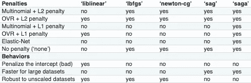
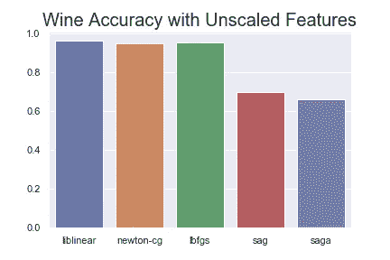
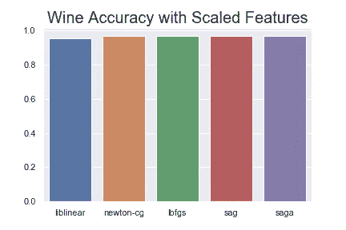

# 不要担心求解器的事情

> 原文：<https://towardsdatascience.com/dont-sweat-the-solver-stuff-aea7cddc3451?source=collection_archive---------1----------------------->

## Scikit-Learn 中更好的逻辑回归模型提示


Lighthouses Give Warnings

逻辑回归是机器学习分类的基本算法。如果你是一名正在实践或有抱负的数据科学家，你会想知道如何使用它的来龙去脉。另外，Scikit-learn 的`LogisticRegression`给出了关于改变默认求解器的警告，所以这是一个学习何时使用哪个求解器的好时机。😀

```
FutureWarning: Default solver will be changed to 'lbfgs' in 0.22\. Specify a solver to silence this warning.
```

在本文中，您将了解 Scikit-learn `LogisticRegression`规划求解选项，并看到对它们的两个评估。此外，您将看到关键的 API 选项，并获得常见问题的答案。到本文结束时，您将对 Scikit 中的逻辑回归有更多的了解——学习而不是担心求解器的问题。😓

我在这个分析中使用的是 Scikit-learn 版本 0.21.3。

**2019 年 12 月 20 日更新**:在 Scikit-learn 核心开发者和维护者 Andreas Mueller 提供了有益的反馈后，我对这篇文章做了几处编辑。

# 何时使用逻辑回归

分类问题是指你试图预测离散的结果，比如某人是否患有某种疾病。相比之下，回归问题是指试图预测一个连续变量的值，如房屋的销售价格。尽管逻辑回归的名字中有*回归*，但它是一种用于分类问题的算法。

逻辑回归可能是最重要的监督学习分类方法。这是广义线性模型的快速、通用扩展。

逻辑回归是一种优秀的基线算法。当特征和目标之间的关系不太复杂时，它工作得很好。

逻辑回归生成通常可解释的要素权重，这在您需要能够解释决策原因时特别有用。这种可解释性经常会派上用场——例如，对于需要证明其贷款决策合理性的贷方。

逻辑回归问题没有封闭解。这很好——我们不使用线性回归问题的封闭解，因为它很慢。😉

求解逻辑回归是一个优化问题。谢天谢地，好人已经创造了几个求解算法，我们可以使用。😁

# 规划求解选项

Scikit-learn 提供了五种不同的解算器。每个求解程序都试图找到最小化成本函数的参数权重。这里有五个选项:

*   `newton-cg` —一种牛顿法。牛顿法使用精确的海森矩阵。对于大型数据集来说，它很慢，因为它需要计算二阶导数。
*   `lbfgs` —代表有限记忆 Broyden–Fletcher–gold farb–Shanno。它用梯度评估来近似二阶导数矩阵更新。它只存储最近的几次更新，因此节省了内存。对于大型数据集，它的速度不是很快。从 Scikit-learn 版本 0.22.0 起，它将成为默认求解器。
*   `[liblinear](https://en.wikipedia.org/wiki/Coordinate_descent)` —大型线性分类库。使用坐标下降算法。坐标下降基于通过在循环中求解单变量优化问题来最小化多变量函数。换句话说，它一次朝一个方向向最小值移动。它是 0.22.0 之前的 Scikit-learn 版本的默认解算器。它在高维情况下表现很好。它确实有一些缺点。它会被卡住，无法并行运行，只能用一对多解决多类逻辑回归。
*   `[sag](https://hal.inria.fr/hal-00860051/document)` —随机平均梯度下降。梯度下降和增量聚集梯度方法的变体，使用先前梯度值的随机样本。适用于大数据集。
*   `saga`—*下垂*的延伸，也允许 L1 调整。一般来说训练速度应该比*下垂*快。

关于不同选项的精彩讨论可以在[这个堆栈溢出答案](https://stackoverflow.com/a/52388406/4590385)中找到。

来自 [Scikit-learn 文档](https://scikit-learn.org/stable/modules/linear_model.html)的下图列出了求解器的特征，包括可用的正则化惩罚。



## 为什么默认求解器会改变？

`liblinear`处理小数据集速度很快，但存在鞍点问题，无法在多个处理器内核上并行化。它只能用一 vs . rest 来解决多类问题。这也不利于截取，不利于解释。

`lbfgs`避免了这些弊端，速度相对较快。对于没有真正大型数据集的大多数情况，这是最佳选择。关于为什么默认设置被改变的一些讨论在[这个 GitHub 问题](https://github.com/scikit-learn/scikit-learn/issues/9997)中。

让我们用两个预测分类项目来评估逻辑回归求解器—一个二元预测分类项目和一个多类预测分类项目。

# 规划求解测试

## 二元分类求解器示例

首先，我们来看一个二元分类问题。我使用了内置的 [scikit-learn 乳腺癌数据集](https://scikit-learn.org/stable/modules/generated/sklearn.datasets.load_breast_cancer.html)。目标是预测乳腺肿块是否是癌性的。


这些特征由关于细胞核的数字数据组成。它们是由活检的数字化图像计算出来的。数据集包含 569 个观测值和 30 个数值特征。我将数据集分为训练集和测试集，并使用不同的求解器对训练集进行网格搜索。你可以访问我的 Jupyter 笔记本，它用于对 [Kaggle](https://www.kaggle.com/discdiver/logistic-regression-don-t-sweat-the-solver-stuff) 的所有分析。

最相关的代码片段如下。

```
solver_list = ['liblinear', 'newton-cg', 'lbfgs', 'sag', 'saga']
params = dict(solver=solver_list)
log_reg = LogisticRegression(C=1, n_jobs=-1, random_state=34)
clf = GridSearchCV(log_reg, params, cv=5)
clf.fit(X_train, y_train)
scores = clf.cv_results_['mean_test_score']

for score, solver in zip(scores, solver_list):
    print(f"  {solver} {score:.3f}" )
```

结果如下:

```
 liblinear 0.939
  newton-cg 0.939
  lbfgs 0.934
  sag 0.911
  saga 0.904
```

*sag* 和 *saga* 的精度值略低于同类产品。

缩放特征后，解算器都表现得更好，并且 *sag* 和 *saga* 与其他解算器一样准确。

```
 liblinear 0.960
    newton-cg 0.962
    lbfgs 0.962
    sag 0.962
    saga 0.962
```

现在让我们看一个有三个类的例子。

## 多类求解器示例

我用 Scikit-learn 的[葡萄酒数据集](https://scikit-learn.org/stable/modules/generated/sklearn.datasets.load_wine.html#sklearn.datasets.load_wine)评估了多类分类问题中的逻辑回归求解器。该数据集包含 178 个样本和 13 个数字特征。目标是从葡萄酒的化学特征来预测用来酿酒的葡萄的类型。

```
solver_list = ['liblinear', 'newton-cg', 'lbfgs', 'sag', 'saga']
parameters = dict(solver=solver_list)
lr = LogisticRegression(random_state=34, multi_class="auto", n_jobs=-1, C=1)
clf = GridSearchCV(lr, parameters, cv=5)
clf.fit(X_train, y_train)
scores = clf.cv_results_['mean_test_score']

for score, solver, in zip(scores, solver_list):
    print(f"{solver}: {score:.3f}")
```

Scikit-learn 给出警告，说明 *sag* 和 *saga* 模型没有收敛。换句话说，他们从来没有到达过最低点。不出所料，结果对那些解算者来说并不太好。

```
liblinear: 0.962
newton-cg: 0.947
lbfgs: 0.955
sag: 0.699
saga: 0.662
```

让我们使用 Seaborn 库制作一个小小的条形图来显示分数。



sag and saga lagging show lower accuracy

在 0 和 1 之间缩放特征后，然后 *sag* 和 *saga* 达到与其他模型相同的平均准确度分数。

```
liblinear: 0.955
newton-cg: 0.970
lbfgs: 0.970
sag: 0.970
saga: 0.970
```



Looking better for sag and saga

注意，这两个例子都是小数据集。此外，在这些示例中，我们没有考虑内存和速度需求。

底线:即将到来的默认 *lbfgs* 解算器对于大多数情况来说是一个很好的首选。如果你正在处理一个大型数据集或者想要应用 L1 正则化，我建议你从 *saga* 开始。记住, *saga* 需要相似比例的特征。

你有*牛顿-cg* 或者*凹陷*的用例吗？如果有，请在评论中分享。💬

接下来，我将在 Scikit-learn 中揭开 LogisticRegression 的关键参数选项的神秘面纱。


Logistics

## 因素

Scikit-learn LogisticRegression 类可以接受以下参数。

`penalty`、`dual`、`tol`、`C`、`fit_intercept`、`intercept_scaling`、`class_weight`、`random_state`、`solver`、`max_iter`、`verbose`、`warm_start`、`n_jobs`、`l1_ratio`

我不会列出下面所有的参数，只是从那些对大多数人最有价值的参数中摘录一些。省略部分见[文件](https://scikit-learn.org/stable/modules/generated/sklearn.linear_model.LogisticRegression.html)。我已经用*斜体*添加了额外的信息。

`C` —浮点型，可选，默认= 1。值越小，正则化程度越高。正则化强度的倒数。*必须是正值。通常用对数搜索:[.001，. 01，. 1，1，10，100，1000]*

`random_state` : int，RandomState instance 或 None，可选(默认=None) *注意，为了再现性，必须在此设置随机状态。*

`solver` { '牛顿-cg '，' lbfgs '，' liblinear '，' sag '，' saga'}，可选(默认='liblinear ')。更多信息见上图。

**在 0.20 版本中更改:在 0.22 版本中，默认将从“liblinear”更改为“lbfgs”。**

`multi_class` : str，{'ovr '，'多项式'，' auto'}，optional(默认='ovr ')如果选择的选项是' ovr '，那么二元问题适合每个标签。对于“多项式”,最小化的损失是整个概率分布的多项式损失拟合，即使数据是二进制的。当 solver =“liblinear”时，“多项式”不可用。如果数据是二进制的，或者如果 solver='liblinear ',则' auto '选择' ovr ',否则选择'多项式'。

**在 0.20 版本中更改:在 0.22 中默认将从‘ovr’更改为‘auto’。** *ovr 代表一对休息。参见下面的进一步讨论。*

`l1_ratio` : float 或 None，可选(默认=None)弹性网混合参数，0 < = l1_ratio < = 1。仅在 penalty='elasticnet '时使用。设置' l1_ratio=0 相当于使用 penalty='l2 '，而设置 l1_ratio=1 相当于使用 penalty='l1 '。对于 0 < l1_ratio < 1，罚的是 l1 和 L2 的组合。*只针对佐贺。*

*注释:*如果你有一个多类问题，那么将`multi-class`设置为`auto`将会使用多项式选项。那是理论上最合理的选择。`auto`很快就会默认。

如果想用 *saga* 解算器使用一些 l1 正则化，使用 *l1_ratio* 。请注意，与 ElasticNet 线性回归选项一样，您可以混合使用 L1 和 L2 惩罚。

还要注意，默认情况下应用了`C=1`的 L2 正则化。这种默认的正则化使模型对多重共线性更加稳健，但代价是可解释性降低(向 Andreas Mueller 致敬)。

拟合模型后，属性为:`classes_`、`coef_`、`intercept_`和`n_iter`。`coef_`包含一个特征权重数组。

# 逻辑回归常见问题

现在让我们在 Scikit-learn 中解决那些你可能对逻辑回归有疑问的问题。

## 我可以使用 LogisticRegression 解决多标签问题吗——这意味着一个输出可以同时成为多个类的成员？

没有。不好意思，如果你需要的话，在这里找另一个分类算法[。](https://scikit-learn.org/stable/modules/multiclass.html)

## 我应该使用哪种正则化？

在偏差/方差权衡中，正则化使你的模型偏向事物的偏差一方。正则化使得逻辑回归模型更具普遍性，尤其是在数据点很少的情况下。您可能想要对正则化参数 *C* 进行超参数搜索。

如果想通过正则化做一些降维，就用 L1 正则化。L1 调整是曼哈顿或出租车调整。L2 正则化是欧几里德正则化，通常在广义线性回归问题中表现更好。

如果你想混合应用 L1 和 L2 正则化，你必须使用 *saga* 解算器。 *liblinear* 求解器要求您进行正则化。然而，你可以只让 *C* 这样一个大的值，它有一个非常非常小的正则化代价。同样， *C* 当前默认设置为 1。

## 我应该缩放特征吗？


Scale

如果使用 *sag* 和 *saga* 解算器，确保特征的比例相似。我们在上面看到了这一点的重要性。Andreas Mueller 在私人信件中还提到，他在使用 *lbfgs* 的未缩放数据上发现了收敛问题，尽管它比 *sag* 和 *saga* 更健壮。

底线:为了安全，扩展你的数据。

## 我应该删除异常值吗？

大概吧。移除异常值通常会提高模型性能。标准化输入也将减少异常值的影响。

RobustScaler 可以缩放特征，您可以避免丢弃异常值。点击这里查看我的文章[讨论缩放和标准化。](/scale-standardize-or-normalize-with-scikit-learn-6ccc7d176a02?source=friends_link&sk=a82c5faefadd171fe07506db4d4f29db)

## 其他哪些假设真的很重要？

观察值应该是相互独立的。

## 我应该使用多项式和交互来变换我的特征吗？

正如线性回归一样，您可以使用高阶多项式和交互作用。这种转换允许您的模型学习更复杂的决策边界。然后，你就不会受限于线性决策边界。然而，过度拟合成为一种风险，解释特征重要性变得更加棘手。求解器找到全局最小值也可能更加困难。


Transformation

## 如果有很多特征，我应该进行降维吗？

也许吧。如果可解释性不重要，主成分分析是一个不错的选择。递归特征消除可以帮助您删除最不重要的特征。或者，如果使用*传奇*解算器，L1 正则化可以将不太重要的特征权重驱动为零。

## 我的要素中的多重共线性是一个问题吗？

它用于解释特性的重要性。当变量之间存在高度相关性时，您不能依赖模型权重。影响结果变量的功劳可能只归于其中一个相关的特征。

有许多方法可以测试多重共线性。参见[克拉哈等人(2012)此处](http://www.frontiersin.org/files/EBooks/194/assets/pdf/Sweating%20the%20Small%20Stuff%20-%20Does%20data%20cleaning%20and%20testing%20of%20assumptions%20really%20matter%20in%20the%2021st%20century.pdf)。

一个流行的选择是检查方差膨胀因子(VIF)。大约 5 到 10 的 VIF 截止值是常见的，但是关于 VIF 截止值应该是多少有一个激烈的争论。

您可以通过对相关矩阵求逆，然后对每个要素取对角线上的值来计算 VIF。

单独的相关系数不足以确定具有多个要素的有问题的多重共线性。

如果样本量较小，获取更多数据可能对消除多重共线性最有帮助。

## 什么时候应该使用 LogisticRegressionCV？

[*LogisticRegressionCV*](https://scikit-learn.org/stable/modules/linear_model.html)如果您拥有大量数据，并且希望在进行交叉验证以调整超参数的同时加快计算速度，那么这就是您想要的 Scikit-learn 算法。

# 包装

现在你知道当你看到`LogisticRegression`规划求解警告时该怎么做了——更好的是，知道如何在第一时间避免它。不再流汗！😅

我建议你在大多数情况下使用即将到来的默认 *lbfgs* 解算器。如果你有很多数据或者需要 L1 正则化，试试 *saga* 。如果你用的是 *saga* 的话，一定要缩放你的特征。

我希望这个关于逻辑回归的讨论对你有所帮助。如果你有，请在你最喜欢的社交媒体上分享，这样其他人也可以找到它。👍

我写关于 [Python](https://memorablepython.com) 、 [Docker](https://memorabledocker.com) 、 [SQL](https://memorablesql.com) 、数据科学和其他技术主题的文章。如果你对此感兴趣，在这里阅读更多[并注册我的](https://medium.com/@jeffhale)[时事通讯](https://dataawesome.com)。😄

[](https://dataawesome.com)

物流快乐！


Good night, lighthouse