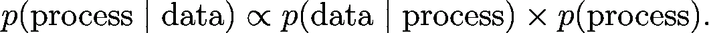
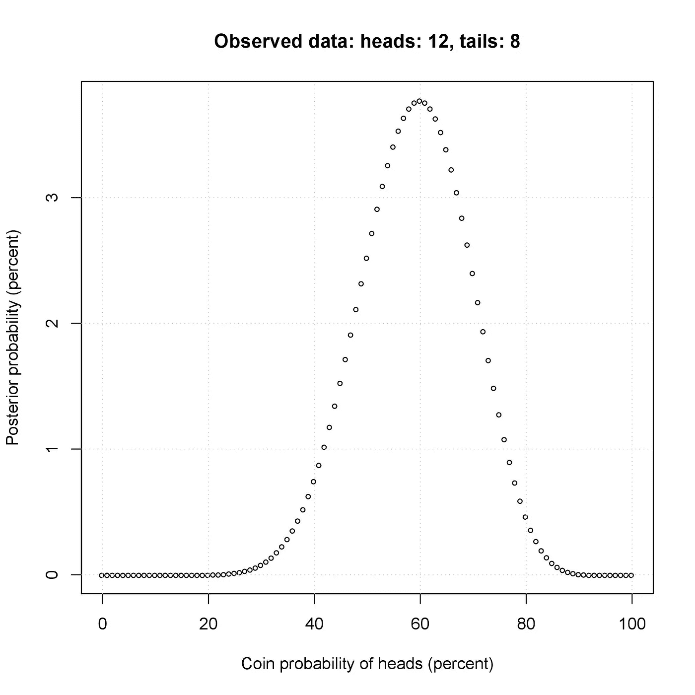
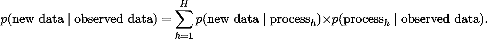

# 不要因为模型“有效”就相信它

> 原文：<https://towardsdatascience.com/dont-trust-a-model-because-it-works-f049374eb6d0?source=collection_archive---------31----------------------->

人们经常试图让别人相信他们的预测是可信的，因为这些预测来自于某种“有效”的统计模型。这通常意味着该模型在过去预测得很好，因此应该相信它在未来也能预测得很好。这听起来很直观:正如我们更有可能相信一台很少发生故障的机器(比如一辆汽车)，我们可能会相信一个在过去运行良好的模型会继续运行下去。当考虑不同的模型时，为什么不“回溯测试”它们，看看哪一个做得最好？我认为这是一个重要的分类错误:统计模型不是机器，也不应该被视为机器。

**统计推断**

为了证明我的论点，首先回顾一下统计推断的基础是有用的。任何统计实践的中心问题是:“不同的过程产生观察到的数据的可能性有多大？”。给定数据和候选过程(假设)的集合，我们应用贝叶斯规则:

以观察数据为条件的假设的概率是后验的， *p* (过程|数据)。这个概率会更高有两个原因:如果数据表明它( *p* (数据|过程))，如果我们事先认为假设更有可能是真的( *p* (过程)，即先验)。

举个简单的例子，假设我们有一枚硬币和一个 20 次抛硬币的样本，其中正面 12 次，反面 8 次。假设我们只考虑三个假设，即正面的概率是 75%、50%或 25 %,假设每一个都有相同的事前概率。我们可以计算出后验概率分别为 33.5%，66.1%，0.4%。

相反，假设我们考虑 101 个假设，即正面的概率是 0、1、2、…、99 或 100%(同样是事前概率相等)。在这种情况下，后视图看起来像这样:

我们也可以考虑连续的假设，例如，正面的概率是 0 到 1 之间的任何数字，具有相等的可能性。这是一个非常简单的例子，但是原则对于任何统计练习都是一样的。

我们也可以在已知过程的条件下计算未观测数据的概率分布，即 *p* (数据|过程)。或者，我们可以计算未知数据函数的分布，例如样本均值。然而，如果我们的目标是从已知数据中了解未知过程，这并不能帮助我们。

**什么时候应该相信一个结果？**

什么时候我们应该相信一个结果，即后验概率分布？主要有两点考虑。一方面，我们可能会问所包含的假设集是否足够宽泛。是否所有看似合理的过程都“获得了证明自己的机会”？一些假设可能已经被包括在内，但是具有较低的先验权重，其他假设可能已经被完全省略。这通常被称为“数据欠拟合”。典型的问题包括:模型是否遗漏了重要的变量？我们应该考虑额外的概率分布族吗？随着时间的推移，参数是否稳定？有应该考虑的动态关系吗？

反过来，我们可能会问，所包含的假设集是否过于宽泛。这就是所谓的“过拟合”。在极端情况下，我们可以将每个观察到的数据点视为唯一的。但这将留下大量的后验不确定性，我们将不会从数据中学到任何东西。

当然，也可能两者都有:我们觉得有些假设被赋予了太多的分量，而另一些则被赋予了太少的分量。

关于什么构成合理与不合理的先验有什么规则吗？不幸的是，答案是否定的。没有“错误”或“正确”的答案，一个人对这些问题的立场是主观的。因此，结果的可信度取决于旁观者。

**举例:糖豆和痘痘**

xkcd.com 的一幅[漫画](https://xkcd.com/882/)展示了两名研究人员正在调查食用软糖豆和痤疮之间的可能联系。他们检查了 20 种不同颜色的软糖数据，发现只有绿色的软糖会引发痤疮。隐含的信息是，他们不应该认真对待这个结果，因为没有证据表明其他 19 种颜色与痤疮有关，我们应该怀疑颜色对痤疮的可能影响。

假设我们确信颜色无关紧要。在这种情况下，我们会简单地估计吃糖豆长痘的几率。但是假设我们想用先验知识来做推论，这个先验知识反映了这样一种信念，即颜色不太可能对痤疮有影响。为了做到这一点，我们将使用一个先验，它对那些效果随颜色而变化的过程赋予较少的权重。这样，我们将推断每种颜色的效果是相似的，除非有相反的有力证据。

需要明确的是，从统计练习中得出绿色软糖会导致痤疮的结论本身并没有什么对错。结果仅仅依赖于所使用的先验知识。

**预测试**

所谓的“预测试”可能会导致拟合不足。这意味着考虑一组假设，然后丢弃那些后验概率低的假设，并给出一个仅考虑剩余假设的后验概率。例如，在上面的硬币例子中，我们可以放弃概率低于 30%或高于 90%的假设，然后重新计算得到的后验概率。

一套假设并不比另一套假设更好。然而，如果想要基于初始假设集进行推断，则需要给出相应的初始后验概率，而不是基于子集的后验概率。

**预测**

我们可以使用后验概率对尚未观察到的数据进行预测，当然假设这些数据是由与观察到的数据相同的过程产生的。未观测数据的预测分布是加权平均值，其中权重是后验概率。如果我们有不同的假设，那么:

这通常被称为*后验预测分布*。

**型号【性能】**

通过仔细选择假设的集合，我们可以找到比其他过程更有可能的过程。此外，如果我们在过去使用这些过程(或模型)，我们将可以很好地预测数据。事实上，*很容易找到一个可以任意(甚至完美)预测过去的过程*。因此，我们应该用这个模型来预测未来吗？同样，除非候选假设集准确地反映了我们的先验分布，否则答案是否定的。

一种常用的方法是将数据分成两个样本，用第一个样本(“训练集”)计算后验概率，然后用它来查看该模型对第二个样本(“验证集”)的预测程度。如果预测是好的，那么这就证明了该模型是可信的，因为它在“样本外”表现良好。但是，当然会观察到“样本外”数据，因此这个练习本质上是对参数在不同子集之间保持稳定的假设的粗略评估。事实上，正如很容易找到一个在样本中预测良好的过程一样，找到一个在“样本内”和“样本外”都预测良好的过程也同样容易。

“预测业绩”在某种意义上是一个毫无意义的概念。我们有数据，有了数据，我们可以通过统计推断获得关于世界的知识，这反过来又使我们能够进行预测。这就是全部了。

**然后怎么办？**

我认为，如果我们认为假设集(和相应的先验权重)是合理的，我们应该相信统计实践的结果。但是，也许令人失望的是，对于什么样的假设和先验是合理的这个问题，没有简单的对错答案。

也就是说，主要的考虑因素如上所述:欠拟合和过拟合。一方面，我们应该检查所考虑的假设，并问自己是否觉得重要的假设被遗漏了。另一方面，我们应该问问自己，我们是否觉得我们可以从具有额外结构的数据中学到更多。简而言之，一个先验可能太“开明”。

**信息丰富的前科**

虽然有些人可能会对信息丰富的先验感到不舒服，但重要的是要记住，任何统计练习都涉及先验，因为许多假设被排除在外，因此先验权重为零。但是为什么优先地位应该是全有或全无呢？事实上，使用信息丰富的先验知识通常有吸引人的理由，例如，当我们对不同的类别使用不同的参数时，就像上面的软糖豆的例子一样。我们可能希望假设子类别之间的参数是相似的。这样，如果某个类别的数据很少，我们可以从其他类别中观察到的数据中获取信息。

使用信息丰富的先验知识的另一个原因是，否则我们可能会非常重视可能非常极端的假设。最后，计算完整的后验分布并不总是容易的，有时只有后验模式(即单一最可能的假设)是可用的。如果使用了信息丰富的先验，基于单独模式的预测将是基于整个后验预测的合理近似。

**沟通结果**

假设我们做了一个统计研究，想让别人相信我们的结果是合理的。我们想要说服我们的观众，假设的范围足够广泛，但是我们也强加了足够的结构。鉴于人们有不同的经历，显示结果对不同的假设有多敏感是有帮助的。一种典型的方法是，首先表明在强先验假设(即相对简单的模型)下结果成立，然后表明在限制性较小的假设(即更复杂的模型)下结果成立。

当对某个主题的知识存在重大差距时，说服观众可能会很有挑战性。我们常常依赖“专家判断”；仅举一个例子:天气。但是我们经常没有时间或兴趣去真正理解专家预测背后的推理。专家有责任为他们的观点提供一个诚实的解释。基于他们使用了一个“运作良好”的模型的解释应该受到最大的怀疑。

**了解一个预测**

到目前为止，我已经讨论了我们是否应该相信统计建模练习的结果(或预测)。我现在转向另一个问题，即*理解*预测。对于来自复杂的高维模型(有时称为“黑箱”)的预测，梳理出主要驱动因素并以简单的术语表达它们可能是一项挑战。

我们应该只使用我们理解的模型吗？答案可以说是否定的。首先，如果我们这样做了，基本上整个人工智能(AI)领域将不得不被放弃。

举个例子，计算机可以识别人类的笔迹，例如用来阅读邮件上的地址。为了做到这一点，计算机使用了一个已经用数据估算过的统计模型。例如，为了识别一个数字，可以将一幅图像转换成一组像素。每个像素被转换成一个从 0 到 1 的数字，代表它的暗度。如果图像的分辨率为 28×28，我们将得到一个 784 维的向量。该模型通常是一个 [*神经网络*](http://neuralnetworksanddeeplearning.com) ，可以使用数据进行估计，然后用于形成预测:对于任何图像(784 维向量)，数字为 0，1，2，3，4，5，6，7，8 或 9 的概率是多少？不用说，理解这种条件概率分布并不容易。

即使我们对模型如何工作没有什么概念，仔细考虑参数的先验分布仍然很重要。与任何模型一样，我们可以使神经网络过拟合或欠拟合。如果我们包括许多自由参数，并忽略后验不确定性(换句话说，预测试)，神经网络可以完美地预测观察到的样本。

**最终想法**

无可否认，所有的知识都是以一些潜在的假设为条件的。统计推断需要利用新信息(数据)建立在原有知识的基础上。然而，观点各不相同，几乎没有普遍认同的假设。如果我们认为潜在的假设是合理的，那么统计结果就是可信的。因此，我们不应该在至少对哪些假设被考虑有所了解的情况下接受一个结果。