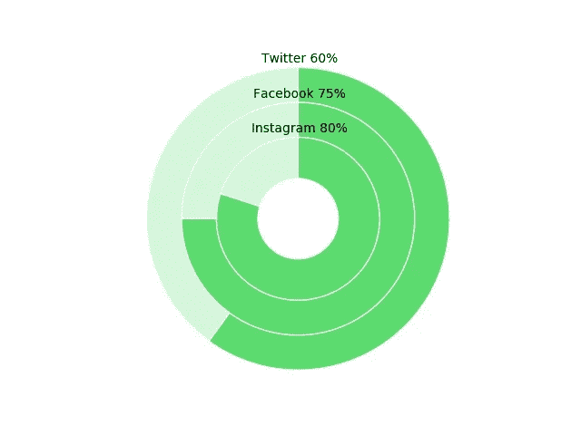

# 使用 Matplotlib 绘制圆环图(Python)

> 原文：<https://towardsdatascience.com/donut-plot-with-matplotlib-python-be3451f22704?source=collection_archive---------16----------------------->

## 让我们用一句非常著名的英语谚语来赞美可视化吧。这是老生常谈，但完全正确。

> “一张**图**抵得上一千句**话**”

在这篇文章中，我将演示如何使用 python 和 matplotlib 创建一个圆环图。圆环图是比较多个实体统计数据的一种非常有效的方式。根据[1]

> 就像饼图**图**一样，**圆环图**显示部分与整体的关系，但是**圆环图**可以包含多个数据系列。您**在**圆环图**中绘制**的每个数据系列都会给**图**添加一个环。

现在，让我们使用下面的虚拟数据来表示不同社交媒体网站的移动应用程序的使用情况。

```
╔═════════════════╦══════════╗
║   Social Media  ║   Usage  ║
╠═════════════════╬══════════╣
║ Twitter         ║ 60 %     ║
║ Facebook        ║ 75 %     ║
║ Instagram       ║ 80 %     ║
╚═════════════════╩══════════╝
```

下面是创建环形图的代码。

```
**import** pandas **as** pd
**import** re

data = pd.read_csv(**'testdata.csv'**)
print(data.head())

**import** matplotlib.pyplot **as** plt

*# create donut plots* startingRadius = 0.7 + (0.3* (len(data)-1))
**for** index, row **in** data.iterrows():
    scenario = row[**"scenario"**]
    percentage = row[**"Percentage"**]
    textLabel = scenario + **' '** + percentage
    print(startingRadius)
    percentage = int(re.search(**r'\d+'**, percentage).group())
    remainingPie = 100 - percentage

    donut_sizes = [remainingPie, percentage]

    plt.text(0.01, startingRadius + 0.07, textLabel, horizontalalignment=**'center'**, verticalalignment=**'center'**)
    plt.pie(donut_sizes, radius=startingRadius, startangle=90, colors=[**'#d5f6da'**, **'#5cdb6f'**],
            wedgeprops={**"edgecolor"**: **"white"**, **'linewidth'**: 1})

    startingRadius-=0.3

*# equal ensures pie chart is drawn as a circle (equal aspect ratio)* plt.axis(**'equal'**)

*# create circle and place onto pie chart* circle = plt.Circle(xy=(0, 0), radius=0.35, facecolor=**'white'**)
plt.gca().add_artist(circle)
plt.savefig(**'donutPlot.jpg'**)
plt.show()
```



Donut Plot

在最核心的地方，这个代码中的圆环图是通过创建一系列不同半径的饼图来创建的，一个在另一个之上，中间有一个白色的圆圈。

## 参考

[1][https://support . office . com/en-us/article/present-your-data-in-a-donut-chart-0 AC 0 efde-34e 2-4d C6-9b7f-ac93d 1783353](https://support.office.com/en-us/article/present-your-data-in-a-doughnut-chart-0ac0efde-34e2-4dc6-9b7f-ac93d1783353)