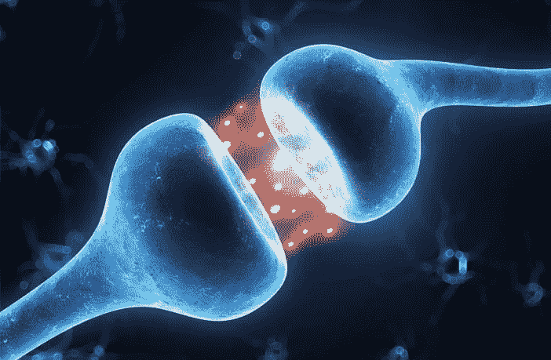
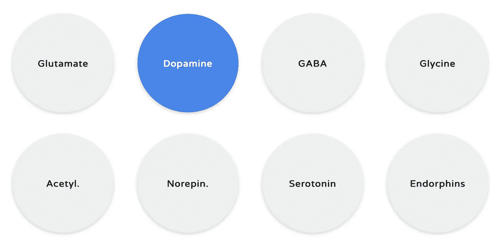
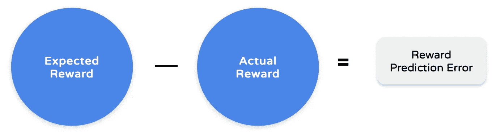

# 多巴胺和强化学习算法

> 原文：<https://towardsdatascience.com/dopamine-and-reinforcement-learning-algorithms-d5deb5ac6479?source=collection_archive---------23----------------------->

决策者面临的一个重要问题是通过反复试验来学习作出何种决定，以便最好地获得奖励或避免惩罚。在计算机科学中🤖，这个问题被称为**强化学习**。让我们仔细看看。

# **什么是多巴胺？**

多巴胺是大脑八种神经递质之一。神经递质是一种化学物质，**在神经元之间来回传递** **信息**。👌🏻

# 多巴胺有什么作用？

中脑多巴胺神经元的阶段性活动提供了一种全局机制🌏进行突触改造。这些突触修饰反过来为一类特定的强化学习机制提供了机械基础，这类机制现在被认为是许多人类和动物行为的基础🐒🐬🐊 🐝🐆🐘。

换句话说，多巴胺让我们看到回报并采取行动。然后我们采取行动**接受奖励**——也就是说，通过使用调节运动、学习、注意力和情绪反应。就这么简单。

# 多巴胺帮助我们学习。

在学习的背景下，多巴胺起着**奖励预测误差信号的作用。**简单来说，多巴胺计算预期*的奖励*和实际*收到的奖励*之间的**差异**。

# 为什么奖励预测误差很重要？

任何人最基本的目标之一👬对未来事件做出准确的预测，以便在这一预期的未来到来时做好准备，并相应地调整自己的行为。

一般来说，学习可以被定义为改善这些对未来的预测的**过程。因为预测往往不太准确，我们需要一种方法来计算我们的预测误差，这样我们就不会再犯同样的错误(因此奖励预测误差)😉。**

这些预测误差是最基本的教学信号之一，可用于**提高对未来奖励的预测准确性**。为此，学习的最终目标是做出准确的预测，从而消除预测误差。

# 强化学习和预测误差。

“预测误差”假设很有趣，因为强化学习算法使用[时间差异学习](https://en.wikipedia.org/wiki/Temporal_difference_learning) 🧠，它大量使用编码预测误差的信号。

时间差异学习是指一类无模型强化学习方法，通过*自举*(使用最近信息和先前估计的组合来生成新的估计)从价值函数的当前估计进行学习。

简单来说，强化学习算法使用预测误差来提高计算机在某些环境下(例如，在下棋或吃豆人时)做出更好决策的能力。

# 所以我们的算法模仿了我们的大脑？

嗯，是的。

目前的数据表明，中脑🧠多巴胺神经元的阶段性活动编码了一种奖励预测误差，用于指导整个额叶皮质和基底神经节的学习。这种活动现在被认为是一种信号，表明受试者对当前和未来事件的价值的估计是错误的，然后表明这种错误的大小。

这是一种组合信号，以定量的方式调整突触强度，直到受试者对当前和未来事件的价值的估计被准确地编码在额叶皮层和基底神经节中。

总之，这种生物活动现在被编码到我们的许多强化学习算法中，并在许多[情况下取得了巨大成功](https://drive.google.com/viewerng/viewer?url=https://storage.googleapis.com/deepmind-media/alphago/AlphaGoNaturePaper.pdf)。

# 这一切意味着什么？

多巴胺神经元可能为大脑中的神经元提供关于未来的**值的详细信息。反过来，这些信息有可能在实际奖励发生之前很早就被用来计划和执行有利可图的行为和决策😎去了解更早的可靠的奖赏预测。**

记住这一点，如果我们能够教会我们的算法做到这一点，我们的算法将继续变得更强大、更智能，同时慢慢走向人工智能成为现实的未来。✌️🏻

来源:

 [## 多巴胺在动机和学习中的作用-神经科学新闻

### 如果你曾经对开始一个新项目感到无精打采，集中精力想象完成它的喜悦，比如说大学…

neurosciencenews.com](https://neurosciencenews.com/dopamine-learning-reward-3157/)  [## 多巴胺:改善强化学习和…机器的快感？

### 好消息:2018 年 8 月 27 日，谷歌通过他们的人工智能博客宣布，他们将发布一个新的框架…

towardsdatascience.com](/dopamine-improved-reinforcement-learning-and-pleasure-for-machines-9278ef84d78b)  [## 多巴胺|今日心理学

### 多巴胺是大脑的神经递质之一，是一种在神经元之间传递信息的化学物质。多巴胺有助于…

www.psychologytoday.com](https://www.psychologytoday.com/us/basics/dopamine) 

[https://drive.google.com/viewerng/viewer?URL = https://storage . Google APIs . com/deep mind-media/alpha go/alphagonaturepaper . pdf](https://drive.google.com/viewerng/viewer?url=https://storage.googleapis.com/deepmind-media/alphago/AlphaGoNaturePaper.pdf)