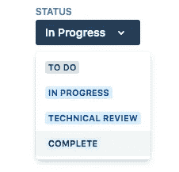
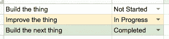

# 多巴胺驱动的发展

> 原文：<https://towardsdatascience.com/dopamine-driven-development-c7ca63b5626c?source=collection_archive---------16----------------------->

Credit: @hannynaibaho, Unsplashed

过去几周，加入 [Monarch](https://medium.com/@Oao84/ive-joined-monarch-money-af95a62f2f01) 后，我又开始写代码了。就上下文而言，除了一些零星的项目，我在过去的两年里没有写过多少代码(而是专注于管理、写作和产品)。

首先突出的是:我有些生疏了。第二:我已经忘记了写作软件是多么有趣和吸引人。我感觉我发现了一个旧瘾。当然，在代码审查、招聘和其他任务之后，我只剩下 20-30%的时间用于编码(和过去不同，我不能把时间延长到清晨或深夜，因为我想和家人在一起)。但是我发现自己整天都在期待着我的“编程修正”，如果我结束了一天却没有得到它，有些事情就感觉不对了。

那么是什么让编写软件具有那种属性呢？因为软件的可塑性很强，而且你可以在快速迭代中工作，所以编写软件可以触发多巴胺释放周期。多巴胺是一种“奖励”化学物质——你的大脑在对某种刺激做出反应时释放它，让你感觉良好，并使你更有可能重复这种行为。

那么你如何利用这一点呢？以下是我发现的一些放大多巴胺分泌的技巧。正如你将看到的，它们中的大多数都是基于缩短(或加强)工作和看到收益之间的反馈循环。好消息是，这些技术对软件开发的速度和质量都有好处。但即使他们没有，我也认为你从更高的精神投入中获得的好处本身就让他们值得。

## 使用 CI/CD

我大学毕业后的第一份工作是在谷歌的 Adwords 产品上工作。我们每两周发布一次。如果您错过了将您的变更发布到发布分支中，您必须等到下一个(除非您正在修复一个主要的 bug 或者有另一个有效的理由将您的变更“精选”到产品中)。现在，有充分的理由使用这种类型的定期发布周期。但是等了两周才把你的代码投入生产？真是扫兴。

相反，使用[与持续部署或交付](https://www.atlassian.com/continuous-delivery/principles/continuous-integration-vs-delivery-vs-deployment)的持续集成。除了集成和部署中的[优势，如更快的速度和更低的风险](https://puppet.com/blog/top-benefits-of-continuous-delivery-an-overview)，编写代码和投入生产之间的快速反馈循环也非常令人满意。Quora(我以前工作过的地方)将这一点发挥到了极致:编写的代码可以在 30 分钟内投入生产，在部署之后[以非阻塞的方式进行代码评审。疯狂的快速和满足。](https://engineering.quora.com/Moving-Fast-With-High-Code-Quality)

## 使用测试

测试是另一种“最佳实践”,它既能提高代码的质量，又能增加编写代码的乐趣。我们都知道好的测试的好处:它确保你的代码做它应该做的事情，可以帮助你轻松自信地做出改变，并迫使你设计干净的、模块化的界面。

一个额外的好处是他们提供了一个真正快速的反馈回路。如果您使用测试驱动开发这样的技术，这一点尤其正确。您首先编写测试，然后实现功能以通过这些测试。这样做的好处是，您可以很快获得积极的回报，而不必等待集成或部署。我发现即使是对这个循环的简单改进，比如用绿色显示你的通过测试，或者显示一个简单的信息，比如“成功”。全部测试通过！”能在你的大脑中激起一点点快乐。

WOOHOO!

## 使用任务管理器

使用项目管理工具(吉拉、Asana、Trello 等)并跟踪你的进度。把你的工作分成小的、可衡量的任务，并有对应你实际工作的阶段。

例如，在 Monarch，我们做代码审查。当代码审查仍然未完成时，将任务标记为“完成”是不成熟的，但是保持它“进行中”(在完成大部分工作之后)感觉是空虚和没有成就感的。所以我们创造了一个“技术回顾”阶段。这确实有助于我们更好地了解不同任务所处的阶段，以及是否有任何东西在技术审查中被阻止，但我们无论如何都会从 Github 获得这些信息(我们对代码审查有 24 小时的周转时间，通常比这更快完成)。主要的好处是更好地将任务映射到工作上。

Oh baby

(如果你不是一个优秀的项目管理人员，我曾让团队使用谷歌文档或电子表格完成任务。

If you’re into that, I won’t judge. To each their own.

# 添加含义

如果这一切看起来像是在训练你的大脑寻求奖励，就像你训练笼子里的老鼠去按下按钮寻找小球一样，那是因为我们缺少了一个关键的部分:意义。短期多巴胺冲击和短期激励一样有效。但是你也应该通过以下方式把你的工作和更大的事情联系起来:

*   理解你正在构建的东西的“[为什么](https://www.amazon.com/dp/B002Q6XUE4/ref=dp-kindle-redirect?_encoding=UTF8&btkr=1)”。对客户会有什么影响？出差吗？
*   查找产品数据/指标，帮助您衡量和理解您所构建产品的影响。如果你的公司没有度量很多指标，那就努力去做。如果 it 部门确实进行了衡量，但只是与管理层和产品经理分享了这些指标，那么就推动为整个公司提供更开放的仪表板和报告。
*   找到与你的用户联系的方法。开展(或询问你是否能参加)用户研究会议。理解你的用户的问题以及你的产品如何帮助他们。额外的好处:这种理解也会让你成为[更有效的软件工程师](https://www.quora.com/Should-software-engineers-be-involved-in-product-decisions)。

# 将它整合在一起

构建软件可能是一项非常令人满足的工作。通过设计你的工作周期和反馈循环，你可以放大这种满足感，让自己更快乐、更有效率。这不仅适用于软件开发，也适用于您定期执行的任何其他任务。总结一下我们讨论的内容:

*   以小的、可管理的增量工作，并找到衡量和奖励自己工作的方法。尽可能缩短工作完成和交付/测量之间的周期时间。
*   将你的工作与更大的图景联系起来，以获得更深层次的满足感。

编码快乐！