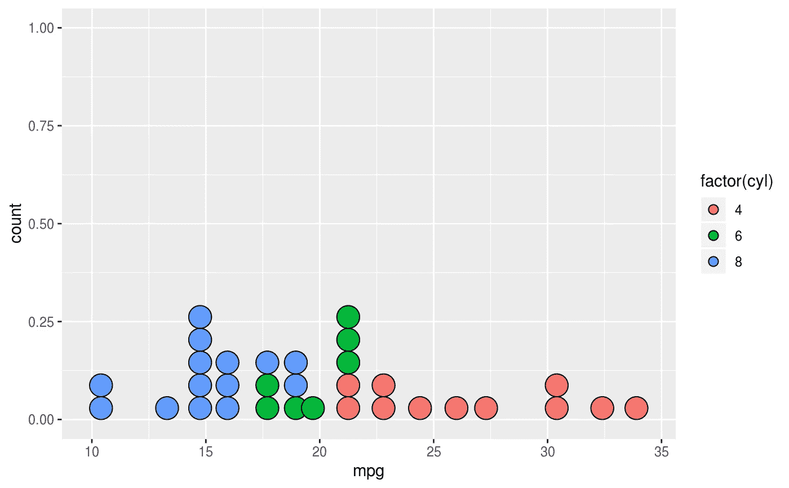
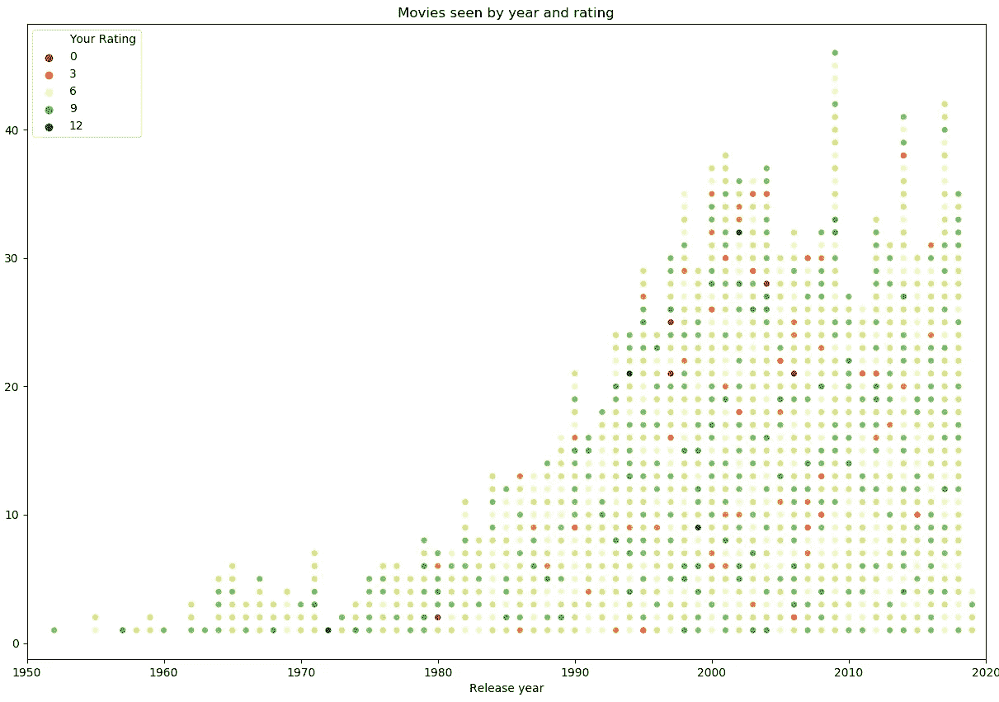
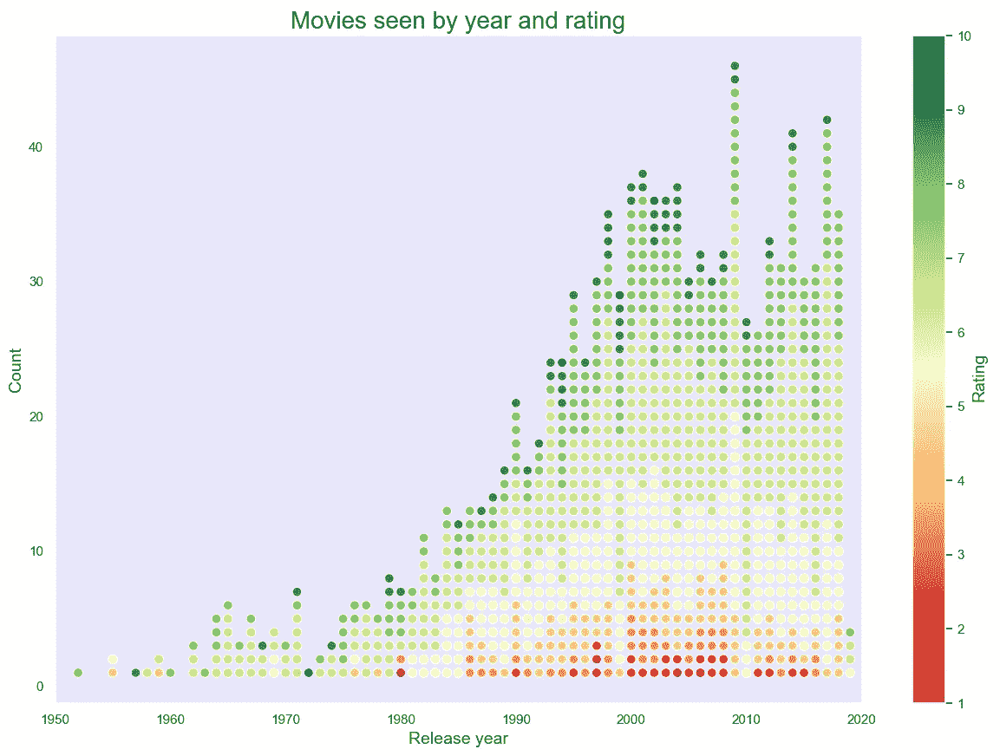

# 如何在 Python 中创建点状图

> 原文：<https://towardsdatascience.com/dotplotpython-c24058dc6689?source=collection_archive---------22----------------------->

## 对经典的 Seaborn 散点图做了一点调整

最近，我查看了我的 IMDb 账户。哇，有超过 1100 个分级的标题！我决定创造一个我每年看过的电影的情节和它们的收视率。点阵图是一种很好的可视化方式，我一直喜欢用 ggplot2 创建的这些[图:](https://ggplot2.tidyverse.org/reference/geom_dotplot.html)



Dot plot created in R’s ggplot2

好吧，用 Python 应该不是什么难事。我只需要用我的评级得到一个. csv 文件，用 Matplotlib/Seaborn 和*写几行代码，瞧！我很快意识到 Matplotlib 不支持点状图。Seaborn 也不知道。我很快检查了 MS Excel——也没有点状图！*

在谷歌搜索了几分钟后，我找到了[的一个解决方案](https://stackoverflow.com/questions/49703938/how-to-create-a-dot-plot-in-matplotlib-not-a-scatter-plot)。然而，创建值的直方图，然后将它们映射到散点图上，并不能解决评级的不同标记颜色的问题。

我喜欢调整标准散点图的想法，所以我决定走这条路。我没有创建一个网格点，而是使用了一个简单的循环来添加负责每年电影数量的新变量。

首先，我们创建一个空数组“movie_count ”,它将存储每部电影在图表上的垂直位置。然后我们使用“enumerate”函数遍历 year 列。对于每个电影，我们从第一个索引开始创建一个子集，直到这个电影。现在，我们对该子集中的所有电影进行计数，并将结果追加到“movie_count”中。

```
# Loop to create a new variable, which will turn scatterplot to a dot plot
movie_count = []

for index, year in enumerate(ratings['Year']):
    subset = ratings.iloc[:index + 1]  # Create subset starting at the beginning of dataset until the movie itself
    count = len(subset[subset['Year'] == year])  # Count all movies from the same year in this subset
    movie_count.append(count)  # Appended counts will be used as vertical values in the scatterplot,
    # which will help to create a dot plot
```

例如，如果我们正在查看数据集中的第 20 部电影，该电影于 2018 年上映，我们将创建这 20 部电影的子集，并对 2018 年的所有电影进行计数。假设有三个，那么我们将这个数字附加到 movie_count 数组的第 20 个位置。如果下一部电影也是 2018 年的，则计数为 4，以此类推。我们数据集中的每一部电影都有一对唯一的坐标——发行年份和数量。

这样我们可以创建一个散点图，实际上就是点状图。现在，我们只是添加色调作为参数，以获得不同的颜色评级，它应该工作。



First version of the dot plot

基本想法是可行的，但现在我们需要解决一些问题:

1.为了更好的可读性，电影应该按等级分类。

2.圆点需要变大。

3.为了更好的对比，应该添加背景色。

4.传说就是不好。您不能在 1-10 的范围内给电影 0 或 12 评分。此外，对于这种数据，平滑(或离散，你的选择)色彩映射表会更好。这里有一个很棒的关于创建色彩映射表的帖子。

解决这些问题后，您可以得到一个漂亮的图表:



Final dot plot looks much better

如果你对创建这个点图的完整代码感兴趣，可以查看我的 [GitHub 库](https://github.com/Pjarzabek/DotPlotPython)。请随意评论或报告代码中的任何改进，因为我只是将 Python 用于数据科学任务，我不是优化方面的专家。