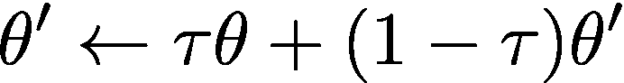

# 双深 Q 网络

> 原文：<https://towardsdatascience.com/double-deep-q-networks-905dd8325412?source=collection_archive---------1----------------------->

## [DQN 家族](https://towardsdatascience.com/tagged/Dqn-family)

## 解决深度 Q 学习中的最大化偏差

# **简介**

在本帖中，我们将探究双 Q 学习网络背后的动机，并看看实现这一点的三种不同方式:

*   原算法在 [**【双 Q 学习】(Hasselt，2010)**](https://arxiv.org/pdf/1509.06461.pdf)
*   [**《双 Q 学习的深度强化学习》(Hasselt et al .，2015)**](https://arxiv.org/pdf/1509.06461.pdf) 中来自同一作者的更新算法，
*   最近的方法，Clipped Double Q-learning，见于[**《Actor-Critic Methods 中的寻址函数逼近误差》(Fujimoto et al .，2018)**](https://arxiv.org/pdf/1802.09477.pdf) 。

如果你还不完全熟悉 Q-learning，我建议你快速看一下[我关于 Q-learning 的帖子](/dqn-part-1-vanilla-deep-q-networks-6eb4a00febfb)！

# 动机

考虑目标 Q 值:

具体来说，

照这样取最大高估值就是隐含地取最大值的估计值。这种系统性的高估在学习中引入了最大化偏差。由于 Q-learning 涉及 bootstrapping——从估计值中学习估计值——这种高估可能是有问题的。

> 这里有一个例子:考虑一个单一状态 *s* ，其中所有动作的真实 Q 值都等于 0，但是估计的 Q 值分布在零上下一些。取这些估计值的最大值(明显大于零)来更新 Q 函数会导致 Q 值的高估。

Hasselt 等人(2015)在跨不同 Atari 游戏环境的实验中说明了这种高估偏差:

Source: [“Deep Reinforcement Learning with Double Q-learning” (Hasselt et al., 2015)](https://arxiv.org/pdf/1509.06461.pdf),

正如我们所看到的，传统的 DQN 倾向于大大高估行动价值，导致不稳定的培训和低质量的政策:

# 解决方法:双 Q 学习

解决方案包括使用两个独立的 Q 值估计器，其中一个用于更新另一个。使用这些独立的估计，我们可以无偏 Q 值估计的行动选择使用相反的估计[3]。因此，我们可以通过从有偏差的估计中分离出我们的更新来避免最大化偏差。

下面，我们将看看双 Q 学习的 3 种不同公式，并实现后两种。

**1。“双 Q 学习”中的原始算法(Hasselt，2010)**

**Pseudo-code Source: “Double Q-learning” (Hasselt, 2010)**

最初的双 Q 学习算法使用两个独立的估计值`Q^{A}`和`Q^{B}`。对于 0.5 的概率，我们使用估计值`Q^{A}`来确定最大化动作，但是使用它来更新`Q^{B}`。相反，我们使用`Q^{B}`来确定最大化动作，但是使用它来更新`Q^{A}`。通过这样做，我们获得了预期 Q 值的无偏估计量`Q^{A}(state, argmaxQ^{next state, action)`,并抑制了偏差。

**2。来自同一作者的“使用双 Q 学习的深度强化学习”(Hasselt 等人，2015)，**的更新版本

在第二个双 Q 学习算法中，我们有一个模型`Q`和一个目标模型`Q’`，而不是像(Hasselt，2010)中那样有两个独立的模型。我们使用`Q’`进行动作选择，使用`Q`进行动作评估。那就是:

我们最小化`Q`和`Q*`之间的均方误差，但是我们让`Q'`慢慢复制`Q`的参数。我们可以通过定期硬拷贝参数来实现，也可以通过 Polyak 平均来实现:

其中，θ'是目标网络参数，θ是主要网络参数，τ(平均速率)通常设置为 0.01。

**3。削波双 Q 学习，见于** [**《演员-评论家方法中的寻址函数逼近误差》(藤本等，2018)**](https://arxiv.org/pdf/1802.09477.pdf) **。**

在削波双 Q 学习中，我们遵循 Hasselt 2015 的原始公式。我们对真实的 Q 值有两个独立的估计。这里，为了计算更新目标，我们取由两个 Q 网络产生的两个下一状态动作值的最小值；当一方的 Q 估计值大于另一方时，我们将其降至最小，避免高估。

Fujimoto 等人提出了这种设置的另一个好处:最小值算子应该为具有较低方差估计误差的状态提供较高的值。这意味着最小化将导致对具有低方差值估计的状态的偏好，从而导致具有稳定学习目标的更安全的策略更新。

# 实施指南

我们将从与本系列第 1 部分相同的 DQN 代理设置开始。如果你想看更完整的设置实现，请查看[我的 Q-learning 帖子](/dqn-part-1-vanilla-deep-q-networks-6eb4a00febfb)或我的 Github 库(底部链接)。

*DQN 代理:*

1.  **Hasselt 等人的双 Q 学习，2015:**

我们将初始化一个模型和一个目标模型:

为了计算损失，我们使用目标模型来计算下一个 Q 值:

然后我们慢慢地将模型参数复制/平均到目标模型参数:

2.**藤本等人 2018 年剪辑双 Q 学习:**

我们初始化两个 Q 网络:

为了计算损耗，我们计算两个模型的当前状态 Q 值和下一状态 Q 值，但使用下一状态 Q 值的最小值来计算预期 Q 值。然后，我们使用预期的 Q 值更新两个模型。

最后是更新功能:

这就结束了我们的双 Q 学习算法的实现。双 Q 学习经常在最新的 Q 学习变体和演员评论方法中使用。在我们以后的文章中，我们会一次又一次地看到这种技术。

感谢阅读！

**在这里找到我的完整实现:**

 [## cy oon 1729/深度 Q 网络

### Q-learning 家族(PyTorch)算法的模块化实现。实现包括:DQN，DDQN，决斗…

github.com](https://github.com/cyoon1729/deep-Q-networks) 

# 参考

*   [“使用函数逼近进行强化学习的问题”(Thrun 和 Schwartz，1993)](https://www.ri.cmu.edu/pub_files/pub1/thrun_sebastian_1993_1/thrun_sebastian_1993_1.pdf)
*   [“双 Q 学习”(Hasselt，2010)](https://arxiv.org/pdf/1509.06461.pdf)
*   [“双 Q 学习的深度强化学习”(Hasselt et al .，2015)](https://arxiv.org/pdf/1509.06461.pdf) ，
*   [“演员-评论家方法中的寻址函数近似误差”(藤本等人，2018)](https://arxiv.org/pdf/1802.09477.pdf)
*   强化学习:导论(萨顿和巴尔托)