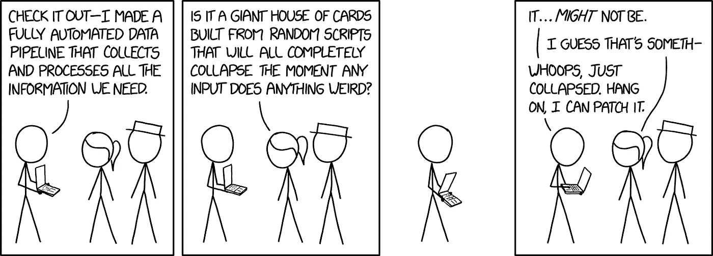

# 打倒技术债！面向数据科学家的干净 Python。

> 原文：<https://towardsdatascience.com/down-with-technical-debt-clean-python-for-data-scientists-aa7592eff7fc?source=collection_archive---------8----------------------->

ata 科学团队倾向于向两个相互竞争的方向发展。一方面是数据工程师，他们重视高度可靠、健壮的代码，这些代码承担着较低的技术债务。另一方面，有一些数据科学家，他们重视在概念验证等环境中快速建立想法和算法的原型。

虽然更成熟的数据科学职能部门在双方之间享有富有成效的工作伙伴关系，拥有复杂的 [CI](https://en.wikipedia.org/wiki/Continuous_integration) / [CD](https://en.wikipedia.org/wiki/Continuous_delivery) 管道，并有明确的职责分工，但早期团队往往由大量缺乏经验的数据科学家主导。结果，代码质量受损，技术债务以[粘合代码](https://en.wikipedia.org/wiki/Glue_code)、管道丛林、死的实验代码路径和配置债务[【1】](https://papers.nips.cc/paper/5656-hidden-technical-debt-in-machine-learning-systems.pdf)的形式成倍积累。



Can you imagine a life without [xkcd](https://xkcd.com/2054/)?

最近，我写了一篇关于*为什么*数据科学家的代码往往[平庸](/why-data-scientists-still-cant-code-b21d6434e238)的头脑风暴，在这篇文章中，我希望揭示一些方法，让更多初出茅庐的数据科学家能够编写更干净的 Python 代码，更好地构建小规模项目，同时减少你无意中给自己和团队带来的技术债务。

下面的内容既不详尽，也不深入，只是一系列浅显的介绍，告诉你如何以一种更有思想的方式建立数据科学项目。有些点会很明显，有些会不太明显。

这里有一个快速的概述:(1)风格指南，(2)文档，(3)类型检查，(4)项目文件夹结构，(5)代码版本控制，(6)模型版本控制，(7)环境，(8) Jupyter 笔记本，(9)单元测试，(10)日志记录。

## Python 风格指南— [PEP 8](https://www.python.org/dev/peps/pep-0008/) 和林挺

可读性很重要。以至于有一个完整的 PEP 致力于此:PEP8，它为编写干净的 Python 代码提供了编码约定。

符合 PEP8 标准被认为是构成*python 式*代码的最低要求。这表明你已经意识到了 Python 开发者应该具备的最基本的习惯，这表明你能够更容易地与其他开发者合作，最重要的是，这使得你的代码更具可读性，[愚蠢地保持一致](https://www.python.org/dev/peps/pep-0008/#a-foolish-consistency-is-the-hobgoblin-of-little-minds)，并且更容易被*你*消化。

如果我在这里复制并重新格式化 PEP8 风格指南，那将是浪费大家的时间。所以，你可以随意浏览[pep8.org](https://pep8.org/)，看看例子，体会一下在微观层面上写干净代码意味着什么(相对于在宏观或系统层面上写干净代码)。

PEP8 中给出的例子包括为命名约定、缩进、导入和行长度设置标准。

顺便说一下，PEP8 是你应该使用成熟的 ide，如 [PyCharm](https://www.jetbrains.com/pycharm/) (我认为是更好的 Python IDE)来编写代码，而不是像 Sublime 这样的简单文本编辑器的众多原因之一。Python 的重量级 ide 通常符合 PEP8 风格指南，当您违反其原则时会发出警告，并提供代码库的自动重新格式化。

有四个[，尽管实际上还有很多其他的](https://github.com/vintasoftware/python-linters-and-code-analysis)——命令行工具对你的源代码进行静态分析，以保持它的整洁和一致:

1.  [](https://pypi.org/project/pylint/)**——最受欢迎的棉绒。检查源代码，并作为一个错误和质量检查。它比 PEP8 有更多的验证检查和选项。众所周知，这是一个有点过了头的沉重的输出按照默认设置，但是。**
2.  **[**黑色**](https://pypi.org/project/black/)—自动重新格式化您的 Python 代码。Black 就地重新格式化整个文件，并将字符串格式化为双引号。**
3.  **[**PyCodeStyle**](https://pypi.org/project/pycodestyle/)—官方 linter 工具，根据 PEP8 python 的样式约定检查 python 代码。**
4.  **[**flake 8**](https://pypi.org/project/flake8/)—pyflakes、pycodestyle 和 mccabe 周围的包装器，它验证 pep8、py flakes 和循环复杂度的包装器。**

***边注 1。linter 不会告诉你你是否已经很好的命名了你的变量。这个被新手开发者嘲笑的技能是一个值得掌握的技能。***

***旁注 2。在安装这些软件包之前，最好是在虚拟环境中。稍后会详细介绍。***

## **记录您的项目— [PEP257](https://www.python.org/dev/peps/pep-0257/) 和 [Sphynx](http://www.sphinx-doc.org/en/master/)**

**当 **PEP8** 概述了*Python 的编码约定*时， **PEP257** 标准化了 *docstrings* 的高层结构、语义和约定:它们应该包含什么，以及如何以一种清晰的方式表述。和 PEP8 一样，这些不是硬性规定，但它们是你应该明智地遵循的指导方针。**

> **如果你违反了这些惯例，最糟糕的是你会得到一些白眼。**

**那么，什么是 docstring 呢？docstring 是作为模块、函数、类或方法定义中的第一条语句出现的字符串文字。这样的 docstring 成为该对象的 __doc__ special 属性。与 PEP8 一样，我不会复制并重新格式化整个 PEP，您应该在自己的时间浏览它，但这里有两个函数的 docstrings 示例。**

1.  **示例*单行* docstring for a 函数 *add* :**

```
def add(a, b):
    """Sum two numbers."""
    return a + b
```

**2.示例*函数*复合体*的多行* docstring:**

```
def complex(real=0.0, imag=0.0):
    """Form a complex number.

    Keyword arguments:
    real -- the real part (default 0.0)
    imag -- the imaginary part (default 0.0)
    """
    if imag == 0.0 and real == 0.0:
        return complex_zero
    ...
```

****Sphynx****

**在所有格式良好的文档字符串都准备好之后，接下来您需要将它们转换成漂亮的项目文档。事实上的 Python 文档生成器被称为 Sphynx，它可以生成 html、pdf、unix 手册页等输出。**

**[这里有](https://pythonhosted.org/an_example_pypi_project/sphinx.html)一个关于 Sphynx 入门的好教程。简而言之，在某个目录(通常是您的 docs 目录)中初始化 Sphynx 并设置其配置之后，您将处理您的 reStructuredText (*。rst)文件，在调用*生成*后，将被转换成您喜欢的输出文档类型。**

**有趣的是，您可以直接从 docstrings 创建对 Python 程序其他部分的[引用](https://www.sphinx-doc.org/en/master/usage/restructuredtext/domains.html#cross-referencing-syntax)，这些引用在输出文档中显示为链接。**

**为了说明 Sphynx 文档生成器的典型输出，这里的是一个包含 Sphynx 生成的文档的 Python 项目的不完整但膨胀的列表。例子包括 [matplotlib](https://matplotlib.org/) 、 [networkX](https://networkx.github.io/) 、 [Flask](https://flask.palletsprojects.com/en/1.1.x/) 和 [pandas](https://pandas.pydata.org/pandas-docs/stable/) 。**

## **类型检查— [PEP484](https://www.python.org/dev/peps/pep-0484/) 、 [PEP526](https://www.python.org/dev/peps/pep-0526/) 和 [mypy](http://mypy-lang.org/)**

**因为 Python 是一种动态类型语言，所以默认情况下没有静态类型检查。这是好的，因为它提供了灵活性和快节奏的开发，但这是坏的，因为您不会在运行系统之前(在编译时)捕捉简单的错误，而是在运行时捕捉它们。通常，像 Python 这样的动态类型语言比静态类型语言需要更多的单元测试。这是乏味的。在 Scala、Java 或 C#等语言中，类型声明出现在代码中，编译器检查变量是否通过类型合法传递。**

**最终，静态类型充当了一个安全网，在某些情况下使用它是明智的。好消息是 Python 实际上提供了一种叫做*类型提示的东西。***

**下面是一个**函数注释**类型提示的例子。这意味着`name`应该是类型`str`，并且该函数也应该返回一个`str`。**

```
def greeting(name: str) -> str:
    return 'Hello ' + name
```

**下面是一个**变量注释**类型提示的例子。这意味着变量`i`应该是一个整数。请注意，以下语法适用于 Python 3.6 及更高版本。**

```
i: int = 5
```

**…但坏消息是 Python 解释器忽略了类型提示，并且没有运行时效果(PEP 目前正在进行中)。**

**但是，如果类型提示没有运行时效果，为什么还要麻烦它呢？两个原因。首先，它让你的代码更清楚地知道它要做什么以及它是如何流动的。其次，因为你*可以*在 Python 中使用静态类型检查器，默认情况下它不会运行。主要的是 [mypy](http://mypy-lang.org/) 。**

**附注 1:由于类型提示的可选性，你可以自由地将它们放在代码中的任何地方，某些地方，或者什么地方都不放。只是尽量保持他们的位置一致。**

***边注 2:如前所述，PyCharm 对于执行 PEP8 标准非常有用。但是它在类型提示的情况下也很有用。它会自动检查您的类型提示，并在您违反预期时告诉您。默认情况下，在 PyCharm 中它们被设置为警告，但是您也可以将它们设置为错误。***

## **项目文件夹结构— [cookiecutter](https://github.com/drivendata/cookiecutter-data-science)**

> **就像凌乱的桌子是混乱思想的标志一样，凌乱的文件夹结构也是如此。**

**许多项目从一开始就受益于一个考虑周全的目录结构。不幸的是，启动项目的一个常见方法是创建一个基础项目目录，并将所有内容直接放在该目录下——从数据到笔记本到生成的模型再到输出——而没有考虑到当您的简单游乐场项目变成越来越复杂的参数化管道时出现的不良影响。**

**最终，你会以某种形式的技术债务结束，这些债务必须在以后以时间和努力的形式偿还。而真正的悲剧呢？所有这些都可以提前避免，只要从一开始就获得正确构建项目的远见。**

**我们之所以纠结于此，部分原因是因为创建项目文件夹结构是*乏味的*。我们想一头扎进探索数据和建立机器学习模型。但是相对较小的努力投入可以节省大量的精力。**

**更整洁的文件夹结构将鼓励最佳实践，简化关注点的分离，并使学习(或重新学习)旧代码更加愉快。**

**幸运的是——或者说是开源开发者的辛勤工作——已经有了一个现成的解决方案来创建我们想要的文件夹结构: [cookiecutter](https://github.com/drivendata/cookiecutter-data-science) 。**

**创建许多数据科学项目通用的干净的文件夹结构只需一个命令。观看下面的视频，了解如何设置 cookiecutter 项目结构。**

**[](https://asciinema.org/a/244658) [## 烹饪-数据-科学

### 由 ericmjalbert 录制

asciinema.org](https://asciinema.org/a/244658) 

请注意，cookiecutter 非常强大，实际上不仅仅是生成干净的项目文件夹结构。要了解更多信息，请查看精彩的 cookiecutter [文档](https://drivendata.github.io/cookiecutter-data-science/)，这是一个数据科学项目理念。** 

## **代码版本控制— [git](https://en.wikipedia.org/wiki/Git)**

**这一点我就不赘述了，因为这应该是一个既定的事实。软件开发的现代世界已经远离了 2000 年前黑暗的西部。每个人和他的狗都应该为他们的项目使用某种版本控制。简单的协作、高效的版本控制、回卷和代码备份。说够了。**

**使用 git 只是第一步。用好它*和*完全是另一回事。**

****提交代码**:“尽早提交，经常提交”是明智的建议。避免提交大块的代码，而要提交小的、孤立的功能。提交时，编写描述性的提交消息，准确记录您的更改。**

****多用户最佳实践**:这在很大程度上是由上下文驱动的。我与我的团队合作的方式是有一个*主*分支，它是**从不**直接推进的，一个*开发*分支，其中代码的运行版本正在工作，但从不直接工作，然后*特性分支*，其中团队的个别成员将编码特性，这些特性后来被合并到开发分支。当开发分支准备好发布时，它被合并到主分支中。这种封装的工作方式使得多个开发人员在不干扰主代码库的情况下处理特定功能变得简单，从而减少了合并冲突的可能性。欲了解更多信息，请查看此[链接](https://www.atlassian.com/git/tutorials/comparing-workflows/feature-branch-workflow)。**

## **模型和数据版本控制— [dvc](https://dvc.org/)**

**模型和数据与代码不一样，它们永远不应该被推入代码库中。他们有独特的生命周期管理要求，有不同的运营限制。然而，适用于代码版本化的相同原理应该适用于数据和模型版本化。**

**构建在 git 之上的一个很棒的开源工具 dvc 可能就是您在这里寻找的。它本质上是一个数据管道构建工具，具有简单的数据版本化选项，在一定程度上有助于解决数据科学中的再现性危机。它能够有效地将您的数据和模型推送到您的服务器，无论是本地、AWS S3、GCS、Azure、SSH、HDFS 还是 HTTP。**

**dvc 围绕三个主要理念:**

1.  **大型文件的版本控制**
2.  **内置具有再现性的轻质管道**
3.  **git 之上的版本管理和实验管理**

***补充说明:对整个数据集进行版本控制的另一种方法是存储重新创建这些数据集所需的元数据，并引用在引用元数据后面创建的模型。***

## **从环境开始构建— [虚拟化](https://virtualenv.pypa.io/en/latest/)**

**如果您的常规实践手册中没有划分您的环境，您可能已经花了一两个下午来平衡系统范围的库版本。也许你正在做一个项目，然后转移到另一个项目，更新 numpy 和*噗！*，你的第一个项目有一个依赖中断。**

**想象一下另一种情况，您的项目被另一个团队成员从 git 中取出，他使用了项目中某个库的不同版本。他们编写一些代码，这些代码依赖于一个你的版本没有的新函数，然后推回到主分支(给聪明人一句话:永远不要*直接推送到主分支)，这是你拉的。你的密码被破解了。太好了。***

**通过使用*虚拟环境*来避免这种情况。对于简单的 Python 项目，使用 virtualenv。如果你有复杂的环境需求，使用 docker 之类的东西。**

**下面是一个简单的 [virtualenv](https://virtualenv.pypa.io/en/latest/) 工作流程:**

1.  **创建新项目时运行`mkvirtualenv`**
2.  **`pip install`您的分析所需的软件包**
3.  **运行`pip freeze > requirements.txt`来锁定用于重新创建分析的确切包版本**
4.  **如果您发现您需要安装另一个包，再次运行`pip freeze > requirements.txt`并将更改提交给版本控制。**

## **关于笔记本的说明— [jupytext](https://github.com/mwouts/jupytext)**

**Jupyter 笔记本在数据科学领域非常普遍。它们是围绕[识字编程](https://en.wikipedia.org/wiki/Literate_programming)范式构建的，并作为强大的媒介，能够将快速原型开发和易于开发与生成流畅演示的能力相结合，中间代码段与输出和解释性文本交错。漂亮的东西。**

**但是，尽管笔记本电脑给人们带来了很多好处，它们也带来了很多痛苦。你的电脑里有多少`Untitled7.ipynb`文件？也许笔记本电脑最大的挫折是它们与版本控制的不协调。**

**这样做的原因是因为他们是一类被称为[的编辑器，所见即所得](https://en.wikipedia.org/wiki/WYSIWYG)，编辑软件允许用户查看与最终结果非常相似的内容。这意味着文档抽象出了元数据，对于笔记本来说，它通过将代码封装在大型 JSON 数据结构中来嵌入代码，二进制数据(如图像)保存为 base-64 编码的 blobs。**

**不过，这里需要澄清一下。Git *可以*处理笔记本，因为你可以把它们推送到你的仓库。Git *不能*在比较不同版本笔记本的情况下很好地处理它们，并且也很难为你提供对写在笔记本上的代码的可靠分析。**

**如果你在你的公司内部或者仅仅是在公共的 GitHub 上搜索签入的笔记本，你很可能会发现数据库凭证、敏感数据、“不要运行这个单元”代码块，以及一大堆其他的不良行为。为了避免这种痛苦，你可以在每次准备签入笔记本时清除输出。但这是手动的，意味着您每次都必须重新运行代码来生成输出，如果有多个用户拉和推同一个笔记本，即使被清除的笔记本元数据也会改变。**

**通过工具，有选择。其中最受欢迎的是 [jupytext](https://github.com/mwouts/jupytext) 。[这里](https://medium.com/capital-fund-management/automated-reports-with-jupyter-notebooks-using-jupytext-and-papermill-619e60c37330)是作者关于如何使用它的一个很棒的教程。你所要做的就是安装 jupytext，它将提供一个整洁的笔记本下拉菜单，用于下载你的代码的降价版本，并省略输出，然后显式忽略`.gitignore`中的所有`.ipynb`文件。**

## **单元测试——单元测试**

**对代码进行单元测试是确保隔离的代码块按预期工作的有效方法。它允许自动化您的测试过程，及早发现错误，使过程更加敏捷，并最终帮助您设计更好的系统。python 中最常用的测试框架是“包含电池”，这是一个名为`[unittest](https://docs.python.org/3/library/unittest.html#module-unittest)`的内置标准模块，它提供了一套丰富的工具来构建和运行测试。另一个测试工具是`[pytest](https://docs.pytest.org/en/latest)`。**

**有很多关于如何进行单元测试的教程，但是这里有一些关键的提示。正如异常处理应该最小化你试图捕捉的潜在错误的功能数量，每个单元测试应该集中在一个*微小的*功能上，以证明它在工作。每个单元测试应该是完全独立的，并且能够单独运行。您的测试套件应该在开发新功能之前和之后运行；事实上，实现一个钩子来自动运行所有测试是一个好主意，在将代码推送到共享的 repo 之前，这种类型的测试通常是一些 [CI](https://en.wikipedia.org/wiki/Continuous_integration) / [CD](https://en.wikipedia.org/wiki/Continuous_delivery) 管道的一部分，许多开源示例服务中的一个叫做 [travis](https://travis-ci.com/) 。试着让你的测试*更快*！对每个测试函数使用长的描述性名称。测试应该位于你的源代码的一个单独的目录中，更多信息请参见文件夹结构部分。**

**[这里是](https://realpython.com/python-testing/)一个教程，[这里是](https://jrsmith3.github.io/python-testing-style-guidelines.html)一个测试风格指南。**

## **测井— [PEP282](https://www.python.org/dev/peps/pep-0282/) ，**

**日志记录是任何超越 POC 领域的系统的关键部分。这是一种跟踪程序执行过程中发生的事情，并将这些信息保存到磁盘上的方法。它对调试有很大的帮助，在石头上留下了痕迹，可以帮助你很好地识别你的 bug。**

**它通常用于两个目的之一。有**诊断日志**，它记录与应用程序操作相关的事件。以及**审计日志**，其记录用于 MI 报告的基本运行时分析。并且每个日志信息有几种类型:**调试**、**信息**、**警告**、**错误**和**严重**。**

**[日志](https://docs.python.org/3/library/logging.html)是内置的、用于日志的标准库 Python 模块。**

## **包裹**

**如果你坚持到最后，恭喜你。你应该得到由衷的赞扬，希望以上信息至少有一些是有用的。现在出去编码吧。**