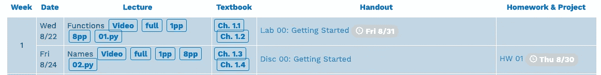

# 使用简单的 Python 爬虫程序下载课程材料

> 原文：<https://towardsdatascience.com/download-course-materials-with-a-simple-python-crawler-94e06d5f84b5?source=collection_archive---------18----------------------->

## 一个自动下载课程资料的爬虫示例


Photo by [Darwin Vegher](https://unsplash.com/@darwiiiin?utm_source=unsplash&utm_medium=referral&utm_content=creditCopyText) on [Unsplash](https://unsplash.com/s/photos/many-book?utm_source=unsplash&utm_medium=referral&utm_content=creditCopyText)

最近我在修加州大学伯克利分校著名的 [CS 61A](http://inst.eecs.berkeley.edu/~cs61a/fa18/) 。我想下载幻灯片并全部打印出来。但是总共有 36 张幻灯片。作为一个**懒**的程序员，我不会浪费宝贵的时间去点击 36 次下载按钮。所以我写了一个简单的脚本来自动下载所有的幻灯片。

在这篇文章中，我将简单介绍你需要知道什么来构建一个简单的下载器。

# 找到下载按钮的模式

首先，打开[下载页面](http://inst.eecs.berkeley.edu/~cs61a/fa18/)。下载按钮显示为“8pp”(见下图)，这意味着一页包含 8 张幻灯片。



8pp is the download button

好了，接下来我们在 Chrome 中打开 [DevTools](https://developers.google.com/web/tools/chrome-devtools/open) 。您也可以在其他浏览器中找到 DevTools。单击 DevTools 左上角的箭头图标，然后将光标移动到“8pp”按钮，这将突出显示 DevTools 中的 HTML 元素。


我们可以得到下面的 HTML 行。下载链接为“assets/slides/01-Functions _ 8pp . pdf”和“assets/slides/02-Names_8pp.pdf”。这些链接在`a`标签的`href`属性中。

```
<li><a href="assets/slides/01-Functions_full.pdf" class="label label-outline">full</a></li>
<li><a href="assets/slides/01-Functions_1pp.pdf" class="label label-outline">1pp</a></li>
<li><a href="assets/slides/01-Functions_8pp.pdf" class="label label-outline">**8pp**</a></li>
<li><a href="assets/slides/01.py" class="label label-outline">01.py</a></li>
...
<li><a href="assets/slides/02-Names_full.pdf" class="label label-outline">full</a></li>
<li><a href="assets/slides/02-Names_1pp.pdf" class="label label-outline">1pp</a></li>
<li><a href="assets/slides/02-Names_8pp.pdf" class="label label-outline">**8pp**</a></li>
<li><a href="assets/slides/02.py" class="label label-outline">02.py</a></li>
```

我们希望自动提取所有链接。所以我们必须找到这些`a`标签行的一些模式。一个非常明确的模式是，它们都包含 8pp 文本(上面代码中的粗体部分)。我们可以先找到包含 8pp 文本的`a`标签行，然后通过`href`属性提取链接。

# 找到包含“8pp”的`a`标签行

我们使用 [XPath](https://www.w3schools.com/xml/xpath_intro.asp) 来定位`a`标记行。

```
slide_links = html.xpath('//li/a[text()="8pp"]/@href')
```

我们可以认为`html`是下载页面的全部 HTML 源代码。然后我们用 XPath 提取链接。`//`是整页的开始。`li/a`表示我们在`li`标签下找到所有`a`标签行。`[text()="8pp"]`是一个过滤器，用于获取那些只包含“8pp”文本的`a`标签行。

# **完成下载链接**

我们得到的`slide_links`如下图所示

```
['assets/slides/36-Natural_Language_8pp.pdf', 
 'assets/slides/37-Final_Examples_8pp.pdf', 
 'assets/slides/36-Natural_Language_8pp.pdf', 
 ...]
```

我们必须添加一个前缀来完成下载链接。前缀是下面的`url`。

```
url = 'http://inst.eecs.berkeley.edu/~cs61a/fa18/'
```

# 总结一下

在运行脚本之前，您需要安装一些 Python 包。

```
pip install requests
pip install lxml
pip install wget
```

`requests`是一个进行 HTTP 请求的工具。`lxml`是一个使用 XPath 的工具。而`wget`是给定网址下载素材文件的工具。

别忘了创建一个“幻灯片”文件夹来存放下载的文件。

在你做好准备之后，你可以运行下面的脚本来下载所有的材料。

> ***查看我的其他帖子*** [***中等***](https://medium.com/@bramblexu) ***同*** [***一分类查看***](https://bramblexu.com/posts/eb7bd472/) ***！
> GitHub:***[***bramble Xu***](https://github.com/BrambleXu) ***LinkedIn:***[***徐亮***](https://www.linkedin.com/in/xu-liang-99356891/) ***博客:***[***bramble Xu***](https://bramblexu.com)