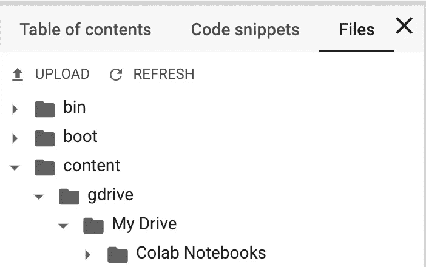

# 通过 Google Colab 将数据集下载到 Google Drive

> 原文：<https://towardsdatascience.com/downloading-datasets-into-google-drive-via-google-colab-bcb1b30b0166?source=collection_archive---------1----------------------->

## 在 Google Colab 中为数据科学项目使用 Google Drive 的分步指南

*更新:(即将推出)TensorFlow 2.0 将为 Keras 推出新的分发策略，以便您可以使用相同的代码在 TPUs* *上分发您的模型* ***。* ***Google Colab 发布后可以直接访问 Google Cloud TPUs*** *！观看*[*TF Dev Summit’19*](https://youtu.be/k5c-vg4rjBw?t=1263)*了解更多信息。***


Google Colab and Google Drive back you up in deep learning — Photo Credit: [Elizabeth Tsung](https://unsplash.com/@elizabethtsung?utm_source=medium&utm_medium=referral)

如果你像我一样使用旧的 MacBook Pro(2013 年末，120GB 高清)，有限的存储将是我在数据科学项目中最大的障碍。对于那些也在从事具有大型数据集的数据科学项目的人来说，我确信保存数据集并在云上训练模型肯定会让你放心。

在本教程中，我将与您分享我在以下方面的经验:

1.  将 Google Drive 安装到 Google Colab
2.  通过 Google Colab 将数据集直接下载到 Google Drive

*   使用 Kaggle API
*   从竞赛网站，要求下载时需要用户名和密码

额外收获:一键启用 Google Colab 中的免费 GPU 支持，使用 Tensorflow 进行训练。

# 将谷歌硬盘安装到谷歌实验室

## 第一步

首先，进入你的谷歌实验室，然后输入以下内容:

```
from google.colab import drive
drive.mount('/content/gdrive')
```

该单元将返回以下内容，您需要转到该链接来检索授权码。那你就可以走了！


## 第二步

如果您能够访问 google drive，您的 Google Drive 文件应该都在以下位置:

**/content/g Drive/My Drive/**

而您当前的目录将是 **/content/**



Click on the arrow on the left and you will find the data structure.

为了方便使用，只需保存下面的代码片段并将其粘贴到 Google Colab 中，您就可以轻松地将您的 Google Drive 安装到笔记本上。

# 通过 Google Colab 将数据集直接下载到 Google Drive

在这一节中，我将与您分享我从 Kaggle 和其他竞争对手那里下载数据集的经验。

通过 Kaggle API 下载 Kaggle 数据集

## 步骤 1-从您的帐户获取 API 密钥

访问[www.kaggle.com](http://www.kaggle.com)⇨登录⇨我的帐户⇨创建新的 API 令牌

将自动下载“kaggle.json”文件。

## **步骤 2 —上传 kaggle.json 文件**

使用 Google Colab 中的这些代码片段完成任务:

```
from google.colab import files
files.upload()  #this will prompt you to upload the kaggle.json
```

下面将创建必要的文件夹路径。

```
!pip install -q kaggle
!mkdir -p ~/.kaggle
!cp kaggle.json ~/.kaggle/
!ls ~/.kaggle
!chmod 600 /root/.kaggle/kaggle.json  # set permission
```

## 步骤 3-下载所需的数据集

只需下载所需的数据集，语法如下:

> ！kaggle 竞赛下载-c '竞赛名称'-p "目标 _ 实验室 _ 目录"

```
!kaggle competitions download -c histopathologic-cancer-detection -p /content/gdrive/My\ Drive/kaggle/cancer
```

额外收获:请参见下面搜索 Kaggle 数据集的 git 要点

## 步骤 4 —解压缩

对于有多个 zip 文件的数据集，我倾向于将目录切换到指定的文件夹，然后一个一个地解压缩。

> ！解压缩-q 文件。zip]-d[出口]
> 
> **-q** 禁止打印正在解压的文件名
> **-d【解压目录】**可选解压文件的目录

```
import os
os.chdir('gdrive/My Drive/kaggle/cancer')  #change dir
!mkdir train  #create a directory named train/
!mkdir test  #create a directory named test/
!unzip -q train.zip -d train/  #unzip data in train/
!unzip -q test.zip -d test/  #unzip data in test/
!unzip sample_submission.csv.zip
!unzip train_labels.csv.zip
```

点击[这里](https://github.com/Kaggle/kaggle-api)阅读更多 Kaggle API 文档。

## 从竞赛网站下载数据集，请求下载时需要用户名和密码

对于像 [ICIAR2018](https://iciar2018-challenge.grand-challenge.org/) 这样的比赛，你需要在下载数据集时提供用户名和密码。

要在 Google Colab 中执行此操作，首先您可以将当前目录更改为您希望保存数据集的文件夹。然后，使用 **wget** 而不是使用 **curl** 命令。

```
!wget --user=your_username --password=your_password http://cdn1.i3s.up.pt/digitalpathology/ICIAR2018_BACH_Challenge.zip
```

下载后，您可以使用上面相同的方法解压缩文件。

# 额外收获:一键启用 Google Colab 中的免费 GPU，用 Tensorflow 进行训练

在您将 Google Drive 安装到 Google Colab 并下载了所需的数据集之后，让我们在您的 Colab 笔记本中启用 GPU 并训练您的模型。

从任务栏:运行时⇨更改运行时类型

硬件加速器:无⇨ GPU


希望你觉得这个教程有用，祝你云计算愉快！

# 信用

感谢 [Matt Gleeson](https://medium.com/@matmogleeson) 、 [Finlay Macrae](https://medium.com/@finlay.macrae) 的建议，让内容变得更好。