# 普通深度 Q 网络

> 原文：<https://towardsdatascience.com/dqn-part-1-vanilla-deep-q-networks-6eb4a00febfb?source=collection_archive---------3----------------------->

## [DQN 家族](https://towardsdatascience.com/tagged/Dqn-family)

## 深度 Q 学习解释

# 介绍

该职位的结构如下:

我们将简要介绍一般的策略迭代和时间差分方法。然后，我们将 Q 学习理解为一个一般的策略迭代。最后，我们将理解并实现 Deepmind 的论文“[用深度强化学习玩雅达利(Mnih et al. 2013)](https://arxiv.org/abs/1312.5602) 中提出的 DQN。

## 通用策略迭代(GPI)

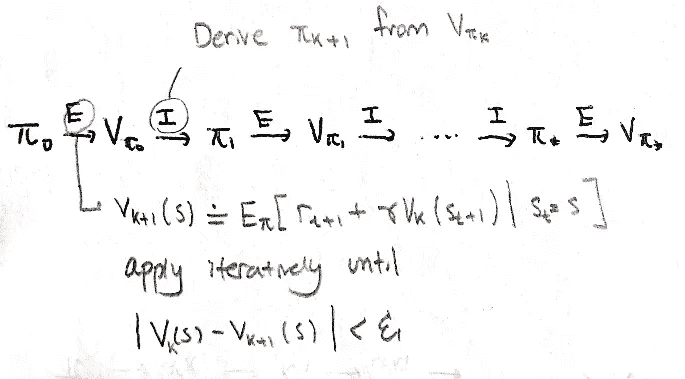

General policy iteration

我们把**一般策略迭代**称为策略评估和策略迭代的交替。我们从某个任意初始化的策略开始，评估该策略(表示为 **E** )，从评估中导出一个新策略(表示为 **I** )，并重复这个过程，直到我们达到一个最佳策略。通过这个迭代过程，我们得到{V_π}和{π}的单调递增(*改进*)序列。

我们如何保证这一点？我们将看看*政策改进定理*:

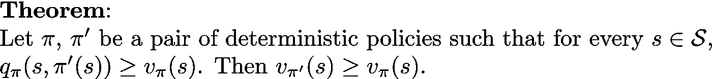

该定理指出，遵循政策π'的价值比遵循政策π'的价值更大。即政策π'优于π。我们现在将证明政策改进定理。

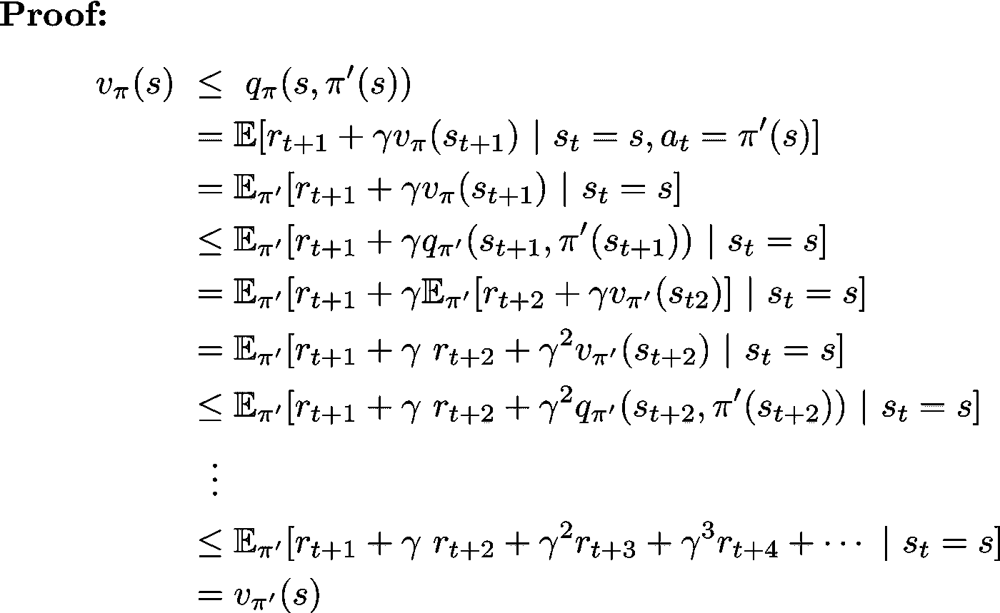

因此，通过政策评估和迭代的迭代相互作用，我们可以最终达到我们的最优政策和价值函数。

## 时间差分法

时间差分法是蒙特卡罗方法和动态规划方法的结合。回忆每种方法:

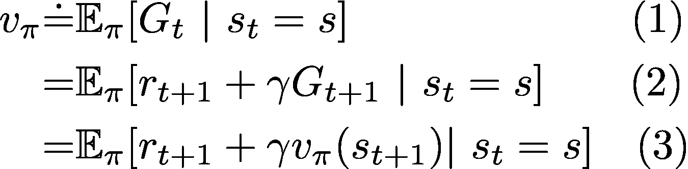

*   蒙特卡罗方法使用估计值(1)进行更新。因为我们不知道真实的期望值，所以我们从环境中采样 G_t。
*   动态编程(DP)方法使用(3)进行更新。我们说 DP 方法是 bootstrap，因为我们使用 v_pi(s_{t+1})的当前估计来执行更新。

在 TD 方法中，我们将蒙特卡罗的*采样*与动态规划的*自举*结合起来。我们对期望值进行采样，如(1)所示，并使用下一个状态值的当前估计值来更新原始状态的值，如(3)所示。TD 目标`\delta`可以有多种形式，但以下是最基本的形式:

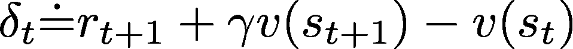

## q 学习和 GPI

在 Q 学习中，我们直接逼近我们的最优动作值函数。在 GPI 意义上，我们从 Q 函数中导出策略，并通过 TD 方法执行策略评估，以获得下一个 Q 函数。

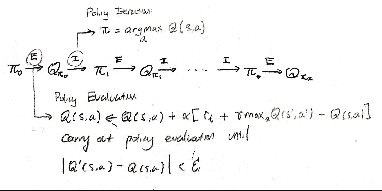

现在让我们的 Q 函数用θ参数化，在我们的例子中，就是神经网络。根据 GPI 公式，我们希望将当前 Q 值与目标 Q 值之间的差异降至最低。为此，我们希望获得两者之间的均方误差:

然后执行梯度下降以最小化两者之间的误差。

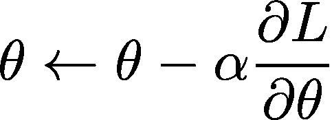

# 深度 Q 网络

发表在(Mnih 等人，2013 年)的 Deep Q learning 利用深度学习的进步从*高维度感官输入中学习策略。*具体来说，它使用卷积网络从 Atari 2600 游戏中学习原始像素，而不是低维特征向量。下图展示了 DQN 的建筑:

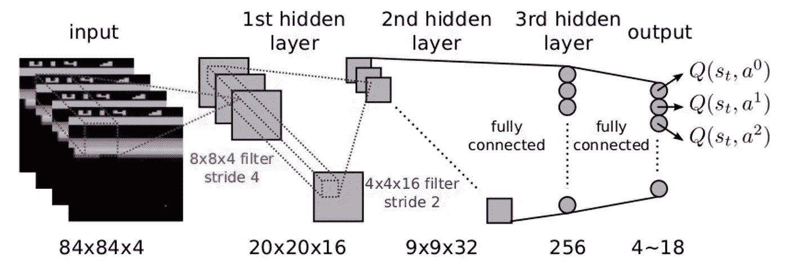

Source: [https://leonardoaraujosantos.gitbooks.io/artificial-inteligence/content/image_folder_7/DQNBreakoutBlocks.png](https://leonardoaraujosantos.gitbooks.io/artificial-inteligence/content/image_folder_7/DQNBreakoutBlocks.png)

为了使计算更加可行，原始的 4 帧游戏图像(RGB 像素)被缩小到 4 帧(84 x 84)图像，从而得到一个(84 x 84 x 4)张量。然后我们把它输入到一个卷积神经网络，它输出一个包含每个动作的 Q 值的向量。从那里，我们使用一个探索方案(通常是 epsilon-greedy ),并在具有最高 Q 值的动作和随机动作之间进行概率选择。

在更高的层面上，深度 Q 学习是这样工作的:

1.  使用当前策略在重放缓冲区中收集和存储样本
2.  从重放缓冲器中随机抽样批次的体验(称为**体验重放**)
3.  使用采样的经验来更新 Q 网络
4.  重复 1-3

我们将进一步了解步骤(2)和(3)，这将让我们直接进入实现阶段。

# 体验回放

为什么我们要随机抽样经验，而不是仅仅使用过去的连续经验？连续的经历彼此(在时间上)高度相关。在统计学习和优化任务中，我们希望我们的数据**独立分布**。也就是说，我们不希望我们提供的数据以任何方式相互关联。经验的随机抽样打破了这种行为的时间相关性，并将其分布/平均到许多以前的状态。通过这样做，我们避免了模型中的显著振荡或发散——相关数据可能产生的问题。

# 更新 Q 网络

为了更新 Q 网络，我们希望最小化目标 Q 值(根据贝尔曼方程)和当前 Q 输出之间的均方误差:

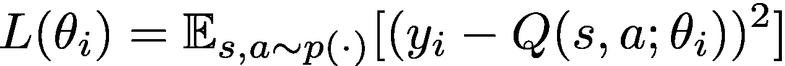

在哪里

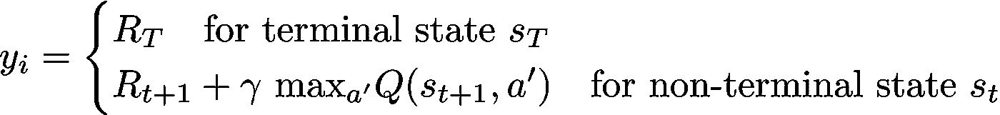

最理想的情况是，我们希望误差减少，这意味着我们当前政策的输出越来越接近真实的 Q 值。因此，利用如上定义的损失函数，我们根据以下等式对损失函数执行梯度步骤:

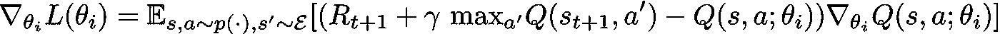

# 实施指南

我们将从构建配备有卷积神经网络的深度 Q 网络开始:

在`forward`函数中，我们输入像素图像，并通过我们的模型输出对应于每个动作的 Q 值向量。

然后，我们将构建我们的重放缓冲区，在那里我们可以存储体验—(状态、动作、奖励、下一个状态、bool(is_done))转换—以及用于学习的随机体验样本:

接下来，我们编写一个函数来计算每个梯度步长的值损失。这看起来像:

最后，我们将把它们都放在我们的 DQN 代理中:

香草 DQN 的实现到此结束。您可以在我的 GitHub 资源库中找到完整的可运行实现:

 [## cy oon 1729/深度 Q 网络

### Q-learning 家族(PyTorch)算法的模块化实现。实现包括:DQN，DDQN，决斗…

github.com](https://github.com/cyoon1729/deep-Q-networks) 

在本系列的后面部分，我们将探索 DQN 的许多变体，它们在许多方面改进了原来的版本。

感谢阅读！

# 参考资料:

*   [用深度强化学习玩雅达利(Mnih et al. 2013)](https://arxiv.org/abs/1312.5602)
*   强化学习:导论(萨顿和巴尔托)

# 下一篇文章:

[我的系列](https://towardsdatascience.com/tagged/Dqn-family)将从香草深度 Q 学习(这篇文章)开始，直到 Deepmind 的彩虹 DQN，当前的艺术状态。查看[我的下一篇文章](/double-deep-q-networks-905dd8325412)关于用双 Q 学习减少高估偏差！

1.  深度 Q 网络
2.  [双深 Q 网络](/double-deep-q-networks-905dd8325412)