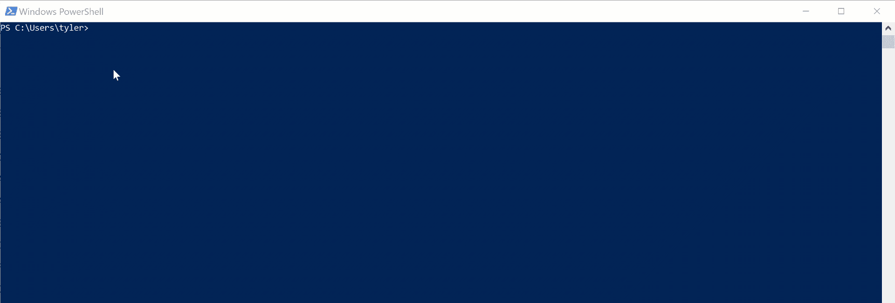
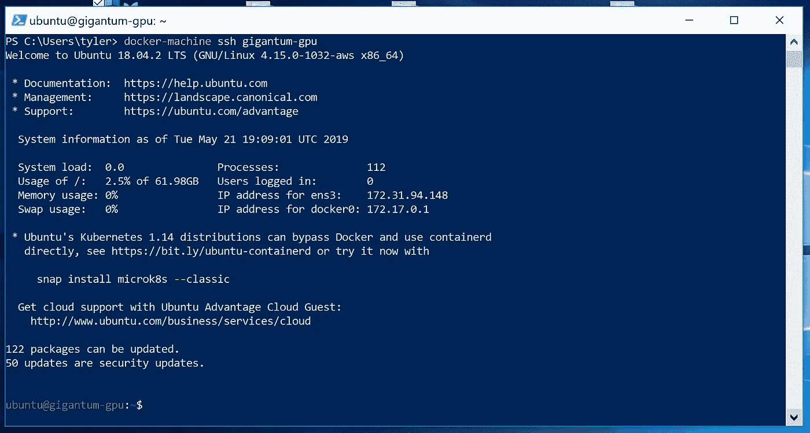
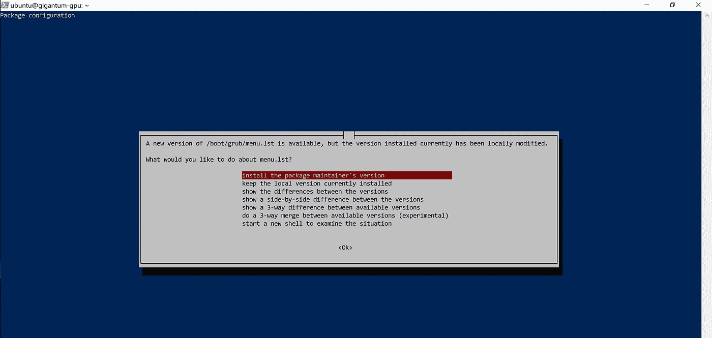

# 德卡里斯。—使用 Docker Machine、PyTorch 和 Gigantum 实现可移植和可再现的 GPU 工作流

> 原文：<https://towardsdatascience.com/dracarys-use-docker-machine-pytorch-gigantum-for-portable-reproducible-gpu-workflows-481ca2632bbb?source=collection_archive---------15----------------------->


[CC image By I, Luc Viatour, CC BY-SA 3.0](https://commons.wikimedia.org/w/index.php?curid=4632541)

# TL；速度三角形定位法(dead reckoning)

1.  手动创建可移植和可再现的 GPU 工作流是脆弱的、技能密集型的和费力的，即使使用容器也是如此。
2.  幸运的是，你可以使用 Docker Machine、PyTorch & Gigantum 或多或少地实现自动化。
3.  我们用这三样东西来展示一个强大的系统，以创建在笔记本电脑和云、CPU 和 GPU 之间无缝移动的工作流。

## **假设** —你应该有:

1.  使用 Bash(在 Linux/macOS 上)或 PowerShell(在 Windows 上)的经验。
2.  Docker CE 安装在本地。
3.  AWS 凭证& EC2 GPU 实例的足够权限。

如果达不到这些要求，也不要绝望。你可以通过一些背景阅读和一些剪切粘贴来快速阅读这篇文章。

***剧透预警***——完成这篇帖子所用的时间将远远少于《GoT》第五集丹妮莉丝·坦格利安烧毁君临所需的时间。

# 介绍

用于并行处理的 GPU 为一些计算提供了令人难以置信的速度提升——最著名的是深度学习。好的图形处理器可以在 CPU 上完成复杂的计算。

不幸的是，安装和配置必要的软件环境需要技能和时间。对于大多数用户来说，访问 GPU 的唯一方式是通过不断增长的平台之一，这些平台提供了进入托管云环境的浏览器界面。这些平台的基本问题是，它们要么是免费的&在计算上毫无价值，要么是功能性的，但似乎是为企业预算量身定制的。

获得更广泛访问的一个途径是通过最大限度地减少设置所需的技能和时间，让人们能够自己做事情。另一种方法是使 GPU 工作流*可移植*，即自包含&易于跨各种资源运行。例如，促进 CPU & GPU 机器之间的移动使得能够在更便宜的 CPU 上测试&调试，从而节省昂贵的 GPU 用于实际计算。在这篇文章中，我们将做这两件事。

基本上，当谈到轻松复制和便携式 GPU 笔记本电脑时，我们会给你自己的龙。

**我们使用的工具**

[*Docker Machine*](https://docs.docker.com/machine/get-started-cloud/)是一个简单的 Apache 许可命令行工具，用于供应、配置&管理远程虚拟环境。

[*PyTorch*](https://pytorch.org/) 是一个 BSD 授权的深度学习框架，可以轻松在 CPU 和 GPU 之间切换进行计算。

[*Gigantum*](https://gigantum.com) 是一个[麻省理工学院许可的](https://github.com/gigantum/gigantum-client)本地应用程序，它与云服务配对，以创建任何人都可以轻松使用的可复制工作流*。*

我们的存在性证明有三个部分:

1.  用 Docker Machine 创建 EC2 GPU 实例的简单过程:
2.  从 Bash 提示符配置实例；
3.  只需点击几下鼠标，即可导入和运行 PyTorch 迁移学习笔记本。

**在我们开始**之前——为了使这篇文章对不同的用户都是可靠的，我们在过程的确定性方面犯了错误&工具的简单性。

# 第 1 部分—创建一个 EC2 p2.xlarge 实例

我们开始吧。

第 1 步到第 3 步是一次性步骤，但是第 4 步中的 Docker Machine 命令是您随时可以用来创建新遥控器的命令。

如果您以前没有使用过，Docker Machine 是一个简单的工具，可以在远程主机上轻松安装、管理和连接 Docker。方便的是，它可以自动发送和简单的端口转发。可以了解一下[这里](https://docs.docker.com/machine/overview/) & [这里](https://dev.to/zac_siegel/using-docker-machine-to-provision-a-remote-docker-host-1267)。

**第 1 步—** *验证 Docker CE &是否正在运行*。

在终端(Bash 或 PowerShell)中，运行:

```
docker version
```

您必须在本地运行 Docker CE。如果你没有一个相当[最近的版本](https://docs.docker.com/engine/release-notes/)，你可能想要更新它。*注意:你不能使用 Docker 工具箱*。

**第二步(仅限 Linux 用户)——***没有 Docker 机器就安装*。

Docker for Linux 的发行版通常不包含 Docker Machine(但 macOS & Windows 包含)。要解决这个问题，请在 Bash 终端中运行以下命令:

```
base=https://github.com/docker/machine/releases/download/v0.16.0 curl -L $base/docker-machine-$(uname -s)-$(uname -m) > /tmp/docker-machinesudo install /tmp/docker-machine /usr/local/bin/docker-machine
```

> 然后，注销&登录——确保 docker-machine 在您的路径上。

**步骤 3 —** *为 CLI* 配置 AWS API 凭证。

如果您没有凭证，请访问[控制台](https://console.aws.amazon.com/iam/home)进行设置。您需要:

1.  您的访问密钥 ID， *youraccesskey。*
2.  您的秘密访问密钥: *yoursecretkey* 。

确保将您的 AWS CLI 配置为自动调用凭证供[命令行](https://docs.aws.amazon.com/cli/latest/userguide/cli-chap-configure.html)使用，否则您需要将它们添加到下面的 Docker 机器命令中。

在终端中，运行:

```
aws configure
AWS Access Key ID [None]: ***youraccesskey*** 
AWS Secret Access Key [None]: ***yoursecretkey*** 
Default region name [None]: 
Default output format [None]: 
```

**步骤 4** — *使用 Docker Machine* 创建实例。

现在可以使用一个 Docker Machine 命令(带有多个参数)来设置 p2.xlarge 实例。

*(在 Linux 或 Mac 上)*在 Bash 终端中输入以下命令

```
docker-machine create --driver amazonec2\
--amazonec2-amiami-0a313d6098716f372 \
--amazonec2-instance-type p2.xlarge \
--amazonec2-region us-east-1 \
--amazonec2-root-size 64 \
gigantum-gpu
```

*(在 Windows 上)*在 PowerShell 终端中输入以下命令

```
docker-machine create --driver amazonec2 `
 --amazonec2-amiami-0a313d6098716f372 `
 --amazonec2-instance-type p2.xlarge `
 --amazonec2-region us-east-1 `
 --amazonec2-root-size 64 `
 gigantum-gpu
```



Pasting and executing the commands for Windows PowerShell is pretty simple.

**如果这次成功了** —恭喜！您已经设置了实例。

如果没有成功——原因可能很简单。

*   你的一把钥匙错了。纠正一下。
*   您没有足够的权限创建实例。纠正这一点，并确保从亚马逊请求访问一个`p2.xlarge`。
*   (Windows)Docker 有问题。重新启动 Docker，然后再次尝试 Docker Machine 命令。

## 用 Docker 机器管理遥控器

*   用`docker-machine ls`检查正在运行什么。
*   用`docker-machine start gigantum-gpu`开始实例。
*   用`docker-machine restart gigantum-gpu`重启实例。
*   用`docker-machine stop gigantum-gpu`停止实例。
*   用`docker-machine ssh gigantum-gpu`SSH 进入实例。

## **不是受益人**

删除实例时要小心。这个命令很简单，`docker-machine rm gigantum-gpu`，但是有两个潜在的问题。

*第一个*——是永久的。你将会失去一切。

*第二个*——在停止实例之前删除实例*可能不会实际关闭实例*。它可能仍在运行&你不会知道，直到你去控制台。

> 有意识、有目的地删除实例。在删除实例之前，请始终停止该实例。

# **第 2 部分—在 GPU 实例上安装软件**

好的。现在结束了，让我们再走 5 步。你只需要做一次。

准备好了吗？

**第一步** — *登录遥控器*。

```
docker-machine ssh gigantum-gpu
```



Docker Machine completely automates the SSH process. No more secrets. No more putty.

除非我们另外告诉你，否则你是在远程的 Bash 终端中。

**第二步** — *将你的用户添加到 docker 组，添加显卡驱动 ppa，&安装 Nvidia GPU 驱动*。

```
sudo usermod -aG docker $USER
sudo add-apt-repository -y ppa:graphics-drivers/ppa
```

然后

`sudo apt-get install -y linux-aws nvidia-headless-430 nvidia-utils-430`

将出现一个菜单。默认设置是保留当前的本地版本。不要。

选择`Install the package maintainer's version`并点击回车。



You will see this menu. Install the package maintainer’s version, although it doesn’t matter much how you answer.

**步骤 3** — *安装 Nvidia Docker 驱动，然后注销并重启实例*。

```
curl -s -L https://nvidia.github.io/nvidia-docker/gpgkey | \
 sudo apt-key add -
distribution=$(. /etc/os-release;echo $ID$VERSION_ID)
curl -s -L https://nvidia.github.io/nvidia-docker/$distribution/nvidia-docker.list | \
 sudo tee /etc/apt/sources.list.d/nvidia-docker.list
```

然后

```
sudo apt-get update
sudo apt-get install -y nvidia-docker2
```

通过从**本地**终端输入`ctrl+d`、&来注销，并使用

```
docker-machine restart gigantum-gpu
```

**第四步** — *登录，安装 Gigantum，注销&然后停止实例*。

通过在**本地**终端输入以下内容登录:

```
docker-machine ssh gigantum-gpu
```

然后，在远程运行的 Bash 提示符下:

```
sudo apt-get install -y python3-pip
pip3 install --user gigantum
```

现在，通过输入`ctrl+d` &退出，然后使用以下命令从**本地**终端重新登录:

```
docker-machine ssh gigantum-gpu
```

然后

```
gigantum install
```

最后，用`ctrl+d` &退出，然后从**本地**终端用以下命令停止:

```
docker-machine stop gigantum-gpu
```

**第五步** — T *休息一下，伸伸腿，稍微反思一下*。

当你休息的时候，回想一下刚刚发生的事情。你的努力换来了什么？

1.  在很短的时间内&使用相对较少的命令，您就可以设置最便宜的 EC2 GPU 实例并为容器化的 GPU 工作流安装软件。
2.  您可以通过启动实例并使用 Docker Machine 登录来随时访问它。以上是一次性设置！

> 最后，请记住，如果您不停止实例，Amazon 将向您收取计算时间费用。此外，它还连接了 64 GB 的 EBS 存储。如果你不删除它，即使它被停止，你也会产生(相对较小的)费用。

# **第 4 部分—运行 PyTorch GPU 工作流**

好的。让我们开始讨论最后 20 分钟的要点。

我们将*轻松地*在 GPU 实例上运行 CPU/GPU 不可知的&可再现 PyTorch 笔记本。笔记本改编自[Sasank Chilamkurthy](https://pytorch.org/tutorials/beginner/transfer_learning_tutorial.html)的转学教程。举例说明了 CPU/GPU 便携笔记本的最佳实践和两种迁移学习思路:*微调* & *特征提取*。

## 导入和检查 PyTorch 项目

对于下一部分，只有三个命令。其余的在浏览器中。

1.  `docker-machine start gigantum-gpu`
2.  `docker-machine ssh gigantum-gpu -L 10000:localhost:10000`
3.  `gigantum start --wait 60`

对于 Gigantum 和 Jupyter 的工作，我们不会列出另一个步骤序列，我们将只显示一个过程的视频(加速)。

可以使用以下 URL 导入迁移学习项目:

> `[*https://gigantum.com/tinydav/simple-pytorch-transfer-learning*](https://gigantum.com/tinydav/pytorch-transfer-learning)`

From start to finish, this takes a total of 7 minutes in real time.

该视频应该是不言自明的，但我们可以解开它一点。

1.  登录应用程序后，运行 PyTorch 笔记本所需的一切都作为代码、数据和环境的存储库导入。
2.  自动构建一个包含运行笔记本的环境的容器。
3.  在构建容器时，我们查看活动和环境的信息。
4.  构建完成后，单击 Code 选项卡中的文件名会在另一个选项卡中启动 JupyterLab。如果没有，你可能已经安装了弹出窗口拦截器。
5.  笔记本运行在 GPU 上。

非常简单，在 p2.xlarge 上每小时只需 0.90 美元，而不是在 SageMaker 上每小时 1.20 美元。

**有一点需要注意**——你并不局限于在基于这个实例的 CUDA 10.0 上运行。如果你查看另一个项目`my-first-project`的环境选项卡，你会注意到它*没有*的 CUDA 10.0，它有*一套完全不同的包*。

> 完成后，请确保执行以下操作:

1.  在终端运行`gigantum stop`。
2.  用`ctrl+d`退出实例。
3.  用`docker-machine stop gigantum-gpu`停止实例。

# 现在，给读者一个练习

您可能还记得，我们说过您可以使用相同的设置在 CPU 上运行笔记本电脑。我们将此作为一个练习留给读者，但我们给出了一个简短的草图，以使它进行得更顺利一些。

按照上面的说明，你可以自己设置一个 CPU 实例，然后运行这个笔记本。如果你有 Docker CE，你可以通过[安装 Gigantum](https://gigantum.com/download) 在本地完成，或者你可以通过修改上述过程在远程完成。

这次你不需要安装任何与 Nvidia 相关的软件。事实上，你甚至不需要在 AWS 上这样做，因为 Docker Machine 为其他提供商工作，比如[数字海洋](https://www.digitalocean.com/community/tutorials/how-to-provision-and-manage-remote-docker-hosts-with-docker-machine-on-ubuntu-16-04)。你甚至可以用你自己的遥控器来做

在 CPU EC2 实例上运行该笔记本的基本步骤是:

1.  使用 Docker Machine 创建一个 t2.xlarge EC2 实例，使用我们为`gigantum-cpu`创建的 AMI。
2.  将您的用户添加到 docker 组，安装 pip3，然后安装 Gigantum。
3.  请注意，在运行`gigantum install`之前，您需要注销然后重新登录。
4.  SSH 进入`gigantum-cpu`，做同样的端口转发，启动 Gigantum &然后导入运行笔记本。

完成后，确保停止`gigantum-cpu`实例。

# 最后 TensorFlow 对 LSTM 笔记本的调侃

如果您完成了上面的练习，那么您现在已经有了一个使用 PyTorch 非常容易地运行 CPU/GPU 不可知工作流的系统。其中重要的一点是 PyTorch 可以无缝地为您管理交换机。

但是 TensorFlow 呢？它不能以这样一种无缝的方式处理这种切换，但事实证明，您可以使用不同的方法在 CPU 或 GPU 上创建工作流，同样是在 Gigantum 中。

在下一篇文章中，我们将讨论如何使用 Docker Machine、Gigantum & TensorFlow 实现这一点。

但是，如果您愿意，您现在可以使用刚刚配置的 p2.xlarge 自己完成这项工作。**你不需要改变什么**。

你可以使用 https://gigantum.com/dmk/trump-speech-generation 的 LSTM 笔记本[开始使用。](https://gigantum.com/dmk/trump-speech-generation)


## 由[Dav Clark](https://twitter.com/davclark)(HDS)&[Tyler white house](https://www.linkedin.com/in/tyler-whitehouse-96761127/)(Gigantum 的 CEO)撰写。

## 在 [Twitter](https://twitter.com/gigantumscience) 上关注我们，或者在 [Spectrum](https://spectrum.chat/gigantum) 上向我们问好！

