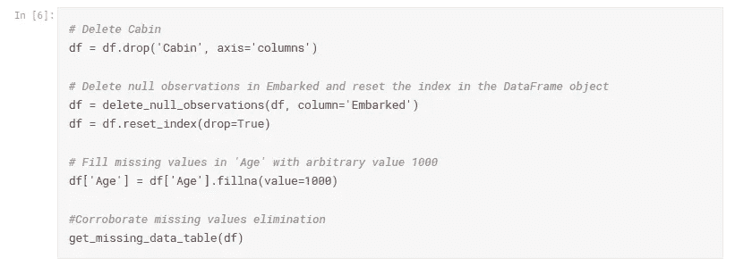
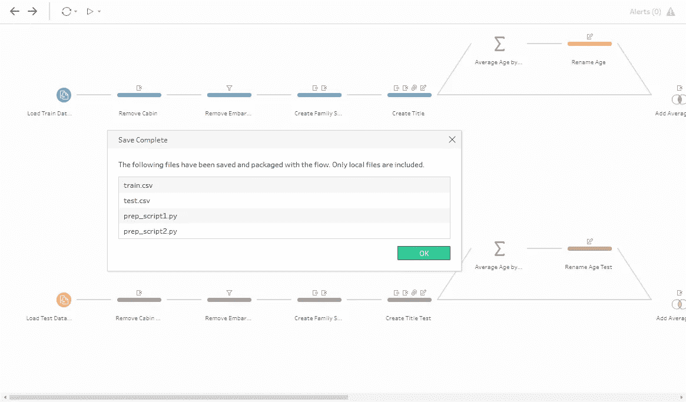

# 拖放数据预处理:使用 Tableau Prep 清理 Titanic 数据集

> 原文：<https://towardsdatascience.com/drag-drop-data-preprocessing-titanic-dataset-cleaning-with-tableau-prep-267c7f753ef?source=collection_archive---------24----------------------->


Photo by [Markus Spiske](https://unsplash.com/@markusspiske?utm_source=medium&utm_medium=referral) on [Unsplash](https://unsplash.com?utm_source=medium&utm_medium=referral)

## Tableau Prep，有多厉害，失败在哪里，最大优势在哪里。

在我作为 Tableau 的商业智能顾问的工作中，我听到了很多“Tableau 不是 ETL”的说法，对此我大部分时间都不得不同意。不管最近的变化，Tableau 已经对其 Tableau 桌面产品进行了改进，以提高处理大量数据的性能，在大多数情况下，在使用 Tableau 桌面进行分析和报告之前，有必要添加一个 ETL 流程，如 Talend 或 Pentaho。

意识到之前的情况，去年(2018) Tableau 向公众发布了产品 Tableau Prep Builder，目的是在使用 Tableau Desktop 进行数据探索之前提供一个拖放工具。作为该工具的顾问，我有责任探索其潜力，了解其优势和实际能力，以评估在客户的 BI 项目中向其展示该工具是否可行。为了做到这一点，我决定将我曾经在 Python 中做过的清理过程复制到流行的 Titanic 数据集，小心地注意到该工具可能存在不足之处，以及它是否真的足够兼容以应用于更大的项目。

# 背景和规格

作为我在数据科学学习过程中的一部分，我在一年多前参加了广受欢迎的 Kaggle 竞赛“[Titanic:Machine Learning from Disaster](https://www.kaggle.com/c/titanic)”，为了这个项目，我使用 Python 执行了数据集清理和预测，并将其与 Tableau 中的数据集探索和分析相集成。该项目可以在[这个链接](https://www.kaggle.com/danielmartinezb/titanic-prediction-using-ensemble-learning/notebook?scriptVersionId=4573741)中读取，我将使用 [Tableau Prep Builder 版本 2019.3](https://www.tableau.com/support/releases/prep/2019.3.1) 复制用 Python 完成的数据准备工作。在整篇文章中，我将尝试解释 Tableau Prep 的一般功能，但重点是 Python 工作与工具中创建的流的比较。

 [## 使用集成学习的泰坦尼克号预测

### 下载数千个项目的开放数据集+在一个平台上共享项目。探索热门话题，如政府…

www.kaggle.com](https://www.kaggle.com/danielmartinezb/titanic-prediction-using-ensemble-learning/notebook?scriptVersionId=4573741) 

# 第 1 部分:加载数据集

与大多数 Kaggle 数据集一样，清理过程从读取 CSV 训练文件开始。Pandas 用于确保数据的结构是正确的，并使用函数 *describe()* 了解数据集的描述性统计信息，例如记录的数量、每列的最大值和最小值等。


Reading the CSV file with Python and Pandas


Summary of the data

在 Tableau Prep 中，与纯文本文件中的数据源的连接与在 Pandas 中一样简单，此外，它还具有 Tableau Desktop 中为大量服务器(如 Hadoop、Teradata、MySQL、BigQuery 等)提供的已知原生连接向导。


Some of the connections available in Tableau Prep

此时，Tableau Prep 开始显示其一些节省时间的功能。如果有多个结构相同的文件，可以创建一个“通配符联合”,只需单击一下，就可以解决 Pandas 中需要的多个连接。

此外，一旦连接到数据，我们就可以定义一个在流程中使用的样本。这使得流程中的每个进程都具有更好的性能，因为无论如何，在准备流程结束时，清理将应用于整个数据集。


Options available when connecting to a source in Tableau Prep

我们还发现，从 Pandas describe()函数获得的信息可以在 Tableau Prep 的“Profile Pane”中找到，在这里我们将能够查看每个字段的摘要描述，并将其与原始表格结构进行对比(甚至利用一些视觉效果)。

# 第 2 节:处理缺失值

决定如何处理包含空值字段的记录是数据清理最常见的任务之一。对于这一步，我开发了一个函数，能够可视化每个字段中的空记录的数量以及它们所代表的总数的百分比(这些信息可以在 Prep 中从“Profile Pane”中查询)。


Pandas in Python vs Profile Pane in Tableau Prep

从具有空值的字段的信息中，由于缺失值的数量很大，我决定删除列“Cabin ”( Tableau Prep 也建议这样做),从列“apollowed”中删除两个空值，并用任意值填充空值“Age ”,以便稍后进行转换。



在 Tableau Prep 中复制这些操作简单、直观，只需几次点击。
*(“年龄”列的更改是在流程的后期开发的)*

在 Python 清理过程的这一点上，我开始分析 Tableau 中的数据集，并根据结果决定对变量应用不同的转换。应该注意的是，从 Tableau Prep 中，我们可以在流程的任何时候加载 Tableau Desktop 中的更改。


# 第 3 节:列转换

Tableau Desktop 中分析的第一个转换是创建“家庭规模”字段，该字段由“Parch”和“SibSp”字段的总和组成。


要复制 Tableau Prep 中的行为，只需创建一个计算字段，其公式为:

```
[SibSp] + [Parch]
```

然后简单地删除菜单中剩余的列。

下一步是提取每个名字的标题。由于乘客的姓名没有给模型添加任何信息，所以我决定提取其头衔(先生、小姐、夫人等。)我们可以更广泛地概括乘客。


这只需要在 Tableau Prep 上点击几下。


然后进行分组，其中只有“主人”、“小姐”、“先生”和“夫人”的称谓保留，其余的归类为“其他”。


对于这种行为，Tableau Prep 提供了几个分组选项(包括按单词相似度甚至发音相似度分组)。

下一个清理步骤可能是最复杂的，在 Tableau Desktop 的支持下，我获得了每个图书的平均年龄，并用该值填充了年龄字段的空记录。


为了在 Tableau Prep 中自动模拟此行为，我需要创建一个具有此平均值的字段(使用 Tableau Prep 聚合过程)，然后通过连接过程将其集成到数据集，最后我创建了一个计算字段，该字段复制了“年龄”字段，如果记录为空，则取平均值字段的值。


Section in the flow to complete the nulls in ‘Age’


Agregation and Join steps in Tableau Prep

计算字段中使用的公式为:

```
IF ISNULL([Age]) THEN
 [Average Age]
ELSE
 [Age]
END
```

最后，列转换过程以删除带有乘客 ID 和机票号码的字段结束(类似于客舱删除步骤)。

# 第 4 部分:用于建模的数据集的调整

到目前为止，数据集是完全干净的，可以用于模式分析和报告。可以看出，所有步骤都可以通过一系列点击以最小的努力来执行，Tableau Prep 已经实现了其功能(在使用 Tableau Desktop 创建报告之前清除数据)。此时，您可以添加一个输出过程，该过程会将所有更改应用到数据集，并将结果导出为 CSV 格式或作为 Tableau Desktop 的摘录来创建报告。

然而，为了让数据集准备好训练模型，还需要两个额外的转换(将分类变量转换为 1 和 0 的数字格式，以最终对它们进行规范化)。根据我的经验，我无法在 Tableau Prep 中本地应用这两种转换(或者不需要很多额外的步骤)，但是我能够集成一个定制的 Python 脚本来满足我的需要。

在与 Python 的集成中(尽管它也可以与 R 集成)，我发现了 Tableau Prep 的最大缺点，也是它真正不足的地方。

首先，对于集成来说，有必要使用配置相当简单的 TabPy 库，可以在[这里](https://www.tableau.com/about/blog/2019/8/introducing-support-custom-r-and-python-scripts-tableau-prep-flows)找到一个博客，它非常有助于理解如何将 Python/R 集成到 Tableau Prep。

[](https://www.tableau.com/about/blog/2019/8/introducing-support-custom-r-and-python-scripts-tableau-prep-flows) [## 在 Tableau 准备流程中引入对定制 R 和 Python 脚本的支持

### 在本文的示例中，Anton 解释了如何配置 Prep Builder 来运行 Python 脚本，并展示了一些…

www.tableau.com](https://www.tableau.com/about/blog/2019/8/introducing-support-custom-r-and-python-scripts-tableau-prep-flows) 

基本上，这是必要的脚本有一个主要功能，将通过参数接收熊猫数据帧，我们必须在它的所有转换。我们将在 Tableau Prep UI 中链接此函数，只需键入其名称。

然而，真正的缺点是，我们必须强制包含 *get_output_schema()* 函数，该函数将向 Tableau Prep 指示我们的数据集在脚本末尾的结构。这样做的问题是，我们必须几乎手动地创建结构，如果我们的数据集有许多列(超过 20 列就已经不可行了)，这将是一项非常繁琐的任务。

为了说明我所说的，我添加了必要的脚本来转换分类变量:

为了应用标准化:

在将这些脚本包含到流中之后，我能够满足我的需求。我甚至可以在任何时候分割流，以生成独立字段 X 的矩阵和包含因变量 y 的列向量。


Final part of the flow

# 结论

在这个实验结束时，我能得出的最后结论是，尽管 Tableau Prep 对公众开放的时间很短，但它将能够简化许多常见的和一些更复杂的过程，这些过程通常在 ETL 或数据科学项目中完成。具体来说，对于这个项目，在需要使用外部脚本之前，只需很少的努力就可以复制 100 多行代码。

总的来说，Tableau Prep 给人留下了非常好的感觉，它绝对是一个值得在一些行业项目中获得机会的工具。显然，它在什么时候暴露了它的容量不足，以及在使用中可能出现什么问题。

作为最后一个优势，强调将流复制到具有相同结构的数据源是多么简单是很重要的。例如，在 Python 中，如果您想要对测试数据集应用相同的转换，您将需要复制代码并调整变量的名称。在 Tableau Prep 中，简单的复制和粘贴会产生相同的结果。


此外，有趣的是，流可以保存为打包格式，其中包括在任何其他使用 Tableau Prep 的计算机上复制流所需的脚本和文件。



简而言之，这绝对是一个我推荐使用并给它一个机会的工具，我个人很高兴看到它的下一个版本中包含的新特性。

# 我是谁？


我叫丹尼尔·马丁内斯，是哥伦比亚波哥大 Bera 集团 SAS 公司 Tableau 的首席商务智能顾问。我对机器学习和数据科学充满热情，目前我拥有 Tableau 桌面专家认证，但作为一名顾问，我有大约一年的时间从事仪表板的构建、使用 Tableau 的 BI 解决方案的架构以及 Tableau 服务器的管理。

如果你想联系我，你可以发邮件到我的邮箱【daniel.martinez@bera-group.com 或者在 LinkedIn 上联系我。

[](https://www.linkedin.com/in/daniel-martinez-bielos/) [## 丹尼尔·马丁内斯·比洛斯托茨基——Tableau 顾问——Bera Group SAS | LinkedIn

### 我是诺特大学最后一个学期的本科生，学习数据科学、机器学习…

www.linkedin.com](https://www.linkedin.com/in/daniel-martinez-bielos/) 

也可以在我的个人博客中读到更多关于我其他项目的信息。

[](https://sites.google.com/view/danielmartinezbielos) [## 丹尼尔·马丁内斯

sites.google.com](https://sites.google.com/view/danielmartinezbielos) 

如果你想更多地了解我们在 Bera Group SAS 的工作，你可以查阅用西班牙语和 T2 语编写的服务手册。