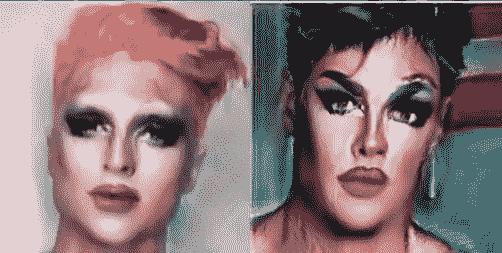

# 变装者:为变装女王训练一个变装者

> 原文：<https://towardsdatascience.com/dragface-training-a-gan-for-drag-queen-transformation-7daf1958e517?source=collection_archive---------21----------------------->

## 用逼真的化妆改变任何自拍

如今，变装皇后在越来越多的人群中变得流行起来。他们在 LGBTQ 群体中也发挥着强大和鼓舞人心的作用。他们通常以出色的表演技巧和奢华的妆容吸引观众。

虽然大多数变装皇后幽默的主持风格和精彩的舞蹈动作很难模仿，但他们复杂的妆容总是更让我惊讶。平均来说，一个专业的变装皇后需要大约 1.5-3 个小时来完成她的化妆。打造拖妆所需的技巧之多，丝毫不亚于油画。我一直在想，如果我和我的朋友们化上男扮女装的妆，他们会是什么样子。

> 因为我不认识任何化妆师，也负担不起几百美元的预算，所以我求助于机器学习来解决问题。

最近我一直在研究 GANs(生成对抗网络)。它们是一种使用深度学习方法(如卷积神经网络(CNN))进行生成建模的方法。GANs 是一个激动人心且快速变化的领域。最先进的 GANs 能够在一系列问题领域生成逼真的图像，最显著的是在图像到图像的翻译任务中，例如将夏天的照片翻译成冬天的照片或白天到夜晚的照片，以及生成甚至人类都无法辨别的物体、场景和人物的逼真照片。因此，他们是这个项目的完美模特，理想情况下，他们可以将任何正面清晰的照片转换为完整的化妆。如果你有兴趣了解更多关于 GANs 的知识，这里的是一篇很棒的文章，会很有帮助。

**项目计划(有我的时间预估):**

1.  Web Scrape 拖动皇后和常规自拍图像资产(1 天)
2.  研究发表的论文并实施最先进的 GAN 算法(1 周)
3.  为模型培训准备项目数据集(1 天)
4.  对 GAN 进行项目数据集培训(2 周)

# **1。网页抓取拖动女王和普通自拍图像资产**

为了收集质量好的变装皇后照片和普通自拍照片，我最初的想法是从谷歌图片搜索中刮照片。我写了一个快速的 python scraper 来从 Google 图片搜索中收集拖拉女王的照片。我的目标是 3000 张照片。然而，谷歌图片搜索上的许多图片都有断开的链接，并且在点击通过一定数量的搜索页面后算法停止。我最终只有大约 700 张照片。真扫兴。

一天，当我因为轻微的社交媒体成瘾而滚动浏览我的 Instagram feed 时(2019 问题，我说得对吗？)，我突然想到，如果我想要大量高质量的图像数据，在当今世界没有比 Instagram 更好的地方了。因此，我创建了另一个 python scraper，并从 Instagram 图片搜索中收集了使用“变装女王”和“自拍”等标签的变装女王照片和普通自拍。这一次，我在 10 分钟内获得了超过 3000 张变装皇后和普通照片。

# **2。发表论文研究并实现最先进的 GAN 算法**

我在 CNN 和深度学习方面有一些经验，我参加过一个基于 GAN 的 [Kaggle 竞赛](https://www.kaggle.com/c/generative-dog-images)，它要求参与者使用 GAN 生成小狗照片。为了那场比赛，我训练了 DC 甘、WGAN GP 和 CGAN。训练这些模型并不容易，我一直在努力解决不收敛和生成器梯度减小等问题。

这一次，我决定在开始创建我的模型之前做更多的研究。我最近读了很多关于最先进的 GANs 的论文，特别是那些在涉及人脸的图像翻译任务中取得成功的 GANs。最终， [Junho Kim 等人关于 **U-GAT-IT**](https://arxiv.org/pdf/1907.10830.pdf) 的一篇论文引起了我的注意。他们的 GAN 模型把女生的自拍转化成了具有视觉感染力效果的动漫形象，坦白说和我的项目目标(从自拍到拖)挺像的。

在详细阅读了这篇论文和他们的代码后，我决定尝试实现他们的模型，原因如下:

1.他们论文中最突出的特点是，他们提出了一个自适应层实例归一化(AdaLIN)函数，以自适应地选择实例归一化(IN)和层归一化(LN)之间的适当比例，而不是只使用其中一个。在 GAN 训练期间，如果仅使用 IN，则由于逐通道归一化特征统计，源域的特征将被很好地保留。然而，目标域的翻译量可能不够，因为实例规范化可能无法捕获全局样式。另一方面，如果仅使用 LN，则目标领域风格可能由于逐层标准化的特征统计而被很好地转移。但是源域的特征可能保存得不太好。通过根据源和目标域分布自适应地选择 IN 和 LN 的比率，该模型可以产生更具视觉吸引力的结果。

文章用一个例子说明了这一理论。下图是来自 selfie2anime 模型的对比。(a)中的图像是源文件。(b)使用 AdaLIN 翻译图像。(c)仅使用实例规范化来翻译图像。(d)仅使用图层规范化转换图像。显而易见,( b)具有最吸引人的视觉效果。(c)很好地保留了源图像的细节，如颧骨和面部表情，但没有很好地与动画特征融合。(d)很好地捕捉了动画特征，但是没有从源文件翻译足够的细节。

[https://arxiv.org/pdf/1907.10830.pdf](https://arxiv.org/pdf/1907.10830.pdf)

2.本文没有使用基本的最小最大损失函数，而是实现了 4 种不同的损失函数:对抗性损失、循环损失、同一性损失和 CAM 损失。

对抗性损失试图将生成的图像与目标分布相匹配。循环损耗对发电机施加循环一致性约束。它要求生成器将源图像翻译到目标域，然后成功地翻译回源域。这有助于解决模式崩溃问题，这是许多 GAN 模型训练中的一大难题。身份损失有助于确保源图像和目标图像的颜色分布相似。如果在生成器中使用来自目标域的图像来翻译该图像，则该图像不应改变。CAM 损耗有助于发生器和鉴别器了解在这两个域中何处需要改进。

报纸上还有很多我喜欢的其他功能。由于这篇博客的篇幅有限，更多细节请参考论文。

# **3。为模型训练准备项目数据集**

在开始构建模型之前，关键的一步是以正确的格式准备数据。我收集了 3000 张变装皇后的照片和 3000 张自拍，但并不是所有的照片都有清晰的正面，也不是所有的照片都被裁剪得恰到好处，只展示了面部区域。为了准备数据，我利用 Open-CV 的级联分类器，编写了一个 python 脚本来识别数据集中的人脸，并对它们进行裁剪，使人脸位于中间。后来，我手动整理了我的数据集，剔除了质量不好的照片。最后我有了 1000 张拖照和 1000 张自拍。

Training set sample

当我收集普通自拍时，最初我只打算包括男性自拍，因为大多数传统的男扮女装者都是由男性转变而来的。然而，我注意到在我的数据集中有大量女性变形的男扮女装照片。因此，我也在我的数据集中加入了女性自拍。将来探索不同性别对模型结果的影响会很有趣。

另一件引起我注意的事情是，大多数男扮女装的照片都有假发，尽管我试图在最终的照片中只包括脸部。而很多自拍，尤其是男性自拍，都是短发。假发最终在我的模特训练中扮演了一个有趣的角色。我将在第 4 节进一步讨论它。

# **4。在项目数据集**上训练 GAN

## **4.1 宏伟设计**

与任何其他 GAN 类似，我的模型有一个生成器和鉴别器。生成器由编码器、解码器和辅助分类器组成。发电机的设计如下图所示:

[https://arxiv.org/pdf/1907.10830.pdf](https://arxiv.org/pdf/1907.10830.pdf)

训练辅助分类器来学习每层特征图的权重，然后用于计算一组领域特定注意特征图。然后，解码器的残差块(AdaLIN)中的参数可以通过全连接层从注意力图中动态计算。

同样，鉴别器也有一个编码器，一个辅助分类器。然而，鉴别器具有分类图像是来自目标域还是由模型生成的分类器，而不是具有带有残余块的解码器。

[https://arxiv.org/pdf/1907.10830.pdf](https://arxiv.org/pdf/1907.10830.pdf)

## **4.1 支付或不支付**

大家都喜欢免费的资源，尤其是免费的 GPU。训练机器学习模型可能会很快变得昂贵。尽管 GCP 和 AWS 提供相对便宜的 GPU，但训练一个模型几天就要花费 100 多美元。甘人以训练时间长著称。

幸运的是，我有一个相对较小的数据集。通过在 Google Drive 上安装我的数据集，我能够完全在 Google Colab 上训练我的模型。如果你对机器学习感兴趣，但受限于计算能力，我推荐你去看看 Google Colab。Google Colab 的另一个优点是，你可以从任何机器上登录它。如果你像我一样每天都很忙，它会给你很大的灵活性。

对于这个特定的模型，每次迭代转换一个图像并产生一组发生器和鉴别器损耗值。我的目标是为 300，000 次迭代训练模型，并在此过程中监控结果。在 Colab 上，训练一次迭代大约需要 3 秒钟，这意味着我将不间断地花费大约 250 小时来达到 300，000 次迭代。呃。

但是现在还不要沮丧。有一个巧妙的技巧实际上救了我的命。在 Pytorch 中，下面的代码可以大大提高训练效率:

> torch . backends . cud nn . benchmark = True

该标志启用 cudnn 中的基准模式。在基准模式下，如果网络中的输入大小没有变化，cudnn 将为该特定配置寻找一组最佳算法(这需要一些时间)。这通常会导致更快的运行时间，在我的例子中，这将每次迭代的运行时间减少到了 1 秒。耶！

不过，对这一招要半信半疑。如果输入大小在每次迭代中都发生变化，那么 cudnn 将在每次出现新的大小时进行基准测试，这可能会导致运行时性能下降。

## **4.2 细节决定成败**

当我监控模型结果时，我很快意识到一些自拍转换比其他的更糟糕。深入挖掘，问题就显现出来了。这些自拍要么戴着眼镜，要么脸部附近有障碍物。我决定立即停止训练，因为我从经验中了解到，在机器学习中，没有什么比高质量的数据集更重要，无论你的算法有多天才。因此，我仔细地重新扫描了我的数据集，删除了任何不清晰、有眼镜或有障碍物遮挡面部的照片。我还附上了一些额外的照片。

## 4.3 大损失，小损失

为了确保我的模型训练正确，我收集了每次迭代的发电机损耗和鉴频器损耗，并绘制了它们的趋势。下图显示了直到 295，000 次迭代的对数变换损失值图表。

鉴别器损失相对一致且较小，这意味着鉴别器总是善于分辨哪些拖动图像是真实的，哪些是模型生成的。发电机损耗从大值开始，然后随着训练的进行逐渐降低。在整个训练过程中，发生器和鉴别器损耗值都有恒定的波动性。这种易变性是意料之中的，因为每次迭代只包含一张照片，并且翻译的难度会根据光线、角度和图像质量等条件而有很大变化。因此，不同的输入图像可能具有非常不同的损失值。

## 4.4 没有照片，就没有真相

跟踪训练进度的另一种方法是简单地查看结果。让我们看看两张示例照片的结果进展。

Original

5,000 iterations after

15,000 iterations after

100,000 iterations after

130,000 iterations after

180,000 iterations after

240,000 iterations after

看起来没那么糟吧！随着训练的进行，模特似乎捕捉到了更突出的化妆特征:大烟熏妆，彩色而光滑的嘴唇，鼻子上的高光，脸颊上的阴影。从 100，000 次迭代开始，翻译的照片已经看起来像专业的拖动图像。随着训练的深入，化妆越来越突出。正是我想要的！

**4.5 好的记忆可能不好**

就在我准备坐下来放松一下，进一步观看火车模型时，我注意到在翻译图像的面部附近有一些随机的笔画。一开始我以为是因为输入图像质量的问题，但是情况越来越糟。在 130，000 次迭代时，我只能看到一些可能被误认为阴影的光线。在 240，000 次迭代后，它们变成了清晰的波浪形图案，围绕在脸部周围。然后我意识到，这些波浪状的图案实际上是从模型中生成的假发。由于大多数变装照片都有色彩鲜艳的假发，模特也应该逐渐学会在照片上戴假发。

然而，随着模特开始越来越关注假发，翻译后的波浪状图案使照片背景看起来扭曲，视觉吸引力下降。

这可能是阿达林的结果。AdaLIN 帮助模型成功地保留了大量来自源域的面部特征，并与来自目标域的化妆特征融合。然而，对于头发，模型可能应该尽可能多地保留原始特征，以使图像看起来更真实。对于未来的开发，我可以修改模型，以便 AdaLIN 应用实例与图层归一化的比率，该比率随图像上的位置而变化(面部区域使用更多的实例归一化，外部区域使用更多的图层归一化)

表演时间到了！

除了翻译我和我朋友的照片，我还和我的模特一起翻译了一些名人的照片。你能猜出以下哪些名人发布了他们精彩的变装吗？请在你的猜测下面评论他们的名字！(或者更好，也评论一下你认为他们的拖名会是什么！:D)

a

b

c

d

# **后续步骤和最终反思**

总的来说，我花了四周时间完成这个项目，比最初估计的时间多了一周。我从这个项目中学到了很多，总体上对结果很满意。回想起来，这些是我学到的最有价值的东西:

1.  确实，数据科学家只花 20%的时间在实际数据分析上，80%的时间在寻找、清理和重组数据上。对于这个项目，收集和转换数据的时间比我想象的要长得多。数据集的质量直接关系到结果的质量。在项目开始的时候，我很想直接投入我的数据来训练模型。由于低质量的训练数据，我不得不重新清理我的数据，并从零开始重新训练我的模型，这给了我很大的教训。
2.  使用各种指标来帮助监控培训过程，包括损失值、分数和目视检查。特别是对于像 GANs 这样的无监督学习任务，您需要选择最适合项目目的的度量标准。
3.  尽可能利用免费资源。Google Colab 和 Kaggle 都为机器学习项目提供免费的 GPU。我个人更喜欢 Colab，因为你可以在 Colab 中直接安装你的 Google Drive。它在模型训练和结果保留方面提供了很大的灵活性。
4.  深入了解模型架构。训练机器学习模型是复杂的任务。理解每个模型组件的特征和功能对于理解模型训练行为是必不可少的。

正如我在 4.5 节中提到的，我的下一步是研究如何改善翻译的假发外观。我可能还会收集更多的数据，因为当前的训练集大小仅为每个类 1000 个。我很想知道更多的数据是否会给模型带来更真实的结果。

这个项目的代码可以在我的 [GitHub](https://github.com/eroswang/DragFace) 上找到。看看吧！

如果你喜欢这个，请随时在[媒体](https://medium.com/@erosw7)上关注我，或者在[LinkedIn](https://www.linkedin.com/in/eroswang7/)&[Twitter](https://twitter.com/erosw7)上联系我！