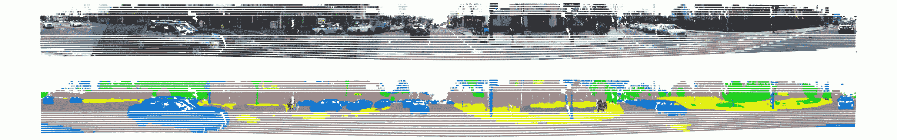

# 在帕洛阿尔托路上的物体周围画一百万个方框

> 原文：<https://towardsdatascience.com/drawing-a-million-boxes-around-objects-on-the-roads-of-palo-alto-cd29a72ee1eb?source=collection_archive---------27----------------------->

## 为自动驾驶汽车比赛的 Kaggle Lyft 3D 对象检测构建语义点云

# 介绍

这篇文章详细介绍了我和 Stefano Giomo 参加最近的 Kaggle Lyft 自动驾驶汽车 3D 物体检测比赛时使用的方法([https://www . ka ggle . com/c/3D-object-detection-for-autonomous-vehicles](https://www.kaggle.com/c/3d-object-detection-for-autonomous-vehicles))。

这场比赛使用了 Lyft 车辆捕获的数据，这些车辆配备了多个摄像头和激光雷达传感器。这些车辆在帕洛阿尔托的道路上拍摄了数百个 20 秒的场景。竞赛的目的是围绕这些场景中不同类别的对象放置 3D 包围盒。

我们在数据的 2D 鸟瞰图表示上训练了一个 UNet 模型。2D 表示是通过一系列预处理步骤创建的，这些预处理步骤将每个激光雷达点云与来自相机和帕洛阿尔托街道地图的语义信息相结合。

为了将 2D 预测从模型转换到 3D 包围体，我们执行了许多后处理步骤，包括计算机视觉技术，以及使用激光雷达点云构建地形图。

在获得铜牌的过程中，我们面临了许多挑战。这次比赛的数据集很大，大约 120Gb，存储和处理数据需要很长时间。学习在不同的参考坐标系之间正确转换数据是复杂的，需要小心谨慎。

决定如何组合激光雷达数据和多个相机图像，以及如何将数据转换为神经网络的输入也具有挑战性。在应对这些挑战的过程中，我们学到了很多，并开发了一些有趣的方法，我们认为值得分享。

在这篇文章中，我们总结了我们如何执行预处理步骤来组合不同的数据类型，我们如何创建输入和训练我们的模型，以及我们如何对我们的预测进行后处理以弥补我们模型的一些限制。

# 数据集

Sensor data from a scene in the Lyft Level 5 data set

比赛数据取自 Lyft 的 Level 5 数据集(【https://level5.lyft.com/】)遵循 nuScenes 数据格式([【https://www.nuscenes.org/】](https://www.nuscenes.org/))。数据模式中每个实体的元数据都用 JSON 表示。

Lyft 构建了一个 SDK 来促进数据结构的工作:它允许用户在场景中导航，操纵盒子，可视化传感器数据等等。SDK 的存储库在这里(https://github.com/lyft/nuscenes-devkit ),可以作为 pip 包安装。

## 场景、样本和传感器

The Lyft vehicle and its sensors

数据由 20 秒长的场景组成。每个场景都由许多样本组成。反过来，样本由同时采集的来自多个传感器的数据组成。每个场景由大约 125 个样本组成。与每个样本相关联的是关于车辆相对于场景的位置以及传感器相对于车辆的位置的信息。该信息允许数据点被合成并正确地放置在场景中。所有车辆都至少有一个激光雷达传感器和六个摄像头。

训练集具有由每个样本中所有感兴趣对象周围的包围体组成的注释。感兴趣的对象分为九类。从柱状图中可以看出，这些类非常不平衡(注意对数刻度)。有 50 多万辆汽车和不到 200 辆急救车辆。

包围体是相对于场景的坐标系定义的。它们平行于 XY 平面，并由七个值指定:中心的三个坐标；体积的三维以及围绕垂直轴的旋转角度(偏航)。

Sample from the street map

还提供了一张源自 OpenStreetMap([https://www.openstreetmap.org/](https://www.openstreetmap.org/))的地图，覆盖的区域包括数据中的所有场景。

## 训练和测试数据集

训练和测试数据集总共包含超过 350，000 幅图像和近 60，000 个点云。这些数据集总共使用了 120 千兆字节的磁盘空间！

# 任务和评价标准

这组测试场景没有注释，要求竞争者预测类别，以及场景中每个感兴趣对象周围的包围体(七个值)。

使用*平均精度*指标对预测进行评分。预测的*平均* *精度*是针对联合(IOU)阈值的交集范围计算的，并且度量是作为这些*平均* *精度*的 M *ean* 计算的。

平均精度的计算如下。例如，假设 IOU 阈值为 0.6，所有与地面真实量重叠至少 60%的量被认为是命中，而其他的被认为是误报。然后，该阈值的*平均精度*被计算为命中数除以预测数量。阈值 0.5、0.55、…、0.9、0.95 用于计算*平均精度*的*平均值*。

# 分割相机图像

Forward facing cameras with semantic segmentation masks

为了利用相机图像中包含的信息，我们创建了每个图像的语义分段，以将语义类与激光雷达点云中的点相关联。我们这样做是为了给我们的网络提供关于每个激光雷达点反射的对象的信息。

我们使用了麻省理工学院计算机科学和人工智能实验室发布的预训练 PyTorch 网络([https://github . com/CSAILVision/semantic-segmentation-py torch](https://github.com/CSAILVision/semantic-segmentation-pytorch))。该模型已在 ADE20K 场景解析数据集([http://groups.csail.mit.edu/vision/datasets/ADE20K/](http://groups.csail.mit.edu/vision/datasets/ADE20K/))上进行训练，该数据集包含大量场景，包括美国公共道路的场景，以及 150 类对象的分割基础事实。

我们对测试集和训练集中的每幅图像进行推理，并将结果保存为 GIF 图像以节省磁盘空间。在 150 个类别中，我们根据它们的频率和与竞争的相关性选择了 24 个类别的子集。例如，我们排除了像*沙发*和*床*这样的家庭用品的类别。我们选择了 24 个类来减少表示分类信息所需的嵌入大小。

# 将类投影到点云

Lyft SDK 提供了在摄像机图像上可视化点云的功能。我们从这段代码中获得灵感来进行相反的操作:将图像和语义数据映射到点云中的点上。

Associating LIDAR points with pixels in a camera image (drawing by [Stefano Giomo](https://medium.com/u/6c1f1c0d4ae5?source=post_page-----cd29a72ee1eb--------------------------------))

该图显示了我们如何将相机图像和语义图投影到点云中的相关点上。例如，P 是激光雷达点云上的一个点。我们沿着将 P 连接到激光雷达传感器的线将 P 投影到相机图像中，找到 2D 点 Q。我们使用 Q 对语义分割遮罩进行采样，并找到点 P 的语义类

A camera image and semantic classes projected onto the corresponding points in the point cloud

## 合并来自多个传感器的语义和相机数据

我们为每个样本中的每个图像投影分割类和相机图像数据。结合所有的投影，我们有一个语义点云，其中每个点都有一个相关的语义类标签。

来自相邻摄像机的图像在边缘重叠。对于重叠区域中的激光雷达点，我们定义了一个规则来根据类与属性域的相关性选择最终标注。

Multiple camera images and segmentation classes projected onto the entire LIDAR cloud

上面的可视化显示了以球坐标表示的整个语义点云，其中 x 轴是方位角，y 轴是连接该点和激光雷达传感器的射线的仰角。

# 鸟瞰模型

我们研究了各种可能的网络架构，包括具有 3D 卷积和区域提议网络的架构。这些模型复杂且计算量大，为了确保我们能够及时提交，我们做出了务实的决定，选择使用 Lyft 团队提供的参考模型作为起点([https://github . com/Lyft/nu scenes-dev kit/blob/master/notebooks/Reference % 20 model . ipynb](https://github.com/lyft/nuscenes-devkit/blob/master/notebooks/Reference%20Model.ipynb))。

参考模型基于自上而下(或鸟瞰)的激光雷达点云。想法是将点云体素化，将 Z 维度划分为三个区域，产生三通道 2D 表示。然后，每个体素中的归一化点数被用作像素强度，第一通道被分配给最低 Z 区域，第三通道被分配给最高 Z 区域。鸟瞰图可以像 RGB 图像一样处理。

Original Birds Eye View model input and target data

该模型预测输入图像的每个像素属于十个类别(九个输出类别和一个背景类别)之一的概率。

Example predictions for the class ‘car’

## 改进鸟瞰模型

Our data preprocessing pipeline to create inputs to the neural network (drawing by [Stefano Giomo](https://medium.com/u/6c1f1c0d4ae5?source=post_page-----cd29a72ee1eb--------------------------------))

受 PointPillars 论文(【https://arxiv.org/abs/1812.05784】T2)的启发，我们通过使用多种渠道向模型提供更多信息来扩展这个参考模型。

具体来说，我们添加了来自街道地图和语义点云的信息。为了包含语义信息，我们在 Rossmann Store Sales Kaggle 竞赛(【https://arxiv.org/pdf/1604.06737.pdf】T4)的实体嵌入纸的样式中使用了 5 维嵌入。

我们修改了参考模型中使用的 PyTorch UNet 实现，并使用[杰瑞米·霍华德](https://medium.com/u/34ab754f8c5e?source=post_page-----cd29a72ee1eb--------------------------------)的 fastai 库训练它。

Training data for our model

# 后处理

## 生成 2D 矩形

一旦我们完成了对测试集的推断，我们就按照参考模型中使用的方法将我们的预测转化为 2D 包围盒。该方法首先对预测进行阈值处理，以获得每个类别的二进制掩码。然后进行侵蚀，接着进行扩张(称为打开)。这消除了二进制掩码中的小伪影。我们找到了每个二进制掩码的轮廓和这些轮廓的最小外接矩形。这些包围矩形是我们包围体的基础。

An example of predictions and extracted contours for class ‘car’

在这个过程完成后，我们有了指定包围体的七个参数中的五个。我们已经计算了 x 和 y 的位置和比例，以及 xy 平面上的旋转(或偏航)。我们仍然需要 z 位置和比例(即海拔和高度)。

# 高度和标高

参考模型使用了一些简化假设，以便将预测的 2D 盒转换成 3D 体积。第一个假设是特定类别的所有对象都具有相同的高度，具体来说，就是训练数据中该类别的平均高度。第二个假设是所有的物体都与装有传感器的车辆(自我车辆)处于相同的高度。

我们试图通过对激光雷达点云进行后处理来改善这两种假设。在这里，我们详细说明了我们是如何改进仰角假设的。

# 构建地形高程图

Point cloud a scene with a hill, the spikes are roadside trees

我们推断，我们应该能够使用激光雷达点云中的最小高程来找到场景的地面高程。我们将每个场景的所有 125 个可用点云转换到同一个参考坐标系，并将它们合并以构建整个场景的点云视图。我们使用这个组合的点云来构建场景的最小高度或地形图。

Minimum elevation map for a scene with a hill

我们面临的一个问题是，场景中的任何物体，如车辆或行人，都会导致对地面高度的高估。我们通过在空间和时间中取最小高度来避免这个问题。通过在一个物体周围的空间区域中取最小值，我们发现在物体旁边的地面上有更低的点。通过在不同的时间点取最小值，我们找到了任何移动物体离开后的地面。

上面的点云是从包含一座小山的训练集中的场景中获取的。下面的视频显示了这个场景的摄像机和注释。

Youtube video showing a scene with a hill.

在场景开始时，车辆正在下山，后面跟着几辆车。下面的动画对比了放置在与 ego 车辆相同高度的包围体和放置在我们创建的地形地图上的包围体。

Bounding volumes of vehicle on a hill placed at ego vehicle elevation vs at terrain elevation

最初，当车辆下降时，与自我车辆处于同一水平的包围体明显比放置在地形图上的包围体差。然而，随着道路表面变平，差异消失，因此这种技术提高了具有山丘或道路高程中的其他差异的场景的分数。

# 结论

我们为这次比赛花费的大部分精力都放在输入数据的预处理和预测的后处理上。我们对参考模型进行了两项关键改进。通过将来自相机图像的语义信息投影到点云中，我们将关于对象类别的信息传递给我们的模型。其次，通过构建地形图，我们提高了预测体积的高程精度。

和大多数 Kaggle 竞赛一样，我们在用完创意之前就用完了时间。我们尝试在多个连续样本(扫描)上训练我们的网络，但不太成功，但如果给我们更多时间，我们确信这条路线会给我们带来提升。后来我们意识到，我们应该尝试使用更高分辨率的鸟瞰图像。

如果我们有更多的时间，我们会尝试使用更先进的端到端方法，更好地表示点云和区域建议网络，以获得更好的包围体。我们希望用语义点来扩展 PointPillars 网络，我们也希望在球形映射的语义点云上训练一个模型。

我们将很快为此项目发布我们的 GitHub 资源库。我们正在撰写更多的文章，这些文章将更详细地介绍预处理、后处理和训练网络背后的更多技术元素。

感谢 [Stefano Giomo](https://medium.com/u/6c1f1c0d4ae5?source=post_page-----cd29a72ee1eb--------------------------------) 的精彩画作！感谢你的阅读！

如果你想看看我们从数据集生成的更酷的视频，以及我们的语义分段遮罩，这里有一个 youtube 播放列表:

Playlist of youtube videos generated from the Lyft Level 5 data