# 绘制架构:在 Pytorch 中构建深度卷积 GAN

> 原文：<https://towardsdatascience.com/drawing-architecure-building-deep-convolutional-gans-in-pytorch-5ed60348d43c?source=collection_archive---------19----------------------->


> 我不能创造的，我不理解。
> 
> 理查德·费曼

费曼并没有创造甘的无监督学习或对抗训练，但通过这句话，他确实证明了智力和理解事物的能力不仅仅是一项有监督的、有鉴别能力的任务。为了理解某样东西，你必须做的不仅仅是根据你已经看过一百万次的类似东西给它贴上标签——为了理解你正在看的东西，你必须能够再现它。在深度学习中，创造能力是一般敌对网络与其前辈不同的地方。GAN 是生成输出的生成模型；这背离了标记输入的判别模型。这使得他们成为深度学习和人工智能领域一股强大的范式转变力量，值得[严乐存](https://www.youtube.com/watch?v=IbjF5VjniVE)和其他深度学习之父给予的大肆宣传。GAN 的潜力超过了辨别网络，因为 GAN 使用深度学习来合成信息并从中创造出一些新奇的东西。正如费曼所说，这是最有影响力的理解形式。

在这篇文章中，我将介绍如何使用深度卷积 GAN 来创建建筑(建筑物的外部)。我想体验使用和创建不是自动内置的数据集——如 Imagnet 和 MINST——并对其进行微调以创建逼真的外观。我使用的数据集是这里的。我还通过从网上抓取额外的图片来扩充数据集。

## 什么是 GAN:

一般的对抗性网络是两个相互竞争的神经网络，以产生与输入非常相似的输出。这两个网络——生成器和鉴别器——扮演着对立的角色。生成器网络基于输入图像从随机噪声创建新图像。随机噪声从不相干像素演变成相干图像，其中具有可辨别的形式，这是因为鉴别器告诉它如何改变。鉴别器网络确定图像是真的还是假的。GAN 的目标是使发生器图像与真实图像非常相似，从而能够欺骗鉴别器认为所产生的图像是真实的。GANs 最重要的特征之一是，在 GANs 中实现的神经网络使用的参数数量远远小于用于训练它们的数据量。这迫使模型学习并内化数据中最重要的特征，以便模型可以生成它们。

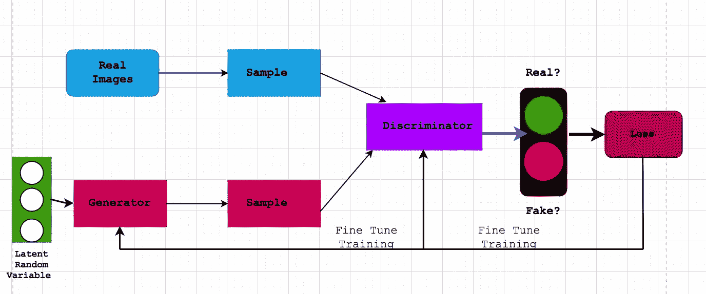

Vanila GAN Architecture

为了更好地理解这一点，让我们看看 Ian Goodfellow 和他的同事在 2014 年发表[原始论文](https://papers.nips.cc/paper/5423-generative-adversarial-nets.pdf)时使用的类比。生成器就像一队伪造者试图创造一个与真画相匹配的输出(输入)，而鉴别器就像一队侦探试图确定真实图像和假图像之间的差异。对于算法的每次迭代，生成器永远不会看到原始输入，而是看到潜在的随机变量(基于真实输入图像的视觉噪声)和鉴别器的判断。这个生成器就像一个盲人伪造者，试图通过给她颜料来重现蒙娜丽莎，然后侦探告诉她如何使用它。伪造者画的画在每次迭代后看起来越来越像蒙娜丽莎。

## 深度卷积 GAN (DCGAN)

普通 GAN 架构功能强大，但这种架构不允许任何真正的空间推理，因为它依赖前馈神经网络而不是卷积神经网络来从图像中提取特征。前馈神经网络不能推理诸如尖锐边缘和突出曲线之类的特征，因为它们不保持图像的空间结构。卷积层保留了图像的空间结构，这意味着将从图像中提取最准确、最详细的特征。这为生成器和鉴别器提供了关于它们将生成的输出以及关于如何区分真实图像中的特征和伪图像中的特征的更高级的空间推理能力。所提取的特征的增强质量通常是在处理图像时使用 DCGAN 的原因。

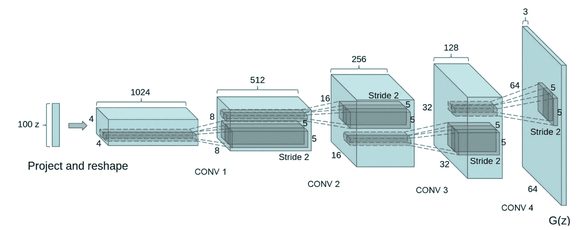

[source](https://arxiv.org/pdf/1511.06434.pdf)

生成器和鉴别器都将是卷积神经网络。鉴别器有一个普通的 CNN 架构，因为它执行的是鉴别、监督的图像分类任务。生成器将具有如下修改的卷积架构:

*   池化被卷积步幅所取代。这允许网络学习它自己的空间下采样(改变输入的大小)。不需要事先设置。
*   CNN 的结尾没有完全连接的层。生成器不是分类器，因此不需要这一部分。
*   除了生成器的输出图层和鉴别器的输入图层之外，批处理规范化用于每个图层。这通过标准化激活(先前层具有零均值和单位方差)和梯度的流动来稳定训练过程。在[的论文](https://arxiv.org/abs/1511.06434)中，结果表明发生器中的输出层和鉴别器中的输入层导致模型不稳定，这就是为什么在那些层中不使用批范数。
*   在生成器中使用 ReLU，但使用 tanh 的输出除外。双曲正切函数的对称性允许模型更快地学习饱和并覆盖训练分布的颜色空间。

# 发电机:

发生器接收随机噪声作为输入，并对鉴频器的输出进行采样，以产生图像。这个过程可以被认为是将噪声映射到输入数据分布，以便产生图像。生成器架构是一个经过修改的卷积神经网络，由 ConvTranspose2d 层组成，这些层具有可学习的参数，其余架构如上所述。

```
nn.Sequential(
 nn.ConvTranspose2d( nz, ngf * 8, 4, 1, 0, bias=False),
 nn.BatchNorm2d(ngf * 8),
 nn.ReLU(True),
 nn.ConvTranspose2d(ngf * 8, ngf * 4, 4, 2, 1, bias=False),
 nn.BatchNorm2d(ngf * 4),
 nn.ReLU(True),
 nn.ConvTranspose2d( ngf * 4, ngf * 2, 4, 2, 1, bias=False),
 nn.BatchNorm2d(ngf * 2),
 nn.ReLU(True),
 nn.ConvTranspose2d( ngf * 2, ngf, 4, 2, 1, bias=False),
 nn.BatchNorm2d(ngf),
 nn.ReLU(True),
 nn.ConvTranspose2d( ngf, nc, 4, 2, 1, bias=False),
 nn.Tanh()
 )
```

## 随机噪声:

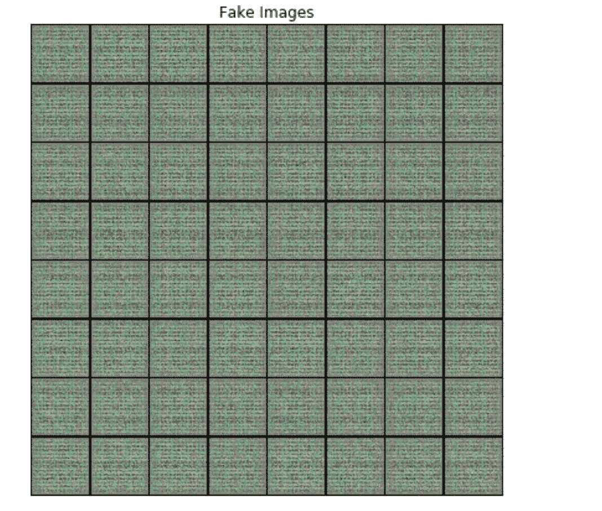

Random Noise

在生成式学习中，机器试图从复杂的概率分布(输入)中生成新的输出。在深度学习中，同样的想法被建模为神经网络——在我们的情况下是卷积神经网络——它将简单的随机变量作为输入，并将遵循目标分布的随机变量作为输出。神经网络能够导出输入概率分布中的等级关系。在这种情况下，这种关系，即随机噪声，是一组类似于真实图像的像素。

在训练循环的第一次迭代中，随机噪声被发送到鉴别器，它确定噪声与真实图像的相似程度。然后，一旦鉴别器告诉它与原始输入的偏差有多大，生成器就会获取该信息并调整噪声，直到它变成类似输入的图像。因此，**发电机不会直接与输入**一起工作。生成器间接地学习如何将噪声转换成看起来像输入的东西。

```
fixed_noise = torch.randn(64, nz, 1, 1, device=device)
```

## **2D 转置图层**

发生器层由 ConvTranspose2d 层组成。这些层将对噪声向量进行上采样，从而将噪声转换为图像。这与反卷积或卷积层不是一回事。卷积层寻求提取越来越小的特征，这些特征稍后将被分类。去卷积层寻求*反转*卷积层的操作。

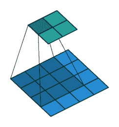

2D Transpose Layer

从最简单的意义上说，转置导致至少两个事物相互交换位置。噪声向量和图像空间将彼此交换位置。这意味着我们正在改变它们的维数顺序，因此，我们将交换矩阵中相对于对角线的值。此过程会对最终输出(图像)的细节进行上采样(放大和填充)。这是发生器“绘制”实际图像的部分。

从高层次来看，如果你看架构，这更有意义。我们从噪声矢量开始。这个向量不是图像。噪声是图像的压缩版本。发生器中的 2D 转置层将解压缩噪声，因此它可以成为一个 8x8 的图像，所有细节都在图像的正确位置。这是发电机的最终产品。

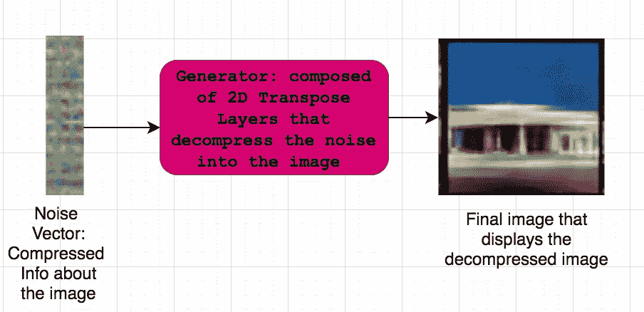

2D Transpose Layer

# 鉴别器

鉴别器得到真实和伪造的图像，它的工作是将它们分类为真实或伪造的。

```
nn.Sequential(
 nn.Conv2d(nc, ndf, 4, 2, 1, bias=False),
 nn.LeakyReLU(0.2, inplace=True),
 nn.Conv2d(ndf, ndf * 2, 4, 2, 1, bias=False),
 nn.BatchNorm2d(ndf * 2),
 nn.LeakyReLU(0.2, inplace=True),
 nn.Conv2d(ndf * 2, ndf * 4, 4, 2, 1, bias=False),
 nn.BatchNorm2d(ndf * 4),
 nn.LeakyReLU(0.2, inplace=True),
 nn.Conv2d(ndf * 4, ndf * 8, 4, 2, 1, bias=False),
 nn.BatchNorm2d(ndf * 8),
 nn.LeakyReLU(0.2, inplace=True),
 nn.Conv2d(ndf * 8, 1, 4, 1, 0, bias=False),
 nn.Sigmoid()
 )
```

## 体系结构

鉴别器是具有上述结构的卷积神经网络。这为鉴别器提供了空间推理能力，它需要学习哪些精确的空间保留特征使图像真实，然后使用这些空间保留特征将图像分类为真实或虚假。鉴别器不使用与生成器相同的 2D 转置图层，因为鉴别器执行的是监督任务-隔离和提取要素-而不是生成任务-对要在影像中创建的要素进行上采样。

## 间接培训

鉴别器将向生成器提供信息，因此它将学习如何创建鉴别器在真实图像中发现的真实特征。最终，我们希望生成的图像非常好，以至于鉴别器无法区分真实图像和虚假图像。这意味着我们需要间接训练 DCGAN。DCGAN 中的发生器并不试图精确匹配输入的概率分布，而是该发生器正在创建一个概率分布，它可以*欺骗*鉴别器网络，使其认为发生器的输出分布来自与真实图像相同的分布。

然后鉴别者会给一幅图像打分，显示它看起来有多像一幅真实或虚假的图像。在训练中，生成器希望让鉴别器给生成的图像打高分，这样鉴别器就会认为假图像是真的。该分数稍后用于学习过程，该学习过程允许生成器在生成图像方面变得更好，并且允许鉴别器在分类图像方面变得更好。

# 损失函数和学习过程

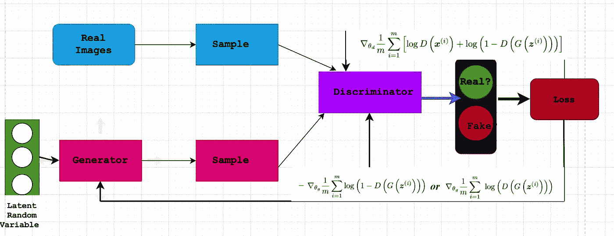

Training Process

## 鉴别器

鉴别器输出值 D，该值指示生成的图像与真实图像有多接近。目标是最大化鉴别器将真实图像识别为真实而将生成的图像识别为伪造的机会。交叉熵函数测量该过程的损失 p log(q)。该功能衡量分类模型的性能。这个函数特别适合这个任务，因为预测的概率偏离标签越远，损失就越大。

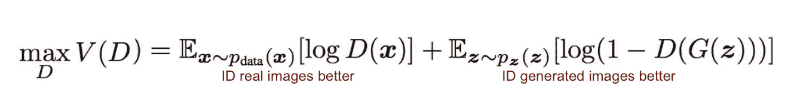

Discriminator Loss

真实的图像， *p* 等于 1 它是真实的最大几率。对于生成的图像，我们需要反转标签(减 1)以最小化它是 1 的机会。这是鉴别器的目标函数。

## 发电机

生成器的目标是创建图像来欺骗鉴别者。这意味着它的目标函数想要鼓励模型创建具有最高可能值 **D** 的图像来欺骗鉴别者。

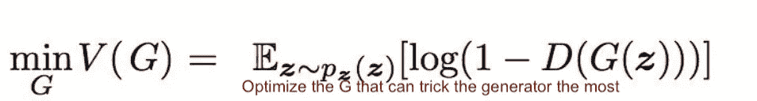

Generator Loss

## 最小最大游戏

GAN 是一种极小极大游戏，其中 **G** 想要最小化 **V** 而 **D** 想要最大化 V。这是一种零和非合作游戏，你的对手想最小化他们的行动，而你想最大化他们的行动；双方都在最大化自己的收益。目标是最小化最大损失(最小化最坏情况)。

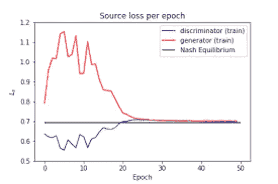

Nash Equilibrium [source](https://arxiv.org/pdf/1805.01972.pdf)

MinMax 游戏来自博弈论。GANs 被设计成达到一个纳什均衡点，在这个点上每个参与者都不能在不改变其他参与者的参数的情况下降低他们的成本。当鉴别器和发生器达到纳什均衡时，GAN 收敛。这是上面最小最大方程的最优点。纳什均衡点意味着成本降低，没有什么可以改变。生成器能够创建欺骗鉴别器的图像。至此，两个目标都达到了。

有些函数不会收敛。这通常发生在非凸函数中。从博弈论的角度来说，当你的对手总是反对你的行动时，很难让你的模型收敛。这就是为什么甘的训练如此困难的原因。

## 输出

现在公布结果！最终，在 GPU 上进行了 500 次训练后，结果出来了。这是训练过程的 GIF 图片:

你可以看到从随机像素到像素化图像再到建筑图像的过程。

这些是我最喜欢的(精选的)图片:

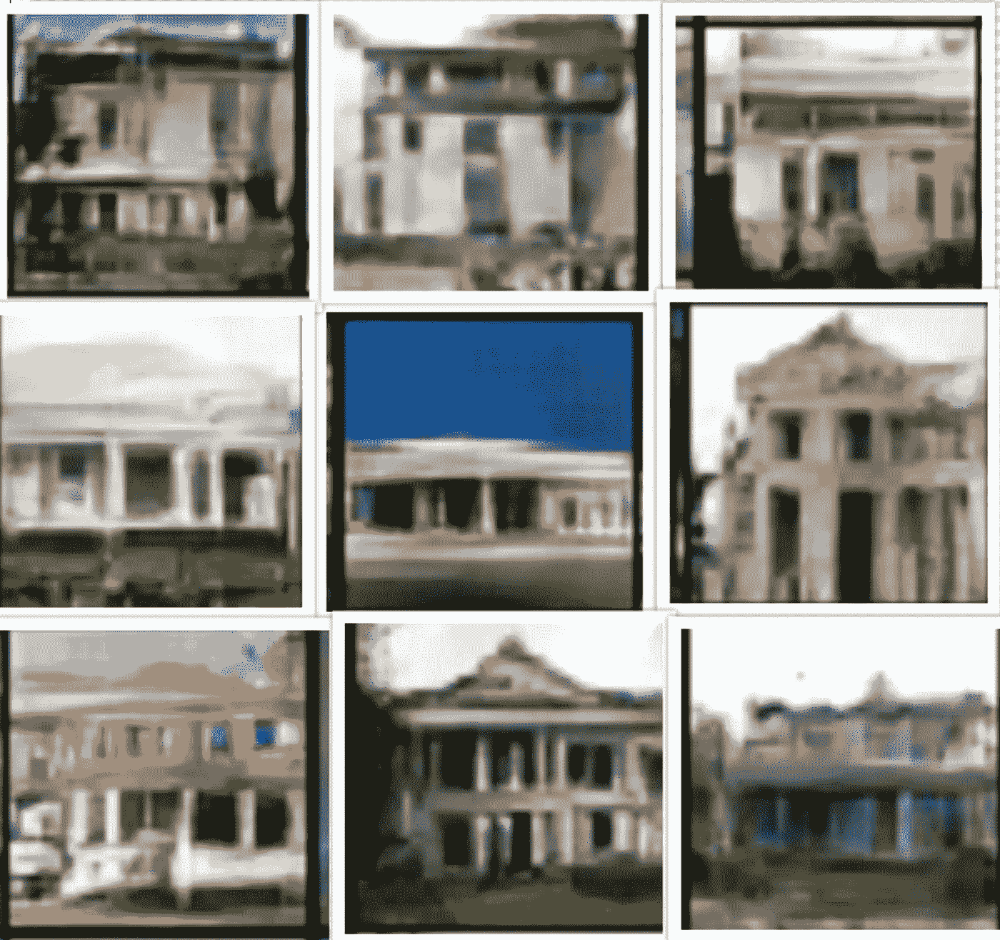

I would live there!

并非所有生成的图像看起来都完美。有些有一个扭曲的，变色的，像素化的门面，只有母亲才能爱…

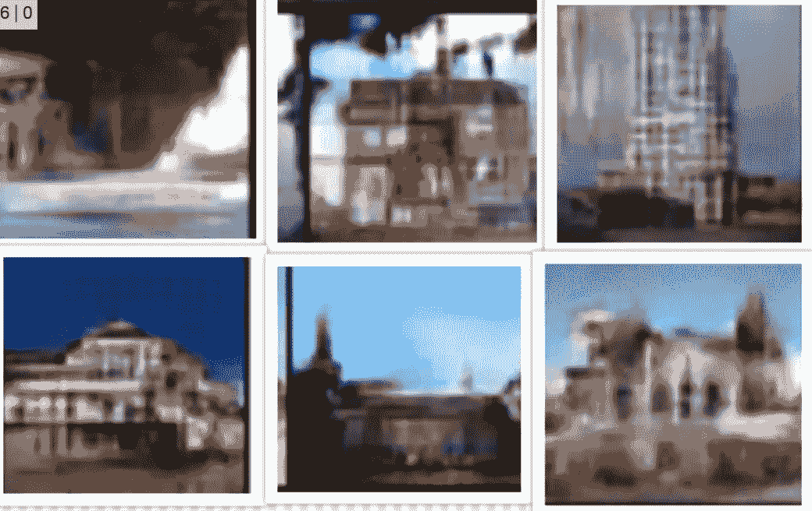

distorted, discolored pixelated images

## 结论

一般的对抗网络同时处理所有这些领域:无监督学习、博弈论和监督学习。这证明了费曼所说的，为了理解某事，你必须能够创造它。创造本质上是多维的——为了做出新的东西，你必须能够同时理解不止一个想法或功能的交互——当深度学习具有这种能力时，它的能力可能是无限的。这种力量显然伴随着前所未有的责任，但未来无监督学习和特别是生成模型，如甘的模型，具有重新定义深度学习和人工智能的巨大潜力。

点击这里查看整个项目！

 [## emilyelia/建筑-DCGAN

### 此时您不能执行该操作。您已使用另一个标签页或窗口登录。您已在另一个选项卡中注销，或者…

github.com](https://github.com/emilyelia/Architecture-DCGAN)