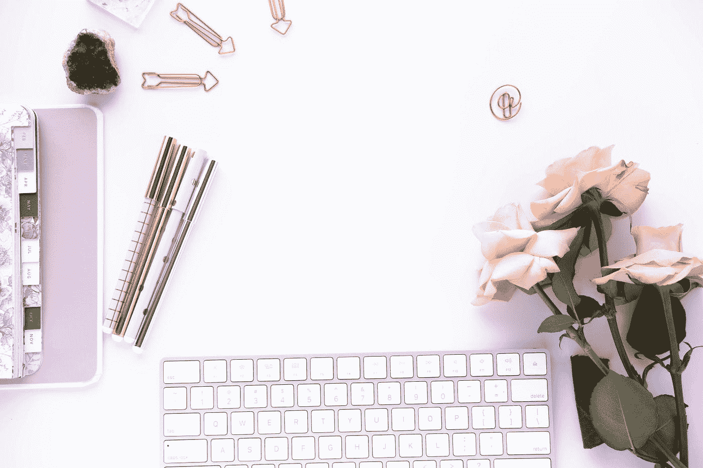
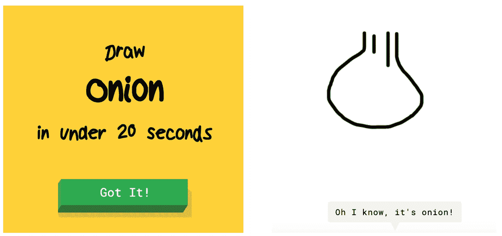
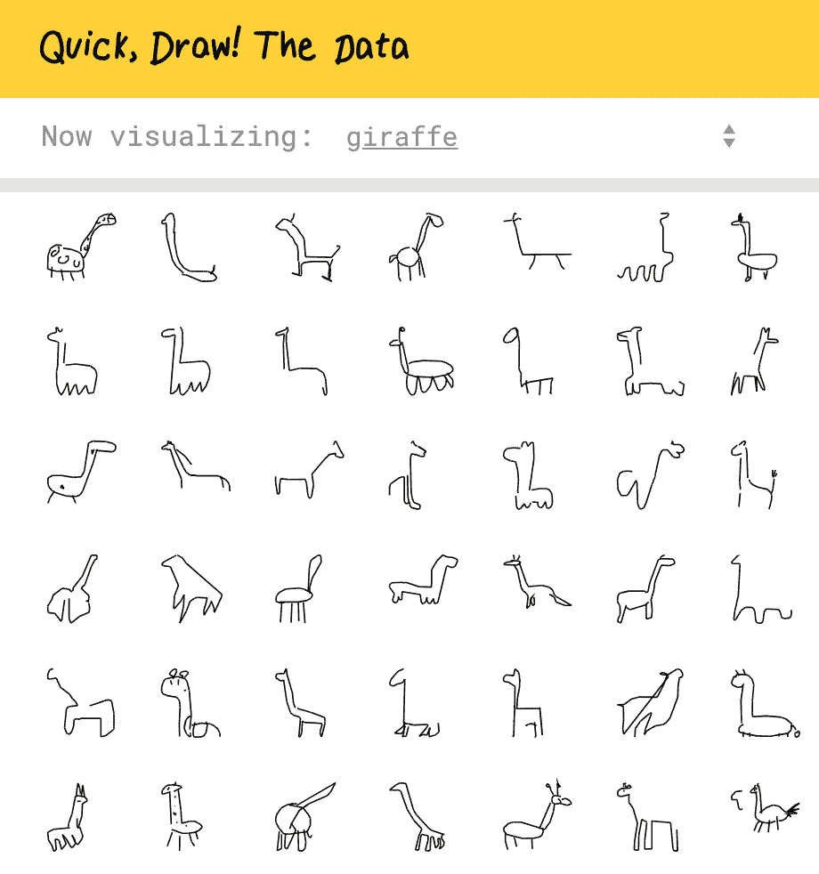
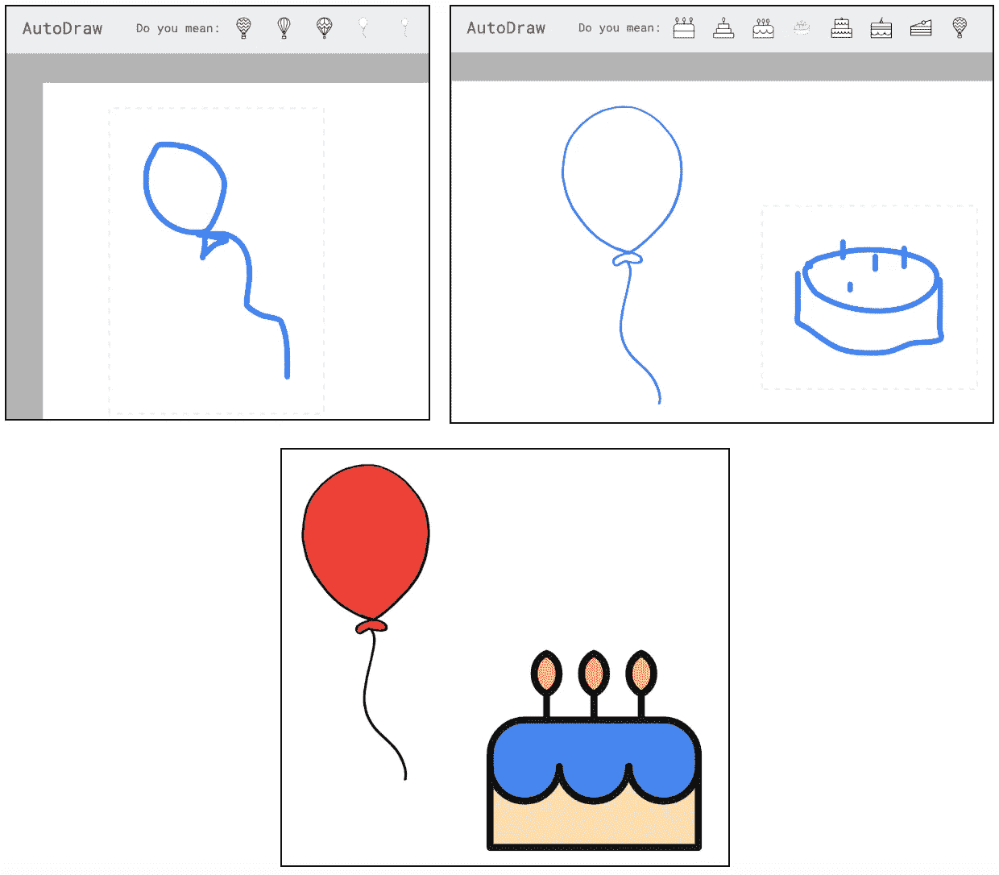
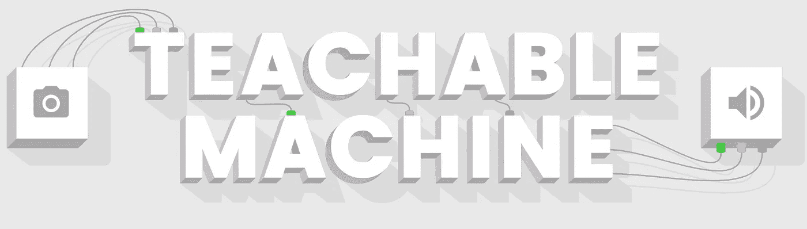
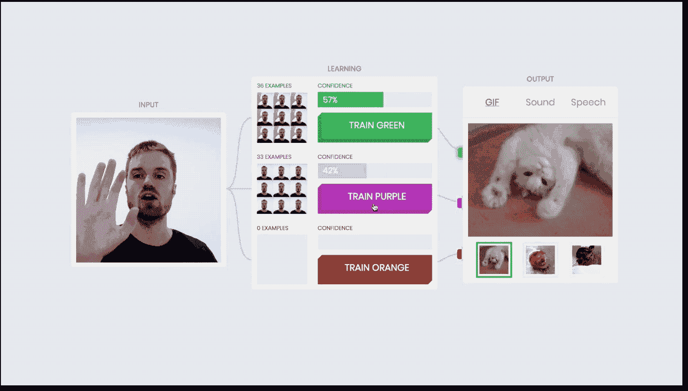
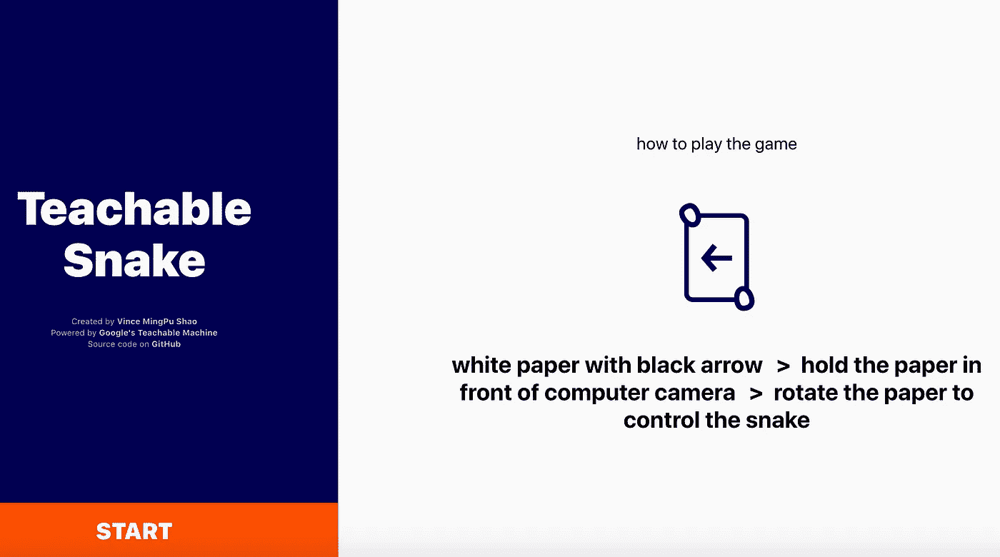
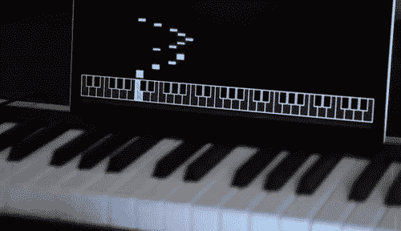

# 像机器一样画画和其他人工智能实验

> 原文：<https://towardsdatascience.com/drawing-like-a-machine-and-other-ai-experiments-c121e0904b2c?source=collection_archive---------29----------------------->

Photo by [Ms Jemini Photos](https://unsplash.com/@msjeminiphotos?utm_source=medium&utm_medium=referral) on [Unsplash](https://unsplash.com?utm_source=medium&utm_medium=referral)

你有没有想过“人工智能”这个术语背后隐藏着什么？使用谷歌实验准备的在线应用程序，可以看到“机器学习”给我们带来的可能性。总的来说，是一群设计师和工程师创造有趣的实验，作为引入这些基于谷歌技术的概念的一种方式。有些是可爱快捷的网页游戏，有些更先进，但所有这些都是为了让其他人更容易理解新技术。

## [1。快，画！](https://quickdraw.withgoogle.com/)

快，画！是一个类似于猜字游戏的网络游戏。不同的是，你不是和你的朋友玩，而是和电脑玩。你有 20 秒的时间根据显示的单词画一幅画，同时人工智能会根据你在屏幕上涂写的所有线条来猜测你在画什么。

Best onion drawing ever

在这个项目的开始，这个模型被故意训练得不完美，所以它会更有趣。用户做出的所有涂鸦都有助于创建一个充满绘画的描述良好的数据集。由于它们，用于建立这个模型的神经网络每天都在学习越来越多的东西。由超过 5000 万张图片组成的数据集在[在线](https://github.com/googlecreativelab/quickdraw-dataset)可用。它启发了许多研究人员建立新的模型，发表研究论文并进行各种分析，如[你在画火烈鸟方面有多糟糕](https://colinmorris.github.io/blog/bad_flamingos)。下面你可以看到人们画长颈鹿的不同方式。

Example of giraffe drawings made by users

这是描述该网站的官方视频:

## [2。自动绘图](https://www.autodraw.com/)

另一个绘图应用程序的例子是 AutoDraw——多亏了这个应用程序，你可以画出你生活中最好的插图。该网站的广告是“为每个人快速绘图”，这是相当准确的描述。你是否曾经计划为聚会制作一份传单，但你缺乏绘画技巧，结果总是使用预先制作的模板？

Here you can see my drawing skills again (or lack of them)

在这个网站上，你可以画出你想要的任何东西，计算机会尽力帮助你完成这项任务。给你的漫画添加更多的细节将会导致计算机方面更准确的预测，如果你对它满意，你可以简单地用 site 提出的图纸交换你的图纸。

AutoDraw 模型是在 Quick，Draw！但是剪贴画本身是由各种插图画家和设计工作室制作的。

AutoDraw 官方视频:

## 3.[可示教机器](https://teachablemachine.withgoogle.com/)

在这个网站上，你可以教电脑按照你想要的方式运行。使用您的摄像头，可教机器让您在浏览器中现场教机器，而不需要任何编码经验。这个实验让任何人都更容易开始探索机器学习是如何工作的。

那么，它是如何工作的呢？在屏幕上，你可以看到来自你的相机，三个大按钮和 gif 的饲料。来自相机的图片将成为神经网络算法学习的输入。在做不同的手势时，你必须使用“训练”按钮拍照。对于每一种姿势，你至少需要拍 30 张照片。这三类图片与输出相关联——第一个手势将启用第一个 gif，第二个和第三个是后续的。在训练完你的神经网络后，你可以马上测试它。显示与教导阶段相同的手势将导致输出的改变。

你也可以改变 gif 图片，让网站显示你挑选的图片。除了 gif，你可以得到的另一种类型的输出是声音和语音——你可以选择不是显示猫和兔子，而是与计算机进行对话。向算法提供你的数据和它学习正确分类的整个过程就是机器学习的全部内容。

建立在可教机器之上的应用之一是[可教蛇](https://teachable-snake.netlify.com/)。正如你可能会猜测，这是一个众所周知的蛇游戏，但控制器是你必须使用你的相机显示的迹象。拿一张纸，画一个箭头，告诉蛇它必须去哪里吃掉所有的点！

## 4.[人工智能二重唱](https://experiments.withgoogle.com/ai/ai-duet/view/)

在这个实验中，你可以和机器一起演奏钢琴二重奏。在这里，你可以释放你所有的音乐创造力，并尝试使用你的笔记本电脑键盘和人工智能一起演奏最好的即兴二重奏。A.I. Duet 是一个工具，它通过神经网络运行你弹奏的音符，并试图在这场冒险中陪伴你。神经网络已经用大量的旋律样本进行了训练。在传统的编程方法中，代码需要实现音符、键和定时之间所有可能的连接。人工智能二重奏模型从数据角度创造了旋律的所有规则，并将它们结合在一起，现在它可以生成与你的部分相匹配的全新曲调。

## 5.[乔治·卡姆](https://experiments.withgoogle.com/ai/giorgio-cam/view/)

这个实验结合了两大机器学习问题——图像识别和语音合成。它始于用户用手机里的相机给他们周围的东西拍照。Giorgio Cam 试图识别该对象，并对其发现的内容进行描述。这段描述后来被改编成了乔治奥·莫洛德尔创作的说唱歌曲的歌词。通过拍摄不同的东西，再加上你的手机，你可以成为一个说唱之王！

## 摘要

总的来说，上面所有的例子都显示了机器学习是如何工作的——它收集大量的输入，并从中学习来预测一些事情。当越来越多的人使用这些应用程序，并告诉他们什么是对或错时，这些应用程序受益最大。从用户那里收集的正确数据越多，结果就越准确。人工智能还有比敲击相机和用电脑玩哑谜更高级的应用，但这些只是简单的例子，可以向你展示我们从使用算盘计数到现在已经走了多远。