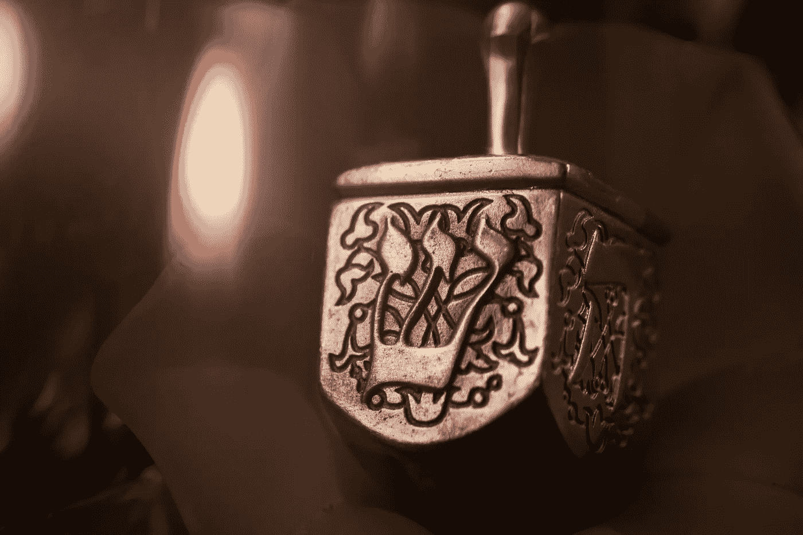
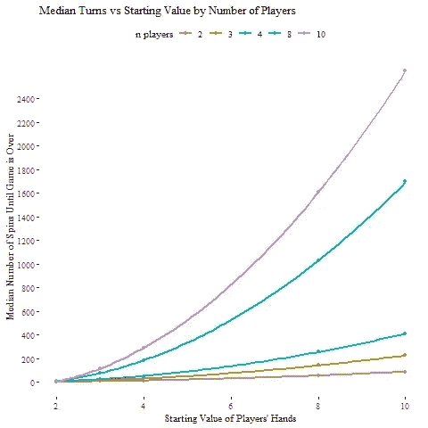
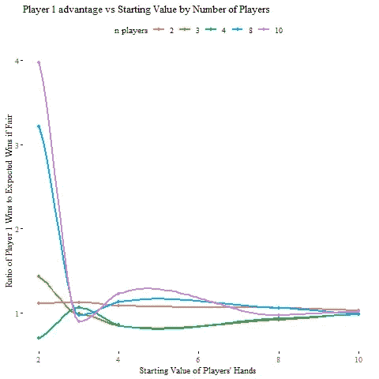

# 德雷德尔分析公司

> 原文：<https://towardsdatascience.com/dreidel-analytics-moneyball-for-ancient-gambling-5a0142a11097?source=collection_archive---------26----------------------->

Photo by [Robert Zunikoff](https://unsplash.com/@rzunikoff?utm_source=unsplash&utm_medium=referral&utm_content=creditCopyText) on [Unsplash](https://unsplash.com/s/photos/dreidel?utm_source=unsplash&utm_medium=referral&utm_content=creditCopyText)

## 古代赌博用的钱球

## 介绍

就像迪斯尼的奥拉夫唱的那样(这些天他差不多一直在我家唱)“现在是一年中的这个时候！”如果你是犹太人，或者你的家庭受到多元文化小学教育的影响，你可能会被劝在这个周末玩一些[纸牌游戏。你不能从维基百科学到的是，根据广泛的分析确定，享受德雷德尔的关键是每个玩家只玩 3 个标记。](https://en.wikipedia.org/wiki/Dreidel)

就我个人而言，我认为你应该完全跳过打陀螺，直接吃马克笔。但也许玩 dreidel 会让你闻到马加比营地的木头烟味和羊肉味，并与一个紧张地争论自己是 T4 自由战士还是激进原教旨主义者的年轻游击战士建立联系。或者也许你会和那些已经开始吃糖果的孩子一起庆祝。

在这种情况下，你需要玩，玩得没有挫败感，这样你就可以回到假期体验中更愉快的部分。控制游戏持续时间是保持游戏乐趣的最容易获得的杠杆，事实证明，游戏长度因玩家可用标记的数量而变化很大。如果你只是想看为什么是 3 个标记而不是 4 个(但愿不会如此)，跳过方法部分，直接看结果。如果你想了解内部工作原理，请继续阅读。

## 方法

让我们模拟游戏来确定开始计数器的数量和完成游戏所需的回合数之间的关系。一路上我们会检查游戏的公平性(剧透警告:维基百科是对的；dreidel 不公平)。

为了在 R 中模拟游戏，我们将构建一个新的类“gameState ”,它将记录 dreidel 任何给定旋转后游戏的状态。这意味着它将跟踪每个玩家的计数器数量、底池中的计数器数量、回合数、下一个轮到的玩家、游戏中的玩家数量以及仍有计数器的玩家数量。我们将使它成为一个类，这样我们就可以创建一个方便的打印方法来改进 gameState 对象的调试和一般可用性。

这相对简单，如下所示:

现在我们已经定义了这个类，我们需要一个基于 dreidel 旋转来更新游戏状态的方法。让我们将传统的{ג,ה、נ,ש的 dreidel 方映射到{4，3，2，1}，并使用整数作为输入，看看如何更新当前用户的持有量和底池的值，将回合数加 1，然后重新计算仍在游戏中的玩家人数。如果我们想通过改变底注的值来改变规则，让我们把它作为输入包含到 takeATurn 函数中。

这个函数比我预期的要复杂得多。大部分这些复杂的部分都是为了防止在“真实”游戏中不会发生的极端情况下的无限循环。这可能是一个基本的编程课程，但让我们继续关注如何在不玩太多的情况下玩够 dreidel。

既然我们可以玩一轮德赖德，那么玩德赖德到只剩下一个玩家就很容易了。为了简化我们的模拟调用，让我们制作一个名为 runGame 的新函数，它只是重复旋转一个 dreidel ( *ceiling(runif(1，0，4)* )调用 *takeATurn()* ，直到只剩下一个活动玩家，返回最终的游戏状态。为了对模拟结果进行一些分析，runGame 应该将允许创建不同游戏的输入(例如，玩家数量和每个玩家获得的计数器数量)作为输入。

模拟 10，000 个游戏感觉足以理解一个游戏可能要走多少个回合。因为如此多的迭代会花费大量时间，所以我们应该使用 foreach 和 doParallel 包在多个内核上运行这些游戏。这里有一个循环来模拟不同玩家数量和标记起始数量(每个玩家)的游戏:

## 结果

通过绘制中值回合数与起始代币数的图表，我们可以看出为什么过去所有的德雷德尔游戏都以提前吃掉代币而告终。四个玩家和 10 个标记给出了 400+旋转的平均时间！

但是让我们来看 3 个标记。即使有 10 名球员(当然我们可以做两场 5 人的比赛？)一场比赛的中位数是 300 次旋转。对于一个更典型的 4 人游戏来说，中间时间不到 20 分钟(在我的模拟中是 22 分钟)。每个人旋转 5 次(对于中位游戏)，这足以满足每个人旋转 dreidel 的愿望，但不会旋转太多，以至于你必须吃掉所有的标记才能离开游戏。

但是不公平的部分呢？事实证明这相当复杂。似乎每个玩家的标记数量、玩家数量以及哪个玩家具有优势之间存在某种关系。

我们可以专注于首选的起始值 3，而不是理解所有这些，对于玩家数量的所有测试值，模拟结果返回非常接近公平值 1，这让我们感觉很好。

## **结论**

Dreidel 一直坚持不是因为它有趣，而是因为它是传统。鉴于传统在节日期间有着不可避免的重要性，应用一些分析来优化我们如何处理传统是为一年中的*那个*时间做准备的一个很好的方式

从这个简单的模拟中，我们可以看到，一个不错的每人 5 次旋转的 dreidel 游戏需要比大多数玩家使用的代币少得多的代币(从 3 个开始！).我们还可以看到，如果我们想偷所有的孩子的糖果，我们应该在一大群玩家中玩，先走，使用 2 或 4 个标记。

如果你想运行你自己的 dreidel 模拟，你可以从[这里](https://gist.github.com/lorenze3/8be3ed5a3059f040f8c90aec947c0035)获得本文中使用的全部代码。

我希望你的假期愉快、有趣、没有烦恼。