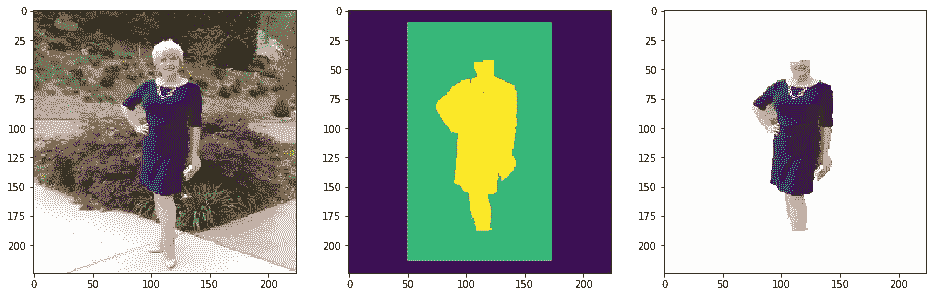

# Keras 中基于自动编码器的服装分割

> 原文：<https://towardsdatascience.com/dress-segmentation-with-autoencoder-in-keras-497cf1fd169a?source=collection_archive---------12----------------------->

## 从照片中提取服装


Photo by [Oladimeji Odunsi](https://unsplash.com/@oladimeg?utm_source=medium&utm_medium=referral) on [Unsplash](https://unsplash.com?utm_source=medium&utm_medium=referral)

时尚行业是人工智能非常赚钱的领域。数据科学家可以在很多领域开发有趣的用例并提供好处。我已经展示了我对这个领域的兴趣[在这里](/zalando-dress-recomendation-and-tagging-f38e1cbfc4a9)，我开发了一个从 Zalando 在线商店推荐和标记服装的解决方案。

在这篇文章中，我试图进一步开发一个系统，该系统接收原始图像(从网络上获取或用智能手机制作)作为输入，并尝试提取其中显示的服装。请记住，分割的挑战是臭名昭著的极端噪声出现在原始图像；我们试图用聪明的技巧(在预处理期间)开发一个强大的解决方案来处理这个方面。

最后，你也可以尝试将这个解决方案与[之前引用的](/zalando-dress-recomendation-and-tagging-f38e1cbfc4a9)合并。这允许你开发一个系统，通过你外出时拍摄的照片，实时推荐和标记服装。

# 数据集

最近，一个关于服装视觉分析和分割的 [Kaggle 竞赛](https://www.kaggle.com/c/imaterialist-fashion-2019-FGVC6)也启动了。这是一个非常有趣的挑战，但这并不适合我们…我的目标是从照片中提取服装，因此由于其冗余和细粒度的属性，这个数据集是不够的。我们需要包含大部分服装的图像，所以最好的选择是我们自己构建数据。

我从网上收集了一些图片，这些图片包含了在不同场景下穿着不同类型女装的人们。下一步需要创建遮罩:如果我们希望训练一个能够只关注真正感兴趣的点的模型，这对于每个对象分割任务都是必要的。

下面我报告一个数据样本供我们使用。我从网上收集了*原始的*图片，然后我很享受地进一步剪辑它们，把*人*和*衣服分开。*


Example of image segmentation

我们进行这种区分，是因为我们想在背景、皮肤和着装之间进行区分。背景和皮肤是这类问题中最相关的噪声源，所以我们尽量抑制它们。

有了这些剪报，我们可以重新创建我们的面具如下所示，这是简单的图像二值化。皮肤是因人和服饰的不同而获得的。


Example of masks

最后一步，我们将所有的图像合并成一个三维的图像。这张图片解码了我们感兴趣的*原始*图像的相关特征。我们的目的是保持背景，皮肤和服装之间的分离:这个结果对我们的范围来说是完美的！


Final mask

我们对数据集中的每一幅图像重复这个过程，以便为每一幅原始图像建立一个相关的三维蒙版。

# 模型

我们拥有一切来创造我们的模型。我们心目中的工作流程非常简单:

我们拟合一个模型，该模型接收原始图像作为输入，并输出三维掩模，即它能够从原始图像中重建皮肤/背景和服装之间的期望分离。这样，当一个新的 raw 图像进来时，我们可以将其分成三个不同的部分:背景、皮肤和服装。我们只考虑我们感兴趣的通道(服装)，用它从输入图像中创建一个蒙版，并剪切它以重新创建原始服装。

由于 UNet 的力量，所有这些魔法都是可能的。这种深度卷积自动编码器通常用于像这样的分割任务。它很容易在 Keras 中复制，我们训练它为我们想要的遮罩的每个通道重建像素。


在开始训练之前，我们决定用它们的 RGB 平均值来标准化我们所有的原始图像。

# 结果和预测

我们注意到，在预测过程中，当我们遇到具有高噪声(就模糊背景或皮肤而言)的图像时，我们的模型开始挣扎。这种不便可以通过简单地增加训练图像的数量来克服。但是我们也发展了一个聪明的捷径来避免这些错误。

我们使用 OpenCV 提供的 GrubCut 算法。该算法利用高斯混合模型实现前景和背景的分离。这对我们很有帮助，因为它有助于指出前景中的人周围去噪。

这里我们实现了一个简单的函数来实现它。我们假设我们感兴趣的人站在图像的中间。

```
def cut(img): img = cv.resize(img,(224,224))

    mask = np.zeros(img.shape[:2],np.uint8)
    bgdModel = np.zeros((1,65),np.float64)
    fgdModel = np.zeros((1,65),np.float64)
    height, width = img.shape[:2] rect = (50,10,width-100,height-20)
    cv.grabCut(img,mask,rect,bgdModel,fgdModel,5,
               cv.GC_INIT_WITH_RECT)
    mask2 = np.where((mask==2)|(mask==0),0,1).astype('uint8')
    img2 = img*mask2[:,:,np.newaxis]
    img2[mask2 == 0] = (255, 255, 255)

    final = np.ones(img.shape,np.uint8)*0 + img2

    return mask, final
```



GrubCut in action

现在我们应用 UNet，并准备在新图像上看到一些结果！


Input — GrubCut + Prediction — Final Dress


Input — GrubCut + Prediction — Final Dress


Input — GrubCut + Prediction — Final Dress


Input — GrubCut + Prediction — Final Dress


Input — GrubCut + Prediction — Final Dress

我们预处理步骤与 UNet 功能相结合，能够获得更好的性能。

# 摘要

在这篇文章中，我们开发了一个端到端的服装分割解决方案。为了达到这个目的，我们利用强大的自动编码器结合巧妙的预处理技术。我们计划这个解决方案是为了在真实照片的真实场景中使用它，并有可能在它的基础上建立一个视觉推荐系统。

[查看我的 GITHUB 回购 ](https://github.com/cerlymarco/MEDIUM_NoteBook)

保持联系: [Linkedin](https://www.linkedin.com/in/marco-cerliani-b0bba714b/)