# 卷积层上的丢失很奇怪

> 原文：<https://towardsdatascience.com/dropout-on-convolutional-layers-is-weird-5c6ab14f19b2?source=collection_archive---------3----------------------->

## 为什么卷积层上的丢失与全连接层上的丢失有根本的不同。

[Dropout](http://jmlr.org/papers/volume15/srivastava14a.old/srivastava14a.pdf) 常用于正则化深度神经网络；然而，在全连接层上应用丢弃和在卷积层上应用丢弃是根本不同的操作。虽然在深度学习社区中众所周知，当应用于卷积层时，辍学具有[有限的好处](https://www.cv-foundation.org/openaccess/content_cvpr_2015/papers/Tompson_Efficient_Object_Localization_2015_CVPR_paper.pdf) [，但我想展示一个简单的数学示例来说明这两者为什么不同。为此，我将定义 dropout 如何在全连接层上操作，定义 dropout 如何在卷积层上操作，并对比这两种操作。](https://papers.nips.cc/paper/8271-dropblock-a-regularization-method-for-convolutional-networks.pdf)

## 全连接层上的脱落

一个 *n* 层全连接神经网络(忽略偏差)可以定义为:

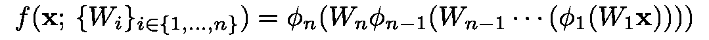

其中 *ϕᵢ* 为非线性(如 ReLU)，对于 *i* ∈{1，…， *n* }为权重矩阵， ***x*** 为输入。

考虑一个单隐层全连接神经网络*f(****x****)*:ℝ⁹→没有非线性和偏差的ℝ⁹。我们可以将网络表达为:

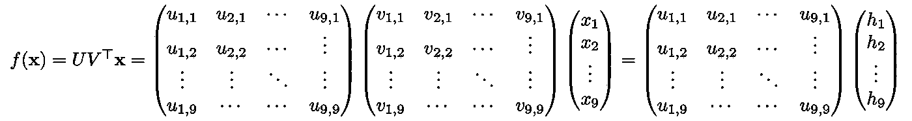

下面是我们的单隐层神经网络的示意图。

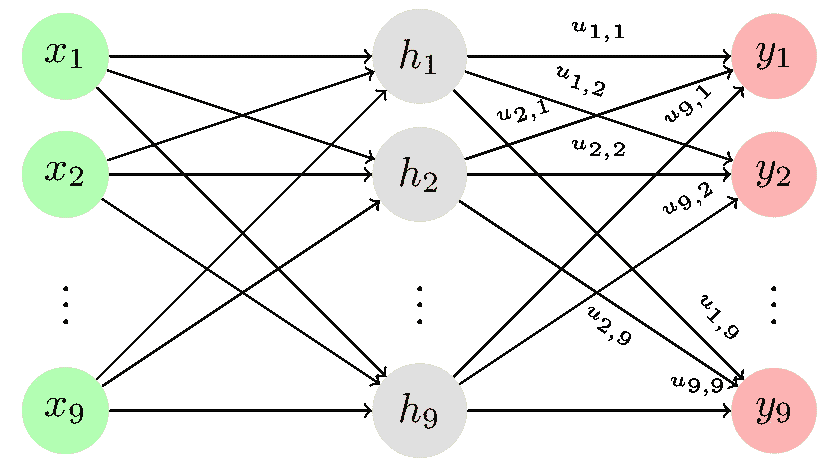

让我们把辍学加入到这个网络中。设 ***r*** ∈ {0,1}⁹为独立同分布(iid)伯努利随机变量的向量。在我们之前定义的神经网络中，Dropout 可以表示为:

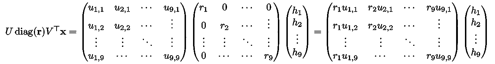

其中*v*ᵀ***x***已经折叠到 ***h*** 为空格。

要了解这如何等价于辍学，考虑具体的情况，其中 ***r*** = (1，0，0，…，0)ᵀ.最终的网络是:

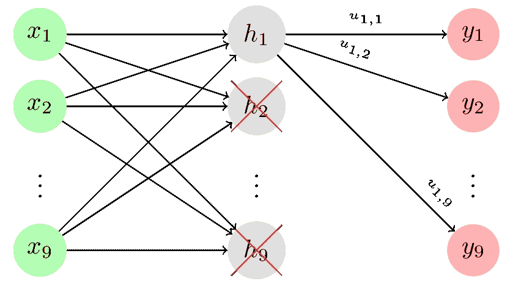

这就是最初的[辍学论文](http://jmlr.org/papers/volume15/srivastava14a.old/srivastava14a.pdf)中讨论的内容。

我们看到，全连接神经网络中的丢失等同于从与全连接层相关联的权重矩阵中清除一列。该操作对应于“丢弃”神经网络中的一个神经元。以这种方式丢弃神经元是合理的，因为定性地说，它促进了权重矩阵中的冗余，即子网络可以稳健地执行所需的操作。

## 卷积神经网络中的丢失

一个 *n* 层卷积神经网络(忽略偏差)可以定义为:

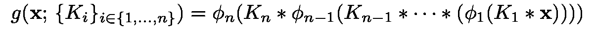

其中∫为卷积算子， *ϕᵢ* 为非线性， *Kᵢ* 为 *i* ∈{1，…， *n* }为卷积核， ***x*** 为输入。

为了弄清我们的方向，让我们先来研究卷积运算。我们可以将离散卷积重写为矩阵乘法。让我们考虑一下将 ***x*** ∈ ℝ ˣ与 *K* ∈ ℝ ˣ进行卷积。那么*K*∵****x***定义为:*

*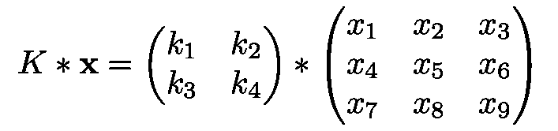*

*这在整形操作之前相当于:*

*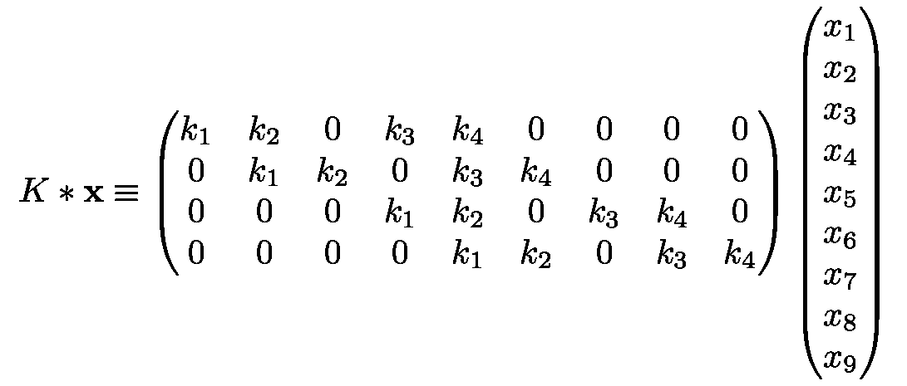*

*既然我们已经确定卷积可以作为矩阵乘法来应用，那么让我们以与我们表述全连接网络大致相同的方式来表述卷积网络。*

*设*g(****x****):*ℝˣ→ℝˣ是一个没有非线性和偏差的全卷积神经网络。本着我们之前网络的精神，我们将 *g* 定义为:*

*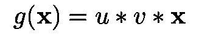*

*其中 *u，v* ∈ ℝ ˣ是卷积核， ***x*** ∈ ℝ ˣ是图像。*

*为了简单起见，也因为不影响我们的分析，让***【h =****v**∵***x***。注意，为了使变换 *g* 有效，我们需要在每个卷积层使用零填充。这可以合并到卷积核的矩阵形式中，因此我们的网络可以写成:**

**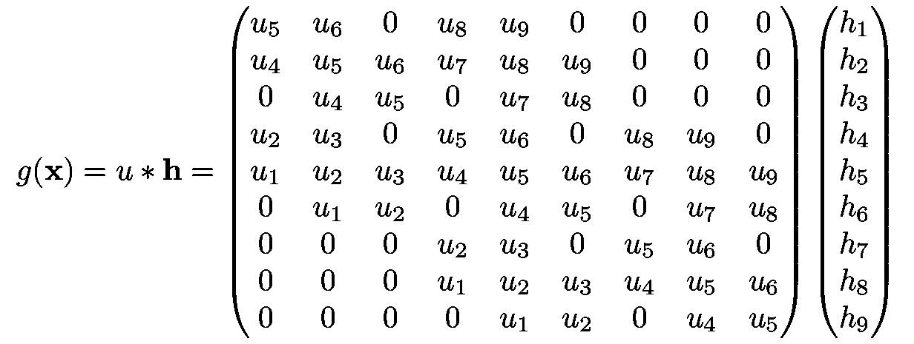**

**其证明留给读者作为练习。**

**像之前在我们的全连接网络中一样，让我们在卷积网络中加入 dropout。**

**设 *U* 定义为上式中的矩阵(即补零的扩展卷积核)设 ***r*** ∈ {0,1}⁹ iid 伯努利随机变量，如前。然后我们有:**

**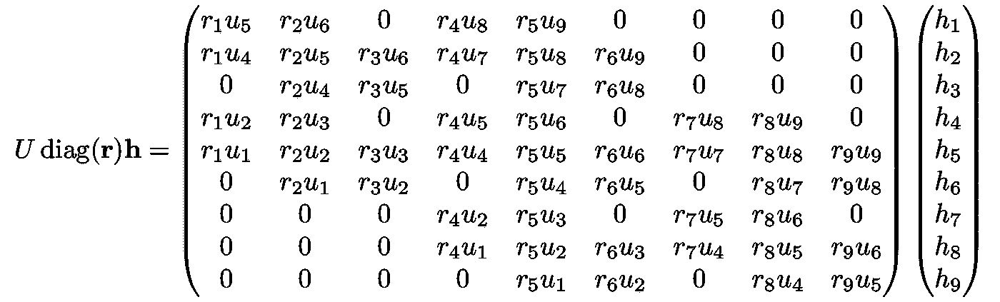**

**为了说明这种压差应用并不等同于全连接情况，只需关注前面所示矩阵左上角的 3 × 3 模块即可:**

**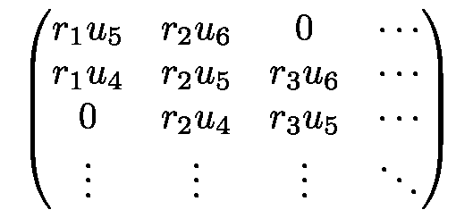**

**请注意，权重 *u* ₄ *，u* ₅ *，u* ₆ 在这个剪切图的三列中至少出现了两次。因此，如果 *r* ₁ = 0 和 *r* ₂=1 或 *r* ₁ = 1 和 *r* ₂=0，我们仍将更新权重 *u* ₅和 *u* ₄(不考虑 *r* ₃的值！).**

## **结果**

**在我们对全连接网络中的丢失的分析中，我们表明丢失操作可以理解为在神经网络中将权重矩阵的列清零。这个操作相当于不训练或“放弃”一个神经元。**

**在上面的分析中，我们已经表明卷积层上的丢失不会产生相同的效果。这由以下事实来证明:将对应于卷积核的权重矩阵的列置零仍然允许训练该列中的权重。**

**由于 dropout 通常用于在训练期间不随机训练神经元子集，而卷积层上的 dropout 不进行这种操作，因此该名称具有误导性，并且——因为效果不明显可解释——很奇怪。**

**我并不是说卷积层的丢包没有用。在[这些](https://arxiv.org/pdf/1511.02680.pdf) [论文](https://arxiv.org/abs/1506.02158)中，作者在卷积层上使用 dropout 时得到了更好的结果。然而，卷积层上的丢失效应似乎相当于将伯努利噪声乘以网络的特征图。我的观点是，在没有更多潜在理论的情况下，选择这种方式将噪声注入系统似乎很奇怪；在全连接层的情况下，哪个*是*的理论。**

**因此，如果您尝试在卷积层后添加 dropout 并得到不好的结果，不要沮丧！似乎没有很好的理由让*提供好的结果。***

## **补充说明**

**在全连接单隐层神经网络[上应用的丢失已经被示出](http://proceedings.mlr.press/v80/mianjy18b/mianjy18b.pdf)对应于可解释的正则化器，一个均衡权重矩阵的正则化器。然而，这些结果的推导大量利用了矩阵的每个元素的权重彼此独立的事实；这个事实在卷积层中不成立。我没有立即看到如何调和这一事实与卷积层，所以我不明白如何辍学可以提供类似的，可解释的正则化。**