# 基于机器学习的睡意检测

> 原文：<https://towardsdatascience.com/drowsiness-detection-with-machine-learning-765a16ca208a?source=collection_archive---------1----------------------->

## 我们的团队如何用 Python 构建一个睡意检测系统。

团队成员:[格兰特·钟](https://www.linkedin.com/in/grant-zhong/)、[瑞英](https://www.linkedin.com/in/rui-ying-0921/)、【何】王、[奥朗则布·西迪奎](https://www.linkedin.com/in/aurangzaibsiddiqui/)、[高拉夫·乔德里](https://www.linkedin.com/in/gauravgc/)

# **简介**

> “每 25 名成年司机中就有 1 人报告说，他们在过去 30 天里开车时睡着了”

如果你以前开过车，你会在某个时候昏昏欲睡。我们不愿意承认这一点，但这是一个有着严重后果的重要问题，需要加以解决。每 4 起交通事故中就有 1 起是由疲劳驾驶引起的，每 25 名成年司机中就有 1 人报告说他们在过去的 30 天里在开车时睡着了。最可怕的是，昏昏欲睡的驾驶不仅仅是在开车时睡着了。昏昏欲睡的驾驶可能小到当驾驶员没有完全注意道路时的短暂无意识状态。疲劳驾驶每年导致超过 71，000 人受伤，1，500 人死亡，以及 125 亿美元的经济损失。由于这个问题的相关性，我们认为开发一种用于困倦检测的解决方案是重要的，特别是在早期阶段以防止事故。

此外，我们认为困倦也会对人们在工作和课堂环境中产生负面影响。虽然睡眠不足和大学生活是密切相关的，但是在工作场所打瞌睡，尤其是在操作重型机械的时候，可能会导致严重的伤害，就像昏昏欲睡地开车一样。

我们对这个问题的解决方案是建立一个检测系统，识别困倦的关键属性，并在有人昏昏欲睡时及时触发警报。

# 数据源和预处理

对于我们的训练和测试数据，我们使用了由位于阿灵顿的德克萨斯大学的一个研究小组创建的[现实生活困倦数据集](https://sites.google.com/view/utarldd/home)，专门用于检测多阶段困倦。最终目标是不仅检测极端和可见的困倦情况，还允许我们的系统检测更柔和的困倦信号。该数据集由 60 名不同参与者约 30 小时的视频组成。从数据集中，我们能够从 22 名参与者的 44 个视频中提取面部标志。这使得我们能够获得足够数量的关于清醒和困倦状态的数据。

对于每个视频，我们使用 [OpenCV](https://pypi.org/project/opencv-python/) 从 3 分钟标记开始每秒提取 1 帧，直到视频结束。

```
import cv2
data = []
labels = []
for j in [60]:
   for i in [10]:
      vidcap = cv2.VideoCapture(‘drive/My Drive/Fold5_part2/’ +     str(j) +’/’ + str(i) + ‘.mp4’)
      sec = 0
      frameRate = 1
      success, image = getFrame(sec)
      count = 0
      while success and count < 240:
         landmarks = extract_face_landmarks(image)
         if sum(sum(landmarks)) != 0:
            count += 1
            data.append(landmarks)
            labels.append([i])
            sec = sec + frameRate
            sec = round(sec, 2)
            success, image = getFrame(sec)
            print(count)
         else:
            sec = sec + frameRate
            sec = round(sec, 2)
            success, image = getFrame(sec)
            print(“not detected”)
```

每个视频大约 10 分钟长，所以我们从每个视频中提取了大约 240 帧，整个数据集有 10560 帧。


Facial Landmarks from OpenCV

每帧总共有 68 个标志，但是我们决定只保留眼睛和嘴巴的标志(点 37-68)。这些是我们用来提取模型特征的重要数据点。

# 特征抽出

正如前面简要提到的，基于我们从视频帧中提取的面部标志，我们冒险为我们的分类模型开发合适的特征。虽然我们假设并测试了几个特征，但我们为最终模型总结的四个核心特征是眼睛长宽比、嘴巴长宽比、瞳孔圆形度，最后是嘴巴长宽比超过眼睛长宽比。

*眼睛纵横比(耳朵)*

耳朵，顾名思义，就是眼睛的长度与眼睛的宽度之比。如下图所示，眼睛的长度是通过平均穿过眼睛的两条不同的垂直线计算的。

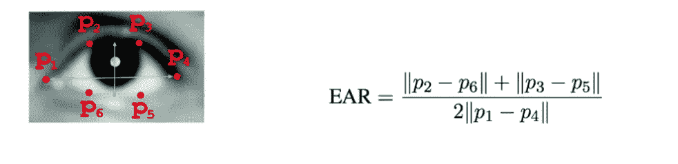

Eye Aspect Ratio (EAR)

我们的假设是，当一个人昏昏欲睡时，他们的眼睛可能会变小，他们可能会眨得更多。基于这一假设，如果一个人在连续帧中的眼睛纵横比开始下降，即他们的眼睛开始更加闭合或他们眨眼更快，我们预计我们的模型会将该类预测为困倦。

*口长宽比(MAR)*

如你所料，MAR 在计算上与耳朵相似，它测量嘴的长度与宽度之比。我们的假设是，当一个人变得昏昏欲睡时，他们很可能会打哈欠，并对自己的嘴巴失去控制，使他们的 MAR 比这种状态下的正常水平高。

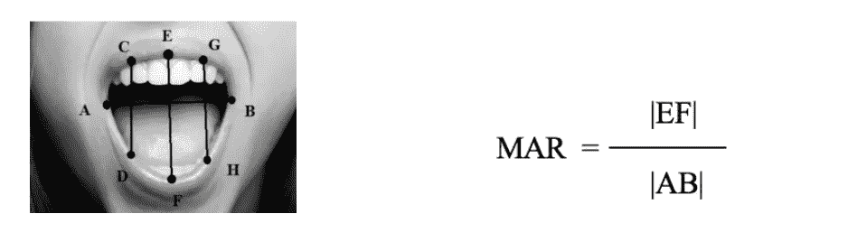

Mouth Aspect Ratio (MAR)

*瞳孔圆形(PUC)*

PUC 是对耳朵的补充，但它更强调瞳孔而不是整个眼睛。

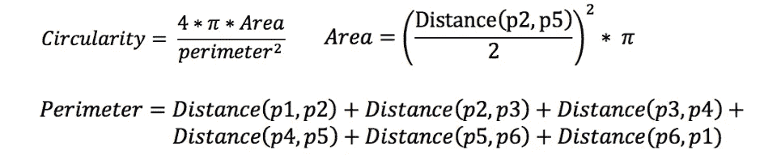

Pupil Circularity

例如，由于分母中的平方项，与眼睛完全睁开的人相比，眼睛半开或几乎闭上的人将具有低得多的瞳孔圆度值。与耳朵类似，预期是当个体昏昏欲睡时，他们的瞳孔圆形度可能下降。

*嘴巴长宽比超过眼睛长宽比(MOE)*

最后，我们决定添加 MOE 作为另一个特性。MOE 就是 MAR 与 EAR 的比值。

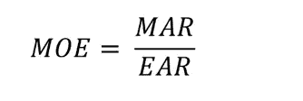

Mouth Over Eye Ratio (MOE)

使用此功能的好处是，如果个体的状态发生变化，EAR 和 MAR 预计会向相反的方向移动。与 EAR 和 MAR 相反，MOE 作为一种测量方法将对这些变化更敏感，因为它将捕捉 EAR 和 MAR 中的细微变化，并将随着分母和分子向相反方向移动而夸大这些变化。因为 MOE 以 MAR 为分子，EAR 为分母，所以我们的理论是，当人昏昏欲睡时，MOE 会增加。

虽然所有这些特征都有直观的意义，但当用我们的分类模型进行测试时，它们在 55%到 60%的准确度范围内产生了较差的结果，对于二进制平衡分类问题来说，这仅是 50%的基线准确度的微小改进。尽管如此，这种失望让我们有了最重要的发现:这些特征没有错，我们只是没有正确地看待它们。

# 特征标准化

当我们用上面讨论的四个核心特性测试我们的模型时，我们看到了一个令人担忧的模式。每当我们在训练和测试中随机分割帧时，我们的模型将产生高达 70%的准确性结果，但是，每当我们按个体分割帧时(即，测试集中的个体将不在训练集中)，我们的模型性能将会很差，正如前面提到的。

这让我们意识到，我们的模型正在与新面孔进行斗争，这种斗争的主要原因是每个人在默认的警报状态下都有不同的核心特征。也就是说，人 A 可能自然地具有比人 B 小得多的眼睛。如果在人 B 上训练模型，则当在人 A 上测试时，该模型将总是预测状态为困倦，因为它将检测到耳朵和 PUC 的下降以及 MOE 的上升，即使人 A 是警觉的。基于这一发现，我们假设将每个人的特征标准化可能会产生更好的结果，事实证明，我们是正确的。

为了归一化每个人的特征，我们取了每个人的警报视频的前三帧，并将它们用作归一化的基线。计算这三个帧的每个特征的平均值和标准偏差，并用于标准化每个参与者的每个特征。从数学上讲，这是归一化方程的样子:

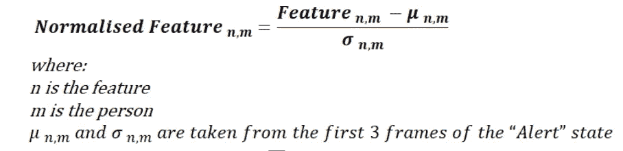

Normalization Method

既然我们已经规范化了四个核心特性中的每一个，我们的特性集就有八个特性，每个核心特性都由它的规范化版本补充。我们测试了模型中的所有八个特性，结果显著改善。

# 基本分类方法和结果

在我们提取和标准化我们的特征之后，我们希望尝试一系列建模技术，从最基本的分类模型开始，如逻辑回归和朴素贝叶斯，然后转向包含神经网络和其他深度学习方法的更复杂的模型。这里需要注意的是性能和可解释性之间的权衡。虽然我们优先考虑性能最佳的模型，但如果我们要将这一解决方案商业化，并向不熟悉机器学习术语的利益相关者展示其商业含义，可解释性对我们也很重要。为了训练和测试我们的模型，我们将我们的数据集分成分别来自 17 个视频的数据和来自 5 个视频的数据。因此，我们的训练数据集包含 8160 行，测试数据集包含 2400 行。

> 我们如何将序列引入基本分类方法？

我们在这个项目中面临的一个挑战是，我们试图预测序列中每一帧的标签。虽然像 LSTM 和 RNN 这样的复杂模型可以解释序列数据，但基本的分类模型却不能。

我们处理这个问题的方法是将原始预测结果与前两帧的预测结果进行平均。由于我们的数据集根据个体参与者分为训练和测试，并且数据点都是按时间顺序排列的，因此在这种情况下，平均是有意义的，并允许我们提供更准确的预测。

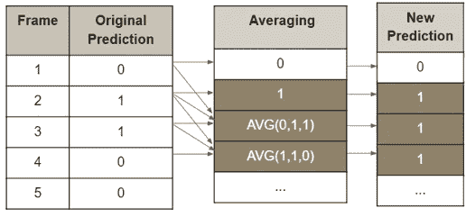

Introducing Sequence to Basic Classification Models

从我们尝试的不同分类方法来看，K-最近邻(kNN，k = 25)的样本外准确率最高，为 77.21%。朴素贝叶斯表现最差，为 57.75%，我们的结论是，这是因为模型在处理数字数据时遇到了困难。虽然 kNN 产生了最高的准确性，但假阴性率非常高，为 0.42，这意味着有 42%的可能性，实际上昏昏欲睡的人会被我们的系统检测为警觉。为了降低假阴性率，我们将阈值从 0.5 降低到 0.4，这使得我们的模型能够预测更多的困倦情况而不是警觉情况。尽管其他一些模型的精度有所提高，但 kNN 仍然报告了最高的精度，为 76.63% (k = 18)，尽管其自身的精度有所下降。

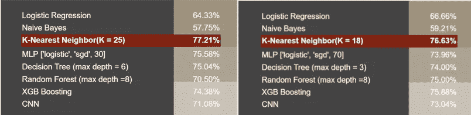

**Left**: Original Results **| Right**: Results after lowering threshold from 0.5 -> 0.4

# 特征重要性

我们想了解特征的重要性，所以我们可视化了随机森林模型的结果。

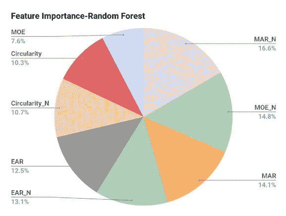

Feature Importance from Random Forest

归一化后的嘴部长宽比是我们的 8 个特征中最重要的特征。这是有道理的，因为当我们昏昏欲睡时，我们往往会更频繁地打哈欠。标准化我们的特征夸大了这种效应，并使其成为不同参与者嗜睡的更好指标。

# 卷积神经网络(CNN)

卷积神经网络(CNN)通常用于分析图像数据并将图像映射到输出变量。然而，我们决定建立一个一维 CNN，并发送数字特征作为连续输入数据，以尝试和理解两个状态的每个特征之间的空间关系。我们的 CNN 模型有 5 层，包括 1 个卷积层，1 个展平层，2 个完全连接的密集层，以及输出层之前的 1 个丢弃层。展平层展平卷积层的输出，并在将其传递到第一个密集层之前使其线性。丢弃层从第二密集层随机丢弃 20%的输出节点，以防止我们的模型过度拟合训练数据。最后的密集层有一个输出节点，输出 0 表示警报，输出 1 表示困倦。

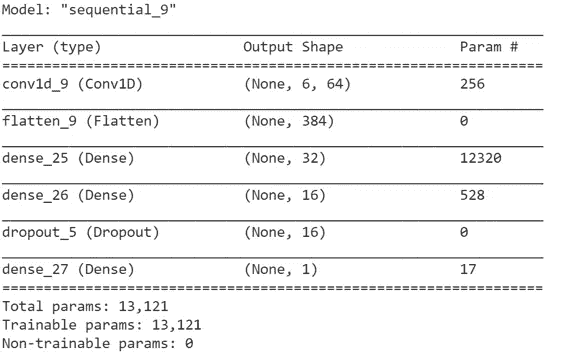

CNN Model Design

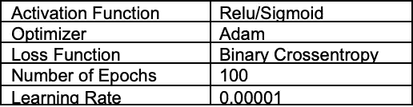

CNN Parameters

# 长短期记忆(LSTM)网络

另一种处理顺序数据的方法是使用 LSTM 模型。LSTM 网络是一种特殊的递归神经网络(RNN)，能够学习数据的长期依赖性。递归神经网络是反馈神经网络，具有允许信息持续存在的内部存储器。

> RNNs 如何在处理新数据的同时拥有内部存储空间？

答案是，在做出决策时，RNNs 不仅考虑当前输入，还考虑它从先前输入中学习到的输出。这也是 RNNs 与其他神经网络的主要区别。在其他神经网络中，输入是相互独立的。在 RNNs 中，输入是相互关联的。公式如下:

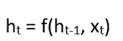

RNN formula

我们选择使用 LSTM 网络，因为它允许我们研究长序列，而不必担心传统 rnn 面临的梯度消失问题。在 LSTM 网络中，每个时间步有三个门:遗忘门、输入门和输出门。

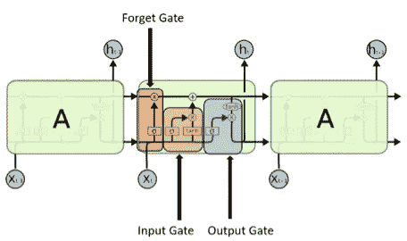

LSTM Network Visualized

**遗忘门**:顾名思义，该门试图“遗忘”之前输出的部分内存。

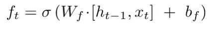

Forget Gate Formula

**输入门:**该门决定应该从输入中保留什么，以便修改存储器。

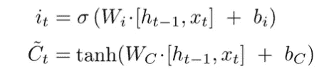

Input Gate Formula

**输出门:**门通过结合输入和存储器来决定输出是什么。

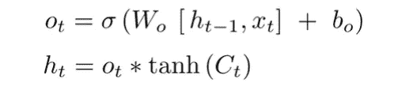

Output Gate Formula

首先，我们将视频转换成批量数据。然后，使用 sigmoid 激活函数将每一批发送通过具有 1024 个隐藏单元的全连接层。下一层是我们的 LSTM 层，有 512 个隐藏单元，接着是 3 个 FC 层，直到最后的输出层，如下图所示。

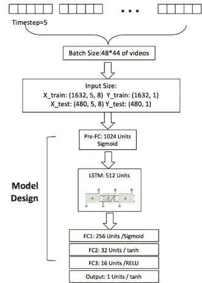

LSTM Network Design

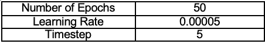

LSTM Parameters

在超参数调整后，我们优化的 LSTM 模型实现了 77.08%的总体准确性，与我们的 kNN 模型的假阴性率(0.42)相比，假阴性率低得多，为 0.3。

# 迁移学习

迁移学习侧重于使用在解决一个问题时获得的知识，并将其应用于解决一个不同但相关的问题。这是一套有用的技术，尤其是在我们训练模型的时间有限或训练神经网络的数据有限的情况下。由于我们正在处理的数据只有很少的独特样本，我们认为这个问题是使用迁移学习的一个很好的候选。我们决定使用的模型是带有 [Imagenet](http://www.image-net.org/) 数据集的 [VGG16](https://neurohive.io/en/popular-networks/vgg16/) 。

VGG16 是由牛津大学的 K. Simonyan 和 A. Zisserman 在他们的论文“用于大规模图像识别的非常深的卷积网络”中提出的卷积神经网络模型。该模型在 ImageNet 中成功实现了 92.7%的前 5 名测试准确率，ImageNet 是一个包含属于 1000 个类别的超过 1400 万张图像的数据集。

[ImageNet](http://www.image-net.org/) 是一个数据集，包含超过 1500 万张带有标签的高分辨率图像，属于大约 22，000 个不同的类别。这些图片是从互联网上收集的，由人类贴标机使用亚马逊的众包工具 Mechanical Turk 进行标记。自 2010 年以来，作为 Pascal 视觉对象挑战赛的一部分，每年都会举办一次名为 ImageNet 大规模视觉识别挑战赛(ILSVRC)的比赛。ILSVRC 使用一个更小的 ImageNet 集，大约有 1000 个图像，每个类别有 1000 个图像。大约有 120 万幅训练图像、50，000 幅验证图像和 150，000 幅测试图像。ImageNet 由不同分辨率的图像组成。因此，图像的分辨率需要更改为 256×256 的固定值。图像被重新缩放和裁剪，中心的 256×256 小块形成最终的图像。

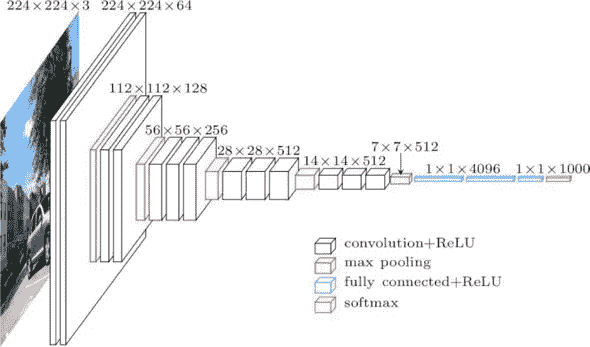

VGG16 Network Architecture

cov1 图层的输入是 224 x 224 RGB 图像。图像通过一叠卷积层，在卷积层中，滤波器的接收域非常小:3×3。在其中一种配置中，该模型还利用 1×1 卷积滤波器，可以将其视为输入通道的线性变换，然后是非线性变换。卷积步距固定为 1 个像素；卷积层输入的空间填充使得卷积后保持空间分辨率，即对于 3×3 卷积层，填充是 1 个像素。空间池由五个最大池层执行，这五个最大池层位于一些卷积层之后。不是所有的 conv。层之后是最大池。最大池在 2×2 像素窗口上执行，步长为 2。

一堆卷积层之后是三个全连接(FC)层:前两层各有 4096 个通道，第三层执行 1000 路 ILSVRC 分类，因此包含 1000 个通道。最后一层是软最大层。全连接层的配置在所有网络中都是相同的。

所有隐藏层都配备了校正(ReLU)非线性。还要注意的是，除了一个以外，没有一个网络包含局部响应归一化(LRN)，因为这种归一化不会改善模型的性能，而是导致计算时间增加。

我们将训练视频分成 34，000 个图像，这些图像是每 10 帧拍摄的截图。我们将这些图像输入 VGG16 模型。我们相信图像的数量足以训练预训练的模型。在对模型进行 50 个时期的训练后，我们得到了以下准确度分数。我们的结果如下所示。

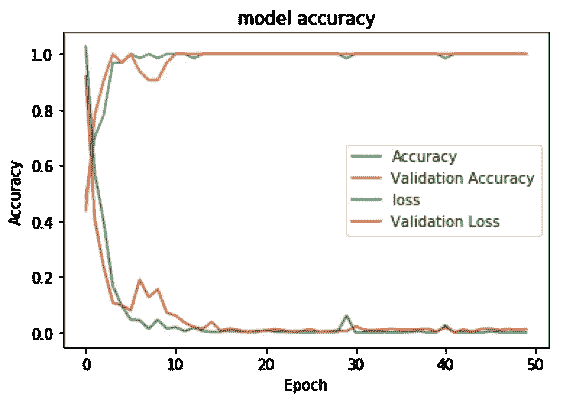

VGG16 Results

很明显，这个模型是过度拟合的。对此的一个可能的解释是，我们通过模型传递的图像是 22 名受访者几乎一动不动地坐在背景不受干扰的摄像机前。因此，尽管我们的模型采用了大量的帧(34，000)，但该模型本质上是试图从 22 组几乎相同的图像中学习。因此，该模型实际上没有足够的训练数据。

# 结论

在这个项目中，我们学到了很多东西。首先，在完成任务时，简单的模型和复杂的模型一样有效。在我们的例子中，K-最近邻模型给出了与 LSTM 模型相似的精确度。然而，因为我们不希望将昏昏欲睡的人错误分类为警觉，所以最终最好使用假阴性率更低的更复杂的模型，而不是部署起来可能更便宜的更简单的模型。第二，正常化对我们的表现至关重要。我们认识到每个人的眼睛和嘴巴长宽比都有不同的基线，对每个参与者进行标准化是必要的。在我们模型的运行时间之外，数据预处理和特征提取/标准化占用了我们大量的时间。更新我们的项目并研究如何降低 kNN 和其他更简单模型的假阴性率将会很有趣。

# 未来范围

展望未来，我们可以做一些事情来进一步改善我们的结果和微调模型。首先，我们需要合并面部标志之间的距离，以说明视频中对象的任何移动。实际上，参与者在屏幕上不会是静止的，我们认为参与者的突然移动可能是困倦或从微睡眠中醒来的信号。其次，我们希望用更复杂的模型(神经网络、集成等)更新参数。)才能达到更好的效果。第三，也是最后一点，我们希望从更大的参与者样本中收集我们自己的训练数据(更多数据！！！)同时包括新的明显的困倦信号，如突然的头部运动、手部运动或者甚至跟踪眼睛运动。

# 产品预览

我们想包括一些我们的系统在运行中的截图！

首先，我们需要根据参与者校准系统，如下所示。

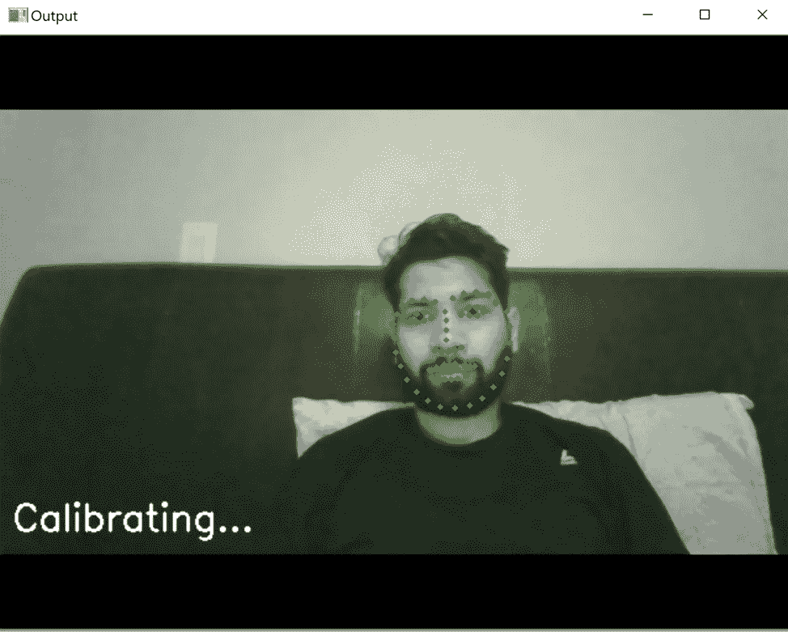

System Calibration

现在，系统应该自动检测参与者是困倦还是警觉。示例如下所示。

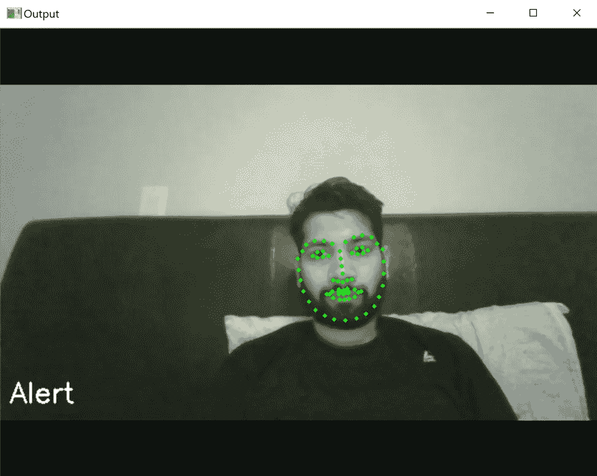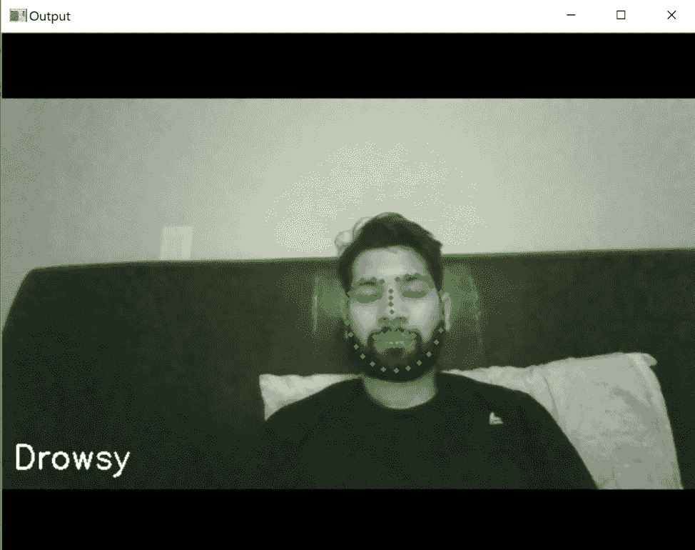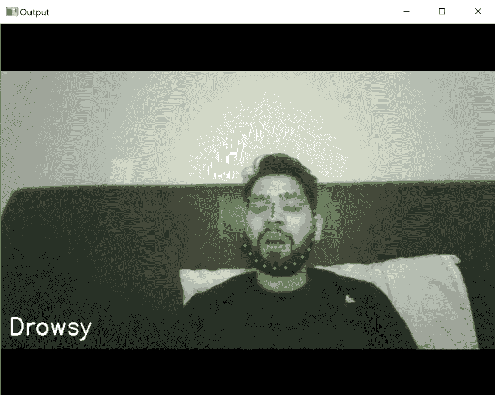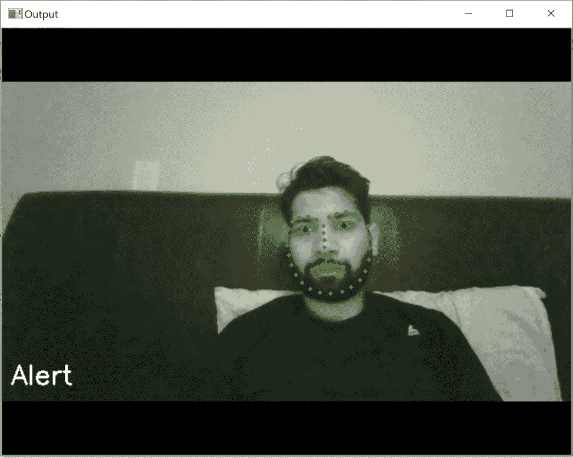

Drowsiness Detection System Example

非常感谢您通读我们的整个博客！如有任何问题或建议，请随时联系 LinkedIn 上的任何人，以改进我们的系统。

完整的项目和代码可以在 [GitHub](https://github.com/sandyying/APM-Drowsiness-Detection) 上查看！

# 承认

我们要特别感谢 Joydeep Ghosh 博士，他在整个项目中提供了非常有价值的指导。

# 参考

[](https://sites.google.com/view/utarldd/home) [## UTA-RLDD

### 德克萨斯大学阿灵顿分校的现实生活困倦数据集(UTA-RLDD)是为多阶段…

sites.google.com](https://sites.google.com/view/utarldd/home) 

https://arxiv.org/abs/1904.07312

【https://pypi.org/project/opencv-python/ 

[https://towards data science . com/understanding-rnn-and-lstm-f 7 CDF 6 DFC 14 e](/understanding-rnn-and-lstm-f7cdf6dfc14e)

[https://neurohive.io/en/popular-networks/vgg16/](https://neurohive.io/en/popular-networks/vgg16/)

[](http://www.image-net.org/) [## ImageNet

### ImageNet 是一个根据 WordNet 层次结构(目前只有名词)组织的图像数据库，其中每个…

www.image-net.org](http://www.image-net.org/)