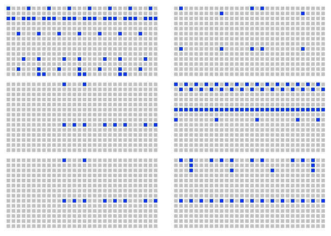
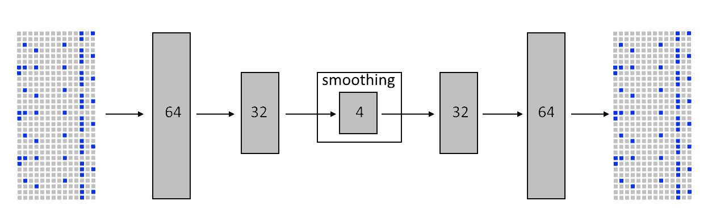
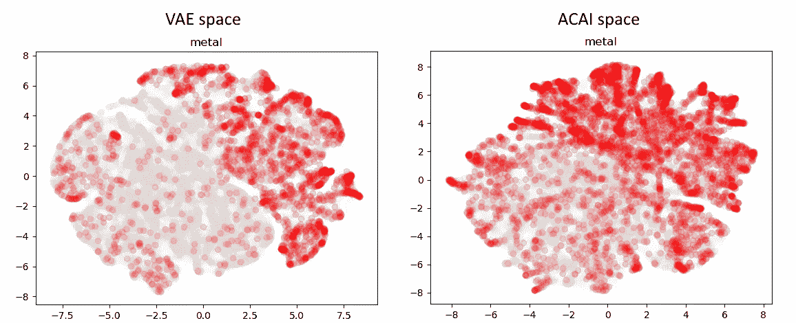
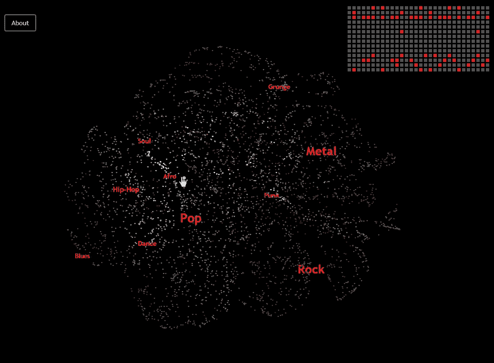

# 来自潜在空间的鼓形图案

> 原文：<https://towardsdatascience.com/drum-patterns-from-latent-space-23d59dd9d827?source=collection_archive---------11----------------------->

## 打击乐节拍以及在哪里可以找到它们

**TL；DR:** 我收集了一个大型的鼓模式数据集，然后使用神经网络方法将它们映射到一个潜在的可探索空间，其中有一些可识别的流派区域。试试[互动探索工具](http://altsoph.com/pp/dsp/map.html)或者下载[几千个独特生成的节拍](https://github.com/altsoph/drum_space)。

# 背景概述

近年来，有许多项目致力于神经网络生成的音乐(包括鼓模式)。一些这样项目使用一个潜在空间的显式结构，其中每个点对应一个旋律。这个空间可以用来研究和分类音乐结构，以及产生具有特定特征的新旋律。有些人使用不太复杂的技术，如“语言模型”方法。然而，我无法找到映射到 2D 空间的典型节拍模式的整体表示，所以我决定自己创建一个。

下面，我列出了我在开始自己的工作之前设法找到并分析的相关项目:

*   LSTMetallica —作者使用语言模型方法来预测节拍中的下一步。
*   [neuralbeats](https://medium.com/@snikolov/neuralbeats-generative-techno-with-recurrent-neural-networks-3824d7ba7972) —另一个语言模型项目，与 LSTMetallica 非常相似。
*   [Magenta VAE](https://github.com/tensorflow/magenta/tree/master/magenta/models/music_vae)——谷歌的 Magenta 是音乐生成和增强的有趣模型和项目的伟大来源。特别是 2016 年他们发布了 [**drum_rnn**](https://github.com/tensorflow/magenta/tree/master/magenta/models/drums_rnn) 型号，2018 年 3 月又发布了 [**music_vae**](https://magenta.tensorflow.org/music-vae) 型号。从那以后，很多项目都使用了这些模型。
*   例如，去年 [Tero Parviainen](https://github.com/teropa) 基于 drum _ rnn+magenta . js+tensor flow . js+tone . js 创建了一个非常棒的[在线鼓点发生器](https://codepen.io/teropa/details/JLjXGK)
*   [Beat Blender](https://github.com/googlecreativelab/beat-blender) 是另一个基于 Magenta 的项目(在 NIPS 2017 上首次亮相)。这与我想做的非常相似，然而，作者没有建立不同流派的概览图，而只是在成对的模式之间建立了一个插值空间。
*   最后但同样重要的是，还有我的另一个项目，[神经网络 RaspberryPi 音乐盒](https://medium.com/altsoph/neural-network-raspberrypi-music-box-328b9665b20b)，它使用 VAE 空间生成源源不断的类似钢琴的音乐。

# 数据集构建

我发现的大多数项目都使用手动选择和清理的节拍模式的小数据集，例如 [GrooveMonkee free loop pack](http://groovemonkee.com/collections/midi-loops) 、 [free drum loops collection](https://www.flstudiomusic.com/2015/02/35-free-drum-loops-wav-midi-for-hip-hop-pop-and-rock.html) 或[AQ-Hip-Hop-Beats-60–110-BPM](https://codepen.io/teropa/details/JLjXGK)。

这对我的目标来说还不够，所以我决定从网上的大量 MIDI 收藏中自动提取节拍模式。我总共收集了大约 200K 的 MIDI 文件，然后只保留了那些具有非平凡的第 9 通道(根据 MIDI 标准的打击乐器通道)的文件，所以还剩下大约 90K 的轨道。接下来，我做了一些额外的过滤，基本上与 neuralbeats 和 LSTMetallica 项目中实现的方式相同(我使用了 4/4 拍号，并对乐器子集进行了量化和简化)。

然后，我根据长时间的停顿将曲目分成独立的块，并搜索连续重复至少 3 次的长度为 32 步的模式——为了加快过程，我使用了哈希和一些简单的贪婪试探法。最后，我丢弃了熵值太低的琐碎模式，并检查了每个模式在所有可能的相移中的唯一性。最终，我的收藏中有 33K 个独特的图案。

some examples of distilled patterns

我使用了一个简单的方案来编码每个模式:一个模式有 32 个时间刻度，有 14 种可能的打击乐器(经过简化)，所以每个模式可以用 32 个整数来描述，范围从 0 到 16383。

您可以[在此](https://github.com/altsoph/drum_space/blob/master/dataset.tsv)下载 TSV 格式的数据集:

*   第一列保存模式代码(32 个逗号分隔的整数)。
*   第二列是这个模式在潜在 4D 空间中的点(4 个逗号分隔的浮点值)，*见下面的细节*。
*   第三列是从潜在空间到 2D 投影的 t-SNE 映射(2 个逗号分隔的浮点值)，*详见下文*。

# 神经网络

我使用 pytorch 框架构建了一个网络，其中有一个 3 层 FCN 编码器，将节拍矩阵(32*14 位)映射到 4D 潜在空间，还有一个与编码器大小相同的解码器。第一个隐藏层有 64 个神经元，第二个有— 32 个。我在层间使用 ReLU 和一个 sigmoid 将解码器输出映射回位掩码。

我尝试并比较了两种不同的潜在空间平滑技术， [VAE](https://en.wikipedia.org/wiki/Autoencoder#Variational_autoencoder_(VAE)) 和 [ACAI](https://github.com/brain-research/acai) :

*   标准 VAE 产生了足够好的结果，空间映射清晰而有意义，
*   ACAI 空间看起来平滑得多——它更难可视化，但更好取样(*见下面的细节*)。

The METAL beats area on the VAE space projection (left) and the ACAI space projection (right)

# 鼓代

我用标准逻辑生成了一个随机节拍:从潜在空间中随机抽取一个点，然后用解码器将这个点转换成节拍模式。你也可以从潜在空间的特定区域采样点，以获得该区域特定风格的典型节拍。使用我用来构建数据集的同一套过滤器对产生的模式进行了过滤(参见上面的详细信息)。

VAE 生成的节拍质量约为 17%，换句话说，平均六分之一的生成节拍成功通过了过滤器。在 ACAI 的例子中，质量明显更高——大约 56%，所以超过一半的生成模式通过了过滤器。

我使用每种方法生成了 10K 节拍并发布了它们(格式类似于主数据集文件格式):

*   [sampled10k_vae_raw](https://github.com/altsoph/drum_space/blob/master/sampled10k_vae_raw) ，
*   [sampled10k_acai_raw](https://github.com/altsoph/drum_space/blob/master/sampled10k_acai_raw) ，
*   [样本 d10k_vae_filtered](https://github.com/altsoph/drum_space/blob/master/sampled10k_vae_filtered) ，
*   [样本 d10k_acai_filtered](https://github.com/altsoph/drum_space/blob/master/sampled10k_acai_filtered) 。

也可以下载这些生成的图案制作的 MIDI 包: [sampled_vae_midi.zip](https://github.com/altsoph/drum_space/blob/master/sampled_vae_midi.zip) 和 [sampled_acai_midi.zip](https://github.com/altsoph/drum_space/blob/master/sampled_acai_midi.zip) 。

# 空间可视化

我使用 VAE 空间进行可视化，因为它有更清晰的视觉结构。基于该空间的 t-SNE 投影来放置点。一些最初收集的 MIDIs 在文件名中有流派标签，所以我用这些来定位和标记具有特定流派的模式的区域。

我基于 [jQuery](http://jquery.com/) 、 [remodal](http://vodkabears.github.io/remodal/) 和 [MIDI.js](https://github.com/mudcube/MIDI.js) (带有[一个重新编码的 GM1 打击乐声音字体](https://github.com/johntu/midi-js-gm1-percussion))库构建了可视化器。您可以探索训练集模式的 3K 子集(灰点)+大约。500 个生成的图案(红点)。

## [**试试这里的**](http://altsoph.com/pp/dsp/map.html) **！**

