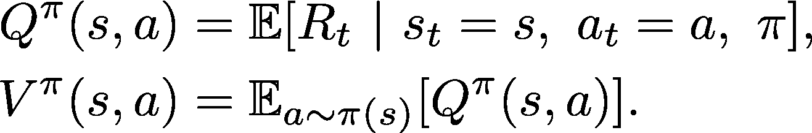
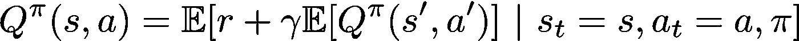
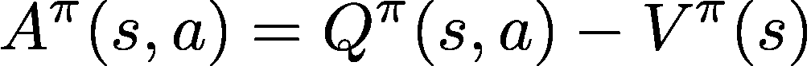
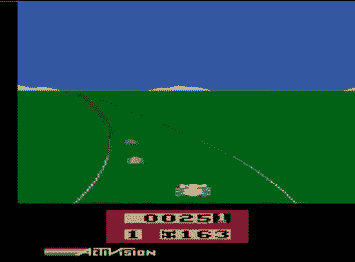
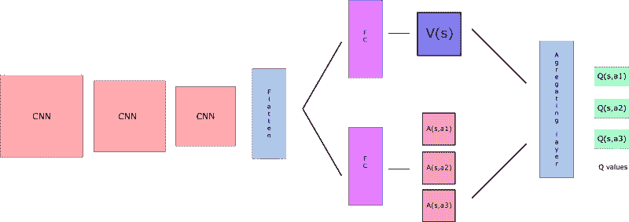
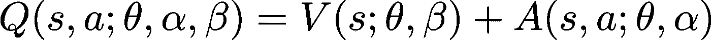
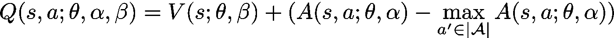
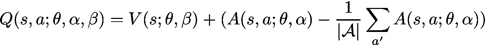
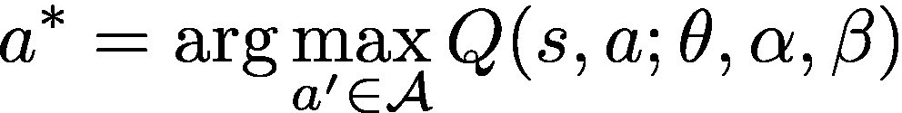
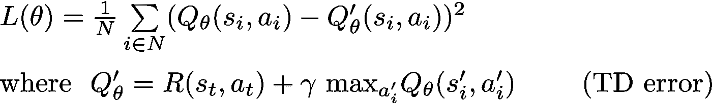

# 决斗深度 Q 网络

> 原文：<https://towardsdatascience.com/dueling-deep-q-networks-81ffab672751?source=collection_archive---------4----------------------->

## [DQN 家族](https://towardsdatascience.com/tagged/Dqn-family)

## 用于深度强化学习的决斗网络架构

# 回顾和介绍

让我们先回顾一下一些重要的定义，然后再看 DQN 论文。这些大部分应该都不陌生。

*   给定代理的策略π，动作值和状态值分别定义为:

*   上面的 Q 函数也可以写成:

*   **优势**是通过用 V 值减去 Q 值获得的量:

回想一下，Q 值表示在给定状态下选择特定动作的值，V 值表示不管采取什么动作都给定状态的值。然后，直观地，优势值显示了在给定状态下选择一个动作相对于其他动作有多有利。

# 什么变化和动机

*   (王等)提出了新颖的*决斗架构*，它通过两个独立的流明确地分离了状态值和依赖于状态的动作优势的表示。
*   这种架构背后的关键动机是，对于一些游戏来说，没有必要知道每个动作在每个时间步的值。作者举了一个 Atari 游戏 Enduro 的例子，在这个游戏中，在碰撞即将发生之前，不需要知道应该采取什么行动。

Atari Enduro. Source: [https://gfycat.com/clumsypaleimpala](https://gfycat.com/clumsypaleimpala)

*   通过显式分离两个估计器，决斗架构可以了解哪些状态是(或不是)有价值的，而不必了解每个状态的每个动作的效果。就像 Enduro 的例子一样，这种架构在一些任务中变得尤其重要，在这些任务中，行动可能并不总是以有意义的方式影响环境。

# 体系结构

像标准的 DQN 架构一样，我们有卷积层来处理游戏帧。从那里，我们将网络分成两个独立的流，一个用于估计状态值，另一个用于估计依赖于状态的动作优势。在这两个流之后，网络的最后一个模块组合状态值和优势输出。

Dueling Architecture, Source: [https://www.freecodecamp.org/news/improvements-in-deep-q-learning-dueling-double-dqn-prioritized-experience-replay-and-fixed-58b130cc5682/](https://www.freecodecamp.org/news/improvements-in-deep-q-learning-dueling-double-dqn-prioritized-experience-replay-and-fixed-58b130cc5682/)

现在，我们如何组合/聚合这两个值呢？

将两个值相加似乎很直观，从优势值的定义中可以立即看出:

然而，作者提出了关于该方法的两个问题:

1.  假设和分别给出状态值和动作优势的合理估计是有问题的。因此，天真地将这两个值相加是有问题的。
2.  两者的简单和是“不可识别的”，因为给定 Q 值，我们不能唯一地恢复 V 和 A。Wang 等人的实验表明，这种可识别性的缺乏会导致较差的实际性能。

因此，神经网络的最后一个模块实现了如下所示的正向映射:

这将迫使最大化动作的 Q 值等于 V，解决了可识别性问题。

或者，如在王等人的实验中所使用的，我们也可以使用:

然后，我们根据以下因素选择最佳行动`a*`:

# 培养

因为决斗架构与标准 DQN 架构共享相同的输入输出接口，所以训练过程是相同的。我们将模型的损失定义为均方误差:

并采取梯度下降步骤来更新我们的模型参数。

# 履行

所以，我们将通过决斗 DQN 的实施。

1.网络架构:如上所述，我们希望将状态相关的动作优势和状态值分成两个独立的流。如上所述，我们还使用正向映射来定义网络的正向传递:

2.接下来，我们将实现更新功能:

除此之外，标准的 DQN 建筑没有什么变化；关于完整的实现，请查看我的香草 DQN 邮报，或者我的 Github 库:

 [## cy oon 1729/深度 Q 网络

### Q-learning 家族(PyTorch)算法的模块化实现。实现包括:DQN，DDQN，决斗…

github.com](https://github.com/cyoon1729/deep-Q-networks) 

# 参考

*   [深度强化学习的决斗网络架构(王等，2015)](https://arxiv.org/abs/1511.06581)