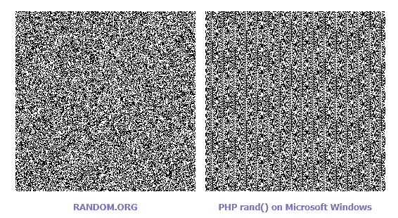

# 地下城和骰子

> 原文：<https://towardsdatascience.com/dungeons-and-dice-8e326a6fcae4?source=collection_archive---------44----------------------->

桌面角色扮演游戏中随机性、多武装匪徒和数字表征的思考


Images from Pixabay and [https://www.flickr.com/photos/lobsterstew/5508435832](https://www.flickr.com/photos/lobsterstew/5508435832)

你经常会发现自己和一些好伙伴在一起，并准备好和一些兽人(或者人类，无论你喜欢哪个)战斗，但是，唉，你没有骰子。

通常这个问题会因为不仅需要 6 面模具 **D6** ，而且需要所有剩余的[柏拉图立体](https://en.wikipedia.org/wiki/Platonic_solid)**D4****D8****D12****D20**而变得更加严重。D10 有时也被卷入其中。我见过很多解决这个问题的方法，从在纸上写数字然后从盒子里画出来，到地下城主编数字。前者的问题是需要更多可能不在身边的材料，后者是全球机制可能有偏见。

也许他/她希望冒险者成功，或者相反不要太快杀死那个超级酷的怪物。尽管转基因并不意味着它会发生，但一些偏见可能会在潜意识中潜入，破坏所需的随机性。你会接受你的角色因为总经理在激烈的战斗中脱口而出错误的数字而被杀死吗？

> 一个解决方案是让其中一个玩家在总经理说一的同时说一个数字，然后将他们按骰子大小相加(并加一)。


Adding modulo D12 is similar to adding hours on a clock. For example 9+5 mod 12 = 2\. Image from pixabay.

但是这真的是一个好的解决方案吗？我们怎么知道它是不是呢？进入伪随机数发生器(PRNGs)的理论。

## 伪随机数发生器

产生随机性的问题是一个古老的问题。1946 年，约翰·冯·诺依曼在研究原子弹时发现自己需要大量的随机数来进行蒙特卡罗模拟。在蒙特卡罗方法中，人们利用随机性来进行计算。最简单的例子是在正方形内画一个四分之一圆。把沙粒随意扔向图画。计算圆内的颗粒数，除以总数，乘以 4，瞧，你已经用蒙特卡罗方法计算出圆周率了。

```
seq = [random.randint(0,100) for x in range(200)]
rand_coords = list(zip(seq[::2], seq[1::2]))sum(1 if math.sqrt(x**2+y**2)<=100 else 0 for x,y in rand_coords)*4/len(rand_coords)
```


200 grains of sand. Pi = 3.24 in this calculation. More grains makes it more exact.

冯·诺依曼在他的工作中发明了中间的平方方法，可以表述为:取一个种子，比方说 4 位数长，平方它，提取中间的 4 位数，它就成为下一个种子。例如:

```
8524 -> 72658576 -> 6585 -> 43362225 -> 3622
```

看起来很随意，但是真的吗？序列 777777 是随机的吗？它在 10⁶发生的几率是 1，但另一方面，758336 也是如此。

检查随机性是一个重要的问题，为此已经设计了许多方法。我们将看看其中的一些。

## 视觉分析

检查某件事是否不是随机的一种方法是寻找模式。事实证明，人类的视觉皮层在这方面相当擅长，让我们画一个中间的正方形序列:

```
def plot_rand(seq):
    dim = int((seq.size)**(1/2))
    seq = seq[:(dim**2)].reshape(dim, dim)
    plt.imshow(seq)
```


正如你所看到的，它开始时很好，但是过了一会儿就陷入了一个循环。冯·诺依曼知道这可能发生，但他没有其他方法可以快速产生大量的伪随机数。他说，当它陷入循环时，它至少会以一种明显的方式失败。

让我们试试另一个:

```
plot_rand([(x**2-3*x)%10 for x in range(300)])
```


似乎我们已经找到了抽象艺术的一个很好的来源。当然，由于剩余力量的[周期性，我们相当有限。](http://www.mathrecreation.com/2012/06/last-digit-sequences.html)

后来，比中间正方形更好的方法被发明了，但是领域被问题困扰。一个例子是 IBMs 杜然算法。乍一看，它似乎能产生很好的随机数，但这是一种错觉。事实上，情况非常糟糕，以至于唐纳德·克努特(Donald Knuth)将它描述为“真正可怕的”,由于 20 世纪 70 年代初杜然的广泛使用，当时的许多结果被视为可疑。

另一个例子是 PHP rand()。



Image from random.org

拥有糟糕的随机数生成器可能会产生一些非常可怕的后果，因为它们被用于为 SSL 协议生成密钥。能够猜出生成器将要产生的下一个数字的攻击者将能够解密所发送的消息。

但是上面描述的让两个人同时说出数字的方法效果如何呢？


对我来说很随机，第一次测试通过了。

## 科尔莫戈罗夫

看待随机性的另一种方式是它很难描述，而有序却很容易描述。

因此**100011010111100101110**看起来比**11111111100000000**更随机，因为后者可以描述为 **[1]*10 + [0]*10** ，但前者更难找到压缩形式。

这是安德雷·柯尔莫哥洛夫的想法，为了纪念他，这个概念被命名为 Kolmogorov 复杂性。

让我们尝试以上述方式压缩我们的序列。

```
def compress(string):
    return ''.join((char + str(sum(1 for _ in group)).replace('1','')) for char, group in groupby(string))
```

*在上面的代码中，我们只处理了最简单的一个字符的情况，因此例如 **10101010** 不会被该算法压缩。更好的压缩算法留给读者作为练习。

400 的 radom.randint()被压缩到 395，而两人的数字得到 390。够接近了，第二次测试通过。

## 卡方检验

卡方检验是一种确定拟合优度的方法。即:零假设符合观察到的行为的概率是多少。如果我随机选择一串数字 0-9，我的无效假设是每个数字都以 10%的频率出现。

让我们把我们的序列放入卡方检验。

```
chisquare([v/len(seq) for k,v in Counter(seq).items()], [.1]*10)
```

random.randint()得出的卡方值为 0.03。我通过捣碎按钮生成的随机序列 ges a 0.12，所以不完全随机。来自两个按钮捣碎序列的序列得到了 0.04，我认为这是非常好的。每第五个位置有“1”的随机序列得到 0.38。

但这里感兴趣的不仅仅是数字的分布。我们还对二元组感兴趣，那就是:两个连续的数字。数字 1-9 可能以均匀分布的方式出现，但也许两个数字“29”比“23”出现得更频繁，因为我在生成数字时使用两只手，并且倾向于在它们之间交替。三元组和更高的也可以尝试。

当用二元模型测试时，random.randint()得到 0.2，我的按钮 mashing 得到 1.28，我们添加的序列得到 0.34，每第 5 个位置有“1”的随机序列得到 4.45。

不完美，但足够接近，第三次测试通过。

## 圆周率

我们当然可以使用上面描述的蒙特卡罗方法，但是要反过来。因为我们知道圆周率应该是多少，PRNG 越接近越好。

我们得到 2.96。不完全是圆周率，但其中一个原因是我们只有整数 0-9。在这种情况下，random.randint(0，9)得出 2.9。

第四次测试通过。

## 顽固的测试

顽固测试是 1995 年在随机数字光盘上首次发现的一系列测试。它们对 10000 长的随机序列效果更好，这里就不用了。

## 多股武装匪徒


A multi-armed bandit situation. From [https://www.inverse.com/article/13762-how-the-multi-armed-bandit-determines-what-ads-and-stories-you-see-online](https://www.inverse.com/article/13762-how-the-multi-armed-bandit-determines-what-ads-and-stories-you-see-online)

虽然这一切看起来都很好，但可能仍然有一个小问题。聪明的玩家会注意到 GM 生成的数字不是随机的，而是遵循一种模式，一种可能被滥用的模式。

除了听起来像是角色扮演游戏冒险中的人物之外，一个多臂强盗实际上是强化学习中的一个问题。假设你有一个吃角子老虎机，又名单臂强盗，但这个有几个手臂。他们都有不同的支付率，你不知道。你必须一边走一边想办法，同时努力实现利润最大化。像往常一样，在强化学习中，当你做出正确的决定时，你通过获得奖励来学习该做什么。

这个概念的一个延伸是上下文多武装匪徒(CMAB)问题，其中你也看上下文，例如一天中的时间。

让我们使用[上下文强盗库](https://github.com/david-cortes/contextualbandits)将我们的情况建模为一个 CMAB。上下文是以前的数字，每当我们的算法选择一个高于平均值的数字，它就会得到奖励。我们的特定算法是 Bootstrapped Thompson 采样，这是一种使用 Beta 分布确定每个动作正确的概率的算法。

```
def run_bandit(seq, nchoices, reward_func):
    base_algorithm = LogisticRegression(random_state=123, 
                                        solver='lbfgs')
    beta_prior = ((3, 7), 2) model = BootstrappedTS(deepcopy(base_algorithm), 
                           nchoices = nchoices, 
                           beta_prior=beta_prior) r_hist = []
    a_hist = []
    X_hist = [] model.fit(X=np.array([[0]]), a=np.array([0]), 
              r=np.array([0])) for X,y in ngram(seq, 2):
        a = model.predict(np.array([[int(X)]]))[0]
        a_hist.append(a)
        X_hist.append([int(X)])
        r = reward_func(a,y)
        r_hist.append(r)
        model.fit(X=np.array(X_hist), a=np.array(a_hist), 
                  r=np.array(r_hist))

    return r_hist np.mean(run_bandit([random.randint(0,9) for x in range(200)], 10, lambda a,y: 1 if (a+int(y))%10 >= 5 else 0))
```

结果是:

对于 random.randint()，该算法平均获得 0.51 分

对于 GM 生成的序列，该算法平均得到 0.63 分。

可以看出，该算法实际上学会了滥用由 GM 创建的序列中的规则。

## 奖励 1:石头剪刀布

同样的方法也可以用来赢得石头剪刀布，顺便说一下，只要使用 nchoices=3 和不同的奖励函数。尝试:

```
np.mean(run_bandit(sequence, 3, lambda a,y: 1 if int(a) == (int(y)+1)%3 else 0))
```

虽然这看起来很糟糕，但人们必须记住，人类不是计算机。人类不太可能像我们的算法那样利用序列中的小规律。

我们通过了吗？我想应该由你来决定。你的角色扮演聚会包括雨人或者有类似能力的人吗？如果不是，我会说这是一个通行证。

## 额外收获 2:数字的表示

一个并非完全无关的问题是向总经理传达数字。通常的情况是，在 GM 掷出骰子后，他/她想要知道例如一个玩家的能力分数，而其他玩家听不到。这可以通过用手指显示一个数字来实现，但是通常的方法只能显示 0-10 的数字，而能力分数通常是 18。

解决这个问题的一种方法是使用基数 6，一只手是第一阶，另一只手是第二阶。这样，一个人可以从 0 一直走到 35。如果这还不够，你可以使用二进制来得到 1023，尽管你需要相当灵活的手指。

如果具体范围接近 1–110，中文数字手势似乎是一个很好的选择。特别是因为我们的数字系统是以 10 为基数的，这使得这些手势更容易理解。


## 结论

玩基于随机性的游戏时没有骰子是一个不容易解决的问题，事实上，即使知道你是否解决了它也是一个困难的问题。幸运的是，即使它并不完美，让 GM 和玩家同时喊出数字对大多数情况来说似乎已经足够了。