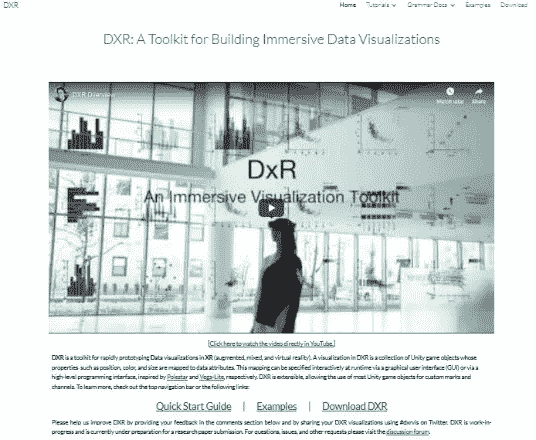
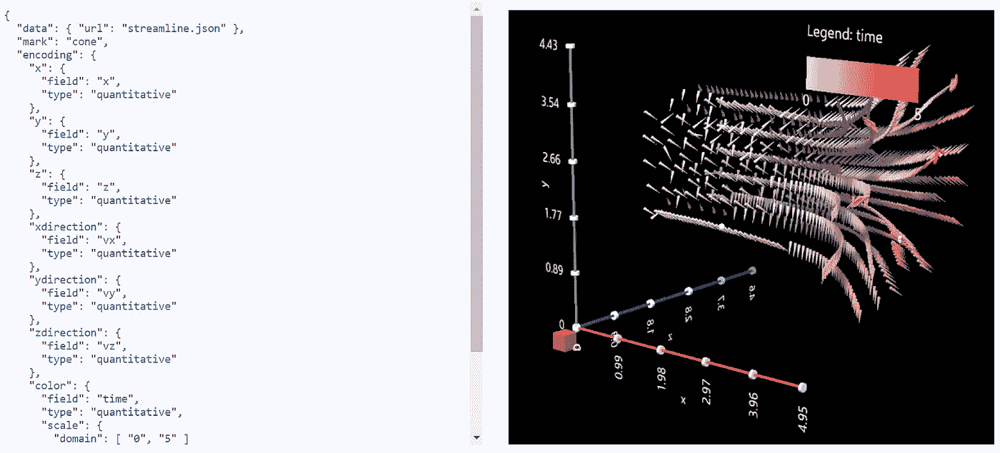
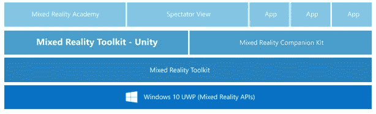

# DxR:将 2D 数据可视化连接到沉浸式空间

> 原文：<https://towardsdatascience.com/dxr-bridging-2d-data-visualization-into-immersive-spaces-d77a20d5f9e9?source=collection_archive---------10----------------------->

(with permission from ShutterStock #616733024)

在 IEEE VIS 2018 上，来自不同大学的研究人员提交了一篇[论文](https://ieeexplore.ieee.org/document/8440858)，描述了一种用于快速部署沉浸式数据可视化的新工具包，称为 DxR ( **D** 数据可视化在 mi **X** ed **R** eality)。[1]

本文代表了将几个技术集群合并到一个集成开发环境中的重大努力。这跨越了带有 [Unity3D](https://unity3d.com/) 场景的 JSON [Vega](https://vega.github.io/vega/) 可视化设计，支持商业 VR 产品，如 [Oculus Rift](https://www.oculus.com/rift/#oui-csl-rift-games=star-trek) 、 [HTC Vive](https://www.vive.com/us/) 和[微软 Hololens](https://www.microsoft.com/en-us/hololens) (中等价位的 VR 头戴设备)。

科罗拉多大学博尔德分校教授丹妮尔·萨菲尔的一篇文章引起了我的注意。她总结了几个数据可视化项目，并将 DxR 的重要性描述如下:

> “虽然我们对 MR(混合现实)在可视化方面的效用的理解仍然有限，但 DxR 等工具可以帮助加快这一领域的发展。通过使构建和部署沉浸式可视化更容易，我们可以更好地理解这些显示技术在什么时候以及为什么对数据分析有用。这些工具对怀疑者和支持者都有帮助，允许他们构建新的应用程序，并快速进行研究，以测试沉浸式可视化可能提供的限制。”[2]

她总结说，更多的混合现实可视化实验对于“准确理解何时以及为什么”它们是有用的，以及它们的限制。

正如 Szafir 的文章所指出的，高级数据可视化是许多业务应用程序的关键要素。使用最新显示技术的压力(由视频游戏行业驱动)正朝着 [*中描述的超越桌面的视觉化——下一件大事*](http://pages.bangor.ac.uk/~pas601/papers/Roberts_et_al_Beyond_CGA.pdf) 发展。作者调查了虚拟现实在几种应用和技术中的潜力，总结如下:

> “可视化研究人员需要开发和适应今天的新设备和明天的技术。今天，人们通过鼠标与视觉描绘互动。明天，他们将触摸、滑动、抓取、感觉、听到、闻到甚至品尝数据。”[3]

# 手脏

先玩玩看 DxR 工具包的表现是否如宣传的那样…

首先，**阅读**[**DxR 论文**](https://ieeexplore.ieee.org/document/8440858) ！如果你对可视化语法和 Unity3D 开发有所了解的话，这篇文章写得很好，也很容易理解。

[https://sites.google.com/view/dxr-vis/home](https://sites.google.com/view/dxr-vis/home)

二、**进入** [**DxR 网站**](https://sites.google.com/view/dxr-vis/home) **查看 5 分钟视频**，简洁明了。花时间浏览 [Vega-Lite 网站](https://vega.github.io/vega-lite/)并滚动浏览众多[示例](https://vega.github.io/vega-lite/examples/)(注意左边的 Vega vis 规范)。这是相当多的使用案例！

这为 DxR 引入沉浸式空间的功能增添了一份风味。

第三，执行代码，如下所示:

1.  **点击[下载 DxR](https://sites.google.com/view/dxr-vis/download) 的链接，下载 UnityPackage 文件**。选择最新版本。另存为文件；这不是 GZ。该文件稍后将被导入到您的 Unity 项目中。此外，确保你的 Unity 版本匹配，因为奇怪的事情可能会发生。使用新的 Unity Hub 管理您的所有 Unity 版本，或者只安装一个新的 Unity 版本。
2.  点击[快速入门指南](https://sites.google.com/view/dxr-vis/tutorials/quick-start-guide)和**通读概述**。理解 Unity 场景中的 Vega-Lite 示例。
3.  重点介绍 [**中的**五个步骤设置****](https://sites.google.com/view/dxr-vis/tutorials/quick-start-guide#h.p_9Ugvv8zA81IQ) **部分**，这是大部分的工作。注意:你需要新手熟悉 Unity3D 来创建一个新的 Unity 项目，导入 [Unity 资源包](https://docs.unity3d.com/Manual/AssetPackages.html)，了解[层级](https://docs.unity3d.com/Manual/Hierarchy.html)、[项目](https://docs.unity3d.com/Manual/ProjectView.html)和[检查器](https://docs.unity3d.com/Manual/UsingTheInspector.html)面板，玩 Unity 场景。如果需要帮助，可以查看 Unity3D 的优秀[入门教程](https://unity3d.com/learn/tutorials/s/interactive-tutorials)。
4.  尝试一些现成的例子。首先，浏览 [DxR 示例页面](https://sites.google.com/view/dxr-vis/examples)。所有这些都可以在 DxRExamples assets 文件夹中找到。双击经典场景以将资源加载到层次窗口中。打开收藏文件夹，记下条形图、散点图等的 DxR…子文件夹。单击第一个项目 DxRBarchartBasic。在检查器面板中，而不是 Vis 脚本及其全局变量 Vis Specs URL，它指向 Examples/Classics/bar chart _ basic . json。在此 Vis Spec 的 JSON 中是“data”属性，包含要显示的数据的值。在其他 Vis 规范中,“URL”属性指定 json 文件名
5.  **按照下一节[创建你的第一个沉浸式视觉](https://sites.google.com/view/dxr-vis/tutorials/quick-start-guide#h.p_U20YrjjB84Zg)来创建你自己的视觉**。还有额外的教程涵盖了 GUI 控件和自定义标记(使用预设)。用自己的数据，玩得开心！
6.  **创建自定义标记**。我特别喜欢在 Unity 中灵活使用预置的游戏对象作为 DxR 标记。注意在研究*火焰*标记及其 C#粒子脚本时，[自定义标记和通道](https://sites.google.com/view/dxr-vis/grammar-docs/custom)中的教程信息丰富。

# 反光

DxR 是将传统 2D 数据可视化连接到沉浸式空间的良好开端。如下所述，在未来的 DxR 版本中，有几个扩展是需要的。这些扩展有望来自持续的研究资助和开源社区的贡献。

**扩展 DxR 标记编码**。DxR 已经实现了令人印象深刻的 Vega-Lite 规范，这在最初并不明显。研究 [DxR 语法文档](https://sites.google.com/view/dxr-vis/grammar-docs)，以及 [Google 工作表文档](https://docs.google.com/spreadsheets/d/1SuD4LPv3dPGlvR3O-F0gHh8d9W1yTdbK6cQN4R9QEQg/edit?usp=sharing)

例如，DXR 使用 x、y、z 位置和旋转的标记编码提供 3D 可视化，类似于 [Unity 变换类型](https://docs.unity3d.com/ScriptReference/Transform.html)。下面是一个名为 *Streamline* 的标准示例，显示在[示例部分](https://sites.google.com/view/dxr-vis/examples)。

Vis Spec and Rendering for the Streamline Example

在上述 vis 规格中，使用了*圆锥*的标记。注意到使用*x 方向*类型来控制标记的方向向量。这不同于 *xrotation* 类型，后者控制单位变换旋转属性。更改 vis 规格以查看差异。DxR 文档中隐藏的宝藏！

不过 Unity 有丰富的渲染能力。如何将标记编码扩展到处理纹理、着色器、声音、动画、粒子等？胡同玩家的[动作功能列表将是目标。](https://hutonggames.fogbugz.com/default.asp?W2)

作为织女星进化的 PyViz。最近，一个名为 [PyViz](http://pyviz.org/) 的社区已经形成，集成了几个基于 python 的可视化包，包括 Vega。这幅 [PyVis 背景图](http://pyviz.org/background.html)描绘了宏伟的画面。目前，只有 Plotly 使用 WebGL 的 3D viz 是有限的，正如在 [FAQ 页面](http://pyviz.org/FAQ.html)上关于【PyViz 是否包含 3D 支持的解释。[路线图页面](http://pyviz.org/Roadmap.html)提供了他们当前/未来的发展方向。没有提到 Unity3D。绝对是一个可以利用的快速发展的社区。

**提升数据整合能力。**当前的数据集成功能支持在 Vis 规范中明确嵌入数据(对于非常小的数据集),或者作为 Unity StreamingAssets 文件夹中的静态 JSON/CSV 文件。

然而，Vis 规范中的 URL 属性可以通过 web 服务调用扩展到远程 SQL 数据库访问。此外，处理*数据流*到 Unity 的能力，在数据改变时自动更新，并与数据服务器交互。这是一项重要的工作，可以借助现有的开源资源(如 PyViz commuity)。

**利用微软混合现实工具包。** DxR 建立在 Unity 环境中的 HoloToolkit 之上。微软最近将 HoloToolkit 转换为混合现实工具包(MRTK)，并且正在积极推进。

Architecture of Mixed Reality Toolkit

目标是…“旨在加速针对微软 HoloLens 和 Windows 混合现实耳机的应用程序开发的脚本和组件集合”，其中确实包括 Steam VR(如 HTC Vive 和 Oculus Rift)和 [OpenXR](https://www.khronos.org/openxr) 平台。 [MRTK github](https://github.com/Microsoft/MixedRealityToolkit-Unity) 在麻省理工学院许可下，基于 Windows 10 UWP ( [混合现实 API](https://docs.microsoft.com/en-us/windows/mixed-reality/))构建。问题是如何将 MRTK 整合到 DxR 中，利用其新兴的功能，同时平衡新兴的竞争 VR 工具包。

**实体-组件-系统合一。另一个相关的发展是 Unity 的新实体-组件-系统架构，以及作业系统和突发编译器。在以成群结队的军队为特色的视频游戏的驱动下，Unity 正在*测试*这种新的架构，它将驱动游戏对象行为的数据(作为实体的组件)与执行这些行为的代码(作为系统)分开。最好的介绍是一系列的[六个视频教程](https://unity3d.com/learn/tutorials/topics/scripting/introduction-ecs?playlist=17117)加上[例子](https://github.com/Unity-Technologies/EntityComponentSystemSamples)。**

当 ECS 成熟时，它的潜力将是创造和激活 Unity 对象(具有复杂行为和外观的 gliphs)，数百万个！将 gliph 的所有数据打包到一个实体中，然后传输到 GPU，这是创建这种可视化的唯一方法。这种能力可以允许新的复杂的可视化方法。

# 只有一个维度？

以上集中于将 2D 可视化连接到 3D 沉浸式空间。然而，这是否意味着只有一个维度可以用于我们的可视化？

2015 年我写过一篇关于 [*虚拟现实对数据可视化*](https://www.immersiveanalytics.com/2015/10/is-virtual-reality-useful-for-data-visualization/) 有用吗？[4]这是基于不列颠哥伦比亚大学数据研究员塔玛拉·芒兹纳的评论。她的简短回答是“不”，因为: *3D 只在空间设置中需要，广义上讲，VR 的成本超过了它的好处*。科学可视化通常具有显示数据的自然 3D 背景，因此对于观察者来说是直观的。如果自然的 3D 背景不存在，那么 VR 还有存在的理由吗？我的结论是…

> …虚拟数据世界应该提供独特的功能(如协作)，并与 2D 可视化协同工作(将它们融入现实世界)。[如果我们]天真地使用虚拟数据世界来将 2D 可视化再扩展一个维度，我们将无法找到[虚拟现实可视化]的有效用例。

从那以后，我研究了几种创造性地使用这个维度的方法。以下是我正在寻求的一些建议；

*   设想构建一个虚拟世界，代表整个复杂系统的动态(如数字城市)。水平面将类似于物理世界，而垂直维度将代表抽象(和分析)层次的增加。记住这里没有重力！
*   支持多用户环境，以促进同时观察相同行为的人之间的协作，每个人都有自己的专用工具。
*   用信息过载字形(标记)，例如基于研究的 Gistualizer[5]*场景的要点* [5]。注意 DxR 例子暗示了这种现象。
*   将潜在空间([嵌入](/neural-network-embeddings-explained-4d028e6f0526))可视化在经过训练的神经网络的隐藏层中。[7]一种方法是通过从权重创建统一纹理来过载字形。第二种，更有趣的方法是探索整个 100+维空间，一次 3 维。在 Unity 中需要一个智能导航器来在这个高亮度空间中漫游！

> 如果你对此感兴趣，让我们来构建沉浸式世界吧！请加入**沉浸式分析社区**进行合作。【 [**网站**](https://www.immersiveanalytics.com/) ， [**twitter**](https://twitter.com/ImmersiveAnalyt) ， [**linkedin**](https://www.linkedin.com/groups/8344300/) ， [**slack**](http://ImmersiveAnalytics.slack.com/) ， [**github**](https://github.com/ImmersiveAnalytics) 】。

# 参考

1.  Sicat，Ronell 等人 *DXR:用于构建沉浸式数据可视化的工具包*。(2018).[https://sites.google.com/view/dxr-vis/home](https://sites.google.com/view/dxr-vis/home)和[https://github.com/ronellsicat/DxR](https://github.com/ronellsicat/DxR)。
2.  萨菲尔，丹奈儿。 *IEEE VIS 2018:色彩、交互、&增强现实*。(2018).[https://medium . com/multi-views-visualization-research-explained/IEEE-vis-2018-color-interaction-augmented-reality-AE 999 b 227 c 7](https://medium.com/multiple-views-visualization-research-explained/ieee-vis-2018-color-interaction-augmented-reality-ae999b227c7)
3.  罗伯茨、乔纳森等人*超越桌面的可视化——下一件大事*。(2014).[https://ieeexplore.ieee.org/document/6879056](https://ieeexplore.ieee.org/document/6879056)
4.  黑客马拉松，理查德。*VR 对数据可视化有用吗？* (2015)。
    [https://www . immersiveanalytics . com/2015/10/is-virtual-reality-used-for-data-visualization/](https://www.immersiveanalytics.com/2015/10/is-virtual-reality-useful-for-data-visualization/)
5.  Bellgardt，Martin 等人 *Gistualizer:多维数据点的沉浸式字形*。(2017).[https://vr.rwth-aachen.de/publication/02157/](https://vr.rwth-aachen.de/publication/02157/)
6.  奥利瓦，奥德。*一场戏的要旨*。(2005).[https://www . science direct . com/science/article/pii/b 9780123757319500458](https://www.sciencedirect.com/science/article/pii/B9780123757319500458)
7.  科尔森威尔。*神经网络嵌入解释*。(2018).
    [https://towards data science . com/neural-network-embeddings-explained-4d 028 E6 f 0526](/neural-network-embeddings-explained-4d028e6f0526)