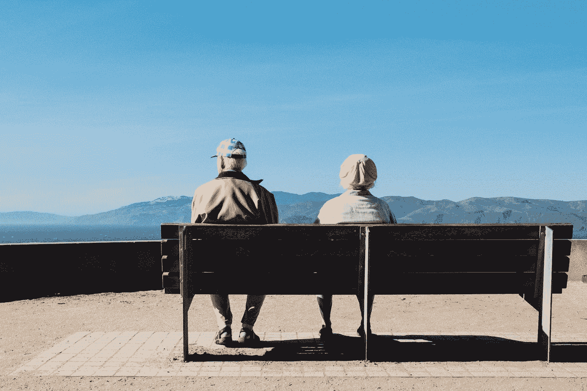
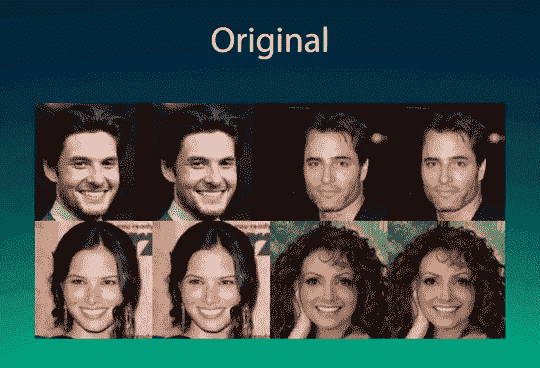
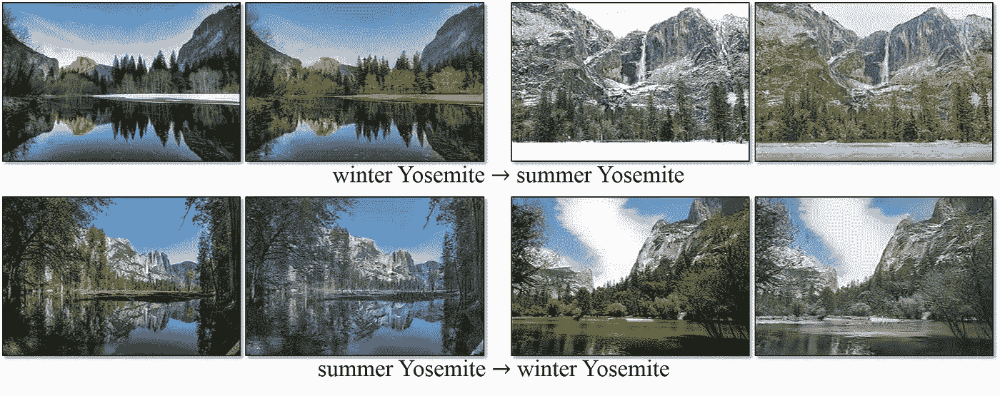
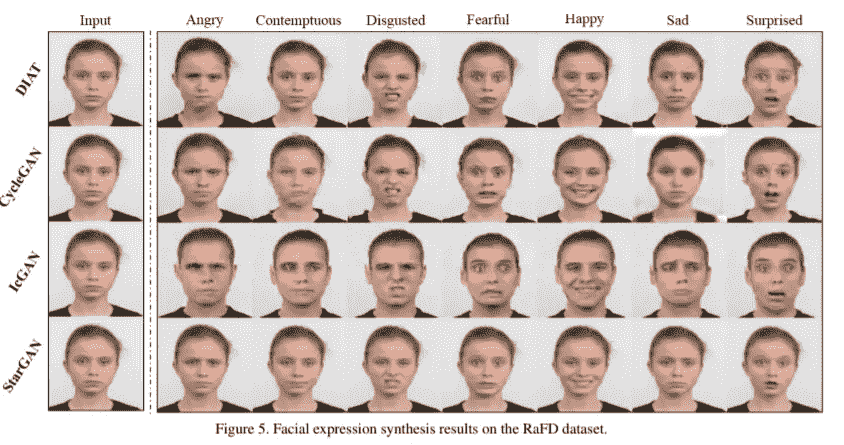
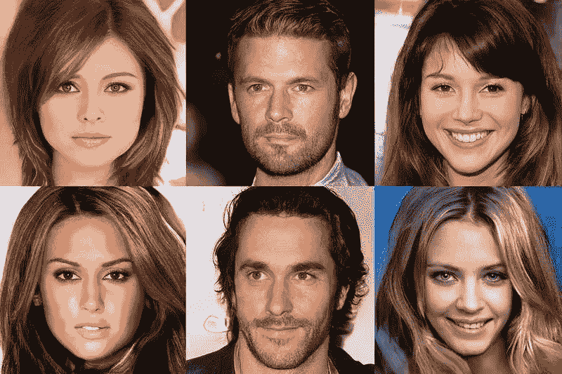
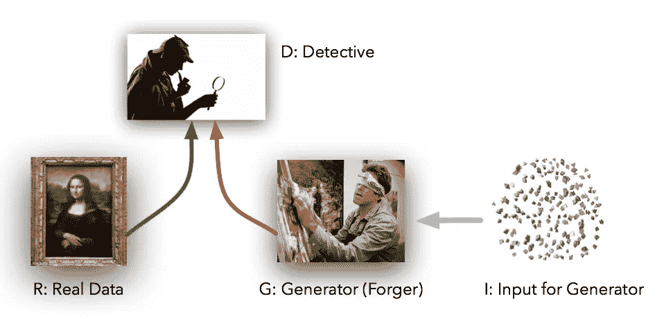
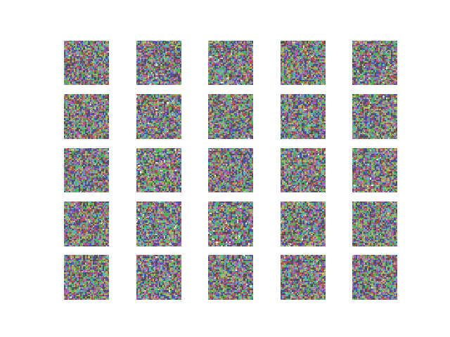
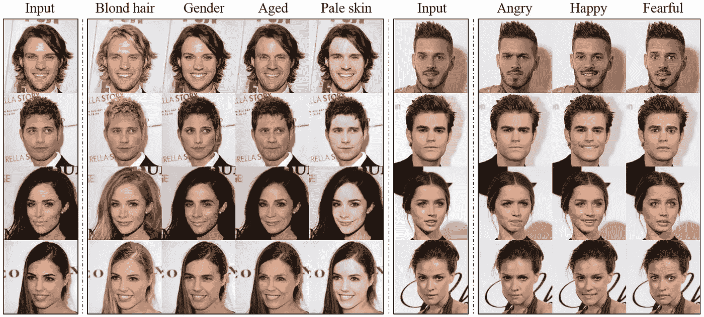
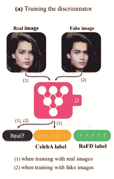
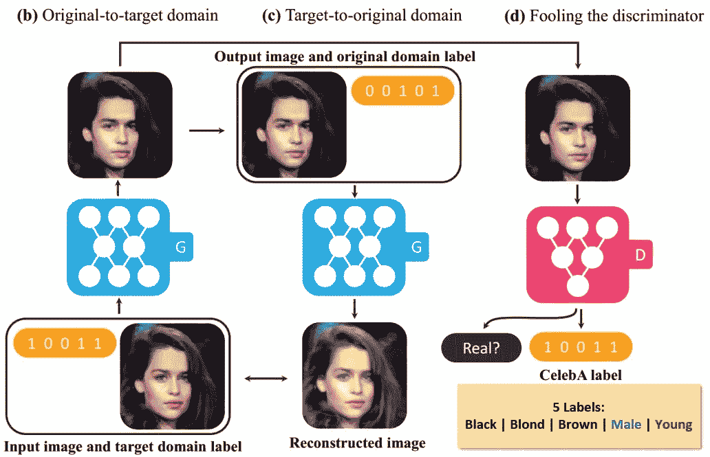

# 使用人工智能染头发(或看起来更老)

> 原文：<https://towardsdatascience.com/dye-your-hair-or-look-older-using-ai-930bc6928422?source=collection_archive---------13----------------------->

## 使用 StarGAN 进行图像到图像的翻译。

Photo by [Matthew Bennett](https://unsplash.com/@mbennettphoto?utm_source=medium&utm_medium=referral) on [Unsplash](https://unsplash.com?utm_source=medium&utm_medium=referral)

我会告诉你一些不可否认的事实。总有一天你会变老——*你会变得不一样。*

*事实上，*在你的一生中，你的外貌会发生很大变化**。**

**你希望自己看起来有点不同。我不会怪你，我也喜欢那样。**

****

**A sample of StarGAN reconstructing images with new target domains**

**你现在就可以这么做。你可以尝试金发——没有任何染料——变老 50 岁，或者甚至改变你的任何照片上的情绪以微笑，看起来生气或害怕——所有这些都不需要任何工作。**

**如果我不工作，谁会工作？**

**艾。或者如果你想更具体一点，它是你计算机内部某处的一个 GPU(或者在云上)。**

**—**

**我使用 Pytorch 实现了 StarGAN(GAN:Generative Adversarial Network)，这是一种可扩展的方法，用于**图像到图像的翻译** — *酷脸改变表情/特征的东西—* 它使用深度学习来重建一个新领域的人的照片(例如，皱眉的男人→微笑的男人，或者黑发的女人→金发的女人)。**

# **图像到图像的转换是将照片的某一方面改变为另一方面**

**如果你没有听说过，图像到图像的翻译听起来像是科幻电影里的东西。**

****

**cycleGAN (not StarGAN) can translate the season the image is in using GANs.**

**这个概念背后的前提非常简单(尽管这个概念并不简单)，所以请听我说完。**

**在基本水平上，完全训练的网络获取输入图像，识别其域分类(一个方面，例如季节、头发颜色或年龄)，并用不同的域重建相同的图像(例如，冬天→重建为夏天)。**

***所以这相当于翻译一幅图像。***

**—**

**是这样的。有许多类型的模型可以执行图像域的这种转换。但是与 StarGAN 相比，他们的结果非常弱。**

****

**StarGAN (bottom) compared to other GAN image translation frameworks**

**与其他只能学习固定翻译(如黑发→红发)而不能反向重建图像的模型不同，StarGAN 旨在学习如何在一个单一的**生成对抗网络** (GAN)中从多个数据集翻译多个域。**

# **生成对抗网络**

**甘现在在某种程度上是人工智能的温床。这种技术可以生成看起来 100%真实但实际上根本不真实的图像。**

**好好看看下面的图片。没有一个是真的。**

****

**“But I swear I’ve seen them somewhere!” — Everyone who looks at this image**

> **这是如何工作的？**

**生成性对抗网络由两个不断相互博弈的神经网络组成(因此是对抗的)。**

**第一个网络叫做**发电机。生成器的作用是生成尽可能精确的假图像。****

**第二个网络称为**鉴别器**。它负责区分真实图像和生成器生成的图像。**

****

**Have you ever seen these people before? Well, neither has anyone else 🤯. All these faces are computer generated by a GAN.**

**把甘斯想成这样。一个伪造者(制作者)正试图从一个画廊伪造艺术品，但是他并不知道艺术品的真实样子。把他想象成一个盲人伪造者。**

**侦探(鉴别者)是一名世界级的伪造艺术品侦探，他的角色只是尽可能多地了解画廊中的艺术品，以便他能够完成确定艺术品是伪造还是真实的工作。**

**—**

**游戏开始时，侦探是**总**对。盲伪造者的唯一输入是他的伪造艺术是否变得更好。**

**最终，伪造者开始创作对侦探来说与画廊里真正的艺术品难以区分的艺术品。**

****每次伪造者或侦探犯了错误，他们都会从中吸取教训，变得更聪明。****

**这意味着，即使这些网络在相互竞争，因为它们学会了更好地做自己的工作，另一个网络也被迫在自己的工作上做得更好。**

****

# **—**

**这里有一些不足为奇的东西。**

## ***每年都有新的人工智能技术/概念发布，使过去在模型任务方面的尝试完全相形见绌。***

***好的部分来了…***

**—**

# **介绍 StarGAN**

**是的，生成从未生活过的人的真实的全新面孔是非常酷的— *和怪异的—* 但是 GANs 可以做的远不止这些。**

**StarGAN 以一种非常聪明的方式使用 GAN 的来创建最好的图像到图像的翻译器(到目前为止)。**

**你已经看到了 StarGAN 的结果:**

****

**StarGAN translates target domains for a handful of celebrity photos.**

## **它是这样工作的**

****

**Remember how GANs work?**

1.  ****鉴别器被训练:****

**StarGAN 过程的第一步是训练鉴别器和发生器开始产生真实的重映射图像。**

**该型号的鉴频器有两个输出；**

*   **确定图像是真的还是假的，**
*   **正确标记图像的领域(棕色头发，女性等)**

**2.**原始图像被转换到目标域****

****

**This Is How StarGAN works.**

**好了，现在鉴别器已经训练好了，是时候创建真正的*假图像了。***

**生成器被馈送原始图像，它的预定目标域并生成假图像。**

**所以*，*在这一步，生成器实际上构建了图像。**

**3.“**假”图像被重建回原来的** ( *什么*？？？？)**

**这一步似乎有点反直觉。**

**在其中，生成器获取假图像，然后*将其重建*回其原始域。**

**它试图重建原始图像。**

**然后，该重建图像再次通过最后一步，以制造赝品。这样重复多次，才能让照片真的好看。**

****为什么？****

**原因很简单。当转换图像域(产生假图像)时，图像不保留原始图像的内容并不困难。**

**它偏离原始面貌太远，即使它做翻译领域的工作。**

**为了解决这个问题，研究人员使用了 CycleGAN 中使用的一种叫做*的循环一致性损失*。这种方法通过生成假图像并通过生成器重建原始输入的过程来循环。**

**4.**再次欺骗鉴别器的时间****

**这是*真正*好玩的部分。**

**做完一个假的/翻译的图像后。图像通过鉴别器，鉴别器决定图像是否是假的并选择其标签。**

**如果图像足够好，鉴别器会正确地标记它，并认为它是一个真实的图像。**

**如果没有，那么…是时候更加努力工作了。**

## **星际之门就是这样工作的吗？**

**是的，本质上。**

*****但是*** ，StarGAN 后面还有一大堆关于 [*实际*研究论文的信息(去看看吧！).](https://arxiv.org/pdf/1711.09020.pdf)**

**—**

**让我们再复习一遍。**

## **外卖食品**

*   ****图像到图像的转换**是可以改变你头发颜色(实际上)或者你最喜欢的自然照片的季节的技术。它使用 GANs 改变**域**(图像的一个方面)。**
*   ****生成性对抗网络**是由一个生成器和一个鉴别器组成的网络，它们不断地相互博弈。这场比赛让甘斯有能力变得更好，提高自己。**
*   **StarGAN 是一个大规模执行图像到图像翻译的框架。在其中，生成的图像实际上被重建回原始图像，然后一个赝品被多次生成以保持其原始性。**

# **在你走之前**

*   **一定要看看我的其他文章！**
*   **注册我的[每月简讯](https://landing.mailerlite.com/webforms/landing/c7n0u8)**
*   **看看我新做的[网站](http://sohailsayed.com)**
*   **在 Linkedin 上添加我以保持更新！s**