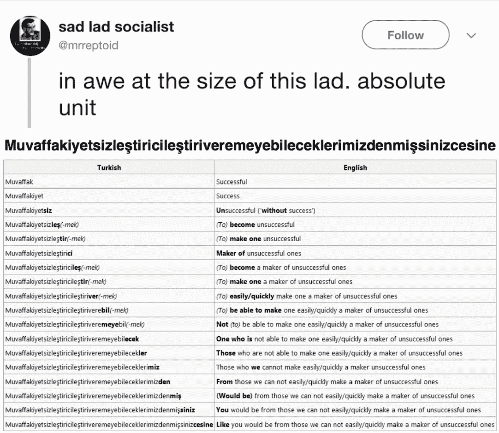

# 垂死的舌头和维度的诅咒

> 原文：<https://towardsdatascience.com/dying-tongues-and-the-curse-of-dimensionality-96b42c628559?source=collection_archive---------37----------------------->

## 自然语言处理能把濒危和非西方语言挤出科学吗？

Photo by [Kobu Agency](https://unsplash.com/@kobuagency?utm_source=medium&utm_medium=referral) on [Unsplash](https://unsplash.com?utm_source=medium&utm_medium=referral)

在过去的十年里，自然语言处理得到了迅猛发展。随着计算能力和数据可用性的提高，挖掘人类语言以获得洞察力的市场非常强劲。

然而，随着 NLP 的激增，我们必须密切关注它正在扩展的空间。我们是否在用我们收集的数据和用来分析数据的工具创造一个以英语为母语的反馈回路？

## 非英语语言特征使得用以英语为母语的人设计的工具执行 NLP 变得复杂。

总的来说，NLP 技术是由以英语为母语的人发明的。英语倾向于语言学家所说的分析型语言。这意味着它每个词的词素数量很低，缺乏其他语言用于时态、人称、语气和体等事物的语法标记，而是通过词序和与其他词的联系来表达。

例如，在英语中，下列句子是不等价的:

> 克劳斯吃沙拉。
> 
> 沙拉吃掉了克劳斯。

但在德语(融合语言)中，它们都意味着“克劳斯正在吃沙拉”，因为融合形态学表明格标记使得词序不太必要:

> 克劳斯死了。
> 
> 丹·萨拉特是克劳斯。

在粘合和多合成的语言中，每个单词甚至可以有更多的含义:

但是大多数 NLP 库都是针对英语和类似英语的欧洲语言的标记化、词条化和词性标注而优化的。

## 低容量、难以处理的数据使偏见永久化。

虽然资源一直在扩大，但除了英语之外，其他语言的选择仍然较少。在某种程度上，这个难题源于对拥有最多数据的语言应用 NLP 的偏见。英语仍然是互联网的语言，因此，它和其他富裕、互联国家的语言一样，在数据集中的比例过高。没有足够的数据，在较小的语言上使用传统的高维 NLP 技术将不会有效。

由于 NLP 经常被用于提供高价值的市场洞察和刺激投资，这种关注的缺乏可能导致一种自我延续的循环，在这种循环中，低资源语言继续获得较少的服务，因此产生的数据比更受关注的语言少。最终，他们可能会失去发言者，而[世界将会失去语言多样性](http://labs.theguardian.com/digital-language-divide/)。

然而，正如我们所知，在项目层面上，“应该非常小心，不要匆忙删除或更改值，尤其是在样本量很小的情况下。”Max Kuhn 和 Kjell Johnson，*应用预测建模* 33(第 5 版。2016).“此外，异常数据可能表明正在研究的人口中的特殊部分刚刚开始被抽样。”*同上* 34。从跨语言数据科学的宏观角度来看，这个建议同样适用。对于历史上研究不足的语言来说，这种初步探索可以产生巨大的影响——对于研究它的知识分子、可以从这种见解中受益的企业，以及从自己的语言得到认可和检查中受益的社区。

## 弥补差距需要认真关注。

必须首先在数据收集阶段缩小差距。一些 NLP 从业者[已经开始在语言学研究过程中更早地实现机器学习](https://dl.acm.org/citation.cfm?id=1699549)，以提高语料库可用的机会。确保领域语言学家和数据科学家进行交流以产生互利的、机器可读的语料库是一个重要的考虑因素。

其他技术可以通过实现不需要这种高维特征创建的方法来寻求充分利用稀疏数据集。半监督和非监督技术可以用来避开休斯现象。要使现有模型适应全新的结构，不仅需要语言知识，还需要创造性思维。在这种情况下，神经技术是有益的。一个小组已经使用深度学习来复兴塞内卡。在谷歌的帮助下，其他公司也在跟进。

机器学习给了我们一个前所未有的机会来保存和探索前几代人从未有过的研究不足的语言。那些接受挑战的人不仅会丰富自己，还会丰富我们对共同语言遗产的集体理解。