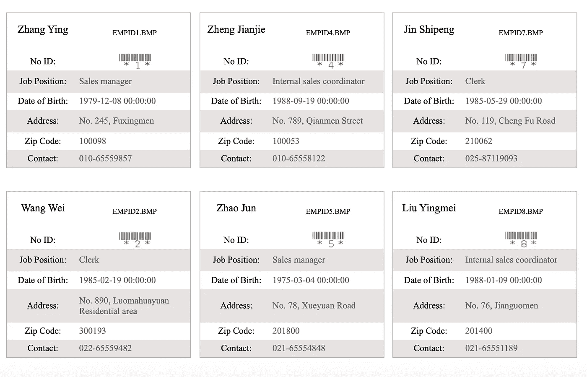

# 动态图表:让您的数据移动

> 原文：<https://towardsdatascience.com/dynamic-charts-make-your-data-move-19e540a06bd3?source=collection_archive---------20----------------------->

## 动态图表给我们一种直观和互动的体验。本文将解释什么是动态图表以及如何制作动态图表。

From [FineReport](https://www.finereport.com/en/?utm_source=medium&utm_medium=media&utm_campaign=blog&utm_term=Dynamic%20Charts%3A%20Make%20Your%20Data%C2%A0Move)

# 1.动态图表是如何工作的？

上图是用 BI 报告工具 [FineReport](https://www.finereport.com/en/?utm_source=medium&utm_medium=media&utm_campaign=blog&utm_term=Dynamic%20Charts%3A%20Make%20Your%20Data%C2%A0Move) 制作的包含动态图表的仪表板。点击饼状图的相应位置，可以得到具体区域的数据，交互性很强。

我们来对比一下 Excel 呈现的数据。是不是显得单调冰冷？相反，动态图表能带给我们直观的体验，更好的展现数据的差异。接下来，我将从定义、优点、制作方法等方面介绍动态图表，让您对动态图表有一个更清晰的认识。

# 2.什么是动态图表？

可能你们很多人认为有动画效果的报表是动态报表。其实动态报表是指没有固定报表模板，需要根据实际业务数据生成模板的报表。而这往往是通过动态图表实现的。动态图表的核心是数据和[图表类型](https://www.finereport.com/en/data-visualization/top-16-types-of-chart-in-data-visualization.html?utm_source=medium&utm_medium=media&utm_campaign=blog&utm_term=Dynamic%20Charts%3A%20Make%20Your%20Data%C2%A0Move)可以根据不同的情况即时显示。除了显示一般的静态图表内容，它们还必须具有良好的交互性。

简单来说，动态图表的核心就是报表数据可以随时调用。比如老板想查看某个月的数据，只需要设置一个参数过滤条件。当老板在控件中选择时间和月份时，报表将只显示该月的数据。这称为动态报告。

动态图表的目的是为了更方便快捷地查询和读取数据。在此基础上，动态图表需要包含大量的逻辑功能，例如:

*   **参数过滤:**根据不同的条件查看不同的数据。这是动态图表的基本功能。

*   **参数联动**:联动两个或两个以上的组件，实现数据之间的自动关联。比如点击年销售额，该年的订单明细，月退货率和销售额排名会挂钩。

*   **Drill Down** :动态图表的常用功能主要是实现无限层数据的展开，以及更高维度的明细数据的展开。例如，下钻图。

*   **参数面板动态显示**:由于一些需要，很多情况下，一些查询条件只有满足某个条件才会显示。例如，如果您选择一个地区，随后的参数框将自动显示该地区的城市和消费者。

**动态查询**:如果数据库中有多个表，我们如何提高查询效率？此时，您可以设置动态数据列，例如，在控件中输入" jia ",它将显示所有表格中带有" jia "的信息:

# 3.如何制作一个很酷的动态图表？

## **3.1 基础图表制作流程**

这里我们选择 FineReport 做动态图表。在 [FineReport](https://www.finereport.com/en/?utm_source=medium&utm_medium=media&utm_campaign=blog&utm_term=Dynamic%20Charts%3A%20Make%20Your%20Data%C2%A0Move) 中，图表的工作流程类似于 Excel，数据准备—插入图表—选择图表类型—选择分类轴、系列名称和系列值—设置图表样式。

## 3.2 不同的图表类型

这主要是文字、数字、网格的美感，以及整体的色彩和谐。这些可以在 FineReport 中定制。

你甚至可以做一个卡片栏报告。

## 3.3 数据可视化小部件

除了表单的类型之外，可视化图表还有动态显示部分，这就是所谓的动态可视化。

## **3.4 仪表盘**

想要让最终的动态图得到大家的认可，要牢记三点:设置版面、搭配颜色、修饰动态效果。

> **注:本文所有动态图表均摘自**[**fine report**](https://www.finereport.com/en/?utm_source=medium&utm_medium=media&utm_campaign=blog&utm_term=Dynamic%20Charts%3A%20Make%20Your%20Data%C2%A0Move)**。这个工具是由我工作的数据研究所开发的。个人使用完全免费。你可以下载它来练习制作图表和仪表盘。**

# 4.制作动态图表的工具

最后，对于公司中的不同角色，他们通常会根据工作需要使用不同的工具来创建动态图表。这三个场景是最常见的，也许可以给你一些参考。

*   利用 Excel 内置的图表做一些规律的图表。用 Excel 制作的高级复杂图表如动态图表、图表的过滤显示可以通过编写 VBA 来实现。
*   使用 R、Python 的编码语言，调用图表函数包，呈现可视化数据，常用于[数据分析师](/6-key-skills-that-data-analysts-need-to-master-df1d82257b9)。
*   使用 Echarts、HighCharts、D3.js 等开源可视化插件，嵌入代码，开发插件包，常用于可视化工程师和前端开发。

# 您可能也会对…感兴趣

[*让你的数据报告脱颖而出的指南*](/a-guide-to-making-your-data-reporting-stand-out-cccd3b99e293)

[*2019 年你不能错过的 9 款数据可视化工具*](/9-data-visualization-tools-that-you-cannot-miss-in-2019-3ff23222a927)

[*新手如何打造一个很棒的仪表盘？*](/how-can-beginners-create-a-great-dashboard-cf48c0f68cd5)

[*数据可视化中前 16 种图表类型*](/top-16-types-of-chart-in-data-visualization-196a76b54b62)

[*什么是大屏幕的数据可视化，如何实现？*](/what-is-data-visualization-for-large-screen-and-how-to-implement-it-1d79cf07783)