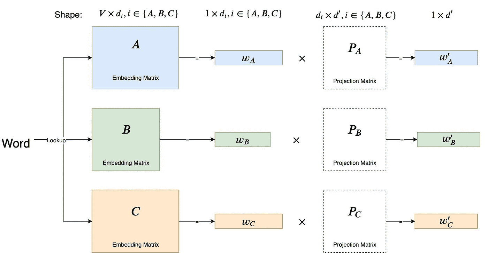
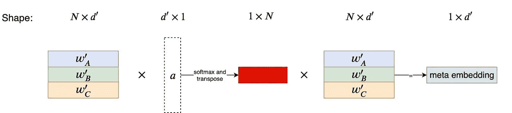
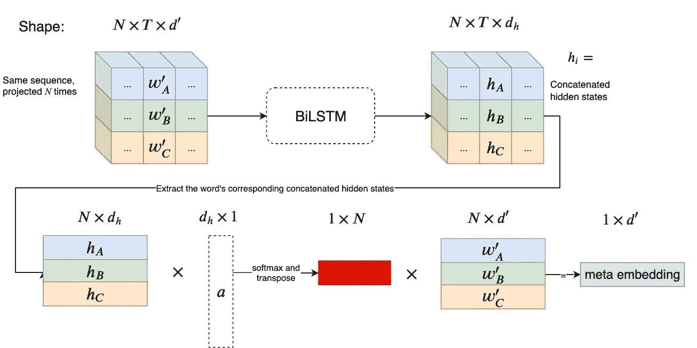

# 动态元嵌入

> 原文：<https://towardsdatascience.com/dynamic-meta-embeddings-f97e2c682187?source=collection_archive---------16----------------------->

如果你在过去的几个月里阅读过任何与 NLP 相关的书籍，你不可能没有听说过[伯特](https://ai.googleblog.com/2018/11/open-sourcing-bert-state-of-art-pre.html)、 [GPT-2](https://openai.com/blog/better-language-models/) 或[埃尔莫](https://allennlp.org/elmo)这些人进一步拓展了 NLP 任务的范围。尽管这些技术很棒，但是有很多 NLP 问题设置你无法使用它们。你的问题可能不是真正的语言，而是可以用记号和序列来表达。你可能正在处理一种没有预先训练选项的语言，也没有资源来自己训练它。
也许你只是在处理一个非常特殊的领域(但是你知道 [BioBERT](https://github.com/dmis-lab/biobert) 吗？).

因此，您可以选择处理预先训练好的嵌入(不是由上述模块生成的)。今年早些时候的 Kaggle [Quora 虚假问题分类](https://www.kaggle.com/c/quora-insincere-questions-classification)就是这种情况，参赛者不能使用 BERT/GPT-2/ELMo，但只能获得四组预训练的嵌入。这个设置引发了一个有趣的讨论，即如何组合不同的嵌入，而不是只选择一个。
在这篇文章中，我们将回顾一些将不同的嵌入组合成单一表示的最新技术，这被称为“元嵌入”。
一般来说，我们可以将元嵌入技术分为两个不同的类别。第一个是(1)当创建元嵌入的过程与它们将被用于的任务分离时，以及(2)当训练元嵌入与实际任务同步时。
我不会在这篇文章中介绍使用第一个提到的过程(1)的方法，它们中的大多数都非常简单，包括嵌入维度的平均、连接等。然而，不要把简单误认为是弱，因为提到的 Kaggle 竞赛[获胜解决方案](https://www.kaggle.com/c/quora-insincere-questions-classification/discussion/80568#latest-564470)使用了嵌入的加权平均。
如果你想了解更多关于这类方法的信息，你可以在下面两篇文章中找到。[简单得令人沮丧的元嵌入——通过平均源词嵌入来计算元嵌入](https://arxiv.org/abs/1804.05262)
**b** 。[通过使用嵌入集合的系综学习元嵌入](https://arxiv.org/abs/1508.04257)
在下一节中，我们将介绍使用第二个提到的过程(2)的两种技术。

# (上下文)动态元嵌入

本节中的技术都来自脸书人工智能研究论文“用于改进句子表示的动态元嵌入”，并提出了两种新技术，“T2”动态元嵌入(DME) 和“T4”上下文动态元嵌入(CDME) 。这两种技术都是附加在网络开始处的模块，并且具有可训练的参数，这些参数从与网络其余部分相同的梯度中更新。这两种技术的共同步骤是原始嵌入的线性投影。下图提供了投影的可视化效果；虚线表示学习的参数。

Figure 1: Projection, learned parameters in dashed line

使用由此产生的投影，将计算关注系数，以使用这些投影的加权和。DME 和 CDME 计算这些系数的方式不同。

## 测距装置(Distance Measuring Equipment)

DME 使用的机制只依赖于单词 projections 本身。每个单词投影乘以一个学习向量 *a* ，这产生一个标量——因此对于 *N* 个不同的投影(对应于 *N* 个不同的嵌入集),我们将有 *N* 个标量。这些标量然后通过 softmax 函数传递，结果是注意系数。然后，这些系数用于创建元嵌入，这是投影的加权和(使用系数加权)。
该步骤如下所示(虚线表示已学习的参数)

Figure 2: Creating the DME embedding, learned parameters in dashed line

如果你说 TensorFlow(或 Keras)，你可能更喜欢在代码中看到它——下面是 DME 的 Github 要点(精简版),完整代码可以在这里找到

## CDME

CDME 使用双向 LSTM (BiLSTM)将上下文添加到混合中。如果你对这个术语感到不舒服，我不会在这里详述 LSTMs，回顾一下关于它们的经典的 [colah post](https://colah.github.io/posts/2015-08-Understanding-LSTMs/) 。

与 DME 的唯一区别在于注意力系数是如何计算的。
就像 DME 一样，首先序列被投影，然后投影的序列通过 BiLSTM。
然后，不使用单词本身，而是使用正向和反向 LSTMs 的级联隐藏状态(在单词的对应索引中)和向量 *a* 来计算关注系数。
这个过程的可视化:

Figure 3: Creating the CDME embedding, learned parameters in dashed line

同样，如果你喜欢阅读下面的代码是 Github gist 的精简版，完整版在[这里](https://github.com/eliorc/tavolo/blob/master/tavolo/embeddings.py#L269)

就这些，希望你学到了新的东西，欢迎发表你的想法和问题。👋

在[https://www.datascience.co.il/blog](https://www.datascience.co.il/blog)查看更多内容、博客和新闻