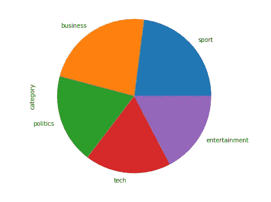
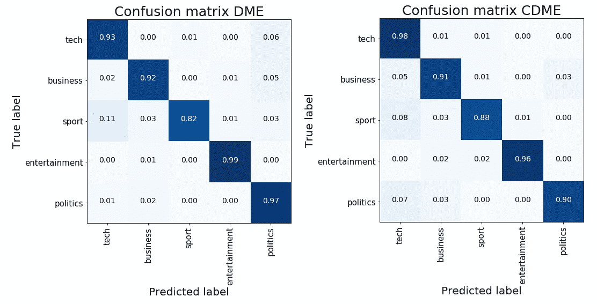

# Keras 中的动态元嵌入

> 原文：<https://towardsdatascience.com/dynamic-meta-embeddings-in-keras-42393d246963?source=collection_archive---------22----------------------->

## 了解不同嵌入的有价值的组合


Photo by [Khushbu hirpara](https://unsplash.com/@khushi22?utm_source=medium&utm_medium=referral) on [Unsplash](https://unsplash.com?utm_source=medium&utm_medium=referral)

许多 NLP 解决方案利用预先训练的单词嵌入。选择使用哪一种通常与最终性能有关，并且是在大量试验和手动调谐之后实现的。脸书的人工智能实验室一致认为，做出这种选择的最佳方式是让神经网络自己找出答案。

他们引入了 [***动态元嵌入***](https://arxiv.org/abs/1804.07983) *，这是一种简单而有效的嵌入集成监督学习方法，可以在同一模型类中的各种任务上实现最先进的性能。这个简单但非常有效的方法允许学习一组选择的单词嵌入的线性组合，这优于各种嵌入的简单串联。*

如上所述，作者在 NLP 领域的各种任务上证明了他们的解决方案的有效性。我们限制自己在一个文本分类问题中采用这些技术，其中我们有 2 个预训练的嵌入，并希望智能地组合它们以提高最终的性能。

# 数据

我在 [Kaggle](https://www.kaggle.com/yufengdev/bbc-fulltext-and-category) 上发现了一个有价值的数据集，其中包含了来自 BBC 档案馆的文章全文(总共 2225 篇)。新闻属于 5 个主题领域:



Label distribution

我们的目标是对它们进行正确分类，为此，我们希望训练不同类型的嵌入，智能地组合它们，并在此基础上构建我们的分类器。开始时，对原始语料库应用标准的清洗程序。作为嵌入模型，我选择了最常见的类型:Word2Vec 和 FastText。我们可以使用 Gensim 轻松地训练它们，将它们“拖放”到 Keras 架构中(记住为每个选定的嵌入框架保持相同的嵌入大小)。我手工仔细计算了这个过程，以便在需要时控制填充过程:Keras 的 Tokenizer 对象和 pad_sequence 函数使所有事情变得简单。

当我们以多次训练的嵌入(也是像手套或类似的模型的预训练形式是完美的)和顺序语料库结束时，我们准备好组合我们的权重。

# 模特们

在原始论文中介绍了两种不同的技术:

*   ***动态元嵌入(DME)*** *:* 原始嵌入被投影到新的空间中，通过 LSTM 编码器添加额外的可学习权重，遵循注意机制。然后将它们与其原始格式线性组合。用喀拉斯语说:

```
def DME(maxlen): inp = Input(shape=(maxlen, 100, 2))
    x = Reshape((maxlen, -1))(inp)
    x = LSTM(2, return_sequences=True)(x)
    x = Activation('sigmoid')(x)
    x = Reshape((maxlen, 1, 2))(x)
    x = multiply([inp, x])
    out = Lambda(lambda t: K.sum(t, axis=-1))(x) return Model(inp, out)
```

*   ***【上下文动态元嵌入(CDME)*** *:* 如上，原始嵌入被投影到一个新的空间，增加额外的可学习权重；但是现在通过 BiLSTM-Max 编码器应用了上下文相关的系统。最终追求的是自我关注机制和与原格式的加权组合。在 Keras 语言中(没有提供 Keras 双向层的最大池合并，所以我们必须自己编码):

```
def CDME(maxlen, latent_dim=2): inp = Input(shape=(maxlen, 100, 2))
    x = Reshape((maxlen, -1))(inp)
    x = Bidirectional(LSTM(latent_dim, return_sequences=True))(x)
    x = Lambda(lambda t: [t[:,:,:int(latent_dim/2+1)],  
                          t[:,:,int(latent_dim/2+1):]])(x)
    x = Maximum()(x)
    x = Activation('sigmoid')(x)
    x = Reshape((maxlen, 1, 2))(x)
    x = multiply([inp, x])
    out = Lambda(lambda t: K.sum(t, axis=-1))(x) return Model(inp, out)
```

我们重新创建了两个通用代码块，它们通过一个动态过程来执行嵌入组合。这两种解决方案都可以放在网络的起点，紧接在我们的嵌入的读取和连接之后。在它们上面，我们可以根据不同的目的叠加正常的图层。在我们的例子中，我们添加一些递归层来正确分类我们的新闻文章。我们以这两种架构结束:

对于 **DME** :

```
concat_inp = Concat_Emb([embedding_matrix_w2v, embedding_matrix_ft], maxlen=max_len)
dme = DME(max_len)
x = dme(concat_inp.output)
x = GRU(128, dropout=0.2, return_sequences=True)(x)
x = GRU(32, dropout=0.2)(x)
out = Dense(y.shape[1], activation='softmax')(x)dme_model = Model(concat_inp.input, out)
dme_model.compile(loss='categorical_crossentropy', optimizer='adam', metrics=['accuracy'])
```

对于 **CDME:**

```
concat_inp = Concat_Emb([embedding_matrix_w2v, embedding_matrix_ft], maxlen=max_len)
cdme = CDME(max_len)
x = cdme(concat_inp.output)
x = GRU(128, dropout=0.2, return_sequences=True)(x)
x = GRU(32, dropout=0.2)(x)
out = Dense(y.shape[1], activation='softmax')(x)cdme_model = Model(concat_inp.input, out)
cdme_model.compile(loss='categorical_crossentropy', optimizer='adam', metrics=['accuracy'])
```

现在，我们已经准备好执行培训，并看到一些结果。这两个模型都能够在测试数据上达到大约 93%的总体准确率，并且每个类别都有很高的召回分数。



# 摘要

允许访问多种类型的嵌入(不管它们是预先训练的还是特别构建的)，我们允许神经网络通过预测每种嵌入类型的权重来学习它偏好的嵌入( *DME* )，可选地取决于上下文( *CDME* )。我们在文本分类的 NLP 任务中实现了这一点，只是简单地将这一过程与处理这类问题的常规方法结合起来。

[**查看我的 GITHUB 回购**](https://github.com/cerlymarco/MEDIUM_NoteBook)

保持联系: [Linkedin](https://www.linkedin.com/in/marco-cerliani-b0bba714b/)

**参考文献**

改进的句子表征的动态元嵌入:*杜维基拉，王和赵京贤；脸书人工智能研究；纽约大学；CIFAR 全球学者。*