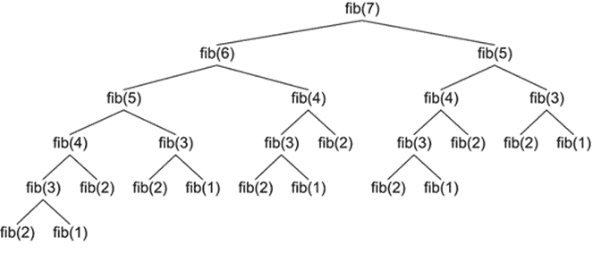
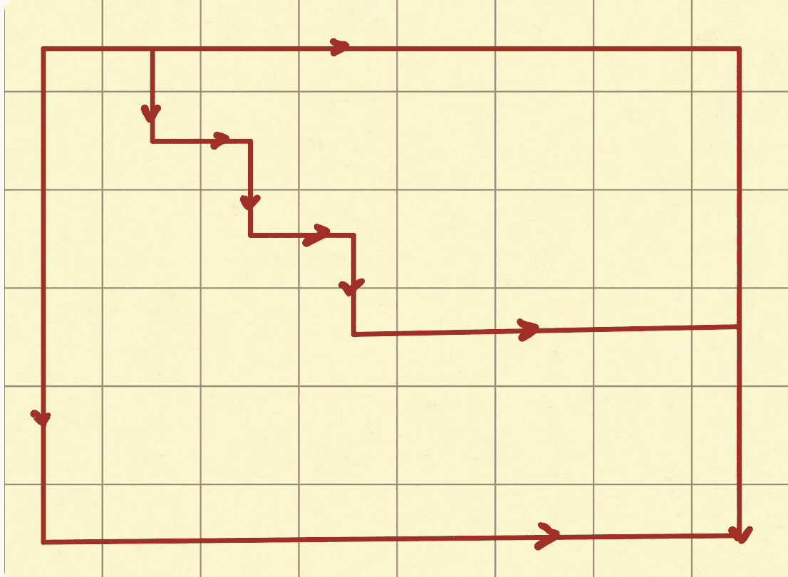
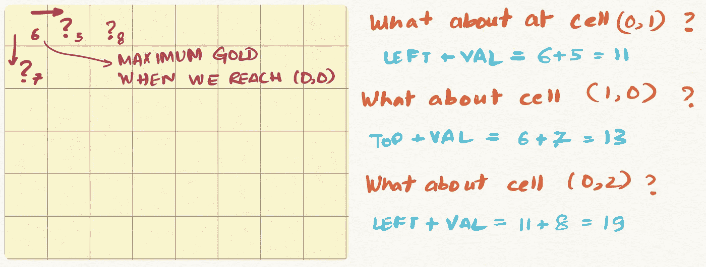
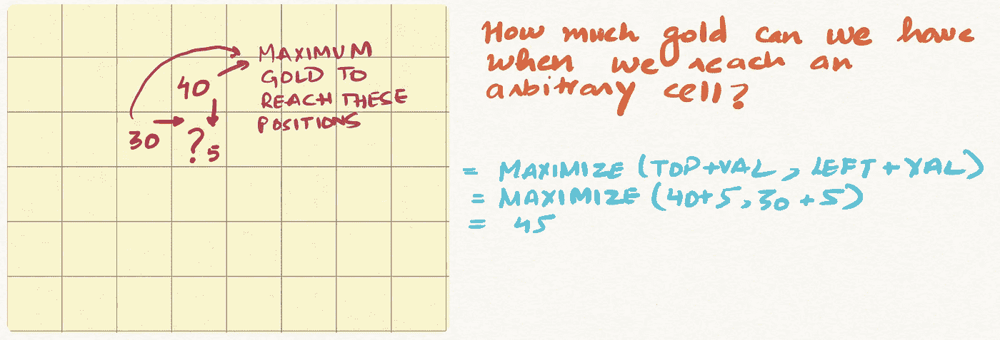

# 数据科学家的动态编程

> 原文：<https://towardsdatascience.com/dynamic-programming-for-data-scientists-bb7154b4298b?source=collection_archive---------8----------------------->


Image by [Dimitri Houtteman](https://pixabay.com/users/Dimhou-5987327/?utm_source=link-attribution&utm_medium=referral&utm_campaign=image&utm_content=4638912) from [Pixabay](https://pixabay.com/?utm_source=link-attribution&utm_medium=referral&utm_campaign=image&utm_content=4638912)

## [算法面试](https://towardsdatascience.com/tagged/algorithms-interview)

## 如何轻松解决 DP 问题？

算法和数据结构是数据科学不可或缺的一部分。虽然我们大多数数据科学家在学习时没有上过适当的算法课程，但它们仍然很重要。

许多公司在招聘数据科学家的面试过程中会询问数据结构和算法。

现在，许多人在这里问的问题是，问一个数据科学家这样的问题有什么用。 ***我喜欢这样描述，一个数据结构问题可以被认为是一个编码能力测试。***

我们都在人生的不同阶段进行过能力倾向测试，虽然它们不是判断一个人的完美代理，但几乎没有什么是真的。那么，为什么没有一个标准的算法测试来判断人的编码能力。

但我们不要自欺欺人，他们需要像你的数据科学面试一样的热情，因此，你可能需要花一些时间来研究算法、数据结构和算法问题。

***这篇文章是关于快速跟踪这项研究，并以一种易于理解的方式为数据科学家解释动态编程概念。***

# 动态编程是如何工作的？

假设我们需要找到第 n 个斐波那契数。

斐波纳契数列是一系列数字，其中每个数字(*斐波纳契数*)是前面两个数字的和。最简单的是 1，1，2，3，5，8 等系列。答案是:

```
def fib(n):
    if n<=1:
        return 1
    return fib(n-1) + fib(n-2)
```

这个问题与递归方法密切相关。但是你能发现这里的问题吗？

如果您尝试计算 fib(n=7 ),它会运行 fib(5)两次，fib(4)三次，fib(3)五次。随着 n 变大，对同一个号码进行了很多次调用，我们的递归函数一次又一次地计算。



[Source](https://www.rubyguides.com/2015/08/ruby-recursion-and-memoization/)

递归本质上是一种自顶向下的方法。当计算斐波那契数 n 时，我们从 n 开始，然后递归调用 n-2 和 n-1 等等。

在 ***动态编程*** 中，我们采取自底向上的方法。它本质上是一种迭代编写递归的方法。我们首先计算 fib(0)和 fib(1 ),然后使用以前的结果生成新的结果。

```
def fib_dp(n):
    dp_sols = {0:1,1:1}
    for i in range(2,n+1):
        dp_sols[i] = dp_sols[i-1] + dp_sols[i-2] 
    return dp_sols[n]
```

# 为什么动态编程很难？

递归是一个数学概念，对我们来说很自然。我们试图通过把一个大问题分解成小问题来寻找解决方案。

现在，动态规划需要完全相同的想法，但在动态规划的情况下，我们预计算所有可能需要以自下而上的方式计算的子问题。

我们人类本质上是天生以自上而下的方式工作的。在我们的学习中，大多数人在深入之前都试图深入事物的广度。或者是我们的思维方式。

那么，如何开始自下而上的思考呢？

我发现解决下面的问题给了我很多关于 DP 如何工作的直觉。 一旦我能够解决这个问题，我自己就对 DP 非常满意，希望它也能帮助你。

基本上这个想法是，如果你知道一个小问题的解决方案，你是否能推导/解决一个更大的子问题？

# 最大路径和

给定一个装满黄金的 *m* x *n* 网格，找出一条从左上到右下的路径，其中*最大化沿其路径的黄金总和*。我们只能从(0，0)开始向下或向右移动

现在可以肯定有许多途径。我们可以一直走到右边，然后到底。或者我们可以走一条曲折的路？



但是只有一条/几条路会让你变得富有。

那么，你是如何开始思考这样一个问题的呢？

当我们考虑动态编程问题时，我们采用自底向上的方法。所以我们从思考最简单的问题开始。在我们的例子中，要解决的最简单的问题是基本情况。如果我们必须到达单元格(0，0)，我们可以获得的最大黄金价值是多少？

答案很简单——就是单元格的值本身。


所以我们转到一个更难的问题。



cell (0，1)和 cell (1，0)呢？

这些也很简单。我们只能通过(0，0)到达(0，1)和(1，0)，因此我们可以获得的最大黄金是单元格(0，1)/(1，0)中的值加上我们到达单元格(0，0)时可以获得的最大黄金

cell(0，2)呢？同样只有一条路。因此，如果我们知道(0，1)的解，我们只需将单元格(0，2)的值相加，就可以得到(0，2)的解

现在让我们试着对任意一个单元格做同样的事情。我们想在这里推导出一个关系。



***所以在任意单元格的情况下，我们可以从顶部或者从左侧到达它。*** 如果我们知道单元格顶部和左侧的解，我们就一定可以计算出任意当前目标单元格的解。

## 编码

一旦我们有了直觉，编码工作就非常简单了。我们从计算第一行和第一列的解开始。然后我们继续用之前得到的关系计算网格中的其他值。

```
def maxPathSum(grid):
    m = len(grid)
    n = len(grid[0])
    # sol keeps the solutions for each point in the grid.
    sol = list(grid)
    # we start by calculating solutions for the first row
    for i in range(1,n):
        sol[0][i] += sol[0][i-1]
    # we then calculate solutions for the first column
    for i in range(1,m):
        sol[i][0] += sol[i-1][0]
    # we then calculate all the solutions in the grid
    for i in range(1,m):
        for j in range(1,n):
            sol[i][j] += max(sol[i-1][j],sol[i][j-1])
    # return the last element
    return sol[-1][-1]
```

# 结论

***在这篇帖子里，我谈到了我对动态编程问题的看法。***

我首先问自己我能解决的最简单的问题，以及我是否能通过使用简单问题的解决方案来解决更大的问题。

动态编程构成了数据科学/机器学习工作面试中一些最常见问题的基础，对这些问题的良好理解可能会帮助你获得理想的工作。

所以出去用 Leetcode/HackerRank 解决一些问题吧。这些问题确实很有趣。

如果你想学习算法和数据结构，也可以看看我在[系列](https://towardsdatascience.com/tagged/algorithms-interview)的其他帖子。

# 继续学习

如果你想了解更多关于算法和数据结构的知识，我强烈推荐 UCSanDiego**在 Coursera 上的 [**算法专门化。**](https://coursera.pxf.io/15MOo6)**

**谢谢你的阅读。将来我也会写更多初学者友好的帖子。在 [**媒体**](https://medium.com/@rahul_agarwal?source=post_page---------------------------) 关注我，或者订阅我的 [**博客**](http://eepurl.com/dbQnuX?source=post_page---------------------------) 了解他们。一如既往，我欢迎反馈和建设性的批评，可以通过 Twitter [@mlwhiz](https://twitter.com/MLWhiz?source=post_page---------------------------) 联系。**

**此外，一个小小的免责声明——这篇文章中可能会有一些相关资源的附属链接，因为分享知识从来都不是一个坏主意**